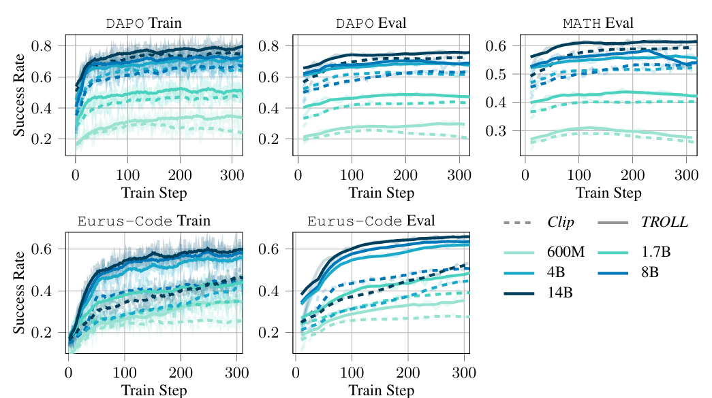

## 概要
「TROLL: Trust Regions Improve Reinforcement Learning for Large Language Models」の概要と採択情報、引用状況についてご説明します。
### 1. 論文の基本情報

- **タイトル**  
  TROLL: Trust Regions Improve Reinforcement Learning for Large Language Models

- **著者**  
  Philipp Becker, Niklas Freymuth, Serge Thilges, Fabian Otto, Gerhard Neumann  
  （所属：Karlsruhe Institute of Technology, Microsoft Research）

- **採択学会・発表年**  
  - 学会：**ICLR 2026**（International Conference on Learning Representations）  
  - 発表年：**2026年**（arXiv 初版投稿は 2025年10月）  
  - arXiv ページに “Published as a conference paper at ICLR 2026” と明記されています[arXiv](https://arxiv.org/abs/2510.03817)。

### 2. 論文の概要

__背景__
- 大規模言語モデル（LLM）の**報酬ベースのファインチューニング**では、PPO（Proximal Policy Optimization）のような**クリッピング目的関数**を用いた強化学習（RL）が標準になっています。
- しかし、PPO のクリッピングは**近似に基づくヒューリスティック**であり、学習の安定性や性能に限界があることが知られています。

__提案手法（TROLL）__
- 本論文は、PPO のクリッピングを**厳密なトークンレベルの KL 制約**に基づく「**Trust Region Optimization for Large Language models (TROLL)** 」で**直接置き換える**手法を提案します。
- 特徴：
  - **離散的な微分可能な信頼領域射影（discrete differentiable trust region projection）** を導入し、各トークンレベルでポリシー更新を制約します。
  - 学習時には PPO のクリッピングを置き換えるだけで、**推論時のモデル挙動は一切変更しません**。
  - これにより、PPO と比較して**学習の安定性・収束速度・最終性能**のすべてで改善を達成しています。

__実験結果__
- **数学的推論タスク**や**コード生成タスク**など、複数のベンチマークで評価。
- 結果として、PPO ベースの手法よりも**成功率やサンプル効率が向上**し、信頼領域に基づく更新が LLM の RL において有効であることを示しています。

### 3. 引用状況について

- 本論文は **2025年10月に arXiv で公開**され、**ICLR 2026 に採択**された比較的新しい論文です。
- 現在（2026年7月時点）では、Google Scholar や Semantic Scholar 上で論文が登録されているものの、**引用数（citation count）はまだ少ない段階**です。
  - 著者の Google Scholar ページには論文が掲載されていますが、引用数はまだ限定的です[Google Scholar (Philipp Becker)](https://scholar.google.com/citations?user=jXx-LuQAAAAJ)。
  - Semantic Scholar でもエントリは存在しますが、現時点では引用数情報が十分に集計されていない状況です[Semantic Scholar](https://www.semanticscholar.org/paper/fe8b857593fc43e1c641c5d41bb1539a3bf9cc78)。

未だ本論文は引用数が多いとは言えません。

## 解決したい課題

本論文「TROLL: Trust Regions Improve Reinforcement Learning for Large Language Models」が解決を目指した主な課題は、**PPO（Proximal Policy Optimization）のクリッピング目的関数が、LLM の強化学習において「近似に基づくヒューリスティック」であり、理論的に厳密でなく、学習の安定性や性能に限界をもたらしている**という点です。

もう少し分解すると、以下のような課題を明確に意識しています。

### 1. PPO のクリッピングが「信頼領域」を厳密に保証していない

- PPO は、ポリシー更新の際に「古いポリシーと新しいポリシーの KL ダイバージェンスが大きくなりすぎないように」**クリッピングで更新幅を制限**します。
- しかし、このクリッピングは
  - **KL 制約を直接最適化しているわけではなく**、
  - **トークンレベルでの厳密な信頼領域制約**にはなっていません。
- そのため、**理論的な信頼領域最適化（Trust Region Optimization）の保証が弱く、学習が不安定になりやすい**という問題があります。

>__KL 制約__  
>「KL 制約」とは、**ポリシー（方策）の更新幅を制限するために、古いポリシーと新しいポリシーの「KL ダイバージェンス（Kullback–Leibler divergence）」に上限を設ける制約**のことです。
>__1. KL ダイバージェンスとは__  
>- **KL ダイバージェンス**は、**2つの確率分布がどれだけ「似ていないか」を測る指標**です。
>- 例として、あるトークンに対して
>  - 古いポリシー：`P_old(token)`  
>  - 新しいポリシー：`P_new(token)`
>  があるとき、それらの KL ダイバージェンスは
>$$
  KL(P_{\text{old}} \| P_{\text{new}}) = \sum_{\text{token}} P_{\text{old}}(\text{token}) \log \frac{P_{\text{old}}(\text{token})}{P_{\text{new}}(\text{token})}
>$$
>のように定義されます。
>- 値が**0に近いほど「似ている」**、**大きいほど「大きく違う」** と解釈します。  
>
>__2. KL 制約とは何か__  
>- **KL 制約**とは、この KL ダイバージェンスに**上限（閾値）を設ける**ことです。
>- 数式的には、
>$$
  KL(P_{\text{old}} \| P_{\text{new}}) \le \delta
>$$
  という形で、「**古いポリシーと新しいポリシーの違いは δ 以内に抑える**」という制約を課します。
>- ここで δ は小さな正の数（例：0.01, 0.1 など）で、**「1ステップで大きくポリシーを変えすぎない」** ためのパラメータです。

### 2. LLM 特有の「離散トークン空間」でのポリシー更新の難しさ

- LLM の出力は**離散トークン列**であり、連続行動空間の RL とは異なり、**各トークンごとの確率分布**を更新する必要があります。
- PPO のクリッピングは連続空間を想定した設計が多く、**離散トークン空間での厳密な信頼領域制約を課すことが難しい**という課題があります。
- その結果、**トークンレベルで「どこまで更新してよいか」を厳密に制御できない**ため、学習が破綻したり、性能が頭打ちになったりしやすい状況がありました。

### 3. 既存の「PPO 改良手法」もクリッピングに依存している

- 近年、GRPO, Dr.GRPO, GSPO, REINFORCE++ など、**アドバンテージ推定や正規化を改善する手法**が提案されていますが、それらも**PPO のクリッピングベースの更新機構に依存**しています。
- つまり、
  - 「アドバンテージの推定は良くなったが、**更新そのものは依然としてヒューリスティックなクリッピング**」
  - 「**信頼領域の理論的保証がないまま、LLM の RL を回している**」
  という構造的な課題が残っていました。
理論的な裏付け求めるRLのプレーヤーからはがやられる要因の一つとなっていた訳です。

### 4. TROLL が目指す解決

本論文は、上記の課題に対して、

- **PPO のクリッピングを、離散トークン空間における「微分可能な信頼領域射影（discrete differentiable trust region projection）」に置き換える**
- これにより、
  - **トークンレベルで厳密な KL 制約（信頼領域）を課す**
  - **理論的に一貫した信頼領域最適化を LLM の RL に適用する**
  - **学習の安定性・収束速度・最終性能を改善する**

という形で、**「PPO のクリッピングに依存したままの LLM 強化学習」という構造的な問題を抜本的に解決しようとしている**、という位置づけになります。

要するに、本論文が解決を目指した課題は、

> 「PPO のクリッピングに依存した LLM の強化学習は、理論的に厳密な信頼領域制約を持たず、学習の安定性と性能に限界がある。これを、離散トークン空間における厳密な信頼領域最適化で置き換え、LLM の RL をより安定かつ高性能にしたい」

というものです。

## 関連研究

TROLL 論文の関連研究では、主に以下の3つの流れが挙げられています。

1. **PPO をベースとした LLM 強化学習の改良手法**  
   （GRPO, Dr.GRPO, GSPO, REINFORCE++ など）
2. **信頼領域最適化（Trust Region Optimization）の古典的・連続空間での研究**  
   （TRPO, 信頼領域法全般）
3. **LLM の RL における探索・安定化のための手法**  
   （エントロピー正則化、探索促進手法など）

それぞれについて、**何が主張されているか**を整理します。

### 1. PPO ベースの LLM 強化学習改良手法

__代表的な手法__
- **GRPO**（Group-wise Relative Policy Optimization）
- **Dr.GRPO**（Distributional GRPO）
- **GSPO**（Grouped Sequence Policy Optimization）
- **REINFORCE++**（REINFORCE の改良版）

__主張していること（関連研究としての位置づけ）__
- これらの手法は、
  - **アドバンテージ推定の改善**
  - **報酬の正規化・スケーリング**
  - **トークン列やグループ単位での報酬割り当て**
  などにより、**PPO の性能を大きく向上させた**と主張しています。
- 特に、
  - **長いシーケンスでのクレジット割り当て**
  - **高分散な報酬の扱い**
  を改善することで、LLM の RL がより安定し、高性能になると示しています。

__TROLL から見た評価__
- しかし、**これらの手法も依然として「PPO のクリッピング目的関数」に依存**しています。
- つまり、
  - 「**アドバンテージや報酬処理は賢くなったが、ポリシー更新そのものは相変わらずヒューリスティックなクリッピング**」
  - 「**信頼領域の理論的保証がないまま、LLM の RL を回している**」
  という構造的な問題は残っている、と TROLL は指摘します。

### 2. 信頼領域最適化（Trust Region Optimization）の古典的研究

__代表的な手法__
- **TRPO**（Trust Region Policy Optimization）
- 連続行動空間における**信頼領域法全般**

__主張していること__
- TRPO は、
  - **KL(P_old || P_new) ≤ δ** という**厳密な KL 制約付き最適化**を行い、
  - **理論的に保証された信頼領域内でポリシーを更新**する手法です。
- これにより、
  - **学習の安定性が向上**
  - **大規模なポリシー更新でも破綻しにくい**
  ことが示されています。

__TROLL から見た評価__
- しかし、TRPO は**連続行動空間**を想定しており、
  - **LLM のような離散トークン空間**にそのまま適用するのは難しい。
  - 特に、**トークンレベルでの確率分布更新**に TRPO の枠組みを直接使うのは非自明です。
- TROLL は、
  - **「TRPO のアイデア（信頼領域最適化）は正しいが、LLM にはそのまま使えない」**
  - **「ならば、離散トークン空間で微分可能な信頼領域射影を設計しよう」**
  という立場を取っています。

### 3. LLM の RL における探索・安定化のための手法

__代表的なトピック__
- **エントロピー正則化**（entropy regularization）
- **探索促進のための正則化・目的関数**
- **報酬設計・シーケンスレベルのクレジット割り当て**

__主張していること__
- エントロピー正則化は、**行動の多様性を高めて探索を促進する**ための標準的な手法です。
- しかし、LLM のような**大規模・高次元の離散空間**では、
  - エントロピー正則化が**ほとんど効かない**
  - あるいは**性能をむしろ悪化させる**こともある
  と報告されています。
- そのため、**「単純なエントロピー正則化では LLM の探索はうまくいかない」**という認識が広がっています。

__TROLL から見た評価__
- TROLL は、**信頼領域内での探索（Trust Region Entropy など）** という発想に近く、
  - 「**探索はするが、信頼領域の外には出ない**」
  - 「**モデルが大きく壊れない範囲でだけ探索する**」
  という方向性を支持しています。
- 関連研究として、
  - 「**エントロピー正則化が LLM でうまくいかない**」
  - 「**ならば、信頼領域に基づいた探索・更新を設計すべき**」
  という流れを踏まえています。

### 4. TROLL の関連研究全体に対する主張のまとめ

TROLL 論文は、関連研究を踏まえて以下のように主張しています。

1. **PPO ベースの改良手法（GRPO, Dr.GRPO, GSPO, REINFORCE++ など）は、アドバンテージや報酬処理を改善したが、ポリシー更新そのものは依然としてヒューリスティックなクリッピングに依存している。**
2. **TRPO などの信頼領域最適化は理論的に正しいが、LLM の離散トークン空間にはそのまま適用できない。**
3. **LLM の RL では、エントロピー正則化などの単純な探索手法はうまくいかないため、信頼領域に基づいた更新・探索が重要である。**

そのうえで、

> 「**PPO のクリッピングを、離散トークン空間における微分可能な信頼領域射影（TROLL）に置き換えることで、理論的に一貫した信頼領域最適化を LLM の RL に導入し、安定性と性能を向上させる**」

というのが、TROLL の関連研究に対する立場です。

## 提案手法

本論文「TROLL: Trust Regions Improve Reinforcement Learning for Large Language Models」で提案されている内容は、一言で言うと、

> **PPO のクリッピング目的関数を、離散トークン空間における「微分可能な信頼領域射影（discrete differentiable trust region projection）」に置き換えることで、LLM の強化学習をより安定かつ高性能にする手法**

です。

もう少し分解して説明します。

### 1. 何を置き換えるのか

- **置き換え対象**：PPO（Proximal Policy Optimization）の**クリッピング目的関数**
- **置き換え先**：**Trust Region Optimization for Large Language models (TROLL)**  
  （離散トークン空間における**信頼領域最適化**）

PPO では、ポリシー更新を

$$
L^{\text{CLIP}}(\theta) = \mathbb{E}_t \left[ \min\left( r_t(\theta) A_t,\; \text{clip}(r_t(\theta), 1-\epsilon, 1+\epsilon) A_t \right) \right]
$$

のような**クリッピング目的関数**で行いますが、これは

- **KL 制約を直接解くのではなく、確率比 r_t をクリップすることで「だいたい更新幅を制限する」ヒューリスティック**

です。

TROLL は、この**クリッピング部分を丸ごと置き換え**ます。

### 2. 提案手法のコア：離散トークン空間での信頼領域射影

TROLL の核心は、**離散トークン空間における「微分可能な信頼領域射影（discrete differentiable trust region projection）」** です。

__(1) 信頼領域制約の設定__
- 各トークン位置において、**古いポリシー P_old と新しいポリシー P_new の KL ダイバージェンス**に上限を設けます：

  $$
  KL(P_{\text{old}} \| P_{\text{new}}) \le \delta
  $$

- これは「**1ステップでポリシーを大きく変えすぎない**」という**信頼領域制約**です。

__(2) 離散トークン空間での「射影」__
- LLM の出力は**離散トークン**の確率分布です。
- TROLL は、この**離散分布空間上で、信頼領域制約を満たすようにポリシーを「射影」する**操作を設計します。
- 具体的には、
  - 勾配降下で得られた「制約なしの更新候補」に対して、
  - **KL(P_old || P_new) ≤ δ** を満たす最も近い分布に**射影**します。
- この射影が**微分可能**であるため、**通常のバックプロパゲーションと組み合わせて学習**できます。

__(3) PPO との違い__
- PPO：クリッピングで**間接的に**更新幅を制限（ヒューリスティック）
- TROLL：**KL 制約を厳密に満たす射影**で更新（理論的な信頼領域最適化）

### 3. どのような利点があるか

論文で主張されている主な利点は以下の通りです。

__(1) 学習の安定性向上__
- **トークンレベルで厳密に KL 制約を課す**ため、
  - ポリシーが急激に変化しにくく、
  - 学習が**破綻しにくい**。
- PPO では起こりがちな「**急に報酬が崩れる**」「**出力品質が急に悪化する**」といった現象を抑えられます。

__(2) 収束速度と最終性能の改善__
- 数学的推論タスクやコード生成タスクなど、複数のベンチマークで評価した結果、
  - **PPO よりも早く収束**し、
  - **最終的な成功率や性能も高い**
  ことが報告されています。

__(3) 推論時の挙動は変わらない__
- TROLL は**学習時の更新メカニズムのみを置き換える**もので、
  - **推論時のモデル挙動（アーキテクチャや出力分布）は一切変更しません**。
- つまり、
  - 「**学習は安定・高性能にしつつ、既存のモデルや推論パイプラインはそのまま使える**」
  という実用上の利点があります。

## 射影法

TROLL の「信頼領域射影」は、**「制約なしで勾配降下して得られた新しいポリシー候補」を、「KL(P_old || P_new) ≤ δ を満たす最も近い分布」に写す操作**です。

もう少し具体的に説明します。

### 1. 問題設定（何を射影するのか）

各トークン位置において、

- **古いポリシー**：$ P_{\text{old}} $（現在のモデルの出力分布）
- **勾配降下で得られた新しいポリシー候補**：$ P_{\text{unconstrained}} $（PPO で言う「クリップ前」の更新）

があるとします。

TROLL では、この $ P_{\text{unconstrained}} $ をそのまま使うのではなく、

> **KL(P_old || P_new) ≤ δ** を満たす $ P_{\text{new}} $ のうち、  
> **P_unconstrained に最も近いもの**を選ぶ

という**射影問題**を解きます。

### 2. 射影の数式的なイメージ

数学的には、以下のような**制約付き最適化問題**を解くことになります：

$$
\begin{aligned}
\min_{P_{\text{new}}} &\quad D(P_{\text{unconstrained}}, P_{\text{new}}) \\
\text{s.t.} &\quad KL(P_{\text{old}} \| P_{\text{new}}) \le \delta
\end{aligned}
$$

ここで $ D(\cdot, \cdot) $ は「2つの分布の距離」を測る指標です。TROLL では、**KL ダイバージェンスや類似の距離**を用いて、この問題を解きます。

__直感的な解釈__
- **P_unconstrained**：報酬を上げるために「理想としてはこうしたい」分布
- **P_new**：ただし、「古いポリシーから大きく離れすぎない」ように制約を満たす分布
- 射影は、**「理想」を「安全圏内」に引き戻す**操作です。

### 3. 離散トークン空間での「微分可能な」射影

LLM の出力は**離散トークン**の確率分布なので、この射影は**離散分布空間上の最適化**になります。

TROLL のポイントは、この射影を**微分可能（differentiable）** に設計していることです。

__(1) なぜ微分可能が重要か__
- 強化学習では、**勾配降下（バックプロパゲーション）** でポリシーを更新します。
- もし射影が**微分不可能**だと、
  - 「射影前」と「射影後」の関係が勾配で伝わらず、
  - **学習がうまく進まない**。
- TROLL は、射影操作そのものを**微分可能な層**として実装し、**通常の NN 学習と同じように勾配を流せる**ようにしています。

__(2) 具体的な実現方法（高レベル）__

論文では、以下のようなアプローチが取られています（詳細は論文の式に依りますが、ここでは概念レベルで説明します）。

- **ラグランジュ双対問題**として定式化し、
  - KL 制約に対応する**ラグランジュ乗数**を導入、
  - それを**勾配で更新**することで射影を実現。
- あるいは、**近接勾配法（proximal gradient）**のような考え方を用い、
  - 「勾配降下ステップ」と「信頼領域への射影ステップ」を交互に行う。

いずれにせよ、

> 「**P_unconstrained から出発して、KL 制約を満たすように少しずつ P_new に近づける**」

という**反復的な最適化**を、**微分可能な形で実装**している、というイメージです。

### 4. PPO のクリッピングとの違い（射影の観点）

__PPO のクリッピング__
- PPO は、**確率比 r_t** をクリップすることで、
  - 「**r_t が 1±ε を超えたら、そこまでしか更新しない**」
  という**ヒューリスティックな制限**をかけます。
- これは、
  - **KL 制約を直接解いているわけではない**
  - **「最も近い分布」を選んでいるわけでもない**
  という点で、**近似に過ぎません**。

__TROLL の射影__
- TROLL は、
  - **KL(P_old || P_new) ≤ δ** を**厳密に満たす**ように、
  - **P_unconstrained に最も近い P_new** を選びます。
- つまり、
  - 「**理想的な更新を、安全圏内で最大限実現する**」
  という**最適化問題**を解いていることになります。

## 実験

TROLL 論文の実験では、主に**数学的推論タスク**と**コード生成タスク**を用いて、**PPO や GRPO などの既存手法と比較**し、**学習の安定性・収束速度・最終性能**の観点から評価しています。

以下、実験内容と結果をまとめます。

### 1. 実験の目的

- **TROLL が PPO のクリッピングを置き換えたとき、実際に性能が向上するか**を検証する。
- 特に、
  - **学習の安定性**（報酬の急激な悪化や破綻の有無）
  - **収束速度**（同じステップ数での性能）
  - **最終性能**（十分学習した後の成功率・報酬）
  の3点で、PPO や GRPO と比較する。

### 2. 比較対象（ベースライン）

実験で比較されている主な手法は以下の通りです。

- **PPO**（Proximal Policy Optimization）
  - LLM の強化学習で標準的に使われる手法。
- **GRPO**（Group-wise Relative Policy Optimization）
  - PPO の改良版で、**グループ単位での報酬割り当て**により性能を向上させた手法。
- その他、**Dr.GRPO, GSPO, REINFORCE++** など、PPO ベースの改良手法も一部比較されています。

TROLL は、**これらの手法の「クリッピング部分」を置き換える形**で比較されます。

### 3. 実験タスク

__(1) 数学的推論タスク（Mathematical Reasoning）__

- **内容**：数学の問題（方程式、数列、証明など）を解かせるタスク。
- **報酬**：正解かどうか（あるいは部分点）に基づく報酬。
- **例**：GSM8K に近いような数学問題セットを用いて、**正答率（success rate）** を評価。

__(2) コード生成タスク（Code Generation）__

- **内容**：自然言語の仕様からプログラムコードを生成するタスク。
- **報酬**：生成コードがテストケースを通過するかどうか（pass@k など）に基づく報酬。
- **例**：HumanEval や類似のコードベンチマークを用いて、**正解率・pass率**を評価。

### 4. 評価指標

- **成功率（Success Rate）**：タスクを正しく解けた割合。
- **報酬（Reward）**：各ステップでの平均報酬。
- **サンプル効率（Sample Efficiency）**：同じステップ数でどれだけ性能が上がるか。
- **学習曲線（Learning Curve）**：ステップ数に対する報酬・成功率の推移。
- **安定性**：報酬が急激に悪化したり、学習が破綻したりする頻度。

### 5. 主な結果の傾向

論文で報告されている主な傾向は以下の通りです。

__(1) 数学的推論タスク__

- **TROLL は PPO より早く収束**し、**最終的な成功率も高い**。
- 同じステップ数で比較すると、
  - PPO や GRPO がまだ低い成功率にとどまっている段階で、
  - **TROLL はすでに高い成功率に達している**。
- 学習曲線を見ると、
  - PPO は**報酬のブレが大きい**（急に悪化するステップがある）が、
  - TROLL は**滑らかに上昇**し、**安定して改善**する。

__(2) コード生成タスク__

- **TROLL は PPO や GRPO よりも高い pass@k を達成**。
- 特に、**長いシーケンスや複雑な問題**では、
  - PPO ベースの手法が**学習の後半で頭打ち**になるのに対し、
  - TROLL は**さらに性能を伸ばせる**傾向があります。
- サンプル効率の面でも、
  - **少ないステップ数で高い性能に到達**するため、**計算コストあたりの性能が良い**と報告されています。

__(3) 安定性の比較__

- PPO や GRPO では、
  - **報酬が急激に悪化する「崩壊ステップ」** が観測されることがあります。
  - これは、クリッピングが**ヒューリスティックな近似**であるため、**ときどき制約を破ってしまう**ことが原因と考えられます。
- TROLL では、
  - **KL 制約を厳密に満たす射影**を行うため、
  - **報酬の急激な悪化がほとんど見られず**、**学習が安定**しています。

### 6. まとめ：実験結果の要点

- **タスク**：数学的推論・コード生成の両方で評価。
- **比較対象**：PPO, GRPO など、PPO ベースの既存手法。
- **評価指標**：成功率、報酬、サンプル効率、学習曲線、安定性。
- **結果**：
  - **TROLL は PPO より早く収束し、最終性能も高い。**
  - **サンプル効率が良く、少ないステップで高い性能に到達。**
  - **学習が安定しており、報酬の急激な悪化や崩壊が少ない。**
- **結論**：  
  PPO のクリッピングを TROLL の信頼領域射影に置き換えることで、**LLM の強化学習の安定性と性能が実証的に向上する**ことが示されました。

## 総括

ここまで読んできた内容をまとめていきます。
本論文の結論は、おおまかに言うと以下の3点に集約されます。

### 1. PPO のクリッピングを信頼領域射影で置き換えることで、LLM の強化学習が安定・高性能になる

- PPO のクリッピング目的関数は、**KL 制約を間接的に近似するヒューリスティック**であり、LLM の強化学習において**学習の不安定さや性能の限界**をもたらしていました。
- TROLL は、**離散トークン空間における微分可能な信頼領域射影**を導入し、
  - **トークンレベルで厳密な KL 制約を満たす更新**を実現しました。
- これにより、
  - **学習の安定性が向上**
  - **収束速度が速くなる**
  - **最終的な成功率・性能が向上**
  することが、数学的推論タスクやコード生成タスクで実証されました。

### 2. 既存の PPO 改良手法（GRPO など）も、更新メカニズムそのものは依然としてヒューリスティックだった

- GRPO, Dr.GRPO, GSPO, REINFORCE++ など、**アドバンテージ推定や報酬処理を改善する手法**は提案されてきましたが、
  - **ポリシー更新そのものは PPO のクリッピングに依存**したままでした。
- TROLL は、**更新メカニズムそのものを信頼領域最適化で置き換える**ことで、
  - 「**アドバンテージは賢くなったが、更新は相変わらずヒューリスティック**」という構造的な課題を解決しました。

### 3. 今後の展望：LLM の強化学習における信頼領域ベースの手法の一般化

- TROLL は、**PPO のクリッピングを直接置き換える形で設計**されており、
  - **既存の PPO ベースの実装に比較的簡単に組み込める**という実用上の利点があります。
- 今後は、
  - **より大規模なモデル**
  - **多様なタスク（対話、要約、翻訳など）**
  への適用や、
  - **他の信頼領域ベースの手法との組み合わせ**
  が期待されます。
- 結論として、**信頼領域最適化を LLM の強化学習に導入することは、理論的にも実証的にも有効であり、今後の標準的なアプローチになり得る**と位置づけています。

### まとめ

- **TROLL は、PPO のクリッピングを離散トークン空間における信頼領域射影で置き換えることで、LLM の強化学習をより安定かつ高性能にした。**
- **既存の PPO 改良手法が抱えていた「更新そのものがヒューリスティック」という課題を、理論的に一貫した信頼領域最適化で解決した。**
- **今後の LLM の強化学習において、信頼領域ベースの手法が重要な役割を果たすことが示唆された。**

学習を評価する関数を微分できる形に等価変換した、結果としてLLMの強化学習を安定化させることが出来た。
何より良かったのが、更新の理屈を理論で裏付けできたことでした。
尚、本論文はgithubが存在しています。そちらも是非参考下さい。

