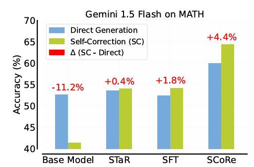
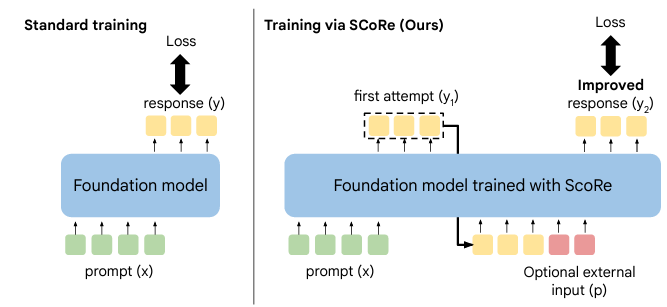
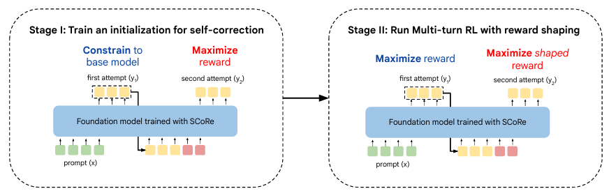

ここ最近の強化学習関係の論文で引用数が多かったものが気になったので調べてみました。
結果ICLR 2025で採択された論文のLLMによる自己修正に関する論文が多いとのことでした。
著者は内容について知らず。
気になりましたので論文を読んでみました。

本日テーマ：
>大規模言語モデル（LLM）が自分自身の誤りを自己修正（self-correction）できるようにするための強化学習（RL）フレームワークScoreについて

## 概要

論文「Training Language Models to Self-Correct via Reinforcement Learning」は、**大規模言語モデル（LLM）が自分自身の誤りを自己修正（self-correction）できるようにするための強化学習（RL）フレームワーク**を提案した研究です[arXiv](https://arxiv.org/abs/2409.12917)。

### 1. 背景と問題意識

- 現在の LLM は、一見すると「自己修正」ができそうに見えるものの、実際には **既存の自己修正手法はほとんど効果がない**ことが繰り返し示されています。
- 既存の自己修正学習手法は、多くの場合  
  - 複数のモデル（例：より高性能なモデルによる監督）  
  - 追加の教師信号（外部フィードバックなど）  
  に依存しており、**単一の LLM だけで、自律的に自己修正を学習する方法が不足**していました。

### 2. 提案手法：SCoRe（Self-Correction via Reinforcement）

著者らは、**SCoRe** という **マルチターン・オンライン強化学習（multi-turn online RL）フレームワーク**を提案しています[arXiv](https://arxiv.org/abs/2409.12917)。

主な特徴は以下の通りです。

- **完全に自己生成データのみで学習**  
  - 外部のより高性能なモデルや追加の人間フィードバックに頼らず、  
    モデル自身が生成した「修正トレース（correction traces）」を用いて学習します。
- **マルチターン RL**  
  - 1回の応答生成だけでなく、複数ステップにわたる「修正プロセス」を強化学習で最適化します。
- **分布整合性と安定化のための正則化**  
  - モデルが「報酬を稼ぐためだけの応答」に偏る（behavior collapse）のを防ぎ、  
    実際のタスク分布に近い自己修正行動を学習するよう、適切な正則化を導入しています。
- **報酬設計**  
  - 自己修正が成功した場合に報酬ボーナスを与え、  
    修正前後の改善を RL の報酬として学習させます。

### 3. 実験と結果

Gemini 1.0 Pro および Gemini 1.5 Flash をベースモデルとして実験を行い、以下の結果が報告されています[arXiv](https://arxiv.org/abs/2409.12917)。

- **MATH（数学推論）ベンチマーク**  
  - ベースモデルの自己修正性能に対し、**15.6% の性能向上**を達成。
- **HumanEval（コード生成）ベンチマーク**  
  - ベースモデルの自己修正性能に対し、**9.1% の性能向上**を達成。
- これらは、**既存の自己修正手法を上回る state-of-the-art の結果**と報告されています。

## 自己修正とは

この論文でいう「自己修正（self-correction）」は、**大規模言語モデル（LLM）が自分の出力を一度生成した後、その内容を確認し、誤りがあれば自分自身で修正するプロセス**を指します[arXiv](https://arxiv.org/abs/2409.12917)。

具体的には、以下のような流れを想定しています。

1. **初期回答の生成**  
   - モデルはまず、与えられた問題（例：数学問題、プログラミング問題）に対して、通常通り回答を生成します。

2. **自己チェック（self-check）**  
   - 生成した回答に対して、モデル自身が「正しいかどうか」「誤りがないか」を確認します。  
   - このとき、**外部の正解ラベルや別の高性能モデルには頼らず**、モデル自身の判断能力を用います。

3. **修正ステップ（correction step）**  
   - 誤りや不十分な点を検出した場合、モデルは**2回目以降の生成で回答を修正**します。  
   - たとえば、数学問題であれば「計算の見直し」や「別の解法の試行」、  
     コード生成であれば「バグの修正」や「より効率的な実装への書き換え」などを行います。

4. **マルチターンの修正プロセス**  
   - この論文の提案手法 SCoRe では、**複数ターンにわたる修正プロセス**を強化学習で最適化します。  
   - つまり、「1回目の回答 → 自己チェック → 2回目の修正回答 → …」という**複数ステップの修正トレース**を、モデル自身が生成し、それを学習データとして使います。

### どのようなタスクで使われるか

論文では主に以下のようなタスクで自己修正が評価されています[arXiv](https://arxiv.org/abs/2409.12917)。

- **数学推論（MATH ベンチマーク）**  
  - 一度解いた問題の答えが間違っていないか、あるいは解法に抜けがないかを確認し、必要に応じて再計算・再推論する。
- **コード生成（HumanEval ベンチマーク）**  
  - 生成したコードが仕様を満たしているか、バグがないかをチェックし、修正版のコードを生成する。

### 既存の自己修正との違い

論文のアブストラクトでは、既存の自己修正手法は

- 複数のモデル（例：より高性能なモデルによる監督）  
- 追加の教師信号（人間のフィードバックなど）

に依存しているのに対し、この論文の「自己修正」は

- **単一の LLM だけで**  
- **完全に自己生成したデータのみ**を使って  
- **強化学習で自己修正能力を向上させる**

という点が特徴的です[arXiv](https://arxiv.org/abs/2409.12917)。

要するに、この論文における「自己修正」とは、

> 「モデルが自分の出力を一度出してから、それを自分で見直し、必要なら自分で書き直す」  
> という**マルチターンの自己改善プロセス**

を指しており、それを強化学習で訓練することで、外部の助けなしに自己修正能力を高める、というのが核心です。

## この論文が解決しようとした課題

読めば読むほどという感じですが、本論文の価値は思ったことをひたすら書き上げるというLLMの行動型を変えることになる、ということにあるのではと思いました。

本論文が解決しようと取り組んだ課題は、以下のように整理できます[arXiv](https://arxiv.org/abs/2409.12917)。

### 1. 中核的な課題：LLM の自己修正能力が「ほとんど機能していない」

- 現在の大規模言語モデル（LLM）は、一見すると「自分の誤りを修正できそう」に見えるものの、  
  実際には **既存の自己修正（self-correction）手法はほとんど効果がない**ことが繰り返し示されています。
- つまり、**「LLM が自分で自分の誤りを直す」という能力が、現状では十分に発揮されていない**というのが、この論文が取り組む根本的な課題です。

### 2. 既存手法の限界（この論文が指摘する問題点）

論文では、既存の自己修正学習手法には次のような問題があると指摘しています[arXiv](https://arxiv.org/abs/2409.12917)。

1. **外部のより高性能なモデルに依存する**  
   - 多くの自己修正手法は、  
     - より高性能な LLM による監督  
     - 別のモデルによるフィードバック  
     に頼っており、**単一の LLM だけで自律的に自己修正を学習する方法が不足**しています。

2. **追加の教師信号（人間のフィードバックなど）が必要**  
   - 自己修正を訓練するために、  
     - 人間による修正例  
     - 外部の報酬モデル  
     などを必要とする手法が多く、**自己生成データだけで学習する枠組みが弱い**。

3. **分布のミスマッチと行動の崩壊（behavior collapse）**  
   - 単純な教師あり微調整（SFT）や報酬最大化だけでは、  
     - モデルが「報酬を稼ぐためだけの応答」に偏る  
     - 実際のタスク分布から外れた挙動になる  
     といった問題が起きやすく、**安定した自己修正行動を学習しにくい**。

### 3. この論文が目指す解決

そこでこの論文は、次のような条件を満たす自己修正学習フレームワークを目指しています[arXiv](https://arxiv.org/abs/2409.12917)。

- **単一の LLM だけで**自己修正を学習できること  
- **外部の高性能モデルや追加の教師信号に頼らず**、**完全に自己生成データのみ**で学習できること  
- **分布のミスマッチや行動の崩壊を防ぎつつ**、自己修正能力を安定して向上させること  

この目的を達成するために、著者らは **SCoRe（Self-Correction via Reinforcement）** という  
**マルチターン・オンライン強化学習フレームワーク**を提案しています。

## 関連研究

論文「Training Language Models to Self-Correct via Reinforcement Learning」の関連研究（Related Work）では、主に以下のような論文と、それぞれが抱える課題が挙げられています[arXiv](https://arxiv.org/pdf/2409.12917.pdf)。

### 1. 自己修正（Self-Correction）の限界を指摘する研究

__(1) Huang et al. (2023) / Kamoi et al. (2024) など__
- **指摘されている課題**  
  - 現代の LLM において、**外部フィードバックなしの「自己修正（intrinsic self-correction）」はほとんど効果がなく、むしろ性能を低下させることがある**。  
  - つまり、「モデルが自分で自分の誤りを直そうとすると、かえって悪化する」という現象が報告されています。

__(2) Kim et al. (2023) / Shinn et al. (2023) など__
- **指摘されている課題**  
  - 自己修正の際に**正解データ（ground-truth）を使用**しており、  
    一般的な「正解ラベルがない」設定では適用が難しい。  
  - 実運用では正解ラベルが手に入らないことが多いため、**現実的な自己修正手法としての汎用性が低い**。

__(3) Madaan et al. (2023) – Self-Refine__
- **指摘されている課題**  
  - 初回の回答に**意図的に弱いプロンプト**を使うことで、改善幅を過大評価している。  
  - 実際には、初回から十分に強いプロンプトを使うと、**自己修正による改善がほとんど見られない**ことが多い。

__(4) Olausson et al. (2023)__
- **指摘されている課題**  
  - コードの自己修正において、**テストケースなどの部分的なフィードバックがあっても修正が困難**である。  
  - つまり、「どこが間違っているか」はある程度分かっていても、**実際に正しいコードに修正する能力が不足**している。

### 2. 外部モデル・外部教師信号に依存する手法

__(5) Saunders et al. (2022) / Qu et al. (2024) / Ye et al. (2023) など__
- **指摘されている課題**  
  - 自己修正の学習に、**人間やより強力なモデル（Teacher）のデモンストレーション**に依存している。  
  - これにより、**自己生成データのみで学習する枠組みが弱く、スケーラビリティや汎用性に限界**がある。

### 3. SFT（教師あり微調整）ベースの自己修正の限界

__(6) Zelikman et al. (2022)__
- **指摘されている課題**  
  - オフラインでモデルが生成したデータに対して SFT を行うと、  
    - **データ収集時と学習後の「分布の不一致（distribution mismatch）」**  
    - **修正を行わなくなる「振る舞いの崩壊（behavior collapse）」**  
    が起きる。  
  - 結果として、**自己修正能力が実質的に改善しない（Δ(t1, t2) が小さい）**ことが示されています。

### 4. 別モデルを用いた修正モデルの設計

__(7) Havrilla et al. (2024b) – GLoRE__

- **指摘されている課題**  
  - 修正のために**別個のモデル（修正専用モデル）** が必要であり、  
    推論時のシステム設計が複雑になる。  
  - 単一の LLM だけで自己修正を完結させるという観点からは、**アーキテクチャ上の負担が大きい**。

## 提案手法

そしてこの論文の提案手法についてです。
その名も**SCoRe（Self-Correction via Reinforcement）** と呼ばれる、**マルチターン・オンライン強化学習フレームワーク**です[arXiv](https://arxiv.org/abs/2409.12917)。

以下、その中身を段階的に整理します。

### 1. 全体像：何を目指しているか

- **目的**  
  - 単一の LLM が、**外部の高性能モデルや追加の教師信号に頼らず**、  
    **自分自身で生成したデータだけを使って**、自己修正能力を高めること。
- **課題への対応**  
  - 既存の自己修正手法は  
    - 外部モデルや正解ラベルに依存  
    - SFT（教師あり微調整）による分布の不一致・行動の崩壊  
    といった問題を抱えていました。  
  - SCoRe は、**オンライン強化学習（RL）でこれらの問題を緩和**します。

### 2. 学習プロセスの概要

SCoRe は、おおまかに次のような流れで学習します[arXiv](https://arxiv.org/abs/2409.12917)。

__(1) 自己生成データによる「修正トレース」の収集__

- モデルは、与えられた問題（例：数学問題、コード問題）に対して、  
  **複数ターンにわたる「修正プロセス」** を自分で生成します。
- たとえば：
  - 1ターン目：初期回答を生成  
  - 2ターン目：その回答をチェックし、誤りがあれば修正版を生成  
  - 3ターン目：さらに改善案を生成 …  
- この一連の「初期回答 → 修正 → 再修正 …」の流れを、**修正トレース（correction trace）** と呼びます。

__(2) 報酬設計：自己修正の成功を評価__

- 修正トレースの各ステップに対して、**自己修正が成功したかどうか**を評価し、報酬を与えます。
- 具体的には：
  - 数学問題：最終的な答えが正しいか  
  - コード問題：テストケースを通過するか  
- この報酬を最大化するように、**ポリシー（LLM）を強化学習で更新**します。

__(3) オンライン RL によるポリシー更新__

- SCoRe は**オンライン RL** であり、  
  - モデルがデータを生成  
  - そのデータに対して即座に報酬を計算  
  - ポリシーを更新  
  というサイクルを繰り返します。
- これにより、**オフライン SFT で起きる「分布の不一致」や「行動の崩壊」を軽減**します。

### 3. 設計上の工夫（既存手法との違い）

論文では、SCoRe が既存手法と比べて特に重視している点として、以下のような工夫が挙げられています[arXiv](https://arxiv.org/pdf/2409.12917.pdf)。

__(1) 自己生成データのみでの学習__

- 外部の高性能モデルや人間のフィードバックに頼らず、  
  **モデル自身が生成した修正トレースだけで学習**します。
- これにより、**単一の LLM が自律的に自己修正能力を高められる**ようになります。

__(2) マルチターン RL による「修正プロセス」の最適化__

- 1回の応答だけでなく、**複数ターンにわたる修正プロセス全体**を RL で最適化します。
- これにより、  
  - 「どこで誤りに気づくか」  
  - 「どのように修正するか」  
  といった**修正戦略そのもの**を学習できます。

__(3) 正則化による分布整合性と行動の崩壊の防止__

- 単純に報酬を最大化するだけだと、  
  - モデルが「報酬を稼ぐためだけの応答」に偏る  
  - 実際のタスク分布から外れた挙動になる（behavior collapse）  
  といった問題が起きます。
- SCoRe では、**適切な正則化**を導入し、  
  - モデルが**自分の生成分布に近い修正行動**を取るように誘導  
  - 修正を行わなくなる（＝自己修正能力が失われる）ことを防ぐ  
  といった工夫がなされています。

__(4) 報酬ボーナスによる「真の自己修正」の促進__

- 単に「正しい答えを出す」だけでなく、  
  **「誤りを検出し、修正して正解にたどり着く」** というプロセスに対して報酬ボーナスを与えます。
- これにより、**「自己修正そのもの」を学習対象**にすることができます。

### 4. まとめ

提案手法 SCoRe は、

- **単一の LLM が**  
- **自分で生成したマルチターンの修正トレースに対して**  
- **オンライン強化学習を行い**  
- **適切な正則化と報酬設計によって、自己修正能力を安定して向上させる**

という枠組みです。

これにより、

- 外部モデルや追加教師信号への依存を減らし  
- オフライン SFT の分布不一致・行動崩壊を避け  
- 数学推論（MATH）やコード生成（HumanEval）で、既存手法を上回る自己修正性能を達成

していると報告されています[arXiv](https://arxiv.org/abs/2409.12917)。

もし、SCoRe の具体的なアルゴリズム（例えば、どのような RL アルゴリズムを使っているか、報酬関数の詳細など）についても知りたい場合は、その点に絞ってさらに詳しくご説明いたします。

## 実験

お待ちかねの実験結果です。

論文「Training Language Models to Self-Correct via Reinforcement Learning」では、提案手法 **SCoRe** を、**数学推論（MATH）** と **コード生成（HumanEval, MBPP など）** のタスクで評価しています[arXiv](https://arxiv.org/pdf/2409.12917.pdf)。

以下、実験の設定と主な結果を整理します。

### 1. 実験の全体設定

__ベースモデル__
- **数学推論（MATH）**  
  - ベースモデル：**Gemini 1.5 Flash**  
- **コード生成（HumanEval, MBPP, MBPP-R）**  
  - ベースモデル：**Gemini 1.0 Pro**

__タスク・ベンチマーク__
- **MATH500**（数学推論ベンチマーク）  
- **HumanEval**（Python コード生成）  
- **MBPP**（Python プログラミング問題）  
- **MBPP-R**（MBPP のリファクタリング版）

__比較手法__
SCoRe は以下のようなベースラインと比較されています[arXiv](https://arxiv.org/pdf/2409.12917.pdf)。

- **ベースモデル単体**（自己修正なし）  
- **Self-Refine**（プロンプトベースの自己修正手法）  
- **SFT ベースの自己修正手法**  
  - STaR（Zelikman et al., 2022）  
  - Pair-SFT（Welleck et al., 2023）  
- その他、関連する SFT ベースの自己修正手法

### 2. 評価指標：Accuracy@t1, Accuracy@t2, Δ(t1, t2)

論文では、自己修正の効果を以下の指標で評価しています。

- **Accuracy@t1**：1回目の回答（初期回答）の正解率  
- **Accuracy@t2**：2回目の回答（修正後）の正解率  
- **Δ(t1, t2)**：t1 から t2 への**純粋な改善量**（= Accuracy@t2 − Accuracy@t1）

この Δ(t1, t2) が大きいほど、「自己修正によってどれだけ性能が上がったか」を表します。

### 3. 主な実験結果

__(1) MATH（数学推論）での結果__

- **ベースモデル（Gemini 1.5 Flash）**  
  - 自己修正なしの性能を基準とし、SCoRe 適用後の結果は：
    - **Accuracy@t2 = 64.4%**  
    - **Δ(t1, t2) = +4.4%**（= 修正による純粋な改善）  
    - ベースモデルに対する**相対改善率：15.6%**  
- これは、既存の SFT ベース手法（STaR, Pair-SFT）や Self-Refine よりも**有意に高い自己修正性能**を示しています。

__(2) HumanEval（コード生成）での結果__

- **ベースモデル（Gemini 1.0 Pro）**  
  - SCoRe 適用後の結果は：
    - **Accuracy@t2 = 64.6%**  
    - **Δ(t1, t2) = +12.2%**（修正による純粋な改善）  
    - ベースモデルに対する**相対改善率：9.1%**  
- こちらも、SFT ベースの自己修正手法よりも**高い改善幅**を達成しています。

__(3) MBPP / MBPP-R での結果__

- MBPP および MBPP-R でも、SCoRe は  
  - ベースモデル単体  
  - SFT ベースの自己修正手法  
  を上回る性能を示しています（具体的な数値は論文内の表に記載）。

### 4. 既存手法との比較と分析

論文では、既存手法（特に SFT ベースの自己修正）について、以下のような問題が指摘されています[arXiv](https://arxiv.org/pdf/2409.12917.pdf)。

- **SFT ベース手法（STaR, Pair-SFT など）**  
  - オフラインデータに対して SFT を行うため、  
    - **分布の不一致（distribution shift）**  
    - **行動の崩壊（behavior collapse）**（＝モデルが修正を行わなくなる）  
    が起きやすく、**Δ(t1, t2) が小さくなる**傾向がある。
- **Self-Refine**  
  - プロンプトベースの自己修正であり、  
    - 初回回答を意図的に弱くする設定が多い  
    - 実際の運用では改善幅が限定的  
  といった問題がある。

これに対し、**SCoRe** は

- **オンライン強化学習**により、  
  - モデル自身の生成分布に近いデータで学習  
  - 修正行動そのものを報酬で学習  
- **正則化と報酬設計**により、  
  - 分布の不一致を緩和  
  - 行動の崩壊を防ぐ  

といった工夫により、**Δ(t1, t2) を大きく改善**できたと報告されています。

## 総括

**総括：本論文の要点**

- **問題意識**  
  - 現在の LLM は「自己修正（self-correction）」がほとんど機能しておらず、  
    既存手法は外部モデルや追加教師信号に依存し、分布不一致・行動崩壊を起こしがち。

- **提案手法：SCoRe**  
  - **単一の LLM が、自己生成データだけで、マルチターン・オンライン強化学習**により自己修正能力を高めるフレームワーク。  
  - 外部モデルや正解ラベルに頼らず、報酬設計と正則化で「真の自己修正」を学習。

- **実験結果**  
  - Gemini 1.5 Flash（MATH）・Gemini 1.0 Pro（コード）をベースに、MATH500・HumanEval などで評価。  
  - MATH：Accuracy@t2 = 64.4%、Δ(t1, t2) = +4.4%、相対改善 15.6%。  
  - HumanEval：Accuracy@t2 = 64.6%、Δ(t1, t2) = +12.2%、相対改善 9.1%。  
  - 既存の SFT ベース自己修正や Self-Refine を上回る、安定した自己修正性能を達成。

- **意義**  
  - 外部依存を減らしつつ、LLM が自律的に自己修正能力を高められる RL ベースのメタ戦略を提示した点が重要。

[arXiv](https://arxiv.org/abs/2409.12917)

ということでなかなか見ごたえある論文でした。
