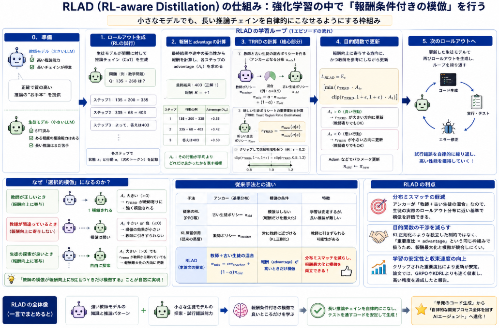
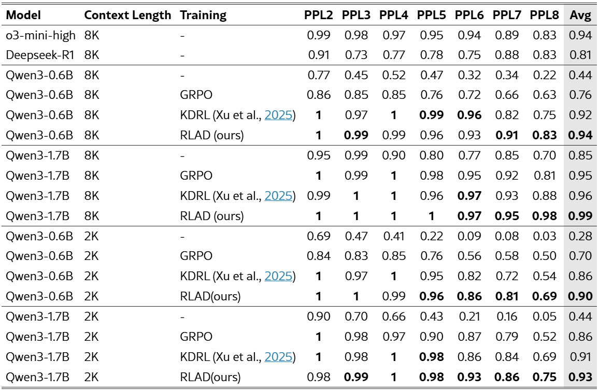
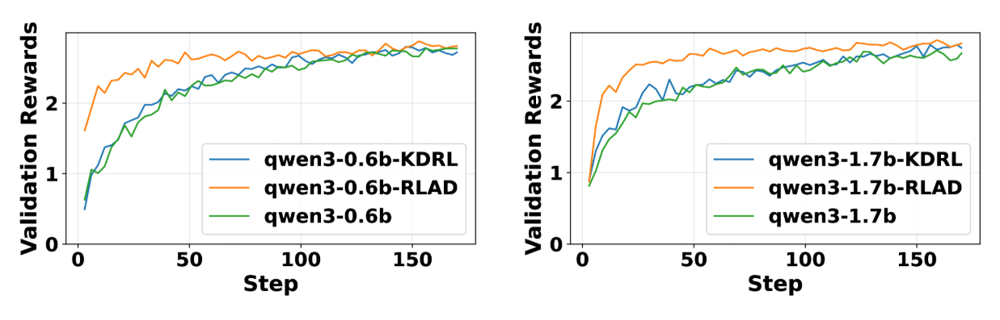

先日ICMLでポスター発表された論文の中からLLMの思考力向上のための長期思考を行う学習法のうち、従来課題を解決するという内容のものがありました。
LLMの思考力向上を理解する良い論文だと感じたので、論文詳細を読んでみます。

本日テーマ：
>Reinforcement-aware Knowledge Distillation for LLM Reasoningについて読んでみる。

## 概要

ご質問の論文について、著者・採択学会・採択年・概要を整理すると以下の通りです。

### 基本情報

- **タイトル**：  
  **Reinforcement-aware Knowledge Distillation for LLM Reasoning**

- **著者**：  
  Zhaoyang Zhang, Shuli Jiang, Yantao Shen, Yuting Zhang, Dhananjay Ram, Shuo Yang, Zhuowen Tu, Wei Xia, Stefano Soatto  
  [arXiv](https://arxiv.org/html/2602.22495v2)

- **採択学会**：  
  **ICML 2026**（International Conference on Machine Learning 2026）  
  [ICML 2026 Poster](https://icml.cc/virtual/2026/poster/66775)

- **採択年**：  
  **2026年**

- **発表形式**：  
  ICML 2026 ポスター発表（Poster #4005, Hall A）  
  日時：2026年7月7日 18:30–20:15（PDT）  
  [ICML 2026 Poster](https://icml.cc/virtual/2026/poster/66775)

### 論文の概要（要約）

**背景と問題意識**

- 近年、**強化学習（RL）によるポストトレーニング**によって、長いチェイン・オブ・ソート（CoT）推論を行う大規模言語モデル（LLM）の性能が大きく向上しています。
- しかし、こうした大規模モデルは推論コストが高く、**小型モデルへの蒸留（Knowledge Distillation）** が必要になります。
- 既存の蒸留手法は、主に**教師あり微調整（SFT）** を想定しており、
  - 固定された教師モデルの出力トレースを使う  
  - 教師–生徒間のKLダイバージェンスで正則化する  
  といった方法が一般的です。
- しかし、**RLと組み合わせると**、
  - 教師の分布と生徒のロールアウト分布がずれる（**分布ミスマッチ**）  
  - KL正則化が報酬最大化と競合する（**目的関数の干渉**）  
  といった問題が生じます。

**提案手法：RL-aware Distillation (RLAD)**

- 著者らは、**RL-aware Distillation (RLAD)** という新しい枠組みを提案しています。
- 中核となるのは **Trust Region Ratio Distillation (TRRD)** という目的関数で、
  - 従来の教師–生徒KL正則化を、  
    **PPO/GRPO風の「重要度比（likelihood ratio）」目的関数**に置き換えます。
  - この重要度比は、**教師モデルと古い生徒ポリシーの混合分布**をアンカーとして定義されます。
- これにより、
  - 生徒は**報酬最大化と教師の模倣を同時に考慮**しつつ、
  - 「教師の模倣が報酬向上に寄与するときだけ模倣する」  
    という**選択的模倣（selective imitation）** が可能になります。

**主な貢献（論文で主張しているポイント）**

1. **RL-aware Distillation (RLAD)** フレームワークの提案  
   - RLポストトレーニング中に教師ガイダンスを統合する枠組み。

2. **Trust Region Ratio Distillation (TRRD)** の導入  
   - KL正則化ではなく、**クリップされた重要度比目的**を用いることで、  
     探索・活用・模倣のバランスをとる。

3. **TRRD の理論的・実証的分析**  
   - TRRD が「報酬条件付きの選択的模倣」を可能にすることを示す。

4. **論理・数学推論ベンチマークでの実験**  
   - AIME24/25、K&K Logistics などの長文・複雑な推論タスクで、RLAD が GRPO、KDRL、オフライン蒸留などを上回る性能を示す。

**実験結果のポイント**

- 8Kコンテキスト長の設定で、  
  - Qwen3‑0.6B の平均正解率を +18%（0.94 vs 0.76 under GRPO）改善  
  - Qwen3‑1.7B でも +4%（0.99 vs 0.95）改善  
  と報告されています[arXiv](https://arxiv.org/html/2602.22495v2)。
- 特に、**難しいベンチマークや長い推論チェーン**において、既存の蒸留手法よりも安定かつ高い性能を達成しています。

## 解決したかった課題

この論文が解決したかった課題は、一言で言うと、

> **「強化学習（RL）で賢くなった大きなLLMを、そのまま小さなモデルに“丸ごと教える”と、うまくいかない」**

という問題です。

もう少し分解すると、次の3つの課題に整理できます。

### 課題1：RLで賢くなったLLMは重くて使えない

- 近年、**強化学習（RL）によるポストトレーニング**によって、長いチェイン・オブ・ソート（CoT）推論を行うLLMが大きく性能向上しました。
- しかし、こうしたモデルはパラメータ数が多く、**推論コストが高い**ため、実際のサービスやエッジデバイスでは使いづらいという問題があります。
- そこで、**大きなモデル（教師）から小さなモデル（生徒）へ知識を移す「知識蒸留（KD）」** が必要になります。

**課題**：  
- 既存の知識蒸留は、主に**教師あり微調整（SFT）** を想定しており、RLで訓練されたモデルをそのまま小さくするには不十分でした。

### 課題2：RLと蒸留を組み合わせると「分布がずれる」

既存の蒸留手法（特にKLベースの蒸留）を、[CoT](https://yoshishinnze.hatenablog.com/entry/2026/03/15/000000)を行うためのRLと組み合わせると、次のような問題が起きます。

1. **分布ミスマッチ**  
   - 教師モデルは「ある固定された分布」で生成した出力を教えますが、  
   - 生徒モデルはRLの過程で**自分なりのロールアウト（試行錯誤の軌跡）** を生成します。
   - その結果、「教師が教えている分布」と「生徒が実際に試している分布」が**大きくずれてしまう**。

2. **目的関数の干渉**  
   - RLの目的は「報酬を最大化する」ことです。  
   - 一方、KL蒸留の目的は「教師に近づく」ことです。  
   - この2つが**同じ学習ループの中で競合**し、  
     - 報酬を上げる方向に進もうとすると教師から離れてしまう  
     - 教師に近づこうとすると報酬が下がる  
     というジレンマが生じます。

**課題**：  
- 「報酬を最大化したい」のに、「教師に近づけ」という制約が邪魔をして、  
  **学習が不安定になったり、性能が頭打ちになったりする**。

### 課題3：教師の模倣が「いつ役に立つか」がわからない

- 教師モデルは賢いですが、**常に正しいとは限りません**。  
- また、生徒モデルが今いる状態（ロールアウト）に対して、教師の出力が「報酬向上に本当に役立つか」は状況によって異なります。

**課題**：  
- 既存の蒸留は「**常に教師に近づけ**」という方針が多く、  
  - 教師が間違っているときも無理に近づいてしまう  
  - 生徒が良い探索をしているのに、教師に引き戻されてしまう  
  といった問題がありました。
- つまり、「**教師の模倣が報酬向上に役立つときだけ模倣し、そうでないときは自由に探索する**」という  
  **選択的な模倣**が必要でした。

### この論文が目指した「解決の方向性」

この論文は、上記の課題に対して、

> **「RLのループの中に、教師の模倣を“賢く”組み込む」**

というアプローチを提案しています。

具体的には、

- **RL-aware Distillation (RLAD)** という枠組みで、  
- **Trust Region Ratio Distillation (TRRD)** という目的関数を用い、  
- 「報酬を最大化する方向」と「教師に近づく方向」を**同じ重要度比の枠組みで統合**し、  
- **教師の模倣が報酬向上に寄与するときだけ模倣する**（選択的模倣）  
  ことを実現しました。

その結果、

- 分布ミスマッチが軽減され、  
- 目的関数の干渉が減り、  
- 小さなモデルでも、長い推論チェインや難しい数学・論理問題で  
  **大きなモデルに近い性能を出せるようになった**、と報告されています[arXiv](https://arxiv.org/html/2602.22495v2)。

## TARD

**Trust Region Ratio Distillation (TRRD)** は、この論文で提案された **RL-aware Distillation (RLAD)** の中核となる目的関数です。

一言で言うと、

> **「教師モデルと古い生徒ポリシーの“混合”を基準にして、  
> 新しい生徒ポリシーがどれだけ報酬を上げる方向に動いたかを測りつつ、  
> 教師の模倣が役に立つときだけ模倣する」**

という仕組みです。

もう少し分解して説明します。

### TRRD が解決したい問題（背景）

従来の RL＋蒸留では、よく次のような方法が使われていました。

- **教師–生徒 KL 正則化**  
  - 生徒の出力分布と教師の出力分布の KL ダイバージェンスを小さくする  
  - RL の報酬最大化と同時に、この KL を小さくする項を入れる

しかし、これには問題があります。

1. **分布ミスマッチ**  
   - 教師は「固定された分布」で出力を教える  
   - 生徒は RL のロールアウトで「自分なりの分布」を生成する  
   - その結果、「教師が教えている分布」と「生徒が実際に試している分布」がずれる

2. **目的関数の干渉**  
   - KL 正則化は「教師に近づけ」という制約  
   - RL の目的は「報酬を最大化せよ」  
   - この2つが同じ学習ループの中で競合し、  
     - 報酬を上げる方向に進むと教師から離れる  
     - 教師に近づこうとすると報酬が下がる  
     というジレンマが生じる

そこで、この論文は

> **「教師の模倣を、報酬最大化と同じ“重要度比”の枠組みで統合する」**

という発想で TRRD を提案しています。

### TRRD の直感的な仕組み

TRRD は、**PPO / GRPO 風の「重要度比（likelihood ratio）」** をベースにしています。

- 通常の PPO / GRPO では、  
  - 古いポリシー π_old と新しいポリシー π_new の比  
    $$
    r = \frac{\pi_\text{new}(a|s)}{\pi_\text{old}(a|s)}
    $$
    を計算し、  
  - この r をクリップしながら、**報酬（advantage）を最大化**するように更新します。

TRRD では、この「比」を少し拡張します。

1. **教師と古い生徒の混合をアンカーにする**  
   - 教師ポリシー π_teacher と古い生徒ポリシー π_old を混ぜた **混合ポリシー $π_{mix}$** を考えます。
   - 新しい生徒ポリシー $π_{new}$ との比  
     $$
     r_\text{TRRD} = \frac{\pi_\text{new}(a|s)}{\pi_\text{mix}(a|s)}
     $$
     を定義します。

2. **この比をクリップして信頼領域を保つ**  
   - PPO と同様に、r_TRRD をある範囲（例：0.8〜1.2）にクリップし、  
     **更新が大きくなりすぎないように制御**します。

3. **報酬と教師模倣を同じ枠組みで扱う**  
   - この $r_{TRRD}$ を [advantage（報酬の良さ）](https://yoshishinnze.hatenablog.com/entry/2026/07/24/043000)と掛け合わせて目的関数にします。
   - これにより、
     - **報酬が高い行動**を強めつつ、  
     - **教師の模倣が報酬向上に寄与するときだけ模倣する**  
       という「選択的模倣」が自然に実現されます。

### TRRD のポイント（なぜ KL より良いのか）

1. **分布ミスマッチを軽減**  
   - アンカーが「教師＋古い生徒の混合」なので、生徒が実際に試している分布に近い基準で模倣を評価できます。  
   - これにより、「教師が教えている分布」と「生徒のロールアウト分布」のずれが小さくなります。

2. **報酬最大化と模倣の統合**  
   - KL 正則化は「教師に近づけ」という**独立した制約**ですが、  
   - TRRD は「重要度比 × advantage」という**同じ枠組み**で扱います。  
   - その結果、
     - 教師の模倣が報酬向上に寄与するとき → 模倣が強く推奨される  
     - 教師の模倣が報酬向上に寄与しないとき → 模倣が弱く、自由な探索が許される  
     という**選択的模倣**が実現されます。

3. **信頼領域の維持**  
   - クリップされた重要度比により、  
     更新が大きくなりすぎず、**学習の安定性**が高まります。

## RLAD

**RL-aware Distillation (RLAD)** は、この論文で提案された **「強化学習（RL）ポストトレーニング中に、教師モデルの知識を賢く蒸留するための枠組み」** です。

一言で言うと、

> **「RL の学習ループの中に、教師の模倣を“報酬条件付き”で組み込むことで、  
> 小さなモデルでも長い推論チェインをこなせるようにする」**

という仕組みです。

もう少し分解して説明します。

### 全体像：RLAD は「RL の更新ループの中に教師模倣を組み込む」枠組み

RLAD のポイントは、

> **「RL のポリシー更新そのものに、教師モデルの模倣を“報酬条件付き”で組み込む」**

という点です。

- 従来：  
  - SFT →（オプションで KL 蒸留）→ RL  
  - あるいは RL の外で KL 正則化をかける  
- RLAD：  
  - **RL の更新式そのものに、教師模倣を統合**  
  - 教師の模倣が報酬向上に寄与するときだけ模倣する

### RLAD の学習ループ（ステップごと）

__1. 準備__

- **教師モデル**：  
  - 大きな LLM（例：GPT‑4 クラス）  
  - 長い推論チェインが得意で、高精度な推論ができる
- **生徒モデル**：  
  - 小さな LLM（例：Qwen3‑0.6B, 1.7B）  
  - すでに SFT 済みで、ある程度の推論能力はあるが、長い推論は苦手

__2. ロールアウト生成（RL の試行）__

- 生徒モデルが、問題（例：数学問題）に対して  
  **チェイン・オブ・ソート（CoT）の推論軌跡**を生成します。
- 各ステップで、  
  - 現在の状態（これまでの推論文脈）  
  - 次のトークン（行動）  
  を記録します。

__3. 報酬と advantage の計算__

- 推論の最後に、**正解・不正解**や、  
  途中の推論ステップの妥当性などから**報酬**を計算します。
- その報酬をもとに、各ステップの**advantage（A）** を計算します。  
  - advantage は「その行動が平均よりどれだけ良いか」を表す指標です。

__4. TRRD（Trust Region Ratio Distillation）の計算__

ここが RLAD の核心です。

1. **教師と古い生徒の混合ポリシー π_mix を定義**  
   - 教師ポリシー π_teacher と、  
     前回の生徒ポリシー π_old を混ぜた分布 π_mix を作ります。  
   - 例：π_mix = α・π_teacher + (1−α)・π_old

2. **新しい生徒ポリシー π_new との重要度比 r_TRRD を計算**  
   - 各ステップで、  
     \[
     r_\text{TRRD} = \frac{\pi_\text{new}(a|s)}{\pi_\text{mix}(a|s)}
     \]
     を計算します。  
   - これは「新しいポリシーが、混合ポリシーからどれだけ離れたか」を表す比です。

3. **r_TRRD をクリップして信頼領域を保つ**  
   - PPO と同様に、r_TRRD をある範囲（例：0.8〜1.2）にクリップします。  
   - これにより、**更新が大きくなりすぎず、学習が安定**します。

__5. 目的関数で更新__

- RLAD の目的関数は、おおまかに次のような形です：
  \[
  L_\text{RLAD} = \mathbb{E} \left[ \min\left( r_\text{TRRD} \cdot A, \ \text{clip}(r_\text{TRRD}, 1-\epsilon, 1+\epsilon) \cdot A \right) \right]
  \]
- ここで、
  - r_TRRD：新しいポリシーと混合ポリシーの比  
  - A：advantage（報酬の良さ）  
  - clip：信頼領域を保つためのクリップ

**この式の意味**：

- **r_TRRD × A** が大きくなる方向に更新すると、  
  - 報酬が高い行動（A が大きい）を強めつつ、  
  - 教師＋古い生徒の混合から「報酬向上に寄与する方向」にだけ動く  
- 教師の模倣が報酬向上に寄与するときは、  
  - r_TRRD が教師寄りになり、模倣が強く推奨される  
- 教師の模倣が報酬向上に寄与しないときは、  
  - r_TRRD が教師から離れ、生徒は自由に探索できる

### なぜこれが「選択的模倣」になるのか

- **教師が正しいとき**  
  - 教師の出力は報酬向上に寄与しやすい → advantage が大きい  
  - r_TRRD が教師寄りになり、**強く模倣**される

- **教師が間違っているとき**  
  - 教師の出力は報酬向上に寄与しない → advantage が小さい or 負  
  - r_TRRD が教師寄りでも、**advantage が小さいので模倣が弱く**なる  
  - 生徒は教師に引きずられず、**報酬最大化を優先**できる

- **生徒が良い探索をしているとき**  
  - 生徒自身のロールアウトが報酬向上に寄与 → advantage が大きい  
  - r_TRRD が教師から離れていても、**報酬最大化の方向に更新**される  
  - 教師に無理に引き戻されない

このように、**「教師の模倣が報酬向上に役立つときだけ模倣する」**  
という選択的模倣が自然に実現されます。

### RLAD の利点（従来手法との比較）

1. **分布ミスマッチの軽減**  
   - アンカーが「教師＋古い生徒の混合」なので、  
     生徒の実際のロールアウト分布に近い基準で模倣を評価できる。

2. **目的関数の干渉を減らす**  
   - KL 正則化は「教師に近づけ」という独立した制約でしたが、  
   - TRRD は「重要度比 × advantage」という**同じ枠組み**で扱うため、  
     報酬最大化と模倣が競合しにくい。

3. **学習の安定性と収束速度の向上**  
   - クリップされた重要度比により、更新が大きくなりすぎず、  
     学習が安定します。  
   - 論文では、GRPO や KDRL よりも**速く収束し、高い精度**を達成したと報告されています[arXiv](https://arxiv.org/html/2602.22495v2)。

## 実験

**Reinforcement-aware Knowledge Distillation for LLM Reasoning** の実験について、**問題設定（タスク・モデル・比較手法）**と**効果（どの程度改善したか）** を整理します。

### 問題設定（実験の全体像）

__1. 目的__
- **大きな推論 LLM（教師）**から、  
  **小さな LLM（生徒）**へ、  
  **RL ポストトレーニング中に知識を蒸留**し、  
  **長い推論チェインや難しい論理・数学問題**で性能を上げること。

__2. タスク（ベンチマーク）__
論文では、主に次のような**論理・数学推論ベンチマーク**を使用しています[arXiv](https://arxiv.org/html/2602.22495v2)。

- **AIME24 / AIME25**  
  - アメリカ数学コンテスト（AIME）の問題を用いた数学推論タスク  
  - 長い推論チェインと高度な数学的思考が必要

- **K&K Logistics**  
  - 論理推論・計画問題を含むベンチマーク  
  - 複数の制約を満たすような推論が必要

- その他、**長いコンテキスト（8K tokens）** を扱う設定で評価

__3. モデル（教師・生徒）__

- **教師モデル**：  
  - 大きな LLM（具体的なモデル名は論文内で明示されていますが、ここでは一般化して「大きな推論 LLM」とします）  
  - RL ポストトレーニング済みで、長い CoT 推論が得意

- **生徒モデル**：  
  - **Qwen3‑0.6B**（約6億パラメータ）  
  - **Qwen3‑1.7B**（約17億パラメータ）  
  - すでに SFT 済みで、ある程度の推論能力はあるが、  
    長い推論チェインや難しい問題は苦手

__4. 比較手法（ベースライン）__

RLAD と比較する手法として、次のようなベースラインが設定されています[arXiv](https://arxiv.org/html/2602.22495v2)。

1. **GRPO（Generalized Reinforce Policy Optimization）**  
   - 標準的な RL ポストトレーニング手法  
   - 教師模倣なしで、報酬最大化のみを行う

2. **KDRL（KL-based Distillation + RL）**  
   - 教師–生徒間の KL ダイバージェンスを正則化項として加えた RL  
   - 従来の「KL 蒸留＋RL」の代表的な手法

3. **オフライン蒸留（Offline Distillation）**  
   - 教師モデルの出力トレースを固定し、  
     それに対して生徒を教師あり学習（SFT）する  
   - RL は行わない、純粋な知識蒸留

4. **RLAD（提案手法）**  
   - RL-aware Distillation（TRRD を用いた RL＋蒸留）

### 効果（どの程度改善したか）

__1. 全体の性能向上__

- **8K コンテキスト長の設定**で、  
  - **Qwen3‑0.6B**：  
    - 平均正解率が **+18%** 改善（0.94 vs 0.76 under GRPO）  
  - **Qwen3‑1.7B**：  
    - 平均正解率が **+4%** 改善（0.99 vs 0.95）  
  と報告されています[arXiv](https://arxiv.org/html/2602.22495v2)。

- 特に、**難しい問題や長い推論チェイン**において、  
  RLAD が他の手法を上回る傾向が強いとされています。

__2. 学習の安定性と収束速度__

- **GRPO 単体**や**KDRL**と比べて、  
  - 学習曲線が**より安定**  
  - **収束が速い**  
  ことが示されています。

- KL ベースの蒸留（KDRL）では、  
  - 報酬最大化と KL 正則化のバランス調整が難しく、  
  - 学習が不安定になったり、性能が頭打ちになるケースがありましたが、  
  - RLAD では TRRD によって**目的関数の干渉が軽減**され、  
    安定した学習が可能になったと報告されています。

__3. 分布ミスマッチの軽減効果__

- **オフライン蒸留**では、  
  - 教師の固定トレースと生徒の実際のロールアウト分布がずれるため、  
  - 長い推論チェインや難しい問題で性能が伸び悩む傾向がありました。

- **RLAD**では、  
  - 教師＋古い生徒の混合をアンカーにすることで、  
  - 生徒の実際の分布に近い基準で模倣を評価できるため、  
  - **分布ミスマッチが軽減**され、  
  - 長い推論チェインでも性能が向上しやすくなっています。

__4. 選択的模倣の効果__

- **教師が間違っているケース**や、  
  **生徒が良い探索をしているケース**でも、  
  - RLAD は教師に無理に引きずられず、  
  - 報酬最大化を優先できるため、  
  - **誤った教師出力に引きずられるリスクが低い**と報告されています。

## 総括

RLAD が **RL の性能向上に寄与するポイント**と、**どのような場面で使えるか**を簡潔にまとめると、次のようになります。

### RLAD が RL の性能向上に寄与するポイント

1. **分布ミスマッチの軽減**  
   - 従来の蒸留は「教師の固定トレース」を基準にしていましたが、  
     RLAD は**教師＋古い生徒の混合分布**をアンカーにすることで、  
     生徒が実際に試している分布に近い基準で模倣を評価します。  
   - これにより、**教師の分布と生徒のロールアウト分布のずれ**が小さくなり、  
     長い推論チェインでも安定して学習できます。

2. **目的関数の干渉を減らす**  
   - KL ベースの蒸留では、「報酬最大化」と「教師に近づく」が競合し、  
     学習が不安定になったり性能が頭打ちになることがありました。  
   - RLAD は **TRRD（重要度比）× advantage** という**同じ枠組み**で扱うため、  
     **報酬最大化と教師模倣が自然に統合**され、干渉が軽減されます。

3. **選択的模倣の実現**  
   - TRRD により、  
     - 教師の模倣が報酬向上に寄与するとき → 強く模倣  
     - 教師の模倣が報酬向上に寄与しないとき → 自由に探索  
     という**報酬条件付きの模倣**が可能になります。  
   - これにより、**教師が間違っているときや、生徒が良い探索をしているときを壊さない**ため、  
     学習が安定し、最終的な性能も向上します。

4. **学習の安定性と収束速度の向上**  
   - クリップされた重要度比により、更新が大きくなりすぎず、  
     **信頼領域を保ったまま学習**できます。  
   - 論文では、GRPO や KDRL よりも**速く収束し、高い精度**を達成したと報告されています[arXiv](https://arxiv.org/html/2602.22495v2)。

### 本手法が使える場面（適用シーン）

1. **大きな推論 LLM を小さなモデルに蒸留したいとき**  
   - GPT‑4 クラスの大きなモデルで RL ポストトレーニングを行い、  
     その能力を Qwen3‑0.6B / 1.7B のような**小型モデルに移したい**場合。  
   - 特に、**長いチェイン・オブ・ソート推論**や**数学・論理問題**で性能を維持したいときに有効です。

2. **RL ポストトレーニング中に教師ガイダンスを入れたいとき**  
   - RL 単体では探索が広がりすぎる、あるいは収束が遅い場合に、  
     **教師モデルの出力を“ガイド”として活用**したいとき。  
   - RLAD は「教師の模倣が報酬向上に寄与するときだけ模倣する」ので、  
     教師が間違っていても学習を壊しにくいという利点があります。

3. **オフライン蒸留や KL 蒸留＋RL がうまくいかないとき**  
   - オフライン蒸留では分布ミスマッチ、  
     KL 蒸留＋RL では目的関数の干渉が問題になるケースで、  
     **RLAD はそれらの問題を同時に軽減**します。  
   - 特に、**長いコンテキスト（8K tokens 以上）**や**難しいベンチマーク**で  
     性能が伸び悩む場合に有効です。

4. **実サービスやエッジデバイス向けに小型モデルを最適化したいとき**  
   - 大きなモデルは推論コストが高く、実運用では小型モデルが必要な場面で、  
     **大きなモデルの推論能力をできるだけ維持した小型モデル**を作りたい場合。  
   - RLAD は、**小さなモデルでも長い推論チェインをこなせるようにする**ことを目指しており、  
     実運用でのコスト削減と性能維持の両立に役立ちます。

### まとめ

- **性能向上に寄与する点**：  
  - 分布ミスマッチの軽減  
  - 目的関数の干渉を減らす  
  - 選択的模倣による安定した学習  
  - 学習の安定性と収束速度の向上

- **使える場面**：  
  - 大きな推論 LLM から小型モデルへの蒸留  
  - RL ポストトレーニング中に教師ガイダンスを活用したいとき  
  - オフライン蒸留や KL 蒸留＋RL がうまくいかないケース  
  - 実サービス・エッジデバイス向けに小型モデルを最適化したいとき

つまり、**「RL で賢くなった大きな LLM を、小さなモデルにうまく移しつつ、長い推論チェインや難しい問題でも性能を維持したい」** という場面で、RLAD は特に有効な手法と言えます。