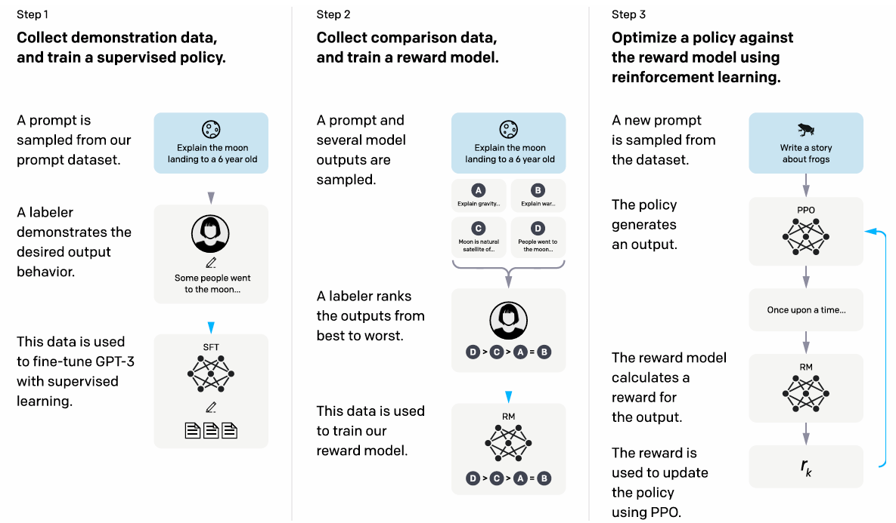
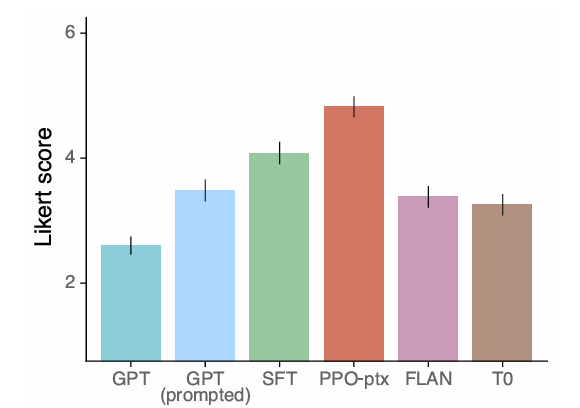

以前[RLHF](https://yoshishinnze.hatenablog.com/entry/2025/12/31/082922)についてご説明しました。
その時はRLHFの仕組みや効果のみにフォーカスを当ててましたが、やはり現論文で理解するとそれ以外の面にも使える知識になると思います。

本日テーマ：
>RLHFが世に公開された論文を当たって理解を深める

## 論文概要

**RLHF（Reinforcement Learning from Human Feedback）** の代表的な論文である  
**InstructGPT**（Ouyang et al., 2022）の概要を説明します。

### 論文情報

- **タイトル**：  
  *Training language models to follow instructions with human feedback*  
- **著者**：  
  Long Ouyang, Jeff Wu, Xu Jiang, Diogo Almeida, Carroll Wainwright, Pamela Mishkin, Chong Zhang, Sandhini Agarwal, Katarina Slama, Alex Ray, et al.  
- **公開**：  
  2022年3月（arXiv: [2203.02155](https://arxiv.org/abs/2203.02155)）  
- **所属**：  
  OpenAI

### 背景と目的

- GPT‑3 のような大規模言語モデルは、  
  - 大量のテキストから学習しているため、**知識は豊富**だが、  
  - 「指示に従う」「有害でない」「有用である」といった**人間の意図に沿った出力**は必ずしも得意ではない。
- そこで、**人間のフィードバックを報酬として強化学習（RLHF）** を行い、  
  **モデルを「指示に従う」「安全で有用な」方向に調整する**ことを目指しました。

### 手法の概要（3段階パイプライン）

InstructGPT は、次の3段階で訓練されます。

__1. 教師あり微調整（SFT: Supervised Fine-Tuning）__

- **目的**：  
  - 人間のアノテータが書いた「指示＋回答」のペアを使って、  
    モデルに「指示に従う」ことを教える。
- **手順**：  
  - 人間が様々な指示（タスク）に対して、望ましい回答を書く。  
  - そのデータで GPT‑3 を微調整し、**SFT モデル**を作る。

__2. 報酬モデルの学習（Reward Model Training）__

- **目的**：  
  - 「どの出力が人間にとって良いか」を予測する**報酬モデル**を作る。
- **手順**：  
  - 同じ指示に対して、モデルが複数の出力を生成。  
  - 人間がそれらを**ランキング（どちらが良いか）**で評価。  
  - そのランキングデータを使って、**報酬モデル**を訓練。  
    - 報酬モデルは、入力（指示＋出力）に対してスコアを出すように学習される。

__3. 強化学習（RLHF: Reinforcement Learning from Human Feedback）__

- **目的**：  
  - 報酬モデルを「報酬関数」として使い、  
    **PPO（Proximal Policy Optimization）** でモデルを更新する。
- **手順**：  
  - SFT モデルを初期ポリシーとして、  
    指示に対して出力を生成。  
  - 報酬モデルがその出力にスコア（報酬）を付与。  
  - PPO で、**報酬を最大化するようにポリシー（モデル）を更新**。  
  - 同時に、SFT モデルからの乖離が大きくなりすぎないよう、  
    **KL 正則化**をかけて安定化。

### 実験結果と主な知見

- **評価指標**：  
  - 人間評価者による「どちらの出力が良いか」の比較（ペアワイズ比較）。
- **主な結果**：  
  - **同じパラメータ数のモデルでも、RLHF をかけた InstructGPT は、元のGPT‑3 より人間評価で大きく勝る** ことが示されました。  
  - 特に、
    - **指示に従う能力**  
    - **有害でない・偏りの少ない出力**  
    - **有用性**  
    の面で改善が見られました。
- **モデルサイズとの関係**：  
  - 1.3B パラメータの InstructGPT が、  
    175B パラメータの GPT‑3 よりも人間評価で良い、という結果も報告されています。  
  - これは、「**RLHF によるアライメントが、モデルサイズ以上に重要**」であることを示唆しています。

### 意義と影響

- **RLHF の有効性を大規模に実証**：  
  - 「人間フィードバックを報酬とした強化学習」が、  
    実際に LLM の振る舞いを大きく改善できることを示した代表的な論文です。
- **ChatGPT の技術的基盤**：  
  - ChatGPT も同様の **SFT + RLHF** パイプラインを採用しており、  
    この論文の手法が実サービスレベルで有効であることを裏付けています。
- **アライメント研究の起点**：  
  - 「モデルを人間の意図に沿わせる」という**アライメント研究**の流れを強く後押ししました。

## 課題

**LLM に強化学習（RL）を使わないといけない根本的な課題**は、一言で言うと、

> **「教師あり学習（SFT）だけでは、“人間が望む振る舞い”を十分に教えられない」**

という問題です。

もう少し分解すると、次の4つの根本的な課題に整理できます。

### 課題1：教師データの限界（ラベル付けのコストと質）

- **SFT（教師あり微調整）**は、  
  - 「入力（指示）」と「望ましい出力（回答）」のペアを大量に用意する必要があります。
- しかし、
  - **高品質な教師データを作るには、人間の専門家が時間をかけて書く必要がある**（コストが高い）。
  - 特に「安全でない出力を避ける」「偏りを減らす」「微妙なニュアンスを正す」といった**質的な側面**は、  
    単純な正解ラベルだけでは表現しきれません。
- **根本的な課題**：  
  - 「人間が望む振る舞い」をすべて教師データとして網羅するのは、  
    **現実的には不可能**に近い。

### 課題2：評価軸の複雑さ（「正しい」だけでは足りない）

- LLM の出力には、単に「正解か不正解か」だけでなく、
  - **有用性**（役に立つか）  
  - **安全性**（有害でないか）  
  - **スタイル・トーン**（丁寧さ、専門性など）  
  - **一貫性・論理性**  
  など、**複数の評価軸**が絡みます。
- これらをすべて「教師データの正解ラベル」として表現するのは困難です。
- **根本的な課題**：  
  - 「正しい答え」を教えるだけでは、  
    **人間が実際に“良い”と感じる出力**を保証できない。

### 課題3：探索空間の広大さ（「どう答えるか」の選択肢が多すぎる）

- LLM は、同じ質問に対して**無数の出力**を生成できます。
  - 例：「日本の人口は？」に対して、  
    - 「約1億2千万人です」  
    - 「2020年時点で約1億2600万人です」  
    - 「1億2千万人くらいだと思います」  
    など、どれも“正しい”が、ニュアンスが異なる。
- SFT は「1つの正解」を教えることが多いため、  
  **多様な“良い出力”の空間全体**をカバーしきれません。
- **根本的な課題**：  
  - 教師データで示された“1つの正解”以外の、  
    **まだ見ていない“良い出力”をモデルが自ら探索する必要がある**。

### 課題4：報酬の定義（「人間が良いと感じる」をどう数値化するか）

- 人間が「この出力は良い／悪い」と感じる基準は、  
  - 明示的なルールでは書ききれない  
  - 文脈依存で変わる  
  という特徴があります。
- **強化学習（RL）**は、
  - **報酬関数**を通じて「良い／悪い」を数値化し、  
  - モデルが**報酬を最大化するように自分で探索・学習**する枠組みです。
- **根本的な課題**：  
  - 「人間が良いと感じる」という**主観的で複雑な基準**を、  
    モデルに教えるには、**報酬ベースの学習（RL）が適している**。

### なぜ RLHF が有効なのか

- **RLHF（Reinforcement Learning from Human Feedback）** は、上記の課題に対して次のように対応します。
  1. **教師データの限界**：  
     - 人間が「どちらが良いか」を比較するだけで済む（ランキングデータ）ため、  
       完全な正解文を書くよりコストが低い。
  2. **評価軸の複雑さ**：  
     - 人間が「良い／悪い」を総合的に判断し、その判断を報酬モデルに学習させる。
  3. **探索空間の広大さ**：  
     - RL によってモデル自身が**報酬を最大化する出力を探索**する。
  4. **報酬の定義**：  
     - 人間のフィードバックを報酬として使い、  
       「人間が良いと感じる」方向にモデルを誘導する。

## 方法の着眼点

**RLHF（Reinforcement Learning from Human Feedback）の着眼点**を一言で言うと、

> **「人間が“良い”と感じる出力を、報酬として強化学習で直接学ばせる」**

という点です。

もう少し分解すると、次の3つの着眼点に整理できます。

### 着眼点1：人間の主観的な「良さ」を報酬として扱う

- LLM の出力には、
  - 正しさ（事実性）  
  - 有用性  
  - 安全性  
  - スタイル・トーン  
  など、**複数の評価軸**が絡みます。
- これらをすべて「教師データの正解ラベル」として書き下ろすのは現実的ではありません。
- **RLHF の着眼点**：  
  - 「人間が“良い”と感じる」という**主観的で複雑な基準**を、  
    **報酬モデル**を通じて数値化し、  
    **強化学習で直接最適化する**。

### 着眼点2：教師データの限界を「比較データ」で補う

- 高品質な教師データ（完全な正解文）を作るのはコストが高く、すべてのタスク・文脈を網羅するのは困難です。
- **RLHF の着眼点**：  
  - 完全な正解文ではなく、  
    **「A と B のどちらが良いか」という比較（ランキング）データ**を人間から集める。  
  - これにより、**教師データの限界を補いながら、人間の好みを効率的に学習**する。

### 着眼点3：モデル自身に「良い出力」を探索させる

- SFT は「与えられた教師データに近づく」学習ですが、  
  実際には**まだ見ていない“良い出力”**が無数に存在します。
- **RLHF の着眼点**：  
  - 報酬モデルを「報酬関数」として使い、  
    **モデル自身が報酬を最大化する出力を探索する**（PPO などの RL）。  
  - これにより、教師データにない文脈でも、  
    **人間が“良い”と感じる方向に自律的に振る舞う**ことを目指す。

## RLHFの流れ

**RLHF（Reinforcement Learning from Human Feedback）の学習の仕組み**は、大きく分けて **3段階のパイプライン**で構成されています。

代表的な論文である **InstructGPT**（Ouyang et al., 2022）[arXiv](https://arxiv.org/abs/2203.02155) を例に、順を追って説明します。

### 第1段階：教師あり微調整（SFT: Supervised Fine-Tuning）

**目的**：  
- モデルに「指示に従う」という基本的な振る舞いを教える。

**手順**：

1. **データ収集**  
   - 人間のアノテータが、様々な指示（タスク）に対して**望ましい回答**を書く。  
   - 例：  
     - 指示：「日本の人口を教えてください」  
     - 回答：「2020年時点で約1億2600万人です。」

2. **学習**  
   - この「指示＋回答」のペアデータを使って、  
     GPT‑3 などのベースモデルを**教師あり学習（SFT）**で微調整。  
   - これにより、**SFT モデル**が得られる。

**役割**：  
- RLHF の**土台となるモデル**を作る段階です。  
- ここではまだ「人間の好み」や「安全性」は十分に反映されていません。

### 第2段階：報酬モデルの学習（Reward Model Training）

**目的**：  
- 「どの出力が人間にとって良いか」を予測する**報酬モデル**を作る。

**手順**：

1. **データ収集（人間のフィードバック）**  
   - SFT モデルに同じ指示を与え、**複数の出力**を生成させる。  
   - 例：指示に対して出力 A, B, C を生成。  
   - 人間がそれらを**ランキング**で評価（例：A > B > C）。

2. **報酬モデルの学習**  
   - 入力：指示＋出力  
   - 出力：スコア（報酬）  
   - 人間のランキングデータを使って、  
     - A のスコア > B のスコア > C のスコア  
     となるように**報酬モデル**を訓練。

**役割**：  
- **人間の主観的な「良さ」を数値化する関数**を作る段階です。  
- 後の RL では、この報酬モデルが「報酬関数」として使われます。

>__報酬モデルはどんなモデル？__  
>**RLHF で用いる報酬モデルは、基本的には「生成モデル」ではなく「評価モデル（スコアリングモデル）」です。**
>もう少し正確に言うと：
>- **生成モデル**：  
>  - 入力（指示など）に対して**テキストを生成する**モデル（例：GPT‑3, GPT‑4）。
>- **報酬モデル**：  
>  - 入力（指示＋出力）に対して**スコア（報酬）を出す**モデル。  
>  - 生成は行わず、**“良い／悪い”を数値で評価する**役割。
>__報酬モデルの役割__
>RLHF の報酬モデルは、次のような特徴を持ちます[arXiv](https://arxiv.org/abs/2203.02155)。
>1. **入力**：  
>   - 指示（prompt）＋モデルの出力（response）のペア。
>2. **出力**：  
>   - 単一のスカラー値（報酬スコア）。  
>   - 例：高いほど「人間が良いと感じる」出力。
>3. **学習データ**：  
>   - 人間が複数の出力を**ランキング**したデータ（A > B > C など）。  
>   - 報酬モデルは、このランキングに合うようにスコアを出力するように学習される。
>4. **用途**：  
>   - 強化学習（PPO など）の**報酬関数**として使われる。  
>   - 生成モデルが出力を生成するたびに、報酬モデルがその出力にスコアを付与し、  
>     生成モデルはそのスコアを最大化するように更新される。
>__報酬モデルは生成モデルか？__
>- **構造的には**：  
>  - 報酬モデルも Transformer ベースのモデルであることが多く、  
>    内部的には生成モデルと似たアーキテクチャを使う場合があります。  
>  - ただし、**出力層はスカラー値（報酬）** であり、テキスト生成は行いません。
>- **機能的には**：  
>  - 生成モデル：**テキストを生成する**  
>  - 報酬モデル：**生成されたテキストを評価する**  
>  - というように、**役割が明確に分かれています**。
>したがって、RLHF の文脈で「報酬モデル」と言うときは、  
>**生成モデルとは別の、評価専用のモデル**を指すのが一般的です。

### 第3段階：強化学習（RLHF: Reinforcement Learning from Human Feedback）

**目的**：  
- 報酬モデルを報酬関数として使い、  
  **モデルが「人間が良いと感じる出力」を生成するように強化学習で調整する。**

**手順**：

1. **初期ポリシーの設定**  
   - 第1段階で作った **SFT モデル**を初期ポリシーとして使う。

2. **ロールアウト生成**  
   - モデルが指示に対して出力を生成（行動を選択）。

3. **報酬の計算**  
   - 第2段階で学習した**報酬モデル**が、  
     その出力にスコア（報酬）を付与。

4. **PPO（Proximal Policy Optimization）による更新**  
   - PPO などの強化学習アルゴリズムで、  
     **報酬を最大化するようにポリシー（モデル）を更新**。  
   - 同時に、SFT モデルからの乖離が大きくなりすぎないよう、  
     **KL 正則化**をかけて安定化。

**役割**：  
- **モデル自身が報酬を最大化する出力を探索する**段階です。  
- これにより、教師データにない文脈でも、  
  **人間が“良い”と感じる方向に自律的に振る舞う**ことを目指します。

### なぜこの3段階なのか

- **SFT だけ**では、  
  - 教師データにない文脈や、微妙なニュアンス（安全性・有用性など）をカバーしきれない。
- **報酬モデル＋RL** によって、  
  - 人間の主観的な「良さ」を報酬として直接最適化できる。  
  - モデル自身がまだ見ていない“良い出力”を探索できる。

この3段階パイプラインにより、  
**「指示に従う」「安全で有用な」LLM** を実現しているのが RLHF の学習の仕組みです。

もし、「PPO の具体的な更新式」や「報酬モデルの学習損失の詳細」など、さらに技術的な部分を知りたい場合は、その点に絞って補足することも可能です。

## RLHFの学習

**RLHF の学習は、基本的には「オフライン学習」に近いイメージですが、厳密には「オフポリシー強化学習」に分類されます。**

もう少し正確に整理すると：

### 学習の流れ（イメージ）

1. **データ収集（オフライン）**  
   - 人間が指示に対する出力を書く（SFT用）。  
   - モデルの複数出力を人間がランキング評価する（報酬モデル用）。  
   - これらは**事前に収集された静的なデータセット**です。

2. **報酬モデルの学習（オフライン）**  
   - 上記のランキングデータを使って、報酬モデルを教師あり学習。  
   - これも完全に**オフライン**です。

3. **RLHF（強化学習）**  
   - ここが少しややこしい部分です。  
   - モデルは**現在のポリシーで新しいロールアウト（出力）を生成**します。  
   - その出力に対して、**事前に学習済みの報酬モデルがスコアを付与**します。  
   - このスコアをもとに、PPO などでポリシーを更新します。

### 「オフライン学習」と言えるか？

- **報酬モデル学習**：  
  - 完全にオフライン（静的なデータセットから学習）。

- **RLHF（ポリシー更新）**：  
  - モデルは**新しいロールアウトを生成**するので、  
    完全な意味での「オフライン学習（既存データのみで学習）」とは少し異なります。  
  - ただし、**報酬は人間からリアルタイムで得ているわけではなく、事前に学習した報酬モデルから得ている**ので、「オフポリシー強化学習」に近い性質を持ちます。

**イメージとしては**：

- 「テキストベースの質問」と「生成AIの解答」、「報酬モデルの評価（スコア）」を使って、**LLM が再学習（RLで更新）される**という理解でほぼ正しいです。  
- ただし、報酬モデル自体は**事前に学習済み**であり、人間がその場で評価しているわけではない点がポイントです。

## 実験結果

**InstructGPT**（Ouyang et al., 2022）[arXiv](https://arxiv.org/abs/2203.02155) に掲載されている**実験設定と実験結果**について説明します。

### 実験の目的

- **目的**：  
  - GPT‑3 などの大規模言語モデルを、  
    **「指示に従う」「安全で有用な」方向に調整**できるかを検証する。  
  - 特に、**RLHF（SFT + 報酬モデル + PPO）** が、  
    元の GPT‑3 や単純な SFT モデルよりも**人間評価で優れているか**を確認する。

### 実験設定（モデル・データ・評価方法）

__1. モデル__

- **ベースモデル**：  
  - GPT‑3 ファミリー（1.3B, 6B, 175B パラメータなど）をベースに使用。
- **比較対象**：  
  - **GPT‑3**（そのまま）  
  - **SFT のみ**（教師あり微調整のみ）  
  - **InstructGPT**（SFT + 報酬モデル + RLHF）  
  - 一部の実験では、**GPT‑3 にプロンプトエンジニアリングを施したもの**も比較。

__2. データ__

- **SFT データ**：  
  - 人間のアノテータが書いた「指示＋回答」のペア（約13,000サンプル）。
- **報酬モデル学習データ**：  
  - 同じ指示に対してモデルが生成した複数出力を、  
    人間がランキング評価（どちらが良いか）したデータ（約33,000サンプル）。
- **RLHF データ**：  
  - 上記の報酬モデルを使って、PPO でポリシーを更新。

__3. 評価方法__

- **人間評価（ペアワイズ比較）**：  
  - 同じ指示に対して、2つのモデルの出力を並べ、人間評価者が「どちらが良いか」を選ぶ。  
  - 「良い」の基準は、  
    - 指示に従っているか  
    - 有用か  
    - 有害でないか  
    など、総合的な判断。
- **自動評価**：  
  - 一部のタスクでは、正解率などの自動指標も使用。

### 主な実験結果

__1. 人間評価での優位性__

- **同じパラメータ数での比較**：  
  - 1.3B パラメータの **InstructGPT** が、  
    175B パラメータの **GPT‑3** よりも**人間評価で良い**と判断されるケースが多く見られました。  
  - これは、「**RLHF によるアライメントが、モデルサイズ以上に重要**」であることを示唆しています。

- **SFT のみ vs RLHF**：  
  - RLHF をかけた **InstructGPT** は、  
    SFT のみのモデルよりも**一貫して人間評価で優れる**ことが確認されました。  
  - 特に、
    - **指示に従う能力**  
    - **有害でない・偏りの少ない出力**  
    - **有用性**  
    の面で改善が見られました。

__2. モデルサイズとの関係__

- **小さいモデルでも RLHF で大きく改善**：  
  - 1.3B の InstructGPT が、175B の GPT‑3 より良いという結果は、  
    「**モデルサイズが小さくても、RLHF で質を高められる**」ことを示しています。

- **大きいモデルほど RLHF の効果も大きい傾向**：  
  - ただし、モデルサイズが大きいほど、  
    RLHF による改善幅も大きくなる傾向も報告されています。

__3. 安全性・アライメントの改善__

- **有害な出力の減少**：  
  - RLHF をかけたモデルは、  
    有害な内容や偏った内容を出力する頻度が**減少**したと報告されています。
- **“お手上げ”回答の増加**：  
  - わからないときや不適切な質問に対して、  
    「答えられません」「これは不適切です」といった**拒否応答**が増え、  
    安全性が向上しました。

__4. 一部のタスクでの性能低下__

- **事実性や一部のベンチマークスコア**：  
  - RLHF によって、**事実性がわずかに低下する**ケースも報告されています。  
  - これは、RLHF が「人間が良いと感じる」方向に最適化するため、  
    必ずしも「事実として正しい」ことと完全には一致しないためです。  
  - ただし、全体としては**有用性・安全性の向上がトレードオフとして許容される**と判断されています。

## 総括

**RLHF の現在の立ち位置**と**その後継・補完的な手法**について整理します。

### RLHF の現在の立ち位置

__1. 実サービスでの「事実上の標準」__

- **ChatGPT, Claude, Gemini** など、主要な商用 LLM の多くが、  
  **SFT + RLHF（あるいはその改良版）** を採用しています。
- 特に、
  - **指示に従う能力**  
  - **安全性（有害でない出力）**  
  - **有用性（ユーザーの意図に沿う）**  
  の向上に RLHF が有効であることが、実サービスレベルで確認されています。

__2. アライメント技術の「第一世代」としての位置づけ__

- RLHF は、**「人間のフィードバックを報酬として強化学習する」** という  
  アライメント技術の**第一世代の代表的手法**と見なされています。
- 現在も、
  - **ベースラインとしての重要性**  
  - **実運用での実績**  
  から、依然として重要な位置を占めています。

__3. 課題と限界も明らかになっている__

一方で、RLHF には次のような**課題・限界**も指摘されています。

- **報酬モデルのバイアス**：  
  - 報酬モデルが人間の評価データから学習するため、  
    評価者のバイアス（文化差・価値観の偏り）が反映されやすい。
- **事実性の低下**：  
  - 「人間が良いと感じる」方向に最適化するため、  
    必ずしも「事実として正しい」ことと一致しない場合がある。
- **学習の不安定性・コスト**：  
  - PPO による RL は計算コストが高く、  
    報酬モデルと生成モデルの両方を訓練する必要がある。
- **報酬ハッキング（reward hacking）**：  
  - 報酬モデルの弱点を突いて、見かけ上「良い」が実質的には不適切な出力を生成するリスク。

### RLHF の後継・補完的な手法

RLHF の課題を解決するために、次のような**後継・補完的な手法**が研究・実用化されています。

__1. DPO（Direct Preference Optimization）__

- **概要**：  
  - RLHF のように**報酬モデル＋PPO**という2段構えではなく、  
    **好みのデータから直接ポリシーを最適化**する手法。
- **特徴**：  
  - 報酬モデルを明示的に学習せず、  
    好みのペアデータから**閉形式の損失関数**でポリシーを更新。  
  - RL ループが不要なため、**学習が安定で計算コストが低い**。
- **立ち位置**：  
  - RLHF の**計算コストと不安定性を改善した「代替手法」**として注目されています。

__2. RLVR（Reinforcement Learning from Verifiable Rewards）__

- **概要**：  
  - 人間フィードバックに依存せず、  
    **自動で検証可能な報酬**（例：正解・不正解、コードのテスト通過など）を使う RL。
- **特徴**：  
  - 数学問題・コード生成など、**正解が明確なタスク**で強力。  
  - 人間評価のコストやバイアスを避けられる。
- **立ち位置**：  
  - RLHF の**補完的な手法**として、  
    特に**推論タスクやコード生成**で活用が進んでいます。

__3. Constitutional AI（Anthropic）__

- **概要**：  
  - 「憲法（Constitution）」と呼ばれる**原則セット**に基づいて、  
    モデル自身に出力を批判・修正させる手法。
- **特徴**：  
  - 人間フィードバックを減らしつつ、  
    **モデル自身の自己批判・自己改善**でアライメントを実現。  
  - RLHF と組み合わせて使われることも多い。
- **立ち位置**：  
  - RLHF を**補完する「原則ベースのアライメント」**として注目されています。

__4. オフライン強化学習・模倣学習の活用__

- **概要**：  
  - 人間のデモンストレーションや高品質な出力データから、  
    **模倣学習（Imitation Learning）** や**オフライン RL**でポリシーを学習。
- **特徴**：  
  - オンライン RL の不安定性を避けつつ、  
    高品質なデータから直接学習できる。
- **立ち位置**：  
  - RLHF の**前段階や代替手段**として研究が進んでいます。

