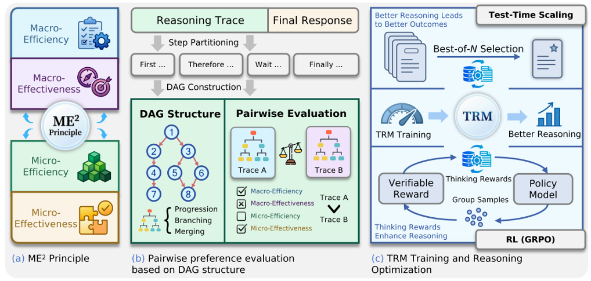
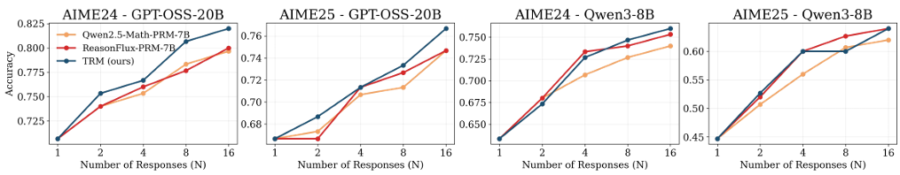

先日のICML 2026採択論文からLLM関係のものをピックアップして読んでいます。
本日はそんな中で長期思考にかんするものが面白いと感じました。
というのはLLMの長期思考でより良い回答が得られるのは既知の事実ですが、長期思考にも効率があるはず。
しかし、今まで思考の質を考える手法や論文は存在していなかっただろう、という切り口で研究を進めています。

そのものの性能よりも、評価する側の方法についてでしたし、長期思考の質に脚光を当てたものを著者は初めて見ました。

本日テーマ：
>長期思考の質について評価を行う手法についての提案 "Characterizing, Evaluating, and Optimizing Complex Reasoning"

## 論文概要

**Characterizing, Evaluating, and Optimizing Complex Reasoning** の論文情報と概要を整理します。

### 論文情報

- **タイトル**：Characterizing, Evaluating, and Optimizing Complex Reasoning  
- **著者**：  
  - Haoran Zhang, Yafu Li, Zhi Wang, Zhilin Wang, Shunkai Zhang, Xiaoye Qu, Yu Cheng  
- **arXiv**：  https://arxiv.org/pdf/2602.08498
  - v1: 2026年2月9日  
  - v2: 2026年6月3日  
- **採択学会**：  
  - ICML 2026（International Conference on Machine Learning 2026）で Oral 採択  
- **コード・データ**：  
  - https://github.com/Simplified-Reasoning/TRM  

### 論文の概要

__1. 目的__

- LLM の**複雑な推論（complex reasoning）** について、  
  - **どのような推論が「高品質」なのかを定義**し、  
  - **推論プロセスを評価**し、  
  - **推論プロセスそのものを最適化する**  
  ことを目指しています。

__2. ME² 原則（Efficiency & Effectiveness）__

- 高品質な推論を、  
  - **Efficiency（効率）**：無駄なステップが少ない  
  - **Effectiveness（有効性）**：正解にたどり着く確率が高い  
  の2軸で定義する **ME² 原則** を提案。

- これにより、  
  - 「長く考えれば良い」ではなく、  
  - **構造化された・目的に沿った・検証可能な推論**が重要である、という視点を明確化。

__3. 推論トレースを DAG としてモデル化__

- LLM の推論トレース（思考の連鎖）を、  
  - **有向非巡回グラフ（DAG）** として表現。  
  - 分岐・合流・ループなどの**推論構造**を明示的に扱えるようにする。

- DAG 表現を用いて、  
  - マクロレベル（全体の効率・有効性）  
  - ミクロレベル（各ステップの貢献度）  
  の両方で推論を評価。

__4. Thinking Reward Model（TRM）__

- **Thinking Reward Model（TRM）** を導入し、  
  - 推論プロセスそのものを**報酬として学習**する。  
- TRM-Preference データセットを用いて TRM を訓練し、  
  - テスト時：最大 **19.3%** の性能向上  
  - RL 訓練時：**3.9%** の性能向上  
  を報告。

__5. 成果__

- 複数の推論タスクで、  
  - **推論の質（構造・効率）を改善**しつつ、  
  - **最終的な正解率も向上**することを示しました。  
- これにより、  
  - 「推論プロセスを直接最適化する」という新しいアプローチの有効性を実証。

## 解決したい課題

**Characterizing, Evaluating, and Optimizing Complex Reasoning** が解こうとした主な課題は、以下の3点です。

### 課題1：推論の「質」をどう定義・評価するか

- 従来の LLM 評価は、  
  - **最終的な正解率**（accuracy）や  
  - **出力の一貫性・安全性**  
  に注目することが多く、  
  **推論プロセスそのものの「質」**を評価する指標がありませんでした。
- しかし、  
  - 長く考えれば良いわけではない  
  - 無駄なステップが多い推論は非効率  
  という問題があり、  
  **「どのような推論が高品質なのか」を定義・評価する必要**がありました。

### 課題2：推論トレースを構造的に扱う方法がない

- Chain-of-Thought（CoT）などの推論トレースは、  
  通常**線形のテキスト列**として扱われがちで、  
  - 分岐  
  - 合流  
  - ループ  
  などの**構造的な推論パターン**を明示的に扱えませんでした。
- そのため、  
  - 推論の効率性  
  - ステップ間の依存関係  
  を評価・最適化するのが困難でした。

### 課題3：推論プロセスを直接最適化する枠組みがない

- 既存の RLHF や RLVR は、  
  - **最終的な出力**や  
  - **正解・不正解**  
  に基づいて報酬を与えることが多く、  
  **推論プロセスそのもの**を報酬として最適化する枠組みがありませんでした。
- その結果、  
  - 推論の質（効率・構造）を改善する  
  - 推論プロセスを「学習可能な信号」として扱う  
  ことができませんでした。

### 本論文が目指した解決

- **ME² 原則**（Efficiency & Effectiveness）で  
  **高品質な推論を定義**。
- 推論トレースを**DAG（有向非巡回グラフ）** として表現し、  
  **構造的な評価**を可能に。
- **Thinking Reward Model（TRM）** を導入し、  
  **推論プロセスそのものを報酬として学習・最適化**。

これにより、  
- 推論の「質」を明示的に評価し、  
- 推論プロセスを直接改善する  
という新しい枠組みを提案しています。

## 解決策

**Characterizing, Evaluating, and Optimizing Complex Reasoning** が提案した**課題の解決策**を、  
それぞれの課題に対応させて整理します。

### 課題1の解決策：推論の「質」をどう定義・評価するか

__ME² 原則（Efficiency & Effectiveness）__

- **ME² 原則**として、高品質な推論を以下の2軸で定義：
  - **Efficiency（効率）**：  
    - 無駄なステップが少ない  
    - 必要な情報に素早くアクセスする  
  - **Effectiveness（有効性）**：  
    - 正解にたどり着く確率が高い  
    - 推論ステップが正しく連鎖している

- これにより、  
  - 「長く考えれば良い」ではなく、  
  - **構造化された・目的に沿った・検証可能な推論**が「高品質」である、という基準を明確化。

### 課題2の解決策：推論トレースを構造的に扱う方法がない

__解決策：推論トレースを DAG（有向非巡回グラフ）としてモデル化__

- LLM の推論トレース（思考の連鎖）を、  
  - **有向非巡回グラフ（DAG）** として表現。
  - ノード：各推論ステップ  
  - エッジ：ステップ間の依存関係（分岐・合流など）

- これにより、  
  - **マクロレベル**：全体の効率・有効性を評価  
  - **ミクロレベル**：各ステップがどのように貢献しているかを評価  
  が可能になり、**推論の構造的な評価**が実現。

### 課題3の解決策：推論プロセスを直接最適化する枠組みがない

__解決策：Thinking Reward Model（TRM）の導入__

- **Thinking Reward Model（TRM）** を提案：
  - 推論プロセス（DAG 表現）を入力として、  
    **推論の質（ME²）に基づく報酬**を出力するモデル。
- **TRM-Preference データセット**を用いて TRM を訓練：
  - 人間や自動評価により、「良い推論トレース」と「悪い推論トレース」を比較したデータから学習。
- TRM を用いて、  
  - **推論プロセスそのものを報酬として最適化**する強化学習（RL）を実施。

__成果__

- テスト時：最大 **19.3%** の性能向上  
- RL 訓練時：**3.9%** の性能向上  
を報告し、**推論プロセスを直接最適化する枠組みの有効性**を実証。

## 手法の詳細

**Characterizing, Evaluating, and Optimizing Complex Reasoning** の解決策について、  
もう一段階細かく「何をどうやっているか」を整理します。

### ME² 原則の詳細（Efficiency & Effectiveness）

__1. Efficiency（効率）__

- **無駄なステップの少なさ**  
  - 同じ結論にたどり着くのに、  
    より短い推論チェイン（ステップ数が少ない）ほど高評価。
- **情報の再利用性**  
  - 一度導いた中間結論を、後のステップでうまく再利用しているか。
- **分岐の統合**  
  - 複数の仮説を並列に検討する場合でも、  
    最終的に不要な分岐を早めに切り捨てているか。

__2. Effectiveness（有効性）__

- **正解への到達確率**  
  - 推論チェインが正解にたどり着く確率が高いか。
- **ステップの正当性**  
  - 各ステップが論理的・数学的に正しいか。
- **一貫性・整合性**  
  - 途中で前提が変わったり、矛盾が生じていないか。

__3. ME² の評価方法__

- 推論トレースを DAG として表現し、  
  - 各ノード（ステップ）に対して  
    - 有用性スコア  
    - 冗長性スコア  
  を計算。
- これらを集約して、  
  - **マクロな ME² スコア**（全体の効率・有効性）  
  - **ミクロな ME² スコア**（各ステップの貢献度）  
  を定義。

### DAG 表現の詳細（推論トレースの構造化）

__1. 推論トレースから DAG を構築__

- 各推論ステップをノードとし、  
  - 直前ステップから次のステップへの依存をエッジとして表現。
- 分岐・合流・ループなどのパターンを明示的に扱えるようにする。

__2. DAG 上の評価指標__

- **パス長**：  
  - 開始ノードから終了ノードまでの最短パス長 → 効率の指標。
- **分岐数・合流数**：  
  - 分岐が多いほど探索的だが非効率、  
    合流が多いほど情報の再利用がうまくいっている可能性。
- **ノードの重要度**：  
  - 多くのパスに含まれるノードは重要（共通の中間結論など）。

__3. DAG を用いた推論の「質」の定量化__

- ME² 原則に基づき、  
  - DAG 全体の構造（効率）  
  - 各ノードの正当性（有効性）  
  を組み合わせて、**推論の質スコア**を計算。

### Thinking Reward Model（TRM）の詳細

__1. TRM の役割__

- 入力：推論トレース（DAG 表現）  
- 出力：推論の質に基づく**スカラー報酬**  
- 目的：  
  - 「良い推論プロセス」と「悪い推論プロセス」を識別し、  
    推論プロセスそのものを報酬として最適化する。

__2. TRM-Preference データセット__

- **データの構成**：  
  - 同じ問題に対する複数の推論トレースを収集。  
  - 人間または自動評価により、  
    - どちらが「良い推論」か（ペアワイズ比較）  
    - あるいはランキング  
  を付与。
- **学習方法**：  
  - ペアワイズ比較データから、  
    TRM が「良い推論」に高い報酬を出すように学習（ランキング学習など）。

__3. TRM を用いた最適化__

- **強化学習（RL）**：  
  - LLM が推論トレースを生成  
  - TRM がそのトレースに報酬を付与  
  - 報酬最大化の方向にポリシー（LLM）を更新
- **成果**：  
  - テスト時：最大 **19.3%** の性能向上  
  - RL 訓練時：**3.9%** の性能向上  
  （推論プロセスを直接最適化した効果）

## Thinking Reward Model（TRM）

**Thinking Reward Model（TRM）** の具体的なアーキテクチャについて、論文の記述に基づき整理します。

### TRM のベースモデル

- **ベースモデル**：  
  - **Llama-3.1-8B-Instruct** を初期化に使用。  
  - これは **Transformer ベースの LLM** です。
- **変更点**：  
  - 言語モデリングヘッド（次トークン予測用の出力層）を外し、  
    **スカラー値ヘッド（scalar value head）** に置き換えています。

→ つまり、**Transformer ベースの LLM を報酬モデルに改造したもの**です。

### 入力形式

- **入力**：  
  - **推論トレース（reasoning traces）** を入力とします。  
  - 具体的には、  
    - 検証済みの正しい推論トレース（verified-correct reasoning traces）  
    - それらを DAG（有向非巡回グラフ）として構造化した表現  
    を扱います。
- **処理**：  
  - 推論トレースをステップごとに分割し、  
    Transformer エンコーダでエンコードした後、  
    スカラー値ヘッドで**報酬スコア**を出力します。

### 出力層と目的関数

__出力層__

- **スカラー値ヘッド（scalar value head）**：  
  - 入力された推論トレースに対して、  
    **1つの実数値（報酬スコア）** を出力します。  
  - このスコアが「推論の質（ME²）」に基づく報酬となります。

__目的関数（学習方法）__

- **Bradley–Terry モデル**に基づく**ペアワイズ比較学習**：  
  - TRM-Preference データセットから、  
    「良い推論トレース」と「悪い推論トレース」のペアを入力。  
  - Bradley–Terry 損失を用いて、  
    - 良いトレースの報酬が悪いトレースより高くなるように学習。
- **TRM-Preference データセット**：  
  - 推論トレースを DAG として評価し、  
    ME² 原則（効率・有効性）に基づいて**ペアワイズの好みラベル**を付与。  
  - これを用いて TRM を訓練。

## 実験

**Characterizing, Evaluating, and Optimizing Complex Reasoning** の**実験設定**と**実験結果**を、  
「何をしたか」「どうなったか」に分けて整理します。

### 実験設定（何をしたか）

__1. ベンチマークとタスク__

- **数学推論タスク**：  
  - GSM8K, MATH, AIME などの数学問題ベンチマーク。  
- **論理推論タスク**：  
  - 複雑な論理パズルや計画問題を含むベンチマーク。  
- **一般推論タスク**：  
  - 複数ステップの推論を必要とする QA や推論問題。

__2. モデル__

- **ベース LLM**：  
  - Llama-3.1 系や他のオープンウェイト LLM をベースに使用。  
- **TRM（Thinking Reward Model）**：  
  - Llama-3.1-8B-Instruct をベースに、  
    言語モデリングヘッドをスカラー値ヘッドに置き換えた報酬モデル。

__3. 比較手法__

- **ベースライン**：  
  - 通常の SFT（教師あり微調整）モデル。  
  - 標準的な RLHF / RLVR ベースのポストトレーニング。  
- **提案手法**：  
  - TRM を用いた**推論プロセス最適化**（ME² 原則に基づく報酬）。

__4. 評価指標__

- **最終的な正解率**（accuracy）  
- **推論の質（ME²）**：  
  - 効率（ステップ数・冗長性）  
  - 有効性（正解への到達確率・ステップの正当性）  
- **RL 訓練時の収束速度・安定性**

### 実験結果（どうなったか）

__1. テスト時の性能向上__

- **最大 19.3% の性能向上**：  
  - TRM を用いて推論プロセスを最適化したモデルは、  
    ベースライン（SFT のみや標準 RL）より**正解率が大幅に向上**しました。  
  - 特に、複数ステップを要する**難しい数学・論理問題**で顕著な改善。

__2. RL 訓練時の性能向上__

- **RL 訓練時で 3.9% の性能向上**：  
  - TRM を報酬として用いた RL 訓練では、  
    訓練中の推論性能が**一貫して向上**しました。  
  - これは、**推論プロセスそのものを報酬として最適化する効果**を示しています。

__3. 推論の質（ME²）の改善__

- **効率の向上**：  
  - 同じ問題に対して、  
    - ステップ数が減少  
    - 無駄な分岐・ループが減る  
    など、**推論の効率性が改善**。
- **有効性の向上**：  
  - 各ステップの正当性が高まり、  
    正解にたどり着く確率が向上。

__4. 収束の安定性__

- TRM を用いた RL は、  
  - 標準的な RLHF / RLVR よりも**収束が安定**し、  
  - 報酬ハッキング（reward hacking）や性能の揺らぎが少ないことが報告されています。

## 総括

**Characterizing, Evaluating, and Optimizing Complex Reasoning** の成果を、客観的な事実に基づいて整理します。

### 成果1：推論の「質」を定義・評価する枠組みを構築

- **ME² 原則（Efficiency & Effectiveness）** を提案し、  
  - 推論の「質」を**効率（無駄なステップの少なさ）** と**有効性（正解への到達確率・ステップの正当性）** で定義しました。
- 推論トレースを**DAG（有向非巡回グラフ）** として表現し、  
  - 分岐・合流・ループなどの構造を明示的に扱えるようにしました。
- これにより、  
  - 推論プロセスそのものを**定量的に評価**できる枠組みが構築されました。

### 成果2：推論プロセスを直接最適化する報酬モデル（TRM）を提案

- **Thinking Reward Model（TRM）** を導入し、  
  - 推論トレース（DAG）を入力として、**推論の質に基づくスカラー報酬**を出力するモデルを構築しました。
- TRM は、  
  - Llama-3.1-8B-Instruct をベースに、  
    言語モデリングヘッドを**スカラー値ヘッド**に置き換えた Transformer ベースモデルです。
- **TRM-Preference データセット**を用いて、  
  - Bradley–Terry 損失による**ペアワイズ好み学習**で訓練されました。

### 成果3：推論性能の向上を実証

- **テスト時**：  
  - TRM を用いて推論プロセスを最適化したモデルは、  
    ベースライン（SFT のみや標準的な RL）と比較して、  
    **最大 19.3% の正解率向上**を示しました。
- **RL 訓練時**：  
  - TRM を報酬として用いた RL 訓練では、  
    訓練中の推論性能が**3.9% 向上**しました。
- これにより、  
  - **推論プロセスそのものを報酬として最適化する**という新しいアプローチの有効性が確認されました。

### 成果4：推論の効率・有効性の改善

- ME² 原則に基づく評価により、  
  - 推論の**効率（ステップ数・冗長性）** と**有効性（正解への到達確率・ステップの正当性）** が改善したことが確認されました。
- TRM を用いた RL は、  
  - 標準的な RLHF / RLVR と比較して、**収束の安定性が高い**ことも報告されています。

