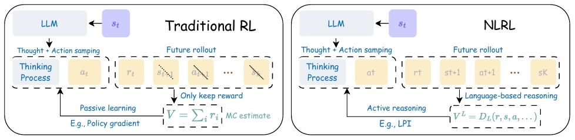

強化学習を行うと、非常に学習が遅い、や、複雑な挙動を必要とするようなケースで全然学習が進まなくなることに悩まされています。
そんな悩みの中で、本日説明するのは **Natural Language Reinforcement Learning（NLRL）** というフレームワークについてです。

論文URL:https://arxiv.org/pdf/2411.14251

## 従来の課題
一番言いたい課題は、従来の強化学習の報酬の難しさです。

そもそも、強化学習のフレームワークには限界があるとされています。
限界というか、もともと、LLMの事後学習においてPPOを用いた強化学習アルゴリズムは、事前学習モデルの持つ事前知識次第になっているということが指摘されています。

例として挙げられていることは、
- 例えば、小規模なモデルでは強化学習によるトレーニングが失敗することがあります。また、テスト時の推論における「リフレクション（省察）」能力は、強化学習によって出現したのではなく、事前学習モデルに元々備わっていたものである可能性が指摘されています→事前学習モデル依存の方法であるということになります。
- マルチターンのエージェント環境において、Chain-of-Thought（CoT：思考の連鎖）で強化された行動を最適化するために強化学習を直接採用すると、CoTの質が低下（退化）を招くことも強調されています

根本的な原因は方策勾配が本質的に「受動的」な性質を持っていることにあるということを主張しています。

方策勾配は、効果的な方策改善ができるかどうかは、エージェントが高品質な「推論の連鎖」や「行動」を自らサンプリングできるかどうかに依存してしまいます。
経験なくして向上はないですが、その経験すら、良い結果につながる結果が出るまで気長に待つ、受動的に待たないといけない。

偶然踏めない状態＝中途半端な行動を繰り返すようになったエージェントは永遠に学習から離れていくことになります。

この辺が問題の中心部です。

### RAGENを引き合いに
以下の絵の左側は、強化学習を用いてCoTベースのLLMエージェントを訓練するRAGENの例を示しています。RAGENはLLMから「思考」と「行動」をサンプリングし、将来のロールアウトからモンテカルロ（MC）推定を行って価値を算出し、方策勾配でLLMを更新します。

このMC推定は将来のロールアウトによる影響を小さくしてしまうことになります。
将来の結果の分布全体を平均化してしまい、具体的な状態、行動、報酬の情報をすべて破棄し、ましてや分析的な情報は一切残りません。

## 提案手法
提案されている手法はLVF（Language Value Function：言語価値関数）です。
LVFは、強化学習における「価値」の概念を、従来のスカラー値（数値）から「言語的な説明」へと置き換えた手法です。

### 手法の方向性

__1. 価値を「言葉」で定義する__

従来の強化学習では、ある状態の良さを「+1.0」や「-0.5」といった数値（スカラー）で表現していました。これに対し、LVFは **「この行動をとると、将来的に障害物にぶつかるリスクがあるが、最短ルートを通れる可能性がある」といった、具体的な根拠を含む言語的なナラティブ（記述）** として価値を定義します。

__2. 情報の損失を防ぐ（有用な圧縮）__

数値によるフィードバックは、情報の多くを削ぎ落としてしまいます。一方で、過去のすべての行動履歴（生の軌跡）を保存するのは非効率です。 

LVFは、戦略の側面、推論ステップ、潜在的な落とし穴などの **重要な意味情報を保持しつつ、言語として要約（圧縮）** することで、学習に必要な情報を効率的にエージェントに伝えます。

__3. 「能動的」な学習を可能にする__

数値だけのフィードバックでは、エージェントは「なぜ報酬が上がったのか」がわからず、良い結果が偶然出るのを待つしかありません（受動的な学習）。 

LVFによる意味豊かなフィードバックがあれば、エージェントはLLM（大規模言語モデル）の推論能力を使い、「次はこうすれば失敗を避けられる」と論理的に分析・予測して、戦略的に行動を改善できるようになります（能動的な学習）。

### 数式での説明

__1. 言語方策 ($\pi_L$): 思考を介した意思決定__
 
従来の方策 $\pi(a|s)$ は、状態 $s$ から直接行動 $a$ の確率を出力します。これに対し、NLRLでは「思考（Thought/Reasoning）」を表す変数 $c$ を導入します。

$$\pi_L(a, c | s) = \underbrace{\pi_L(c | s)}_{\text{思考生成}} \cdot \underbrace{\pi_L(a | c, s)}_{\text{行動選択}}$$

具体的なプロセス:

1. 入力 ($s$): 「エージェント1（私）は位置(1,1)にいる。相方はゲート前で待っている」
2. 思考 ($c$): 「私がスイッチを踏み続ければ、相方がゲートを通ってゴールできる。だから私はここに留まるべきだ」
3. 行動 ($a$): STAY（待機）

__2. 言語価値関数 ($V_L$): 言語による状態評価__

従来の価値関数 $V(s) \in \mathbb{R}$ は、ある状態 $s$ から将来得られる報酬の期待値を数値で返します。NLRLでは、これを言語的なアセスメント $V_L(s)$ に置き換えます。

$$V_L(s) \approx \text{LLM}(\text{Prompt}(s, \text{Goal}))$$

具体例:

- 数値 $V(s)$: $0.95$
- 言語 $V_L(s)$: 「非常に良好。スイッチが確保され、チーム全体のタスク完了まであと数ステップである。衝突のリスクも低い。」

__3. 言語MC/TD推定: 言語による価値の更新__

ここが最も革新的な部分です。従来のベルマン方程式による価値の更新を、言語の「要約・統合」によって行います。

__A. 言語モンテカルロ (MC) 推定__

複数のエピソード（軌跡）から得られた結果を、集約関数 $G_1$ を使って一つの価値評価にまとめます。

$$V_L^\pi(s_t) \approx G_1 \left( \{ \tau^n \}_{n=1}^{K_{MC}} \right)$$

※ $\tau^n$ は $n$ 番目のエピソードの全履歴（行動、状態、結果）。

具体例:

- 入力: 「試行1：成功（10歩）、試行2：成功（12歩）、試行3：失敗（衝突）」
- $G_1$ による出力: 「この状態は、基本的には成功に繋がるが、強引に進むと衝突のリスクがある中程度の価値を持つ状態である。」

__B. 言語時間的差分 (TD) 推定__

「現在の状態での記述」と「次の状態での価値（言語）」を組み合わせて、現在の価値を再評価します。

$$V_L^\pi(s_t) \approx G_1 \left( G_2( d_t, V_L^\pi(s_{t+1}) ) \right)$$

- $d_t$: $d(s_t, a_t, r_t, s_{t+1})$。ステップの記述（例：「右に動いて報酬0を得て、次の地点へ移動した」）
- $V_L^\pi(s_{t+1})$: 次の状態の評価（例：「ゴールまであと1歩の非常に良い状態」）
- $G_2$ (合成): これらを統合（例：「今の1歩によって、非常に良い状態に遷移した」）
- $G_1$ (集約): 複数の可能性をまとめ、最終的な現在の価値記述を生成。

__4. 「計算」ではなく「翻訳と要約」で学ぶ__

従来のAIは「この行動は＋10点」という数字を足し算して学習しますが、NLRLは以下のように動きます。

- 足し算（＋）の代わりに「統合」:「一歩進んだ（事実）」＋「次はゴールできそう（未来の予測）」を、LLMが **「一歩進んだことでゴールが目前になった（統合された評価）」** と言葉でまとめます。
- 期待値（$\mathbb{E}$）の代わりに「要約」:「右に行ったら成功した」「左に行ったら失敗した」という複数の経験を、LLMが **「右に行くのが正解だが、慎重さが必要だ」** と一つの教訓に要約します。これが従来の「平均をとる」操作にあたります。

__訓練の仕方が変わる（回帰 vs 模倣）__

AIを賢くする方法も、数学的な「誤差の修正」から「言葉の真似」に変わります。

- 従来のCritic（評価役）: 正解の数値（例：0.8）に近づくように計算を繰り返す（MSE損失）。
- NLRLの評価役（LVF）: 人間や優れたAIが書いた「完璧な評価文」を真似して書けるように練習する（クロスエントロピー損失）。

つまり、「計算ドリル」を解く学習から、「優れた解説文」を書く写経のような学習に変わるイメージです。

__5. 「熟議」するAI（方策改善）__

NLRLの最も賢い部分は、行動を決める前に **「一人会議（熟議）」** をすることです。

1. 選択肢の提示: 「右に行く」「左に行く」「待つ」の3つの候補を出す。
2. 言語評価の参照: それぞれの選択肢に対して「右は危ない」「待つのがチームのためだ」という言葉の評価（$Q_L$）を読む。
3. CoT（思考連鎖）: 「今は相方が困っている。評価文によれば待つのが最善だ。よし、待とう」と言葉で考えて決定する。

### つまり

以上をまとめるとこういうことになります。

教師学習のロジックでデータを収集して、教師あり学習の形式でLLMを更新することになります。

__1. 価値関数（Critic）の学習：回帰から模倣へ__

従来の強化学習では、将来得られる報酬の合計（数値）を予測するために「回帰（Regression）」を用います。
- 従来のRL:  ターゲット: 累積報酬の数値（例：$10.5$）
- ロス関数: 平均二乗誤差（MSE）。予測値とターゲットの数値的な「距離」を縮めます。
- NLRL: ターゲット: LLMが言語オペレータ（$G_1, G_2$）を通じて生成した「評価文」（例：「この状態はゴールに近く非常に良好である」）
- ロス関数: クロスエントロピー損失。これは通常の教師あり学習（次単語予測）と同じです。LLMがターゲットの評価文と同じ言葉を出力できるように学習します。

__2. 方策（Actor）の学習：確率上昇から「熟議」の模倣へ__

方策の更新も、従来の「良かった行動の確率を上げる」という手法から、「賢い思考プロセスを真似する」という手法に変わります。

- 従来のRL (PPOなど):  アドバンテージ（その行動がどれだけ良かったか）に基づいて、行動確率 $\pi(a|s)$ を直接調整します。
- NLRL: ターゲット: 熟議オペレータ（$I$）が「思考連鎖（CoT）」を用いて導き出した「より良い思考と行動のセット」。
- 学習方法: 熟議によって得られた「より賢い自分の判断」を正解データとして、自分自身を **教師あり微調整（SFT）** します。

## 実験と結果
論文の4章に記載されている実験と結果についてです。

以下、今回の言語モデルによるTDを言語TDと定義します。

>__言語TD（Language Temporal Difference）__  
>今回論文で提示されているLLMによるTD誤差に基づく学習法のことです。　　
>強化学習の古典的な手法である「TD学習（時間的差分学習）」を、数値ではなく「自然言語（言葉）」で行うという手法です。　　
>1. 一歩先の予測（Look-ahead）: 「もし今、右に移動したら、次はゲートの目の前に着くはずだ。」
>2. 一歩先の評価: 「ゲートの目の前という状態は、相方がスイッチを踏んでくれていれば『最高』だが、そうでなければ『行き止まり』だ。」
>3. 言語TDによる集約: これらと言葉を組み合わせて、**「今の移動は、相方の動き次第で天国か地獄に分かれる『重要な分岐点』である」**という現在の評価文を生成します。

### 実権

__1. 迷路ゲーム実験：先読みと言葉の集約__

この実験では、モデルを訓練せず、 **「プロンプト（指示の出し方）の工夫」** だけでどこまで賢くなるかを検証しました。

* **実施内容**:
迷路の中にいるAIに対し、単に「次どこに行く？」と聞く（ベースライン）のではなく、 **「3ステップ先までシミュレーションし、その結果を言葉でまとめてから判断して」** という指示（言語TD推定）を与えました。
* **結果**:
* **「先読み」の効果**: 先の展開を言葉でシミュレートさせた方が、ゴール到達率（報酬）が劇的に向上しました。
* **試行回数の影響**: 1つの行動に対して、複数のパターン（Variations）を考えさせて集約させるほど、判断の正確さが増しました。

__2. ボードゲーム（Breakthrough）実験：自己学習の力__

この実験では、LLMに馴染みのないマイナーなゲームを題材に、 **「言葉による訓練（学習）」** の効果を検証しました。

* **実施内容**:
$5 \times 5$ のボードゲームにおいて、AIに「今の盤面はどちらが有利か」を言葉で評価させました。そして、言語TD（数ステップ先の展開を言葉でまとめる手法）を使って生成したデータを用い、小さなモデル（LLaMA-8B）を **教師あり学習（微調整）** しました。
* **結果**:
* **知識不足の露呈**: 訓練前の状態では、最強クラスのAI（GPT-4oやLLaMA-70B）でさえ、ルールを知らないため「勘」に近い評価しかできず、精度は壊滅的でした。
* **「訓練」による逆転**: 言語TDで自己学習を繰り返した小さなモデル（8B）は、**自分より10倍近く大きい巨大なモデル（70B）の性能を大きく上回り**、盤面を正確に評価できるようになりました。

### 実権の結論

1. **「言葉で考える」は有効**: AIに「あーだこーだ」と言葉でシミュレーションさせるプロセス（言語TD）は、数値の計算に匹敵する、あるいはそれ以上の判断力を生み出す。
2. **巨大モデルに勝てる**: 汎用的な巨大AIにそのまま解かせるよりも、NLRLのフレームワークを使って **「言葉で自己学習」させた特化型モデルの方が、特定のタスクでは圧倒的に強くなる。**

## 結論

今回手法の良い点は以下だと考えてます。

1. 世界の「常識」をカンニングできる

従来の強化学習は、何も知らない赤ん坊が目隠しをして迷路を歩き、壁にぶつかった時の「痛み（マイナス報酬）」という数字だけで学習するようなものです。 一方、NLRLは **「大規模言語モデル（LLM）が学習済みの膨大な知識」** をそのまま使えます。

数値RL: 壁にぶつかっても「なぜダメなのか」わからず、何度もぶつかって「この座標はマイナスだ」と覚える。

NLRL: 「壁は通り抜けられない」「スイッチを押せば扉が開く」という物理や因果関係の常識を言葉として理解しているため、最初からある程度「当たり」をつけた行動ができます。

2. 「なぜ？」という理由（論理）を学習できる

数値の強化学習では、価値は「0.85」といった無機質な数字です。しかし、NLRLでは価値を **「言葉（理由）」** として保持します。

データの密度の違い:

数字の「0.8」からは何も学べませんが、 **「相方がゲートの前で待っているので、私はスイッチを踏み続けるべきだ。そうしないとチームは失敗する」という評価文からは、次に似たような状況（別の迷路や別のタスク）になったときに応用できる「教訓（エッセンス）」** を学べます。

これにより、学習データが少なくても、高い応用力（汎化性能）を身につけることができます。

3. 「思考の飛躍」が起きやすい（熟議の力）

実験結果（Breakthroughの例）にあったように、LLMに馴染みのないタスクでも、 **言語TD（先読み）** を行うことで飛躍的に賢くなります。

従来のRLは、実際に何度も失敗して報酬を受け取らないと強くなれません。

NLRLは、頭の中で「もしこう動いたら、こうなって、ああなるはずだ」と言葉で **シミュレーション（熟議）** し、その論理的な結論から「これが正解のはずだ」と判断します。

これにより、実体験（失敗）の回数を減らしつつ、質の高い意思決定が可能になります。
今度は、実際にどこかで実装してみます。

