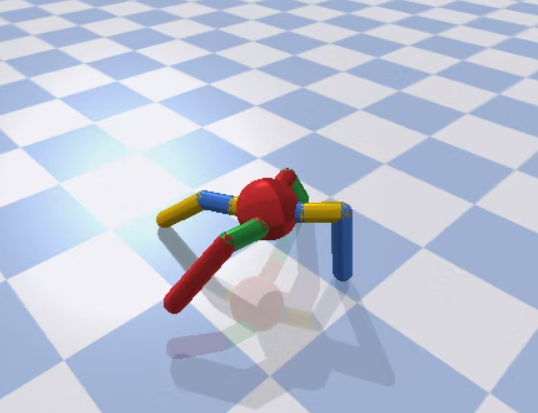

## 目的
物理シミュレーション環境で強化学習。
https://zenn.dev/karaage0703/articles/e01c2abc88373c

## PyBulletの環境構築
以下のコードを実行する。
./reinforce-learning/pybullet-robot/humanoid/examples/pybullet/examples

実行するのはこのコード
```python
python humanoid_manual_control.py
```


#### Tf-Agents
TensorFlowがバージョンアップして強化学習用のライブラリ TF-Agentsが使えるようになったようだ。
TF-Agents では、環境は Python か TensorFlow で実装できます。Python 環境は実装し、理解し、そしてデバッグするために通常はより容易ですが、TensorFlow 環境はより効率的で自然な並列性が可能です。

## 強化学習ワーク
学習環境： AntBulletEnv-v0
状態空間： 連続値8次元（体の位置と姿勢と速度）+ 連続値16次元（関節の角度と角速度）+ 離散値4次元（足の設置状態）= 28次元
行動空間: 全て連続値で8次元（足4本×2関節ずつ）
報酬: 前進することによって貰える
ペナルティ: 倒れたる

