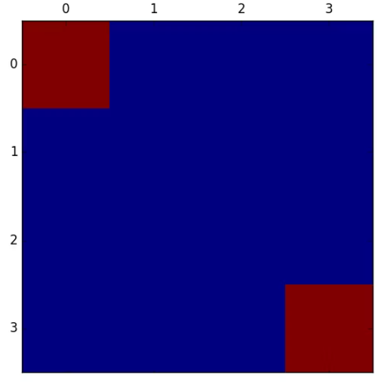
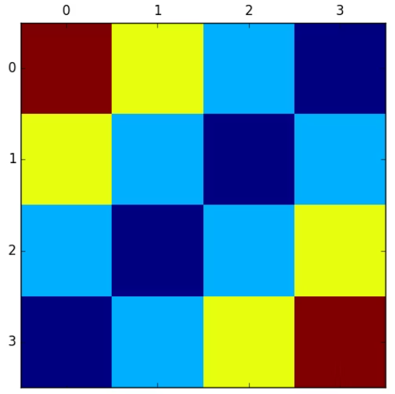
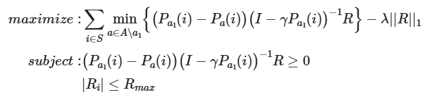
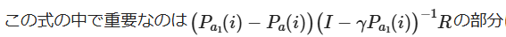
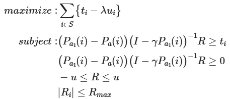

逆強化学習（Inverse Reinforcement Learning, IRL）の実装の進め方について、基礎から実践までステップごとに解説します。

---

## 1. 逆強化学習とは

- **目的**: 専門家（人間や既存エージェント）の行動データから「報酬関数」を推定すること
- **通常の強化学習**: 報酬関数が既知で、最適な方策を学習
- **逆強化学習**: 方策（行動軌跡）が既知で、報酬関数を学習

---

## 2. 実装の基本的な流れ

### ステップ1: 環境の準備
- OpenAI Gymなど、強化学習環境を用意
- 状態空間・行動空間・遷移関数がアクセスできることが望ましい

### ステップ2: 専門家デモデータの収集
- 専門家による軌跡（状態・行動のシーケンス）を収集
- データ形式例: `[(s_0, a_0), (s_1, a_1), ..., (s_T, a_T)]`

### ステップ3: 報酬関数のパラメータ化
- 報酬関数 \( R(s, a) \) をパラメータ \( \theta \) で表現
  - 例: 線形結合 \( R(s, a) = w^T \phi(s, a) \)
  - ニューラルネットで表現することも可能

### ステップ4: 報酬関数の学習（IRLアルゴリズムの実装）
- 代表的なIRLアルゴリズムを選択
  - **MaxEnt IRL（最大エントロピー逆強化学習）**: 実装しやすく、よく使われる
  - **Feature Matching IRL**: 状態特徴の一致を目指す
  - **GAIL（Generative Adversarial Imitation Learning）**: GANを応用した模倣学習
- アルゴリズムに従い、報酬関数のパラメータを更新

### ステップ5: 検証
- 学習した報酬関数で通常の強化学習を行い、専門家と同じような方策が得られるかを検証

---

## 3. 具体的な実装例（MaxEnt IRLの概要）

1. **特徴量関数 \(\phi(s, a)\) を定義**
2. **専門家データとエージェントデータの特徴量の期待値を計算**
3. **報酬パラメータ \(w\) を勾配法で更新**
   - 目標：専門家と同じ特徴量期待値になるように \(w\) を更新
4. **更新を繰り返す**

---

## 4. 参考コード例（MaxEnt IRL）

以下はシンプルなMaxEnt IRLの流れ（擬似コード）です。  
本格的な実装は [MaxEnt IRLの論文](https://www.cs.berkeley.edu/~pabbeel/cs287-fa09/readings/ZiebartThesis09.pdf) や [実装例](https://github.com/hiwonjoon/ICML2018-Tutorial-IRL) を参考にしてください。

```python
# 1. 環境・特徴量関数の定義
env = ...  # Gymなど
def feature_func(state, action):
    return ...

# 2. 専門家データの特徴量期待値
expert_features = np.mean([feature_func(s, a) for s, a in expert_trajs], axis=0)

# 3. 報酬パラメータ初期化
w = np.random.randn(feature_dim)

# 4. IRLループ
for iteration in range(N):
    # 報酬関数で方策を学習（例: soft Q-learning）
    agent_policy = train_policy(env, reward_func=lambda s, a: np.dot(w, feature_func(s, a)))
    # エージェントの軌跡から特徴量期待値を計算
    agent_features = np.mean([feature_func(s, a) for s, a in agent_trajs], axis=0)
    # 勾配更新
    grad = expert_features - agent_features
    w += lr * grad
```

---

## 5. 便利なライブラリ

- [imitation](https://github.com/HumanCompatibleAI/imitation)（GAIL/IRL実装）
- [stable-baselines3](https://github.com/DLR-RM/stable-baselines3)（強化学習）

---

## 6. 注意点

- IRLは計算コストが高く、環境の遷移確率が必要な場合も多いです
- 状態・行動空間が大きい場合は、特徴量設計や関数近似が重要です
- 専門家デモが多いほど性能が安定します

---

## まとめ

1. **環境とデモデータを用意**
2. **報酬関数をパラメータ化**
3. **IRLアルゴリズムで報酬パラメータを更新**
4. **学習した報酬関数で方策を検証**

---

もし実装例や特定のアルゴリズム（MaxEnt IRL, GAILなど）の詳細が必要であれば、追加でご質問ください。


とても良い質問です。  
**逆強化学習（IRL）**は「専門家のデモ（行動軌跡）」から**報酬関数を推定する**ための手法ですが、その前提として「専門家のデモ」が必要です。  
しかし、**環境の報酬関数が不明**で「そもそも最適な専門家方策を作れない（デモが作れない）」場合はどうするべきか、という疑問ですね。

---

## 1. IRLの前提：専門家デモは「報酬関数が不明」でもOK

- IRLの現実的な使い方は、「**人間や既存のAIエージェントの行動ログ**」を使うことです。
- つまり、「**なぜその行動をしたのか（報酬関数）は分からないが、行動履歴は観測できる**」という状況こそIRLの出番です。
- **報酬関数が分からないからこそ、IRLを使って推定する**のです。

---

## 2. デモデータがない場合のアプローチ

### (1) **人間や既存のエージェントに実際にプレイしてもらう**
- ゲームやロボット操作なら、人間に操作してもらい「状態・行動」の軌跡をログとして記録します。
- 既存のAIやルールベースの方策があれば、それを使っても良いです。

### (2) **サンプル方策で軌跡を集める**
- どうしても誰もプレイできない場合、**ランダム方策や単純なルールベース方策**で軌跡を集めることもできます。
- ただし、この場合「専門家らしい行動」ではないため、IRLで推定される報酬関数も「それなりのもの」になります。
- 本来のIRLの目的は「上手な行動の背後にある報酬関数」を推定することなので、**良いデモがあるほど良い報酬関数が得られます**。

### (3) **シミュレータやヒューリスティックで代理デモを作る**
- 何らかのルールやヒューリスティックで「それっぽい行動」を生成し、それをデモとして使うこともできます。

---

## 3. まとめ

- **IRLは「報酬関数が不明」な状況で使うもの**なので、環境の報酬が分からなくてもOKです。
- 大事なのは「専門家（人間やAI）の行動履歴（状態・行動の列）」です。
- それもなければ、**人間にプレイしてもらう**・**既存AIでプレイする**・**ヒューリスティックで生成する**などでデモデータを作りましょう。

---

### 参考：人間デモの記録例（Gym環境）

```python
import gym

env = gym.make("CartPole-v1")
obs, _ = env.reset()
done = False
traj = []

while not done:
    env.render()
    # ここで人間がキーボード入力でactionを選択するなど
    a = int(input("action? (0 or 1): "))
    traj.append((obs, a))
    obs, r, terminated, truncated, _ = env.step(a)
    done = terminated or truncated

# trajがデモデータ
```

---

**まとめ**：  
IRLは「報酬が不明だけど、良い行動のデモがある」状況で使うものです。  
デモがなければ、人間や既存方策などからデモを集める工夫をしましょう。


### 逆強化学習の手法
この記事では逆強化学習の手法としてよく取り上げられる手法の中で以下の3つについて解説したいと思います。

- 線形計画法を用いた逆強化学習
- Maximum Entropy IRL
- Maximum Entropy Deep IRL

MDPの報酬分布は以下のようになった。



この状態で価値反復法を用いて、GridWorldを行うと以下のようになる。

```python
def value_iteration(trans_probs, reward, gamma=0.9, epsilon=0.001):
    """Solving an MDP by value iteration."""
    n_states, n_actions, _ = trans_probs.shape
    U1 = {s: 0 for s in range(n_states)}
    while True:
        U = U1.copy()
        delta = 0
        for s in range(n_states):
            Rs = reward[s]
            U1[s] = Rs + gamma * max([sum([p * U[s1] for s1, p in enumerate(trans_probs[s, a, :])])
                                      for a in range(n_actions)])
            delta = max(delta, abs(U1[s] - U[s]))
        if delta < epsilon * (1 - gamma) / gamma:
            return U
```



### 線形計画法を用いた逆強化学習
逆強化学習では各状態における最適な行動が既知＝方策が既知とおく。
このときに、各状態における報酬を表すベクトル$R$を求める。






この目的関数は$a_1$との期待報酬の差が最も小さい行動との期待報酬の差を最も大きくする報酬ベクトルを求めている。

この状態で線形計画問題として扱うことができないので、新たに$t_i$、$u_i$という変数を用意し、以下のように変換する。



```python
import numpy as np
from scipy.optimize import linprog

def lp_irl(trans_probs, policy, gamma=0.2, l1=1.5, Rmax=5.0):
    """
    Solve Linear programming for Inverse Reinforcement Learning
    """
    n_states, n_actions, _ = trans_probs.shape
    A = set(range(n_actions))
    tp = np.transpose(trans_probs, (1, 0, 2))
    ones_s = np.ones(n_states)
    eye_ss = np.eye(n_states)
    zero_s = np.zeros(n_states)
    zero_ss = np.zeros((n_states, n_states))
    T = lambda a, s: np.dot(tp[policy[s], s] - tp[a, s], np.linalg.inv(eye_ss - gamma * tp[policy[s]]))

    c = -np.r_[zero_s, ones_s, -l1 * ones_s]
    zero_stack = np.zeros((n_states * (n_actions - 1), n_states))
    T_stack = np.vstack([-T(a, s) for s in range(n_states) for a in A - {policy[s]}])
    I_stack = np.vstack([np.eye(1, n_states, s) for s in range(n_states) for a in A - {policy[s]}])

    A_ub = np.bmat([[T_stack, I_stack, zero_stack],    # -TR <= t
                    [T_stack, zero_stack, zero_stack], # -TR <= 0
                    [-eye_ss, zero_ss, -eye_ss],  # -R <= u
                    [eye_ss, zero_ss, -eye_ss],   # R <= u
                    [-eye_ss, zero_ss, zero_ss],  # -R <= Rmax
                    [eye_ss, zero_ss, zero_ss]])  # R <= Rmax
    b = np.vstack([np.zeros((n_states * (n_actions-1) * 2 + 2 * n_states, 1)),
                   Rmax * np.ones((2 * n_states, 1))])
    results = linprog(c, A_ub, b)

    return results["x"][:n_states]
```

## 転移学習
転移学習とは、あるタスクで学習したモデルの知識を別の類似したタスクに転移・運用する学習方法。
データが少ない場合や学習時あkンを短縮したい場合に有効な手法。

転移学習を行う際に相性が良いのは逆強化学習で得られた知識。


