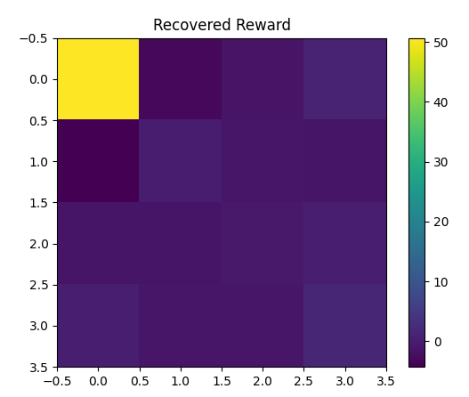

このコードは、「**最大エントロピー逆強化学習（MaxEnt IRL: Maximum Entropy Inverse Reinforcement Learning）**」を用いて、`FrozenLake-v1`環境で**専門家（最適方策）の行動デモから報酬関数を推定する**アルゴリズムを実装しています。

以下、**処理の順にわかりやすく説明**します。

---

### 1. 環境の初期化

```python
env = gym.make('FrozenLake-v1', is_slippery=False)
env.reset()
n_states = env.observation_space.n
n_actions = env.action_space.n
```
- OpenAI Gym の FrozenLake 環境（滑らない設定）を作成。
- 状態数と行動数を取得。

---

### 2. 特徴量行列の作成

```python
def feature_matrix():
    return np.eye(n_states)
F = feature_matrix()
```
- 各状態をone-hotベクトルで表現（特徴量行列F）。

---

### 3. 専門家（最適方策）のデモ軌跡を生成

#### (1) 最適方策の計算

```python
def value_iteration(env, gamma=0.9, eps=1e-5):
    ...
    return policy
expert_policy = value_iteration(env)
```
- 動的計画法（価値反復法）で**最適方策**を計算。

#### (2) デモ軌跡の生成

```python
def generate_expert_trajectories(env, policy, n_trajs=30):
    ...
    return trajs
expert_trajs = generate_expert_trajectories(env, expert_policy, n_trajs=30)
```
- 最適方策に従って、複数の軌跡（状態-行動列）を生成（専門家デモ）。

---

### 4. 専門家の特徴量期待値の計算

```python
def compute_feature_expectations(trajs, F):
    ...
    return feat_exp / len(trajs)
expert_feat_exp = compute_feature_expectations(expert_trajs, F)
```
- 専門家軌跡において、各状態に何回訪れたかを特徴量として集計し、平均化（専門家の特徴量期待値）。

---

### 5. 報酬パラメータの初期化

```python
w = np.random.randn(n_states)
```
- 状態ごとの報酬パラメータ \( w \) をランダムに初期化。

---

### 6. MaxEnt IRLのメインループ

30回繰り返し学習を行う：

```python
for it in range(30):
    ...
```

#### (1) 学習中のwでsoftmax方策を計算

```python
policy = soft_value_iteration(w, F, env)
```
- 現在の報酬パラメータ \( w \) でsoft value iteration（softmax backup）を行い、softmax方策を計算。

#### (2) 方策に従った軌跡をサンプリング

```python
agent_trajs = sample_trajectories(env, policy)
```
- 学習中の方策で、軌跡（状態-行動列）を複数生成。

#### (3) エージェントの特徴量期待値を計算

```python
agent_feat_exp = compute_feature_expectations(agent_trajs, F)
```
- エージェント（学習中方策）の特徴量期待値を計算。

#### (4) 勾配計算と報酬パラメータの更新

```python
grad = expert_feat_exp - agent_feat_exp
w += lr * grad
```
- 専門家とエージェントの特徴量期待値の差を勾配とし、報酬パラメータ \( w \) を更新（専門家の特徴量分布に近づける）。

---

### 7. 学習した報酬の表示

```python
print("Learned reward:", w.reshape(4,4))
```
- 学習が終わった後、得られた報酬パラメータを4×4のマトリクス（FrozenLakeのマップと同じ形）で表示。

---

## まとめ

- **FrozenLake環境で専門家（最適方策）によるデモを生成**
- **専門家の特徴量期待値を計算**
- **報酬パラメータwを初期化**
- **MaxEnt IRLで、専門家の特徴量分布に近づくようにwを更新**
- **最終的に、専門家デモから報酬関数wを推定**

---

このようにして、「**専門家の行動デモから報酬関数を逆推定する**」という逆強化学習の基本的な流れを実装しています。


## 目的
今回エージェントの行動の行動から、各状態に割り当てられる価値を示す重みが定義される。
FrozenLakeのすべての状態（16個、4×4マス）に対して「この状態にいるとどれだけ“良い”か」を表現する数値。


### 詳しく説明すると

#### 1. **報酬関数の定義**

- このコードでは、状態 \( s \) における報酬 \( R(s) \) は  
  \( R(s) = F[s] \cdot w \)  
  で与えられています。
- ここで \( F[s] \) は状態 \( s \) のone-hotベクトルなので、  
  **実質的に状態sの報酬=w**です。

#### 2. **wの意味**

- **w** は長さ16のベクトルで、各要素が各状態の報酬値です。
- 例えば `w[0]` は左上のマス（状態0）の報酬、`w[15]` は右下のマス（ゴール）の報酬です。

#### 3. **学習される内容**

- MaxEnt IRLでは、「専門家が多く通った・よく訪れた状態」に高い報酬が割り当てられるようにwが調整されます。
- 逆に、専門家があまり通らなかった状態には低い（あるいは負の）報酬が割り当てられます。
- こうして「専門家の行動を再現するのにふさわしい報酬関数」をwとして学習します。

#### 4. **最終的に得られるもの**

- 最終的なwは、「専門家の行動デモを最もよく説明するような各状態の報酬値のセット」になります。
- 例えば、ゴールや安全な道筋の状態には高い報酬、穴や通らない状態には低い報酬が割り当てられやすいです。


# MaxEnt IRL
最大エントロピー逆強化学習：専門家の行動でもより、背後にある報酬関数を推定する逆強化学習手法の一つ。


MaxEnt IRL（Maximum Entropy Inverse Reinforcement Learning、最大エントロピー逆強化学習）は、**専門家（人間やエージェント）の行動デモから、その背後にある報酬関数を推定する逆強化学習手法**のひとつです。  
この手法は、従来の逆強化学習（IRL）の欠点を補うために「エントロピー最大化」という考え方を導入しています。


## MaxEnt IRLのポイント

### 1. **逆強化学習（IRL）の基本**

- **目的**: 専門家のデモ軌跡（行動履歴）が与えられたとき、「どんな報酬関数があれば専門家のような行動をとるか？」を推定する。
- **通常のIRL**: 「専門家の方策と同じ特徴量期待値を持つような報酬関数」を探す。

### 2. **MaxEnt IRLの特徴**

#### エントロピー最大化（Maximum Entropy）

- **「もっともらしい」だけでなく、「なるべくランダムさも維持」**  
  → 専門家の行動を説明できる報酬関数は複数ある。  
  → その中で「無駄な仮定をせず、最もランダム（エントロピー最大）」な方策を選ぶ。
- **確率的方策**を導く  
  → 行動確率が「報酬の合計が高い軌跡ほど確率が高い」ように分布する。

#### 数式的には

- 各軌跡 \( \tau \) の確率は  
  \[
  P(\tau) \propto \exp(\sum_{t} R(s_t))
  \]
  となる（Boltzmann分布、ガウス分布のような形）。
- これにより、専門家デモの多様性や曖昧さもモデリングできる。
※Rは状態に対する報酬。

### 3. **手法の流れ**

1. **専門家の軌跡データを集める**
2. **報酬関数のパラメータ（w）を仮定**
3. **現在の報酬関数で、軌跡分布（softmax方策）を計算**
4. **その分布でサンプリングした軌跡の特徴量期待値と、専門家の特徴量期待値の差を計算**
5. **この差がゼロに近づくようにwを更新**
6. **繰り返してwを最適化**

### 4. **メリット**

- **確率的な方策が得られる**（曖昧な行動も扱える）
- **専門家の多様な行動パターンを再現しやすい**
- **現実のノイズや不確実性も自然に吸収できる**

---

## まとめ

- **MaxEnt IRLは、「専門家の行動をよく説明しつつ、最もランダムな方策」を導く逆強化学習手法**
- **確率的な行動モデルを構築できるため、現実的な応用に強い**

今回シミュレーションによる状態価値関数の分布




