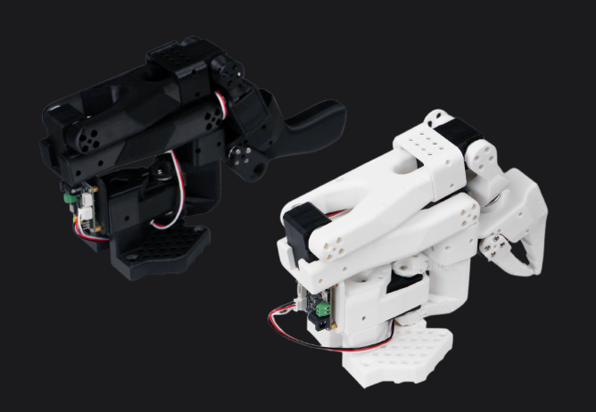

[huggingface/lerobot: 🤗 LeRobot: Making AI for Robotics more accessible with end-to-end learning](https://github.com/huggingface/lerobot)

「 **LeRobot** 」は、HuggingFaceが開発したオープンソースのロボティクス向けAIライブラリです。PyTorchベースで構築されており、模倣学習や強化学習を用いた実世界のロボット制御を簡単にはじめられるよう設計されています。

[アームロボットの製作と遠隔操作 – ALOHAでTransformerを用いた模倣学習を試す Part 1 | アールティ ヒューマノイドロボットブログ](https://rt-net.jp/humanoid/archives/6826)

## LeRobotが提供するもの

> **・事前学習済みモデルとデータセット
>
> **人間の操作デモを含む多様なデータセットや、模倣学習・強化学習で学習されたポリシーモデルが提供されています。
>
> **・シミュレーション環境
> **ロボットを組み立てなくても、「ALOHA」「PushT」「SimXArm」などの環境で学習や評価が可能です。
>
> **・実機対応
> **低コストなロボットアーム (SO-ARM 100 など) やNVIDIA Jetsonなどのデバイスと連携し、実際のロボット制御やデータ収集が行えます。
>
> **・柔軟なデータ構造
> **時系列データや画像、センサ情報を効率的に扱える独自のデータセット形式（LeRobotDataset）を採用しています。

[Hugging Face](https://huggingface.co/)社は、実世界のロボット工学アプリケーション用に学習された新しい機械学習モデル、[LeRobot](https://huggingface.co/lerobot)を発表した。LeRobotはプラットフォームとして機能し、データ共有、視覚化、高度なモデルのトレーニングのための多用途ライブラリを提供する。

LeRobotは、[PyTorch](https://pytorch.org/)で実世界のロボット工学のためのモデル、データセット、ツールを提供することを目指している。その目的は、ロボット工学への参入障壁を低くし、誰もがデータセットと事前学習済みモデルを共有することで貢献し、恩恵を得られるようにすることだ。

### Koch v1.1の特徴

・小さめ
・$441=約7万円くらい
・サーボモータの性能が良い

### SO-101の特徴

・中くらい
・$241=約4万円
・サーボモータのトルクが高い



🤗 **LeRobot** は、現実世界のロボティクスに向けた **モデル・データセット・ツール** を PyTorch 上で提供することを目的としています。

その目標は、ロボティクスへの参入障壁を下げ、誰もがデータセットや事前学習済みモデルを共有し、利用できるようにすることです。

🤗 **LeRobot** には、模倣学習や強化学習に重点を置き、実世界への転移が実証されている最先端の手法が含まれています。

🤗 **LeRobot** はすでに、事前学習済みモデル、人間によって収集されたデモンストレーションデータセット、そしてロボットを組み立てなくても始められるシミュレーション環境を提供しています。今後数週間のうちに、より手頃で高性能なロボットに対する実世界のロボティクス支援をさらに拡充していく予定です。

🤗 **LeRobot** は、事前学習済みモデルやデータセットを Hugging Face コミュニティページで公開しています。

## LeRobotDataset フォーマット

**LeRobotDataset フォーマット**のデータセットは、とても簡単に利用できます。

たとえば次のように、Hugging Face Hub 上のリポジトリやローカルフォルダから直接ロードできます：

```python
dataset = LeRobotDataset("lerobot/aloha_static_coffee")
```

そして、Hugging Face や PyTorch のデータセットと同じようにインデックスでアクセスできます。

例：

```python
dataset[0]
```

これで、データセット内の 1 つの時間フレームを取得できます。このフレームには「観測値（observation）」と「行動（action）」が PyTorch テンソルとして格納されており、そのままモデルに入力できます。

---

### LeRobotDataset の特徴

LeRobotDataset の特徴は、単にインデックス番号で 1 フレームを取得するのではなく、**インデックスとなるフレームとの時間的な関係に基づいて複数フレームを取得できる**点です。

これは `delta_timestamps` に、インデックスフレームに対する相対的な時刻のリストを指定することで実現します。

例えば：

```python
delta_timestamps = {"observation.image": [-1, -0.5, -0.2, 0]}
```

とすると、あるインデックスに対して 4 フレームが取得されます：

* インデックスフレームの **1秒前**
* **0.5秒前**
* **0.2秒前**
* インデックスフレーム自体（`0` の指定に対応）

詳しくはサンプルコード `1_load_lerobot_dataset.py` の `delta_timestamps` の使用例を参照してください。

---

### 内部構造について

内部的には、LeRobotDataset フォーマットはいくつかのデータシリアライズ方法を利用しています。これは、このフォーマットをより深く扱う場合に理解しておくと役立ちます。

私たちは、柔軟でありながらシンプルなデータセット形式を目指しました。この形式は、**強化学習やロボティクス**において登場するほとんどの特徴量や特殊性をカバーできるよう設計されています。

* シミュレーション環境でも実世界の環境でも利用可能
* 特に「カメラ情報」や「ロボットの状態」に焦点を当てて設計
* ただしテンソルで表現できるものであれば、他の種類のセンサ入力にも容易に拡張可能

---

### 典型的なデータセットの構造

以下は、`dataset = LeRobotDataset("lerobot/aloha_static_coffee")` でインスタンス化した典型的な LeRobotDataset の重要な詳細や内部構造の整理です。

データセットごとに具体的な特徴量は変わりますが、**基本的な構造は共通**です。
