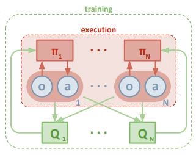

# マルチエージェント in 深層強化学習

## 概要

本日はActor-Critic手法として有名なDDPG(Deep Deterministic Policy Gradient)を拡張した手法である[MADDPG(Multi-Agent Deep Deterministic Policy Gradient)](https://arxiv.org/pdf/1706.02275.pdf)について紹介

強化学習は単一エージェントに対して発展してきたが、現実世界ではエージェントは複数存在する。

より効率的に仕事をさせるためにはエージェントを協調的に制御する必要がある。(例. 工場内のUAVとUGVの協調作業など)

MARLは近年では盛んに研究されていて、単一エージェントと比べて、行動や学習はとても難しい。

エージェントが増加すれば増加するほど、学習する際の勾配が正しい方向に進む確率が指数関数的に低下する。

## 全体イメージ

イメージは以下の図のようになる。

N個のエージェントはそれぞれ方策 $\pi = {\pi_1, \pi_2 ... \pi_N}$とします。

状態値 $o_i$ をそれぞれの方策に渡すとエージェントが取るべき行動 $o_i$が出力される。

これはそれぞれのエージェント(actor)は **Decentralized** (分散)な方策をとることを意味しています。

次にすべてのエージェントを管理できるN個の価値関数(Q関数）があります。

この価値関数はすべてのエージェントから状態値 $x={o_1,...o_N}$と行動 $a={a_1,...a_N}$ を受け取ってその価値を返します。

言い換えると**Centralized**なcritic(批評家)であることを意味しています。

つまり、N人のcriticがすべてのactor(演者)について評価し、actorたちはその評価に応じてそれぞれのとる方策を更新します。

## 少しだけ数式を見よう

以上の議論から、まずactorたち最大化するべき目的関数はcriticからの評価であることは明らかです。それぞれの確率的な方策を構成するパラメータをθiとすると、
𝕤𝕡𝕒𝕚𝕚J(θi)=Es∼pμ,ai∼πi[Qi(x,a1,...aN)]
目的関数は以上と書きます。両辺をパラメータであるθiで微分すると、確率的な方策を更新する勾配は以下になります。
𝕤𝕡𝕒𝕚𝕚∇θiJ(θi)=Es∼pμ,ai∼πi[∇θilog⁡πi(ai|oi)Qi(x,a1,...aN)]
しかしすでに知られているように、**MADDPG**は名前の通り**決定的方策をとるoff-Policy**の手法であるため、以上の式は以下のように書き換えられます。(off-Policyというのは簡単に言うと取るべき行動は現在の方策(Policy)に関係なく(Off)常に最善を尽くす手法のことです。)
方策の勾配式を決定的方策に書き換えると
𝕩𝕒𝕚∇θiJ(μi)=Ex,ai∼D[∇θiμi(ai|oi)∇aiQiμ(x,a1,...,ai′,...,aN)|ai′=μi(o)]
決定的な方策っていうのは状態値oをある関数μ(⋅)に渡すと決められた行動が出力されます、連続値空間でよく用いられます。それに対して確率的な方策っていうのは状態値oをある関数π(⋅)に渡すとそれぞれの行動を行う離散的な確率が出力されます。またこの式に注意するべきところはエージェントiを評価する価値関数Qi(⋅)に渡す行動はiの行動ai′のみ一ステップ分更新します。

ではcriticたちの評価どうやって正しく評価しているかどうかを見るでしょう？ここは慣例の **TD誤差** (説明は割愛します)の出番です。価値関数を更新するロス関数は以下に示します。
L(θi)=Ex,a,r,x′[(Qiμ(x,a1,...aN)−y2)]
ここで,x,a,r,x′はあらかじめ経験を貯蓄していたバッファーDからサンプルした値です。また、学習のターゲットであるyは以下の式で求めます。
y=ri+γQiμ′(x′,a1′,...,ai,...,aN′)|a′=μ′(o)
ここでμ′(⋅)とQ′(⋅) はターゲット関数になっていて、価値関数Q(⋅)はこいつらに準じてsoft-updateしていく感じです。

## 集中/分散学習

強化学習における「集中学習」と「分散学習」は、主に **「誰がどこで情報を処理し、学習の司令塔がどこにあるか」** という構造の違いを指します。

特にマルチエージェント強化学習（MARL）の文脈で、それぞれの特徴を整理します。

### 1. 集中学習 (Centralized Training)

すべてのエージェントのデータ（観測、行動、報酬）を**一箇所に集めて、一つの巨大な知能として学習**させるスタイルです。

* **仕組み:** 全エージェントの情報を統合した「グローバルな状態（State）」を元に学習します。サッカーに例えると、監督がピッチ全体の動きを俯瞰し、全員の動きをセットで指示するようなものです。
* **メリット:** * エージェント間の複雑な相互作用（あいつが右に行ったから、自分は左へ行くなど）を直接学べる。
* 学習が理論上、最も最適解に辿り着きやすい。
* **デメリット:** * **次元の呪い:** エージェント数が増えると、情報の組み合わせが爆発的に増え、計算が追いつかなくなる。
* **実行時の制約:** 学習時に「全員の情報を知っていること」を前提とするため、実行時も全員と通信し続けなければならないことが多い。

### 2. 分散学習 (Decentralized Training)

各エージェントが**自分自身の経験だけを頼りに、独立して学習**するスタイルです。

* **仕組み:** 他のエージェントを「環境の一部（あるいは動く障害物）」とみなし、各エージェントが個別にネットワークを更新します。
* **メリット:** * 計算負荷がエージェントごとに分散されるため、スケーラビリティ（拡張性）が高い。
* 他者との通信が不要なため、プライバシーや通信環境の制限に強い。
* **デメリット:** * **非定常性問題:** 「自分が学んでいる間に他人も動きを変える」ため、AIから見ると「世界のルールが勝手に変わる」ように見え、学習が非常に不安定になる。
* 協力行動が偶然に頼ることになり、高度な連携が生まれにくい。

### 3. ハイブリッド型：集中学習・分散実行 (CTDE)

現在、ドローンの協調制御などで最も使われているのが、両者のいいとこ取りをした **CTDE (Centralized Training, Decentralized Execution)** です。

* **考え方:** **「練習（学習）はみんなでビデオを見ながら反省会をするが、試合（実行）は各自の判断で動く」**。
* **特徴:** * **学習時:** 集中学習を行い、他人の行動も考慮して「評価（Critic）」を磨く。
* **実行時:** 分散実行を行い、自分のセンサー情報（Actor）だけで素早く動く。
* **代表例:** QMIX、MADDPG。

### 比較まとめ

| 項目                     | 集中学習                 | 分散学習               | CTDE (ハイブリッド)              |
| ------------------------ | ------------------------ | ---------------------- | -------------------------------- |
| **情報の集約**     | 常に一箇所に集中         | 各エージェントに分散   | 学習時のみ集中                   |
| **学習の安定性**   | 高い（全体が見えるため） | 低い（他人が動くため） | 中〜高（バランス型）             |
| **実行時の自律性** | 低い（通信が必要）       | 高い（単独で動ける）   | 高い（単独で動ける）             |
| **主な用途**       | 小規模な精密制御         | 大規模で独立した環境   | **複数のドローン等の協調** |

**総括**
「集中か分散か」という問いに対しては、現在のマルチエージェント強化学習では **「学習は集中的に、実行は分散的に」** というCTDEの考え方が、最も効率的かつ現実的な解決策とされています。

## MARLの学習方法論

マルチエージェント強化学習（MARL）の協調学習における主要なフレームワークは、情報の扱い方と学習の進め方によって大きく3つに分類されます。

現代の主流は **CTDE（集中学習・分散実行）** ですが、それぞれの特徴を整理します。

### 1. 分散学習・分散実行（Decentralized Training, Decentralized Execution）

各エージェントが「他人は環境の一部（動く壁のようなもの）」とみなして、個別に学習し実行する最もシンプルな形です。

* **仕組み:** 各エージェントが独立してDQNやPPOなどのシングルエージェント用アルゴリズムを走らせます（Independent RL）。
* **利点:** アルゴリズムが単純で、エージェントが何台に増えても構造が変わらない。
* **課題:** 「自分が学んでいる間に他人も変わる」ため環境が不安定になり、学習が収束しにくい（非定常性問題）。

### 2. 集中学習・集中実行（Centralized Training, Centralized Execution）

全エージェントを一つの大きな「巨大なAI」として扱い、全員の観測と行動をひとまとめにして処理する形です。

* **仕組み:** 全員の観測を一つの入力ベクトルにし、全員の行動を一つの巨大な行動空間として定義します。
* **利点:** 理論上、最も最適な協力行動（コンビネーション）を学習できる。
* **課題:** エージェントが増えると「行動の組み合わせ」が爆発的に増え（次元の呪い）、計算が不可能になる。また、実行時も常に全エージェント間の通信が必要。

### 3. 集中学習・分散実行（Centralized Training, Decentralized Execution: CTDE）

**現在のデファクトスタンダード**です。学習時のみ情報を共有し、実行時は独立させる「いいとこ取り」のフレームワークです。

* **仕組み:**
* **学習時（集中）:** 評価役（Critic）や混合ネットワークが、全エージェントの状態や行動を「カンニング」して、各行動の正しさを正確に評価する。
* **実行時（分散）:** 各エージェントは自分自身のネットワーク（Actor）だけを使い、自分の目の前の情報だけで行動を決定する。
* **代表的な手法:** **MADDPG**（各員の評価役が他人の行動を見る）、**QMIX/VDN**（個人の価値をチームの価値へ統合する）。
* **利点:** 学習が安定し、かつ実行時に通信インフラが脆弱な環境（ドローンの野外飛行など）でも動作する。

### 4. 通信型フレームワーク（Communication-based Learning）

エージェント同士が「メッセージ」を送り合うことで協調を促す仕組みです。

* **仕組み:** 行動を選ぶ前に、エージェント間でベクトル化された情報（通信プロトコル）を交換するネットワーク層を持ちます。
* **利点:** 視界の外にいる味方の状況を知ることができ、高度な連携が可能。
* **代表的な手法:** **CommNet**, **DIAL**。

### 5. 階層型・役割ベース（Hierarchical / Role-based Learning）

上位の「司令塔（Manager）」と下位の「実行役（Worker）」に分ける、あるいは「役割」を割り当てる形式です。

* **仕組み:** 長期的な目標を立てるAIと、具体的な操作（ドローンの移動など）を行うAIを分離します。
* **利点:** 複雑で長期にわたるタスクを効率よく学習できる。
* **代表的な手法:** **ROMA**（役割を動的に学習）。

### まとめ：どれを選ぶべきか？

* **現実的なロボット/ドローン制御:** 通信や計算資源の制約から、**CTDE（MADDPGやQMIX）**が第一選択となります。
* **高度な戦略が必要な場合:** **通信型**や**役割ベース**をCTDEに組み込んで構築します。

## 参考

[マルチエージェント深層強化学習を勉強しよう　第一回-MADDPGの解説及び実装 #Python - Qiita](https://qiita.com/mayudong200333/items/4a09a52e58a66a766ab2)

# 情報アップデート

マルチエージェント強化学習（MARL）では、ここ数年で特に以下のような方向性の手法が有効性を確認されています。

---

## 1. 価値分解型（Value Decomposition）の手法

**代表例：QMIX, VDN, QPLEX など**

- **特徴**  
  各エージェントのQ値を足し合わせる（VDN）や、単調な関数で「混合」する（QMIX）ことで、**グローバルなQ値を個別エージェントのQ値に分解**します。  
  これにより、**分散実行（decentralized execution）** を保ちつつ、**集中学習（centralized training）** で協調的な価値関数を学習できます（CTDE: Centralized Training with Decentralized Execution）。

- **有効性が確認されているタスク**  
  - StarCraft II のマルチエージェント環境（SMAC）  
  - 協調型ゲーム（複数ロボットの協調制御など）  
  サーベイ論文でもQMIXは代表的アルゴリズムとして扱われています[ScienceDirect](https://www.sciencedirect.com/science/article/pii/S2949855424000042)。

---

## 2. アクター・クリティック型のマルチエージェント手法

**代表例：MADDPG, MAPPO**

- **MADDPG（Multi-Agent Deep Deterministic Policy Gradient）**  
  - 各エージェントにポリシーネットワーク（アクター）を持たせつつ、**クリティックは全エージェントの観測・行動を入力**として学習します。  
  - これにより、**非定常性（他のエージェントのポリシーが変化する問題）** を緩和し、協調・競合タスクの両方で安定した学習が可能になります。

- **MAPPO（Multi-Agent PPO）**  
  - PPOをマルチエージェントに拡張したもので、**実装のしやすさと安定性**から近年広く使われています。  
  - SMACやマルチロボット制御などで、QMIXやMADDPGと比較されることが多いです。

- **有効性が確認されているタスク**  
  - 協調タスク（ロボット群の協調ナビゲーション）  
  - 競合・混合タスク（マルチエージェントゲーム、交通制御など）  
  包括的サーベイでもMADDPGは代表的アルゴリズムとして整理されています[arXiv](https://arxiv.org/html/2312.10256v2)。

---

## 3. コミュニケーションを明示的に学習する手法（Comm-MADRL）

**代表例：TarMAC, DIAL, CommNet, GraphComm など**

- **特徴**  
  - エージェント間で**メッセージを送受信する通信プロトコルを学習**します。  
  - グラフ構造（GraphComm）や注意機構（attention）を用いて、どのエージェントとどの情報を共有すべきかを学習する手法が増えています。

- **有効性が確認されているタスク**  
  - 部分観測環境での協調（例：一部のエージェントしか全体を見られない状況）  
  - 大規模エージェント群での情報共有（ロボット群、ドローン群など）  
  コミュニケーション付きMADRLのサーベイでは、通信設計が性能向上に大きく寄与することが報告されています[Springer](https://link.springer.com/article/10.1007/s10458-023-09633-6)。

---

## 4. モデルベースMARLと階層型MARL

- **モデルベースMARL**  
  - 環境の遷移モデルを学習し、**計画（planning）と学習（learning）を組み合わせる**ことで、サンプル効率を向上させます。  
  - 共同状態・行動埋め込みを学習するフレームワークなどが提案されています[ResearchGate](https://www.researchgate.net/publication/400812110_Multi-Agent_Model-Based_Reinforcement_Learning_with_Joint_State-Action_Learned_Embeddings)。

- **階層型MARL（Hierarchical MARL）**  
  - 高レベルの「マクロ行動」と低レベルの「ミクロ行動」を分離し、**長期タスクや複雑な目標**を扱いやすくします。  
  - 倉庫自動化（Kiva Systems）や長期協調タスクで有効性が確認されています[WePub](https://wepub.org/index.php/TCSISR/article/view/5457)。

---

## 5. 近年のサーベイが指摘する「有効性のポイント」

2023–2024年のサーベイ論文では、有効なMARL手法に共通する特徴として以下が挙げられています[ScienceDirect](https://www.sciencedirect.com/science/article/pii/S2949855424000042)[arXiv](https://arxiv.org/html/2312.10256v2)。

1. **CTDE（集中学習・分散実行）の枠組み**  
   - 学習時はグローバル情報を活用し、実行時は各エージェントが独立に行動できる設計が主流。

2. **価値分解や通信による協調の明示的表現**  
   - QMIXのような価値分解、あるいはコミュニケーションネットワークにより、**協調の構造を明示的にモデル化**することが性能向上に寄与。

3. **スケーラビリティと計算量のバランス**  
   - エージェント数が増えても計算量が爆発しないよう、**グラフ構造や階層化**を用いる手法が増えている。

4. **ベンチマーク環境での系統的評価**  
   - SMAC、Multi-Agent Particle Environment など、**標準的なベンチマーク**で比較されることで、手法の有効性が客観的に確認されています。

---

## まとめ

- **協調タスク**では、QMIXなどの価値分解型やMADDPG/MAPPOなどのCTDE型が主流で、SMACなどのベンチマークで高い性能が確認されています。  
- **部分観測・大規模環境**では、コミュニケーションを学習するComm-MADRLやグラフベースの手法が有効です。  
- **サンプル効率や長期タスク**には、モデルベースMARLや階層型MARLが注目されています。

より詳細な分類や個別アルゴリズムの比較については、上記のサーベイ論文を参照すると体系的に理解できます[ScienceDirect](https://www.sciencedirect.com/science/article/pii/S2949855424000042)[arXiv](https://arxiv.org/html/2312.10256v2)。

# 更に手法群

マルチエージェント環境において「協調（coordination）」と「探索（exploration）」の両方に強みを持つ手法は、単一エージェントの強化学習よりも設計難易度が高く、以下の3つの観点で整理すると理解しやすいです：

* **信用割当（credit assignment）**
* **非定常性（non-stationarity）への対処**
* **探索の効率化（joint exploration）**

その上で、代表的かつ実用的な手法群を体系的に整理します。

---

# ① Value Decomposition系（協調に強い + 探索も安定）

## ● VDN（Value Decomposition Networks）

* 各エージェントのQ値を**加算分解**
* 協調は「暗黙的」に実現

### 強み

* 学習が安定
* スケーラブル

### 弱み

* 表現力が弱い（非線形な協調関係を表現できない）

---

## ● QMIX（最重要）

* Q_total を **単調性制約付きの非線形関数**で分解

### 本質

[
\frac{\partial Q_{total}}{\partial Q_i} \ge 0
]

→ 各エージェントの改善が全体改善に寄与

### 強み

* 強い協調表現能力
* CTDE（Centralized Training, Decentralized Execution）と相性良

### 探索面

* ε-greedyだけでは弱い → 他手法と併用されることが多い

---

## ● QTRAN / QPLEX（発展系）

* 単調性制約を緩和し、より一般的な協調を表現

### 特徴

* **理論的には最も表現力が高い**
* ただし実装・学習が難しい

---

# ② Policy Gradient系（探索に強い + 協調も可能）

## ● MADDPG（Multi-Agent DDPG）

* 各エージェントにActor
* **中央Critic**で全体状態を評価

### 強み

* 非離散・連続行動に対応
* 他エージェントを考慮した学習が可能

### 弱み

* 探索はノイズ依存 → 非効率になりがち

---

## ● MAPPO（かなり実用的）

* PPOをマルチエージェントに拡張

### 強み

* 安定性が非常に高い
* 実務・研究で広く使われる

### 探索

* PPO由来の**確率的政策**により自然な探索

---

## ● COMA（Counterfactual Multi-Agent Policy Gradient）

* クレジット割当を明示的に解決

### 核心

「そのエージェントがいなかった場合との差分」で評価

### 強み

* 協調タスクで非常に有効

### 弱み

* 計算コストが高い

---

# ③ 探索強化系（ここが本質的に重要）

協調よりも「探索」が難しいのがマルチエージェントの本質です。
以下は探索を強化する重要技術。

---

## ● RND（Random Network Distillation）

* 未訪問状態に報酬付与

### マルチエージェントでの課題

* 個別探索 vs 集団探索のバランス

---

## ● Count-based / Intrinsic Motivation

* 状態訪問回数ベース

### 拡張

* joint-state に適用 → 計算爆発

---

## ● MAVEN（かなり重要）

* QMIX + **潜在変数 z による探索制御**

### 本質

* 各エピソードで異なる「探索戦略」を持たせる

### 強み

* 協調探索（coordinated exploration）が可能
* 「全員で違う戦略を試す」ではなく
  → 「チームとして一貫した探索」を実現

👉 **協調 × 探索 のバランスが非常に良い**

---

## ● QPLEX + Exploration（最新系）

* Expressive value + 探索ボーナス

---

# ④ ゲーム理論・分布系アプローチ

## ● LOLA（Learning with Opponent-Learning Awareness）

* 他エージェントの学習を考慮して最適化

### 特徴

* 協調・競争両方に強い

---

## ● Population Based Training / PSRO

* 複数ポリシーを同時に進化

### 強み

* 探索の多様性確保
* Nash均衡に近づく

---

# まとめ（実務的な選択指針）

目的別に整理すると：

### ■ 協調を最優先

* QMIX
* QPLEX

---

### ■ 探索を強化したい

* MAVEN（最有力）
* RND + MAPPO

---

### ■ バランス型（おすすめ）

* MAPPO（まずはこれ）
* QMIX + 探索拡張

---

### ■ 理論的に高度

* COMA
* QTRAN
* LOLA

---

# 重要な洞察（本質）

マルチエージェントの難しさは単なる「探索」ではなく：

> **“他エージェントと整合的な探索をどう行うか”**

単独探索ではなく：

* 同時に同じ仮説を試す必要がある
* しかし通信なしでそれを実現する必要がある

このため：

* MAVENのような「共有潜在変数」
* Centralized Critic
* Populationベース手法

が重要になります。

---

必要であれば、以下も深掘りできます：

* PyMARLベースでの実装構成
* 各手法の数式レベルの違い（勾配式・損失関数）
* 実験ベンチマーク（SMACなど）での性能比較

