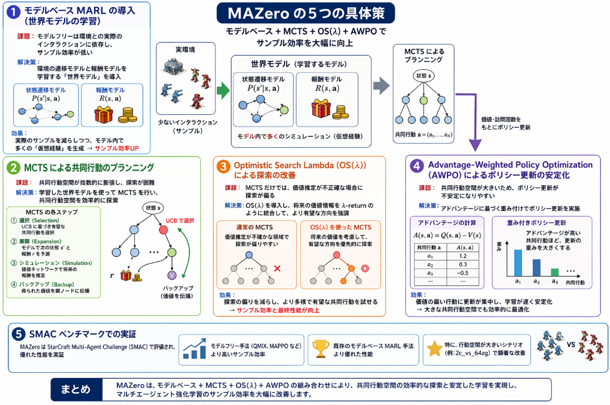
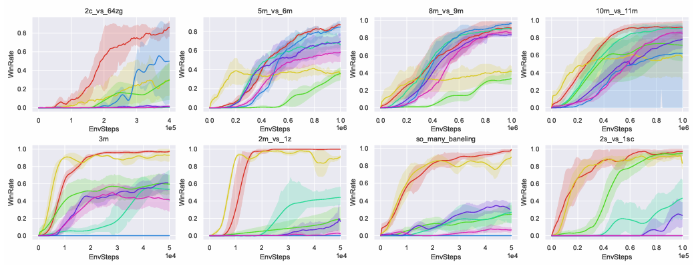

先日ご紹介した以下のサーベイでピックアップしたMAZeroについて調査しました。
本日は手法の詳細について説明します。

## 手法概要

MAZero は、**2024年5月20日**に arXiv に提出された論文
**“Efficient Multi-agent Reinforcement Learning by Planning”**（arXiv:2405.11778）で提案された手法です。[arXiv](https://arxiv.org/abs/2405.11778)

この論文は ICLR 2024 に採択されており、
MuZero をマルチエージェント環境に拡張したモデルベース MARL アルゴリズムとして位置づけられています。[OpenReview](https://openreview.net/forum?id=CpnKq3UJwp)

したがって、**MAZero は 2024 年に開発・公開された比較的新しい手法**と言えます。

## 解決しようとした課題

MAZero が解決しようとした主な課題は、**マルチエージェント強化学習（MARL）におけるサンプル効率の低さ**です。

> __サンプル効率の低さ__
> マルチエージェント強化学習（MARL）における「サンプル効率の低さ」とは、「学習に必要な環境とのインタラクション（経験）の量が非常に多く、現実の時間やコストがかかりすぎる」 という問題のことです。

### 1. 背景：マルチエージェント強化学習の課題

従来の MARL アルゴリズム（QMIX, MADDPG, MAPPO など）の多くは **モデルフリー** です。

- **モデルフリー**：環境の遷移モデル（状態遷移確率や報酬関数）を明示的に学習せず、直接「状態 → 行動 → 報酬」の経験からポリシーを学習します。
- これにより、**サンプル効率が低い**（多くの経験が必要）という問題があります。

特に、マルチエージェント環境では：

- エージェント数が増えると **行動空間が指数的に膨張** する
- 各エージェントの相互作用が複雑になり、**環境のダイナミクスが非定常** になる
- その結果、**学習に膨大な経験が必要** になり、現実のロボット制御やゲームなどでは適用が難しい

### 2. MAZero が目指した解決策：モデルベース + プランニング

MAZero は、**MuZero** の成功（モデルベース + MCTS によるサンプル効率の高さ）を
マルチエージェント環境に拡張することを目指しました。

**MAZero が解決しようとした課題**：

1. **サンプル効率の向上**

   - モデルフリー MARL に比べて、**少ない経験で高性能なポリシーを学習**できるようにする。
   - 特に、**SMAC（StarCraft Multi-Agent Challenge）** のような大規模・複雑な環境で有効に機能することを目指しました。[arXiv](https://arxiv.org/abs/2405.11778)
2. **大規模行動空間での探索効率**

   - マルチエージェント環境では、**共同行動空間が指数的に膨張**します。
   - MAZero は **MCTS（Monte Carlo Tree Search）** を用いて、
     共同行動空間を効率的に探索し、**最適な共同行動**を見つけやすくします。
3. **モデルベース MARL の設計**

   - 単一エージェントでは MuZero が成功しましたが、マルチエージェントでは **世界モデル（状態遷移・報酬モデル）の設計が複雑**になります。
   - MAZero は、**共同状態遷移モデルと報酬モデル**を学習し、
     それを使って MCTS を行うことで、**モデルベース MARL の枠組みを確立**しました。
4. **探索と活用のバランス**

   - MCTS では **UCB（Upper Confidence Bound）** に基づく探索が行われますが、マルチエージェントでは **共同行動の価値推定が難しい**。
   - MAZero は **Optimistic Search Lambda (OS(λ))** と
     **Advantage-Weighted Policy Optimization (AWPO)** を導入し、
     大規模行動空間での探索効率とポリシー最適化を改善しました。[OpenReview](https://openreview.net/forum?id=CpnKq3UJwp)

### 3. MAZero の具体的な貢献

MAZero は以下の点で課題を解決しようとしています：

- **モデルベース MARL の実装**

  - 共同状態遷移モデルと報酬モデルを学習し、MCTS によるプランニングで **将来の報酬を予測**しながら行動選択を行う。
  - これにより、**実際の環境とのインタラクション回数を減らしつつ高性能なポリシー**を獲得。
- **MCTS による共同行動探索**

  - 各エージェントの行動を独立に選ぶのではなく、
    **共同行動空間を MCTS で探索**し、**協調的な最適行動**を見つける。
- **OS(λ) と AWPO による探索・最適化の改善**

  - **OS(λ)**：将来の価値情報を活用して、探索の方向性を改善。
  - **AWPO**：アドバンテージに基づく重み付けでポリシー更新を安定化。
- **SMAC ベンチマークでの優位性**

  - 論文では、SMAC の複数のシナリオで
    **モデルフリー手法（QMIX, MAPPO など）や既存のモデルベース手法より高いサンプル効率と勝率**を達成したと報告されています。[arXiv](https://arxiv.org/abs/2405.11778)

MAZero が解決しようとした主な課題は：

- **マルチエージェント強化学習におけるサンプル効率の低さ**
- **大規模共同行動空間での探索の難しさ**
- **モデルベース MARL の設計と実装の難しさ**

これに対し、MAZero は：

- **モデルベース + MCTS** によるプランニングでサンプル効率を向上
- **共同状態遷移モデルと報酬モデル**を学習し、将来の報酬を予測
- **OS(λ) と AWPO** で探索とポリシー最適化を改善
- **SMAC ベンチマークで既存手法を上回る性能**を示す

ことで、**「少ない経験で高性能なマルチエージェントポリシーを学習する」** という課題に取り組んでいます。[arXiv](https://arxiv.org/abs/2405.11778)[OpenReview](https://openreview.net/forum?id=CpnKq3UJwp)

## 具体的な手法

MAZero が「マルチエージェント強化学習のサンプル効率の低さ」を解決するための**具体策**は、主に以下の4つです。

### 1. モデルベース MARL の導入（世界モデルの学習）

**課題**：モデルフリー MARL は、環境との実際のインタラクションに依存し、サンプル効率が低い。

**解決策**：MAZero は、**環境の遷移モデルと報酬モデルを学習する「世界モデル」**を導入します。

- 状態遷移モデル：$P(s'|s,\mathbf{a})$
- 報酬モデル：$R(s,\mathbf{a})$

これにより、**実際の環境とやり取りせずに、モデル内で将来の状態と報酬をシミュレーション**できます。
MuZero と同様に、**モデルベース強化学習（MBRL）** の枠組みを MARL に拡張しています。[arXiv](https://arxiv.org/abs/2405.11778)

**効果**：

- 実際のサンプル（環境とのインタラクション）を減らしつつ、モデル内で多くの「仮想経験」を生成できる
- サンプル効率が大幅に向上

>__世界モデル__  
>「環境がどのように変化するかを予測するモデル」 です。通常のエージェント（Actor）やクリティック（Critic）とは役割が異なります。
>世界モデルは、環境のダイナミクス（状態遷移と報酬）を学習するモデルです。
>- 入力：現在の状態 $s$ と共同行動 $\mathbf{a}$
>- 出力：
>  - 次の状態 $s'$ の予測
>  - 報酬 $r$ の予測
>  - （場合によっては）終了判定 $done$ の予測
>数式で書くと：
>$$
>s', r \sim \text{WorldModel}(s, \mathbf{a})
>$$
>**役割**：
>- 実際の環境とやり取りせずに、**将来の状態と報酬をシミュレーション**する
>- これにより、**モデル内で多くの「仮想経験」を生成**できる

### 2. MCTS（Monte Carlo Tree Search）による共同行動のプランニング

**課題**：共同行動空間が指数的に膨張し、探索が困難。

**解決策**：MAZero は、学習した世界モデルを使って **MCTS** を行い、**共同行動空間を効率的に探索**します。

- 各ノードは状態 $s$、各エッジは共同行動 $\mathbf{a} = (a_1, \dots, a_N)$
- MCTS の各ステップで：
  1. 選択（Selection）：UCB に基づいて有望な共同行動を選択
  2. 展開（Expansion）：モデルで次の状態 $s'$ と報酬 $r$ を予測
  3. シミュレーション（Simulation）：価値ネットワークで将来の報酬を推定
  4. バックアップ（Backup）：得られた価値を親ノードに伝播

>__MCTS__  
>木探索とモンテカルロシミュレーションを組み合わせた探索アルゴリズムです。
>MCTS は、「将来の可能性を木構造で表現し、ランダムシミュレーションで評価する」 手法です。
>- 木（Tree）：状態をノード、行動をエッジとして表現
>- モンテカルロ（Monte Carlo）：ランダムなシミュレーションで将来の報酬を推定
>これにより、膨大な行動空間の中から、有望な行動を重点的に探索できます。
>**効果**：

- ランダム探索ではなく、**価値情報に基づいた効率的な探索**が可能
- 大規模な共同行動空間でも、**有望な共同行動を重点的に探索**できる

### 3. Optimistic Search Lambda (OS($\lambda$)) による探索の改善

このアルゴリズムは結構大物でした。少し詳細に説明します。

__1. 背景：MCTS の探索バイアス__

通常の MCTS では、UCB に基づいて行動を選択します：

$$ \text{UCB}(s,a) = Q(s,a) + c \sqrt{\frac{\log N(s)}{N(s,a)}} $$

- $Q(s,a)$：行動 $a$ の平均報酬（価値推定）
- $N(s,a)$：行動 $a$ の訪問回数

**問題点**：
- $Q(s,a)$ が不正確（ノイズが多い、学習初期など）だと、  
  **誤った行動が「有望」と判断され、探索が偏る**ことがあります。
- 特に MARL では、共同行動空間が大きく、**価値推定の不確実性が高い**ため、この問題が顕著です。

__2. OS($\lambda$) の基本アイデア__

OS($\lambda$) は、**将来の価値情報を統合した「楽観的な価値推定」** を使います。

- 通常の $Q(s,a)$ の代わりに、**$\lambda$-return に基づく価値推定**を使う
- $\lambda$-return は、**将来の報酬を重み付きで統合**した値で、  
  単一ステップの報酬より**より正確で将来を見据えた評価**ができます。

__3. $\lambda$-return の数式__

単一エージェントの強化学習では、$\lambda$-return は以下のように定義されます：

$$ G_t^{(\lambda)} = (1-\lambda) \sum_{n=1}^\infty \lambda^{n-1} G_t^{(n)} $$

ここで $G_t^{(n)}$ は $n$-step return：

$$ G_t^{(n)} = \sum_{k=0}^{n-1} \gamma^k r_{t+k} + \gamma^n V(s_{t+n}) $$

- $\lambda \in [0,1]$：将来のステップをどれだけ重視するか
- $\lambda=0$：1-step return（$r_t + \gamma V(s_{t+1})$）
- $\lambda=1$：Monte Carlo return（終端までの総報酬）

**直感的な意味**：
- $\lambda$ が大きいほど、**より遠い将来の報酬を重視**する
- $\lambda$ が小さいほど、**近い将来の報酬を重視**する

__4. MAZero における OS($\lambda$) のロジック__

MAZero では、**MCTS の各ノードで $\lambda$-return に基づく価値推定**を行います。[arXiv](https://arxiv.org/abs/2405.11778)

__(A) 価値ネットワークと報酬モデルの利用__

MAZero は、以下のコンポーネントを持ちます：

- **価値ネットワーク** $V_\theta(s)$：状態 $s$ の価値を推定
- **報酬モデル** $R_\phi(s,\mathbf{a})$：報酬を予測
- **遷移モデル** $P_\psi(s'|s,\mathbf{a})$：次の状態を予測

MCTS のシミュレーションでは、これらのモデルを使って将来の報酬を計算します。

__(B) $\lambda$-return の計算__

MCTS の各ノード $(s,\mathbf{a})$ に対して、**$\lambda$-return に基づく価値推定**を行います：

1. **$n$-step return の計算**（$n=1,2,\dots$）：
   $$ G^{(n)}(s,\mathbf{a}) = \sum_{k=0}^{n-1} \gamma^k \hat{r}_{t+k} + \gamma^n V_\theta(s_{t+n}) $$
   - $\hat{r}_{t+k}$：報酬モデル $R_\phi$ による予測報酬
   - $s_{t+k}$：遷移モデル $P_\psi$ による予測状態

2. **$\lambda$-return の統合**：
   $$ G^{(\lambda)}(s,\mathbf{a}) = (1-\lambda) \sum_{n=1}^H \lambda^{n-1} G^{(n)}(s,\mathbf{a}) $$
   - $H$：シミュレーションのホライズン（打ち切り長）

3. **楽観的な価値推定**：
   $$ Q_{\text{OS}}(s,\mathbf{a}) = G^{(\lambda)}(s,\mathbf{a}) + \beta \cdot \text{Uncertainty}(s,\mathbf{a}) $$
   - $\beta$：楽観性の強さを調整するハイパーパラメータ
   - $\text{Uncertainty}(s,\mathbf{a})$：価値推定の不確実性（例：訪問回数の逆数など）

__(C) MCTS の UCB への組み込み__

MCTS の選択ステップでは、通常の $Q(s,a)$ の代わりに $Q_{\text{OS}}(s,\mathbf{a})$ を使います：

$$ \text{UCB}_{\text{OS}}(s,\mathbf{a}) = Q_{\text{OS}}(s,\mathbf{a}) + c \sqrt{\frac{\log N(s)}{N(s,\mathbf{a})}} $$

これにより：

- **将来の報酬を重視した価値推定**（$\lambda$-return）
- **不確実性の高い行動に対する楽観的な探索**（Uncertainty 項）

が組み合わさり、**より有望な共同行動を優先的に探索**できます。

__5. OS($\lambda$) の効果__

1. **探索の偏りを減らす**：
   - 単一ステップの報酬だけに依存しないため、**ノイズの影響が軽減**されます。
   - $\lambda$-return により、**将来の報酬を考慮したより安定した評価**が得られます。

2. **有望な共同行動の優先探索**：
   - 不確実性が高いが、将来の報酬が期待できる行動に対して、  
     **楽観的な価値推定（$Q_{\text{OS}}$）**を与えることで、探索を促進します。

3. **サンプル効率の向上**：
   - 価値推定がより正確になるため、**MCTS の探索効率が向上**し、  
     少ない実経験で良い共同行動を見つけやすくなります。

### 4. Advantage-Weighted Policy Optimization (AWPO) によるポリシー更新の安定化

**課題**：共同行動空間が大きいため、ポリシー更新が不安定になりやすい。

**解決策**：MAZero は **AWPO** を導入し、**アドバンテージに基づく重み付け**でポリシー更新を行います。

- アドバンテージ $A(s,\mathbf{a}) = Q(s,\mathbf{a}) - V(s)$ を計算
- アドバンテージが高い共同行動ほど、**ポリシー更新の重みを大きく**する
- これにより、**良い共同行動を優先的に強化**し、学習を安定化

**効果**：

- ポリシー更新が**価値の高い行動に集中**し、学習が速くなる
- 共同行動空間が大きい場合でも、**効率的なポリシー最適化**が可能

### 5. SMAC ベンチマークでの実証

MAZero は、**StarCraft Multi-Agent Challenge (SMAC)** で評価され、以下の結果が報告されています。[arXiv](https://arxiv.org/abs/2405.11778)

- **モデルフリー手法（QMIX, MAPPO など）より高いサンプル効率**
- **既存のモデルベース MARL 手法より優れた性能**
- 特に、行動空間が大きいシナリオ（例：2c_vs_64zg）で顕著な改善

これにより、MAZero の具体策（モデルベース + MCTS + OS($\lambda$) + AWPO）が
**実際にサンプル効率を改善する**ことが示されています。

## 総括
1. 探索時に共同行動空間を効率的に探索するためMCTSを導入。
2. 実探索の非効率性をなくすため世界モデルを導入。この辺りは最近の仮想環境での学習にも通じます。
3. 価値をここに計算せずにエージェントの情報を $λ$ を用いて統合して、出来るだけ将来的な探索を行えるようにする。
4. ポリシーも有効と思われる場所を集中的に探索するようにする。

学習の難しさの課題を全方位で解決してまわったのがMAZeroという手法だと感じました。
それにしても、ここまで問題に対してしっかりと手を入れた論文は久しぶりに見ました。。。

書いた人が素直に凄いと感じます。
