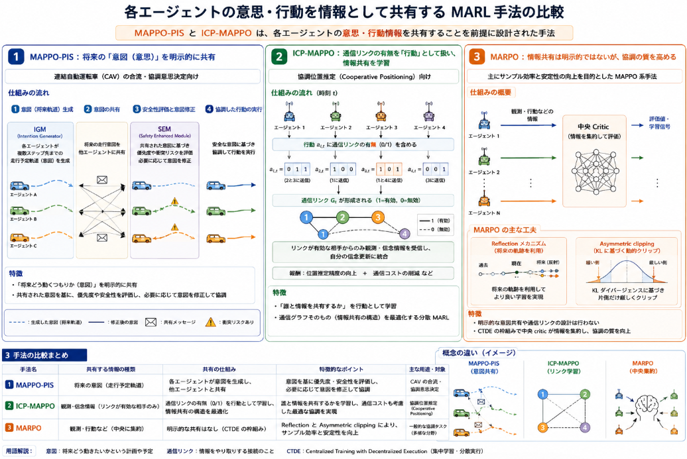

先日より進めている[Pursuitのチーム連携の学習](https://yoshishinnze.hatenablog.com/entry/2026/08/01/043000)において、現状使っている手法を少し方向を変えてみようかと考え始めています。
見た感じ、エージェントの動作時に他のエージェントの動作などの情報を踏まえて行動することが出来ればより良いチーム連携ができそうだが、現在のMAPPOでは個人のエージェントはあくまで独立です。

ということで**集中学習・分散実行（CTDE）** で仲間同士のコミュニケーションを行うことを前提とした手法がないか調べてみました。

## 手法一覧
まずはCTDEでMAPPOの後続手法にどんなものがあるかについて調べてみました。(MAPPOは、PPOをマルチエージェント環境に拡張した CTDE の代表的な手法です。) 
その後続として、サンプル効率・通信効率・協調の安定性を高めるための「分散学習に強い」MAPPO系手法がいくつか提案されています。代表的なものを整理します。

### 1. MARPO（Multi-Agent Reflective Policy Optimization）

- **位置づけ**  
  MAPPOのサンプル非効率を改善するための **on-policy MARL 手法** で、RPO（Reflective Policy Optimization）をマルチエージェントに拡張したもの[AAAI](https://ojs.aaai.org/index.php/AAAI/article/view/40219/44180)。

- **分散学習・協調の特徴**
  - CTDE を採用（学習時は中央化された critic を使う）。
  - **Reflection メカニズム**：  
    現在の状態だけでなく、その後の軌跡（trajectory）も利用して更新するため、**将来の協調結果を踏まえた学習**が可能になり、サンプル効率が向上。
  - **Asymmetric clipping**：  
    KL ダイバージェンスに基づくクリップ範囲の動的調整により、マルチエージェント特有の非定常性に強い安定した学習を実現。
  - SMAC-Hard や GRF などで MAPPO より早く高い勝率に到達することを報告[AAAI](https://ojs.aaai.org/index.php/AAAI/article/view/40219/44180)。

- **分散学習との関係**  
  学習は CTDE で集中化されていますが、**サンプル効率が高いため、実運用時の分散実行でも少ないデータで良い性能が出る**という意味で「分散学習に強い」と解釈できます。

### 2. MAPPO-PIS（MAPPO with Prior Intent Sharing）

- **位置づけ**  
  連結自動運転車（CAV）の合流・協調意思決定向けに提案された MAPPO 拡張[arXiv](https://arxiv.org/html/2408.06656v2)。

- **分散学習・協調の特徴**
  - ベースは CTDE 型の MAPPO。
  - **Prior Intent Sharing（意図共有）**：
    - IGM（Intention Generator Module）で各車両が **将来の走行軌道（意図）** を生成し、それを他車両と共有。
    - これにより、単純な観測だけでなく「相手がどう動くつもりか」を明示的に扱える。
  - **Safety Enhanced Module（SEM）**：
    - 合流レーンかどうか、合流端までの距離、時間車頭間隔などから **優先度** を計算。
    - 衝突リスクが検出された場合、意図修正器で安全な行動に修正。
  - カリキュラム学習により、簡単なシナリオから複雑なシナリオへ段階的に学習。

- **分散学習との関係**  
  学習は CTDE ですが、**実行時に「意図」を明示的に共有する分散協調**を前提としている点が特徴です。  
  つまり、各エージェントは自分の将来の意図を他エージェントに伝え、それに基づいて協調する「分散実行時の情報共有戦略」を学習の一部として組み込んでいます。

### 3. ICP-MAPPO（Cooperative Positioning with MAPPO）

- **位置づけ**  
  協調位置推定（Cooperative Positioning）のための **動的通信グラフを扱う MAPPO 系手法**[MIT](https://rings.winslab.lids.mit.edu/wp-content/uploads/2025/02/CamBraNicWin-Fusion-07-2024%E2%80%94Cooperative-Positioning-with-Multi-Agent-Reinforcement-Learning.pdf)。

- **分散学習・通信の特徴**
  - CTDE を採用しつつ、**dynamic decentralized execution** を導入。
  - 各エージェントの行動 $a_{i,t}$ に、他エージェントとの **通信リンクの有無（0/1）** を含める。
  - これにより、時刻ごとに通信グラフ $G_t$ を動的に変更し、**必要な近傍だけと通信**するように学習。
  - シミュレーションでは、全結合グラフと比べて最大 60% の通信リンク削減を達成しつつ、位置推定精度を維持[MIT](https://rings.winslab.lids.mit.edu/wp-content/uploads/2025/02/CamBraNicWin-Fusion-07-2024%E2%80%94Cooperative-Positioning-with-Multi-Agent-Reinforcement-Learning.pdf)。

- **分散学習との関係**  
  通信リンクの有無を **RL の行動として学習**するため、  
  - どのエージェントと通信すべきか  
  - どのタイミングでリンクを切るか  
  を自律的に決める **分散・通信効率重視の MARL** と言えます。

### 4. その他の分散 MARL との関係（MAPPO 以外の系統）

MAPPO 以外にも、分散 MARL の代表的な系統があります。

- **Decentralized MARL（完全分散）**  
  - 中央 critic を使わず、各エージェントが **局所情報と限定的な通信** だけで学習・実行する枠組み[Emergent Mind](https://www.emergentmind.com/topics/decentralized-multi-agent-reinforcement-learning-marl-framework)。
  - 例：  
    - **Consensus-based critics**：近傍エージェントと価値推定を共有し、**合意形成**しながら学習する手法[Emergent Mind](https://www.emergentmind.com/topics/decentralized-multi-agent-reinforcement-learning-marl-framework)。  
    - **Fully decentralized MARL**：ネットワーク上のエージェントが関数近似を用いて協調する理論的枠組み[PMLR](https://proceedings.mlr.press/v80/zhang18n/zhang18n.pdf)。

- **IPPO（Independent PPO）**  
  - 各エージェントが独立に PPO で学習する単純な分散手法[MARLlib](https://marllib.readthedocs.io/en/latest/algorithm/ppo_family.html)。
  - MAPPO と比べると非定常性に弱いが、**完全分散で実装が簡単**という利点があります。

### 手法の傾向

- **MAPPO の後続で「分散学習」に強い系譜**としては、  
  - **MARPO**：サンプル効率を高め、少ないデータで分散実行でも高性能を出す。  
  - **MAPPO-PIS**：将来の意図を明示的に共有する分散協調を前提とした CTDE。  
  - **ICP-MAPPO**：通信リンクの有無を行動として学習し、動的通信グラフで分散実行を最適化。  
  が代表的です。

- これらは基本的に **CTDE（集中学習・分散実行）** をベースにしつつ、  
  - サンプル効率  
  - 通信効率  
  - 意図共有  
  といった観点で「分散実行時の協調」を強化している点が共通しています。

## コミュニケーションを前提とした手法

その中から各エージェントの意思や行動を情報として共有することを前提とした手法について調べていきます。
先述の手法の中では**MAPPO-PIS** と **ICP-MAPPO** が、**各エージェントの意思・行動情報を共有することを前提に設計された手法**に該当します。

### 1. MAPPO-PIS：将来の「意図（意思）」を明示的に共有

- **設計の前提**  
  連結自動運転車（CAV）の合流・協調意思決定向けに提案された MAPPO 拡張で、**将来の走行意図を他エージェントと共有する**ことを前提に設計されています[arXiv](https://arxiv.org/html/2408.06656v2)。

- **意図共有の仕組み**
  - **IGM（Intention Generator Module）**  
    各エージェントが、複数ステップ先までの **走行予定軌道（意図）** を生成し、それを他エージェントに共有します。
  - **SEM（Safety Enhanced Module）**  
    共有された意図に基づき、優先度（合流レーンかどうか、合流端までの距離、時間車頭間隔など）を計算し、衝突リスクがあれば **意図を修正** して安全な行動に誘導します。

- **特徴**  
  単に「観測」や「行動」を共有するだけでなく、**「将来どう動くつもりか（意図）」を明示的に共有し、それを基に協調する**という設計になっています。

### 2. ICP-MAPPO：通信リンクの有無を「行動」として扱い、情報共有を学習

- **設計の前提**  
  協調位置推定（Cooperative Positioning）のための MAPPO 系手法で、**どのエージェントと通信するか（＝情報を共有するか）を RL の行動として学習**する枠組みです[MIT](https://rings.winslab.lids.mit.edu/wp-content/uploads/2025/02/CamBraNicWin-Fusion-07-2024%E2%80%94Cooperative-Positioning-with-Multi-Agent-Reinforcement-Learning.pdf)。

- **情報共有の仕組み**
  - 各エージェントの行動 \(a_{i,t}\) に、他エージェントとの **通信リンクの有無（0/1）** を含めます。
  - リンクが有効（1）の場合のみ、その近傍エージェントの観測・信念情報を自分の信念更新に統合します。
  - これにより、**どのエージェントと情報を共有すべきか**を動的に学習し、通信グラフ \(G_t\) を最適化します。

- **特徴**  
  「誰と情報を共有するか」を **行動として最適化** しているため、**情報共有の構造そのものを学習対象にした分散 MARL** と言えます。

### 3. MARPO：情報共有は明示的ではないが、協調の質を高める

- **MARPO** は、主に **サンプル効率と安定性** を改善するための手法で、  
  - Reflection メカニズム（将来の軌跡を利用）  
  - Asymmetric clipping（KL に基づく動的クリップ）  
  により、協調の質を高めます[AAAI](https://ojs.aaai.org/index.php/AAAI/article/view/40219/44180)。

- ただし、**明示的な意図共有や通信リンクの設計**は行わず、  
  CTDE の枠組みの中で **中央 critic が各エージェントの情報を集約**する形になっています。

## 比較

3種類の手法を実装難易度、協調学習の質、意思共有を前提とした手法か、引用数の4軸で評価してみました。

| 手法 | 実装難易度 | 協調学習の質 | 意思共有を前提 | 引用数（おおよそ） |
|------|------------|--------------|----------------|---------------------|
| **MARPO** | ★★☆（中） | ★★★（高） | ×（CTDE 内で暗黙的に協調） | まだ少ない（2026 AAAI 論文）[AAAI](https://ojs.aaai.org/index.php/AAAI/article/view/40219) |
| **MAPPO-PIS** | ★★★（高） | ★★★（高） | ◎（将来の意図を明示共有） | 20+ 程度[arXiv](https://arxiv.org/abs/2408.06656)[ACM](https://dl.acm.org/doi/10.1007/978-3-031-91813-1_16) |
| **ICP-MAPPO** | ★★★（高） | ★★☆（中〜高） | ○（通信リンクの有無を行動として共有） | まだ少ない（2024 Fusion 論文）[MIT](https://rings.winslab.lids.mit.edu/wp-content/uploads/2025/02/CamBraNicWin-Fusion-07-2024%E2%80%94Cooperative-Positioning-with-Multi-Agent-Reinforcement-Learning.pdf) |

### 1. MARPO

- **実装難易度**：中  
  - ベースは MAPPO（PPO ベース）で、  
    - Reflection メカニズム（将来軌跡を利用）  
    - Asymmetric clipping（KL に基づく動的クリップ）  
    を追加する形です[AAAI](https://ojs.aaai.org/index.php/AAAI/article/view/40219)。  
  - MAPPO 実装があるなら、その拡張として比較的素直に追加できますが、軌跡レベルの更新ロジックがやや複雑です。

- **協調学習の質**：高  
  - SMAC-Hard や GRF で MAPPO より早く高い勝率に到達し、**サンプル効率と安定性が高い**と報告されています[AAAI](https://ojs.aaai.org/index.php/AAAI/article/view/40219)。

- **意思共有を前提**：×  
  - CTDE の枠組みで、中央 critic が各エージェントの情報を集約しますが、**明示的な意図共有や通信リンク設計は行いません**。  
  - 協調は「中央 critic が全体を俯瞰して学習」という形で達成されます。

- **引用数**：まだ少ない  
  - 2026 AAAI 論文で、比較的新しいため引用はまだ限定的です[AAAI](https://ojs.aaai.org/index.php/AAAI/article/view/40219)。

### 2. MAPPO-PIS

- **実装難易度**：高  
  - MAPPO に加えて、  
    - IGM（Intention Generator Module）：将来の走行軌道を生成・共有  
    - SEM（Safety Enhanced Module）：優先度計算と意図修正  
    - カリキュラム学習  
    を組み込む必要があり、**モジュール数・ロジックが増える**ため実装負荷は高めです[arXiv](https://arxiv.org/html/2408.06656v2)。

- **協調学習の質**：高  
  - CAV の合流シナリオで、安全性・効率・システム全体性能が既存手法を上回ると報告されています[arXiv](https://arxiv.org/html/2408.06656v2)。  
  - 将来の意図を共有することで、**長期的な協調が安定**します。

- **意思共有を前提**：◎（明示的）  
  - 各エージェントが **将来の走行意図（軌道）を明示的に共有**し、それに基づいて協調・安全確保を行う設計です[arXiv](https://arxiv.org/html/2408.06656v2)。  
  - 「観測」だけでなく「意図」を共有する点が特徴です。

- **引用数**：20+ 程度  
  - arXiv 版で 20 件以上の引用が報告されており、MARPO・ICP-MAPPO よりは多く引用されています[arXiv](https://arxiv.org/abs/2408.06656)[ACM](https://dl.acm.org/doi/10.1007/978-3-031-91813-1_16)。

### 3. ICP-MAPPO

- **実装難易度**：高  
  - MAPPO に加え、  
    - 通信リンクの有無（0/1）を行動として扱う  
    - 動的通信グラフ \(G_t\) の管理  
    - 近傍の観測・信念を統合する LSTM ベースの信念更新  
    を実装する必要があり、**通信グラフと RL の統合が複雑**です[MIT](https://rings.winslab.lids.mit.edu/wp-content/uploads/2025/02/CamBraNicWin-Fusion-07-2024%E2%80%94Cooperative-Positioning-with-Multi-Agent-Reinforcement-Learning.pdf)。

- **協調学習の質**：中〜高  
  - 協調位置推定タスクで、全結合グラフと比べて最大 60% の通信リンク削減を達成しつつ、精度を維持できると報告されています[MIT](https://rings.winslab.lids.mit.edu/wp-content/uploads/2025/02/CamBraNicWin-Fusion-07-2024%E2%80%94Cooperative-Positioning-with-Multi-Agent-Reinforcement-Learning.pdf)。  
  - ただし、タスクが位置推定に特化しているため、一般的な協調ゲーム（SMAC など）での評価は限定的です。

- **意思共有を前提**：○（通信リンクとして）  
  - 「誰と情報を共有するか」を **行動として最適化** するため、**情報共有の構造そのものを学習対象**にしています[MIT](https://rings.winslab.lids.mit.edu/wp-content/uploads/2025/02/CamBraNicWin-Fusion-07-2024%E2%80%94Cooperative-Positioning-with-Multi-Agent-Reinforcement-Learning.pdf)。  
  - 明示的な「意図」共有ではありませんが、**通信リンクを通じた情報共有**を前提とした設計です。

- **引用数**：まだ少ない  
  - 2024 Fusion 論文で、引用はまだ限定的です[MIT](https://rings.winslab.lids.mit.edu/wp-content/uploads/2025/02/CamBraNicWin-Fusion-07-2024%E2%80%94Cooperative-Positioning-with-Multi-Agent-Reinforcement-Learning.pdf)。

## 総合的な傾向

上記を踏まえてMAPPOの代替手法として扱うかは第一がMAPPO-PISかというように判断しました。
より詳細な情報を調べていきたいと思います。

- **実装難易度**：  
  MARPO ＜ MAPPO-PIS ≒ ICP-MAPPO  
  （MARPO は MAPPO の拡張として比較的素直、PIS と ICP は追加モジュールが多く複雑）

- **協調学習の質**：  
  MARPO ≈ MAPPO-PIS ＞ ICP-MAPPO  
  （MARPO と PIS は汎用タスクで高評価、ICP は位置推定特化で高精度だがタスクが限定）

- **意思共有を前提とした設計**：  
  MAPPO-PIS（◎） ＞ ICP-MAPPO（○） ＞ MARPO（×）  
  （PIS は「意図」を明示共有、ICP は「通信リンク」を通じた情報共有、MARPO は中央 critic による暗黙的協調）

- **引用数（現時点）**：  
  MAPPO-PIS ＞ MARPO ≈ ICP-MAPPO  
  （PIS は CAV 分野で注目されており引用が多く、MARPO・ICP は比較的新しい）

