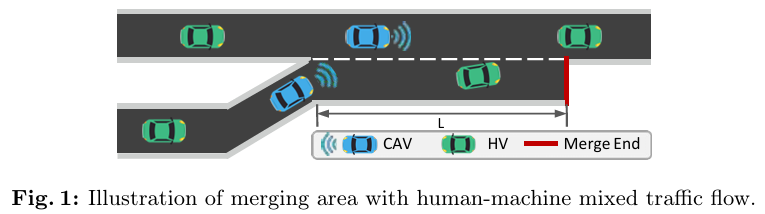
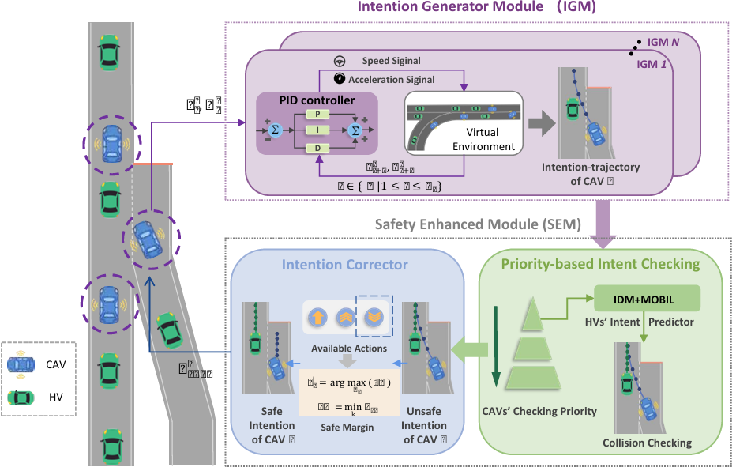
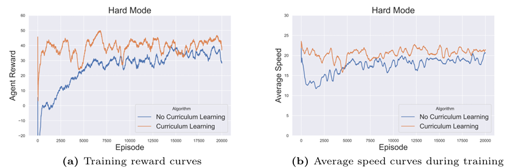
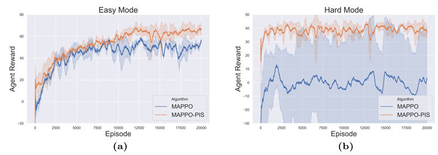
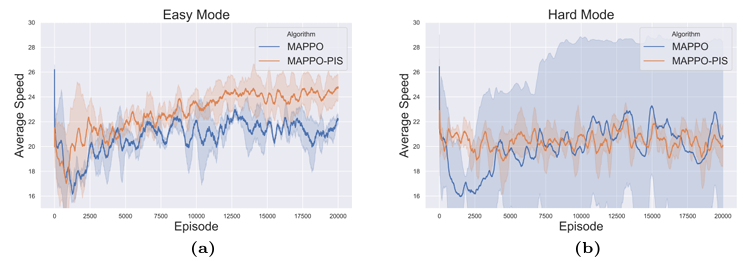

先日[調査したチーム連携強化のためのMARLの手法](https://yoshishinnze.hatenablog.com/entry/2026/08/04/043000)について本日は詳細を調べていこうと思います。

調査対象となる手法の名前は**MAPPO-PIS**です。

## 概要

以下に、MAPPO-PIS 論文の概要を整理します。

### 論文情報

- **タイトル**：  
  *MAPPO-PIS: A Multi-Agent Proximal Policy Optimization Method with Prior Intent Sharing for CAVs' Cooperative Decision-Making*  
  [arXiv](https://arxiv.org/abs/2408.06656)

- **著者**：  
  Yicheng Guo, Jiaqi Liu, Rongjie Yu, Peng Hang, Jian Sun  
  [arXiv](https://arxiv.org/abs/2408.06656)

- **発表年**：  
  2024年（arXiv 投稿日：2024年8月13日）  
  [arXiv](https://arxiv.org/abs/2408.06656)

尚、本論文はECCVでの採択論文です。
ECCV は、コンピュータビジョン分野の トップ国際会議の一つ です。

>__ECCV__  
>分野：コンピュータビジョン（Computer Vision）  
>画像認識、物体検出、セマンティックセグメンテーション、3Dビジョン、映像理解、GAN、自己教師あり学習など、画像・動画を扱う AI 研究全般を対象とします。
>トップ会議としての位置づけ：  
>コンピュータビジョン分野で最も権威のある国際会議の一つで、CVPR（Conference on Computer Vision and Pattern Recognition）、ICCV（International Conference on Computer Vision）と並び、「三大ビジョン会議」と呼ばれることが多いです。

### 論文の目的

- **対象タスク**：  
  連結自動運転車（Connected and Autonomous Vehicles, CAVs）の **協調的意思決定**、特に **人間と自動運転車が混在する合流エリア** での協調[arXiv](https://arxiv.org/abs/2408.06656)。

- **課題認識**：  
  - 合流エリアでは、車両同士の相互作用が複雑で、単純なルールベースや既存の MARL 手法では、  
    - 安全性（衝突回避）  
    - 交通効率（流れの円滑化）  
    を同時に高水準で達成することが難しい。

- **目的**：  
  - CAV の協調意思決定問題を **マルチエージェント強化学習（MARL）** として定式化し、  
  - **将来の走行意図（Prior Intent）を共有する** ことで、安全性と効率を両立する協調行動を学習する手法を提案すること[arXiv](https://arxiv.org/abs/2408.06656)。

### 手法の構成

MAPPO-PIS は、**Multi-Agent Proximal Policy Optimization（MAPPO）** をベースに、以下の2つの主要モジュールを統合した手法です[arXiv](https://arxiv.org/html/2408.06656v2)。

__1. Intention Generator Module（IGM）__

- **役割**：  
  各エージェント（CAV）が、**将来の走行軌道（意図）** を生成し、それを他エージェントと共有するモジュール。

- **動作**：  
  - 各車両は、複数ステップ先までの **予定軌道（trajectory）** を生成。  
  - この軌道情報を **V2V 通信** を通じて近傍車両と共有し、「自分が今後どう動くつもりか」を明示的に伝える。

- **意義**：  
  単なる観測情報だけでなく、**将来の意図** を共有することで、相手の動きを予測しやすくなり、長期的な協調が可能になる。

__2. Safety Enhanced Module（SEM）__

- **役割**：  
  共有された意図に基づき、**安全性を確保するためのチェックと修正** を行うモジュール。

- **構成**：
  - **優先度計算**：  
    各車両について、  
    - 合流レーンにいるか（緊急性）  
    - 合流端までの距離  
    - 時間車頭間隔（time headway）  
    などから **優先度スコア** を計算[arXiv](https://arxiv.org/html/2408.06656v2)。
  - **意図チェック・修正**：  
    - 共有された意図に基づき、衝突リスクが検出された場合、  
    - **Intention Corrector** によって、安全な行動に意図を修正し、その修正後の意図に従って行動を選択。

- **意義**：  
  意図共有により協調を促進しつつ、SEM で **安全性を保証** する二段構えの設計になっています。

__3. 学習フレームワーク__

- **ベースアルゴリズム**：  
  MAPPO（Multi-Agent PPO）を採用し、**集中学習・分散実行（CTDE）** の枠組みで学習[arXiv](https://arxiv.org/html/2408.06656v2)。

- **カリキュラム学習**：  
  - 簡単なシナリオ（例：車両数が少ない、速度が低い）から、  
  - 複雑なシナリオ（車両数が多い、速度が高い、人間運転車が混在）へと段階的に学習させることで、**学習効率と安定性を向上**[arXiv](https://arxiv.org/html/2408.06656v2)。

### 実験結果の概要

- **評価環境**：  
  人間運転車と CAV が混在する **合流シナリオ**（高速道路ランプ合流など）を対象としたシミュレーション環境[arXiv](https://arxiv.org/html/2408.06656v2)。

- **比較対象**：  
  既存の協調意思決定手法や MARL ベースライン（MAPPO など）と比較。

- **主な結果**：  
  - **安全性**：  
    衝突率や危険な接近の発生頻度が減少し、既存手法より安全な挙動を示す。  
  - **効率**：  
    平均速度やスループットが向上し、交通流の効率が改善。  
  - **システム全体性能**：  
    安全性と効率の両面で、**state-of-the-art ベースラインを上回る性能**を達成したと報告されています[arXiv](https://arxiv.org/html/2408.06656v2)。

### 概要総括

- MAPPO-PIS は、**CAV の協調意思決定**を MARL として扱い、  
  - **将来の走行意図を共有する IGM**  
  - **安全性を確保する SEM**  
  を MAPPO に統合した手法です。

- これにより、  
  - 人間運転車が混在する複雑な合流環境でも、  
  - 安全性と交通効率を両立する協調行動を学習できることが示されています[arXiv](https://arxiv.org/html/2408.06656v2)。

- 実装コードは GitHub で公開されています：  
  https://github.com/CCCC1dhcgd/A-MAPPO-PIS  
  [arXiv](https://arxiv.org/abs/2408.06656)

## 研究背景

MAPPO-PIS は、**自動運転・CAV（Connected and Autonomous Vehicles）の協調意思決定**という応用課題に対して、  
- 既存の **MAPPO（Multi-Agent PPO）**  
- 自動車分野の **意図共有（Intent Sharing）** の標準  
- 交通流・人間運転車の挙動をモデル化する **古典的交通モデル**  
を組み合わせて設計されています。

以下、影響を受けた主な論文・標準・モデルを、背景とともに整理します。

### 1. ベースとなった強化学習手法：MAPPO と PPO

- **MAPPO（Multi-Agent Proximal Policy Optimization）**  
  - MAPPO-PIS は、**MAPPO** をベースアルゴリズムとして採用しています[arXiv](https://arxiv.org/html/2408.06656v2)。  
  - MAPPO は、単一エージェントの **PPO（Proximal Policy Optimization）**[arXiv](https://arxiv.org/html/2408.06656v2) をマルチエージェント環境に拡張したもので、  
    - **集中学習・分散実行（CTDE）** の枠組み  
    - 安定した on-policy 学習  
    を特徴とします。

- **背景**：  
  - マルチエージェント環境では、各エージェントが独立に学習すると「相手のポリシーが変わる」ことで環境が非定常になり、学習が不安定になります。  
  - MAPPO は、中央 critic が全体の状態を把握することでこの非定常性を緩和し、**協調的なポリシー学習を安定化**する手法として広く使われています。  
  - MAPPO-PIS は、この **MAPPO の安定性とスケーラビリティ** を活かしつつ、CAV 特有の「意図共有」と「安全性」を追加した設計になっています。

### 2. CAV 向けマルチエージェント強化学習（MARL）の先行研究

- **CAV の協調意思決定を MARL で扱う研究**  
  - MAPPO-PIS の論文では、  
    - Independent Q-Learning (IQL)  
    - MAACKTR  
    - MAA2C  
    などの **既存 MARL 手法** を引用し、CAV の協調意思決定に適用した研究を背景として挙げています[arXiv](https://arxiv.org/html/2408.06656v2)。

- **背景**：  
  - 合流エリアや交差点など、**複数車両が相互作用する交通場面**では、  
    - 単純なルールベース  
    - 単一エージェント RL  
    では、安全性と効率の両立が難しいことが知られていました。  
  - そこで、**マルチエージェント RL** を用いて、車両同士の協調を学習する研究が増えてきました。  
  - MAPPO-PIS は、その中でも **MAPPO をベースに、より高度な「意図共有」と「安全性モジュール」を追加**することで、既存手法を上回る性能を目指しています。

### 3. 意図共有（Intent Sharing）の概念と SAE 標準

- **SAE J3216：意図共有協調（Intent-Sharing Cooperation）**  
  - MAPPO-PIS の「Prior Intent Sharing」というアイデアは、  
    - **SAE J3216** で定義されている **Intent-Sharing Cooperation** の概念に基づいています[arXiv](https://arxiv.org/html/2408.06656v2)。

- **背景**：  
  - SAE J3216 は、自動運転車同士や自動運転車とインフラが、  
    - 「これからどう動くつもりか（意図）」  
    を明示的に共有し、協調するための標準的な考え方を示しています。  
  - これに対し、従来の多くの研究は、  
    - 過去の行動履歴から相手の意図を **推論（Intent Inferring）** する  
    アプローチでした[arXiv](https://arxiv.org/html/2408.06656v2)。  
  - MAPPO-PIS は、  
    - **推論ではなく、明示的な意図共有（Intent Sharing）**  
    を採用することで、  
    - 誤推論による事故リスク  
    - 不確実性の増大  
    を減らし、より安全で効率的な協調を目指しています。

### 4. 人間運転車の挙動モデル：IDM と MOBIL

- **Intelligent Driver Model (IDM)**  
  - 車間距離と速度に基づいて、車両の加速度を決める **カーブィングモデル**[arXiv](https://arxiv.org/html/2408.06656v2)。

- **MOBIL レーンチェンジモデル**  
  - レーンチェンジの意思決定を、自車と周囲車両の利得（加速度の改善など）に基づいて行うモデル[arXiv](https://arxiv.org/html/2408.06656v2)。

- **背景**：  
  - MAPPO-PIS は、**人間運転車（HV）と CAV が混在する環境**を扱うため、  
    - HV がどのように動くかを予測する必要があります。  
  - そこで、交通工学分野で広く使われている **IDM と MOBIL** を組み合わせ、  
    - HV の挙動をシミュレート  
    - SEM（Safety Enhanced Module）でのリスク評価  
    に利用しています。  
  - これにより、**CAV が HV の動きをある程度予測しつつ、安全な協調行動を学習**できるようになっています。

### 5. その他の関連研究（ルールベース・最適化ベース）

- **ルールベースの予約方式**  
  - 交差点や合流部で、車両が「スロット」を予約するようなルールベースの方式[arXiv](https://arxiv.org/html/2408.06656v2)。

- **最適化ベースの MPC（Model Predictive Control）**  
  - モデル予測制御を用いて、短期的な将来の状態を最適化する手法[arXiv](https://arxiv.org/html/2408.06656v2)。

- **背景**：  
  - これらは、**安全性や効率を高めるための古典的なアプローチ**として引用されています。  
  - しかし、  
    - ルールベースは複雑な状況に弱い  
    - MPC は計算コストが高く、リアルタイム性に課題がある  
    といった限界があります。  
  - MAPPO-PIS は、**RL による柔軟な学習**と、**意図共有・安全性モジュール**を組み合わせることで、  
    - ルールベースや MPC の利点（安全性・最適性）  
    - RL の利点（適応性・スケーラビリティ）  
    を両立しようとしています。

論文で解決したいシチュエーションとして車の合流が挙げられてます。
突然飛び出したりするとメチャ危険ですし、お互いの意思疎通が必要になるわけです。

## 提案手法

MAPPO-PIS の提案手法は、**「将来の走行意図を共有する」ことで、CAV（連結自動運転車）同士が安全かつ効率的に協調する**ことを目指したマルチエージェント強化学習（MARL）手法です。

全体の流れを簡略化すると、以下のようになります。

1. **各車両が「将来どう動くつもりか（意図）」を生成・共有**（IGM）  
2. **共有された意図をもとに、衝突リスクをチェックし、必要なら安全な行動に修正**（SEM）  
3. **MAPPO でポリシーを学習**（CTDE：集中学習・分散実行）

以下、もう少し詳しく説明します。

### 1. 全体のフレームワーク：MAPPO + 意図共有

- **ベースアルゴリズム**：  
  - **MAPPO（Multi-Agent PPO）** を採用し、  
    - 学習時：中央 critic が全体の状態を見て価値を評価（集中学習）  
    - 実行時：各車両が自分のポリシーに基づいて独立に行動（分散実行）  
  という **CTDE（Centralized Training, Decentralized Execution）** の枠組みを使います[arXiv](https://arxiv.org/html/2408.06656v2)。

- **追加要素**：  
  - **Intention Generator Module（IGM）**：将来の走行軌道（意図）を生成・共有  
  - **Safety Enhanced Module（SEM）**：安全性をチェックし、必要なら意図を修正  
  を MAPPO に統合しています。

### 2. Intention Generator Module（IGM）：将来の「意図」を生成・共有

__何をするモジュールか__

- 各 CAV が、**「今後数秒〜数十秒、自分がどう走るつもりか」という軌道（意図）** を生成します。
- この軌道情報を **V2V 通信** で近傍の車両（CAV やインフラ）に **明示的に共有** します。

__入力と出力__

- **入力**：  
  - 自車の状態（位置、速度、加速度など）  
  - 周囲の車両・環境情報（車線、合流端までの距離など）
- **出力**：  
  - 将来の **走行軌道（trajectory）**：  
    - 例：「次の 3 秒間はこの速度で直進し、その後右レーンに合流する」といった連続的な軌道

__ポイント__

- 単に「今の観測」を共有するのではなく、**「将来の行動計画」を共有**することで、  
  - 相手が自分の動きを予測しやすくなり、  
  - 長期的な協調（例：合流時の順番調整）が可能になります。

### 3. Safety Enhanced Module（SEM）：安全性を確保する二段構え

SEM は、**共有された意図をもとに「安全かどうか」をチェックし、必要なら修正するモジュール**です。主に2つの要素からなります。

__(1) 優先度計算（Priority）__

- 各車両について、以下のような情報から **優先度スコア** を計算します[arXiv](https://arxiv.org/html/2408.06656v2)：
  - 合流レーンにいるかどうか（緊急性）  
  - 合流端までの距離  
  - 時間車頭間隔（time headway）  
  - など

- **意味**：  
  - 「どちらの車両が先に合流すべきか」を定量的に判断し、  
  - 優先度の高い車両を優先して通すような協調を促します。

__(2) 意図チェックと修正（Intention Corrector）__

- 共有された意図（軌道）に基づき、**衝突リスク** を評価します。
- リスクが高い場合：
  - **Intention Corrector** が、  
    - 速度を落とす  
    - 合流タイミングを遅らせる  
    - 車線変更をキャンセルする  
    など、**安全な行動に意図を修正**します。
- 修正後の意図に従って、実際の行動（アクセル・ブレーキ・ステアリング）が決定されます。

__背景モデル：IDM と MOBIL__

- SEM では、**人間運転車（HV）の挙動** を予測するために、  
  - **Intelligent Driver Model (IDM)**：車間距離と速度から加速度を決めるモデル  
  - **MOBIL レーンチェンジモデル**：レーンチェンジの意思決定モデル  
  を利用しています[arXiv](https://arxiv.org/html/2408.06656v2)。

- これにより、  
  - CAV は HV の動きをある程度予測しつつ、  
  - 自車の意図を安全側に修正することができます。

### 4. MAPPO との統合と学習

論文読んで気づいたのですが、本手法はMAPPOから新規性があるかというと、明確な新規性ではない感じです。
MAPPOを使って、安全運転のモジュールを統合した手法であるとみるとすんなり、"そういうことか"となります。

__学習時の流れ（CTDE）__

1. **各エージェント（CAV）**：
   - 観測（位置、速度、周囲車両など）と、共有された意図情報を入力として、  
   - IGM で将来軌道を生成し、SEM で安全性チェック・修正を行ったうえで、  
   - 最終的な行動（アクセル・ブレーキ・ステアリング）を出力。

2. **中央 critic**：
   - 全車両の状態と共有された意図を入力として、  
   - 全体の価値（安全性・効率など）を評価し、  
   - MAPPO の目的関数に基づいてポリシーを更新。

3. **カリキュラム学習**：
   - 簡単なシナリオ（車両数が少ない、速度が低い）から、  
   - 複雑なシナリオ（車両数が多い、速度が高い、HV が混在）へと段階的に学習させることで、  
   - 学習の安定性と効率を高めています[arXiv](https://arxiv.org/html/2408.06656v2)。

__実行時の流れ（分散実行）__

- 学習済みのポリシーと IGM/SEM を使い、  
  - 各 CAV は **自分の観測と共有された意図だけ** を基に行動を決定します。  
- 中央 critic は不要で、**完全に分散実行** が可能です。

### 5. 提案手法の新規性

- **従来の MARL for CAV**：  
  - 観測や過去の行動から相手の意図を「推論」する（Intent Inferring）ことが多く、  
  - 誤推論による事故リスクや不確実性が課題でした。

- **MAPPO-PIS**：  
  - **明示的な意図共有（Prior Intent Sharing）** を導入し、  
    - 「自分がどう動くつもりか」を直接伝えることで、推論の不確実性を減らす。  
  - **SEM による安全性チェック・修正** を組み込み、  
    - 意図共有による協調を、安全側に制御する。  
  - **MAPPO の安定した学習能力** を活かしつつ、  
    - CAV 特有の「意図共有」と「安全性」を統合した点が新しいです[arXiv](https://arxiv.org/html/2408.06656v2)。

論文で掲載されているシステム構成図です。
IGMが出す走行予定経路をお互い共有しあい、MAPPOにより協調学習するということのようです。
因みに、図、文字化け・・・？なんだ・・・。。。

## 実験結果

以下、MAPPO-PIS の **実験の問題設定** と **実験結果** を順に説明します。

### 1. 問題設定（シナリオ・環境）

__シナリオ：人間運転車と CAV が混在する合流エリア__

- **対象**：  
  高速道路の **ランプ合流エリア**（on-ramp から本線車線への合流）  
  - CAV（Connected and Autonomous Vehicles：連結自動運転車）  
  - HV（Human-driven Vehicles：人間運転車）  
  が混在する環境[arXiv](https://arxiv.org/html/2408.06656v2)。

- **交通モード（難易度）**：  
  以下の4つのモードで評価されています[arXiv](https://arxiv.org/html/2408.06656v2)。

  1. **Easy Mode（簡単）**  
     - CAV：1〜3台  
     - HV：1〜3台（同質：全車同じ挙動）  

  2. **Hard Mode（難しい）**  
     - CAV：3〜6台  
     - HV：3〜6台（同質）  

  3. **Easy Mode（異質 HV）**  
     - CAV：1〜3台  
     - HV：1〜3台（異質：Aggressive / Normal / Timid の3タイプ）  

  4. **Hard Mode（異質 HV）**  
     - CAV：3〜6台  
     - HV：3〜6台（異質：Aggressive / Normal / Timid）  

- **シミュレータ**：  
  - **highway-env** を用いて合流シナリオをシミュレート[arXiv](https://arxiv.org/html/2408.06656v2)。

### 2. 比較手法（ベースライン）

MAPPO-PIS は、以下の **state-of-the-art MARL 手法** と比較されています[arXiv](https://arxiv.org/html/2408.06656v2)。

1. **MAPPO**  
   - Multi-Agent PPO（本手法のベース）  
   - CTDE フレームワークで、中央 critic が全体を評価。

2. **MAACKTR**  
   - Multi-Agent Actor-Critic using Kronecker-Factored Trust Region  
   - 信頼領域を用いた actor-critic 型 MARL。

3. **MAA2C**  
   - Multi-Agent Advantage Actor-Critic  
   - Advantage を用いた actor-critic 型 MARL。

### 3. 評価指標

安全性と効率の両面から、以下の指標で評価されています[arXiv](https://arxiv.org/html/2408.06656v2)。

1. **Evaluation Reward（評価報酬）**  
   - 学習済みポリシーを評価した際の **累積報酬**。  
   - 報酬設計には、  
     - 安全（衝突回避）  
     - 効率（速度維持、遅延回避）  
     などが含まれます。

2. **Collision Rate（衝突率）**  
   - 1エピソードあたりの **衝突回数** または衝突確率。  
   - 低いほど安全。

3. **Average Speed（平均速度）**  
   - 車両の平均速度（m/s）。  
   - 高いほど交通流がスムーズで効率的。

4. **Post-Encroachment Time (PET)**  
   - 合流時に、先行車と後続車が **同じ空間を通過する時間差**。  
   - 値が大きいほど、**安全マージンが大きい**（衝突リスクが低い）ことを意味します。

### 4. 実験結果の要点

__(1) Easy Mode（同質 HV）__

- **Evaluation Reward**：  
  - MAPPO-PIS：**73.45**  
  - MAPPO：44.03  
  - MAA2C：36.27  
  → MAPPO-PIS が **最も高い報酬** を達成[arXiv](https://arxiv.org/html/2408.06656v2)。

- **Collision Rate**：  
  - MAPPO-PIS：**0.00**（衝突なし）  
  - MAPPO：0.03  
  → MAPPO-PIS が **最も安全**[arXiv](https://arxiv.org/html/2408.06656v2)。

- **PET**：  
  - MAPPO-PIS：**1.6秒**（高い安全マージン）  
  → 他手法より大きな安全マージンを示す[arXiv](https://arxiv.org/html/2408.06656v2)。

__(2) Hard Mode（同質 HV）__

- **Evaluation Reward**：  
  - MAPPO-PIS：**33.27**  
  - MAPPO：-36.58  
  - MAA2C：0.30  
  → 難易度が上がっても、MAPPO-PIS は **正の報酬を維持** し、他手法を大きく上回る[arXiv](https://arxiv.org/html/2408.06656v2)。

- **Collision Rate**：  
  - MAPPO-PIS：**0.01**  
  - MAPPO：0.03  
  → Hard Mode でも **衝突率が低く、安全性が高い**[arXiv](https://arxiv.org/html/2408.06656v2)。

__(3) 異質 HV（Aggressive / Normal / Timid）を含む場合__

- **Easy / Hard Mode ともに**、  
  - MAPPO-PIS は **最も高い評価報酬** と **低い衝突率** を維持。  
  - Aggressive（攻撃的）な HV が混在しても、**安全性と効率の両立**が可能であることが示されています[arXiv](https://arxiv.org/html/2408.06656v2)。

__(4) 平均速度（Average Speed）__

- MAPPO-PIS は、  
  - 他手法より **高い平均速度** を達成し、  
  - 交通流の効率（スループット）が向上していることが報告されています[arXiv](https://arxiv.org/html/2408.06656v2)。

### 5. 実験結果のまとめ

- **安全性**：  
  - Collision Rate と PET の両面で、MAPPO-PIS は **最も安全な挙動** を示しました。  
  - 特に Hard Mode や異質 HV を含む場合でも、衝突率を低く抑えています。

- **効率**：  
  - Evaluation Reward と Average Speed が、MAPPO, MAACKTR, MAA2C を上回り、  
  - **交通流の効率も高い** ことが確認されています。

- **協調の質**：  
  - 意図共有（IGM）と安全性モジュール（SEM）を組み込むことで、  
  - 単純な MAPPO よりも **協調の質が向上** し、  
  - 複雑な合流シナリオでも安定して性能を発揮できることが示されました[arXiv](https://arxiv.org/html/2408.06656v2)。

## 総括

論文読んでわかった点ですが。
MAPPO-PIS では、**「自分が今後、こうしていく」という行動予定（将来の軌道・意図）を生成するモジュール**が必須です。

### 1. IGM（Intention Generator Module）の役割

- MAPPO-PIS では、**IGM** が以下の役割を担います[arXiv](https://arxiv.org/html/2408.06656v2)。
  - 各エージェント（CAV）が、  
    - 現在の状態（位置・速度など）  
    - 周囲の環境情報  
    を入力として、  
    - **将来の走行軌道（trajectory）** を生成。
  - この軌道を **「意図（Intent）」** として他エージェントと共有。

- つまり、  
  - 「今から数秒後、自分はここをこの速度で通るつもりだ」  
  という **行動予定（計画）** を明示的に生成・共有することが、MAPPO-PIS の核心部分です。

### 2. なぜ「行動予定の生成」が必要か

- MAPPO-PIS は、**意図共有（Prior Intent Sharing）** を前提に設計されています[arXiv](https://arxiv.org/html/2408.06656v2)。
- 意図共有を行うためには、  
  - 各エージェントが **自分自身の将来の行動計画** を持っている必要があります。
- この計画がなければ、  
  - 相手に「自分がどう動くつもりか」を伝えられない  
  - SEM で安全性チェックや修正もできない  
  ため、MAPPO-PIS の枠組みは成立しません。

したがって、**「今後、こうしていく」という行動予定の生成は、MAPPO-PIS を実現する上で不可欠**です。

### 3. 実装上のポイント

- 行動予定（意図）の生成は、  
  - 単純なルールベース（例：一定速度で直進）  
  - あるいは、  
  - ニューラルネットワークによる予測（将来の状態を回帰するモデル）  
  など、**どのような方法でも構いません**。

- 重要なのは、  
  - **将来の行動計画を明示的に表現し、共有できる形式** にすることです。

うーん。。。うーん。。。
数学的な美しさを応用したような手法を想定してました。。。

