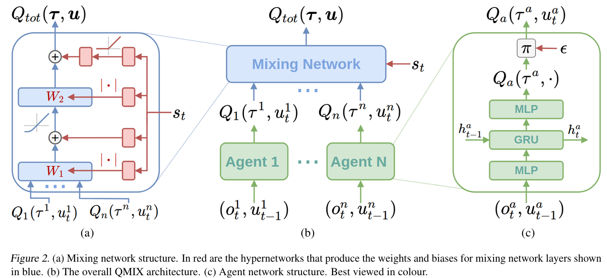

# QMIXの実装

先日QMIXの記事を書きましたが、できばえが今一つだったので、修正版として記事を書きなおします。
QMIXは、複数のエージェントが協調してタスクを達成するマルチエージェント強化学習（MARL）の代表的なアルゴリズムです。

論文URL：https://arxiv.org/abs/1803.11485

## QMIXの基本理念：CTDEフレームワーク

QMIXは、MARLで最も成功しているフレームワークの一つである**Centralized Training with Decentralized Execution (CTDE)**（集中学習・分散実行）に基づいています。

1. **集中学習 (Centralized Training)**：学習時、システム全体の**グローバルな状態**（全エージェントの位置、タスク状況など）を利用して、全エージェントの行動の合計価値を評価します。これにより、エージェント間の協調的な行動を学習しやすくなります。
2. **分散実行 (Decentralized Execution)**：実行時、各エージェントは自分自身の**ローカルな観測**（周囲の状況や自分の荷物有無など）のみに基づいて行動を決定します。これは実世界のシステム（ロボット、ドローンなど）の制約に対応しています。

学習に当たって次のように学習されることになります。

1. すべてのエージェントは部分観測の情報を用いる
2. 各エージェントの部分観測情報はお互いに共有はされない
3. 報酬も個々のエージェントに対してではなくチーム全体への報酬と考える

詳細は次項にて説明します。

## QMIXの主要な仕組み：Value Decomposition

QMIXの核心は、**価値分解 (Value Decomposition)**という手法を用いて、集中学習と分散実行を両立させる点にあります。

QMIXでは、以下の2つのネットワークを導入します。

### 1. 個別Qネットワーク (Agent Q-Networks)

* **目的**: 各エージェントが自身のローカルな観測 $o_i$ のみを使って、そのエージェントの行動 $a_i$ のQ値 $Q_i(o_i, a_i)$ を出力します。
* **特徴**: エージェントごとに独立したネットワークであり、**分散実行**を可能にする基盤となります。
* **構造**: 一般的なDQNと同様の**全結合層**または**RNN**（観測が履歴依存の場合）が使用されます。

### 2. ミキサーネットワーク (QMixer Network)

* **目的**: 個別Qネットワークから得られた**各エージェントのQ値** $Q_1, Q_2, \dots$ と、**グローバルな状態** $s$ を入力として受け取り、チーム全体の合計Q値 $Q_{tot}(s, a_1, \dots, a_N)$ を計算します。
* **特徴**: **集中学習**を担う部分であり、エージェント間の依存関係や協調性を考慮に入れます。
* **モノトニシティ制約**: 最も重要な制約です。QMixerは、**あるエージェントのQ値 $Q_i$ が上昇すれば、合計Q値 $Q_{tot}$ も必ず上昇する**ように学習されます（**非負の重み**）。
  $$
  rac{\partial Q_{tot}}{\partial Q_i} \ge 0
  $$

  この制約により、「グローバルな最適行動は、ローカルで最適な行動の組み合わせから導かれる」という整合性が保たれ、分散実行が可能になります。

## アーキテクチャ

以下の絵を基に今回のアーキテクチャを説明していきます。

右の図(c)は、各エージェントのアーキテクチャを示しています。
このエージェントはそれぞれ部分観測（observation）とjoint-actionを入力としてQ値を出力しています。

ここで得られたQ値は真ん中の図(b)のようにMixing Networkに入力されます。
Mixing Networkは集中方学習を行うネットワークです。
ここで各エージェントのQ値とグローバルな状態情報を受け取り、システム全体のQ値を出力します。

MixingNetworkの内部構造は図(a)のように入力されたQ値を基に、状態を入力して重みで解釈を進めていくという構成になっています。

以上の計算より得られた $Q_{tot}$ よりターゲット更新します。

結果、各エージェント個々のＱ値が評価され、Reward Shapingの役割を担うことになります。

## QMIXの具体的な実装ステップ

以下では後述するリンク先に記述したコード上、QMIXの実装に必要な主要な処理を説明します。

### 1. 状態の前処理 (`preprocess_state`)

エージェントの観測（ローカル状態）と、ミキサーが使用するグローバルな状態を生成します。

* **ローカル状態 ($o_i$)**: エージェント $i$ の位置、荷物有無、そして**全オーダーの状況**（グローバル情報の一部をローカル観測に含めることが多い）など、個別Qネットへの入力となります。
* **グローバル状態 ($s$)**: 全エージェントの位置、荷物有無、全オーダーの状況など、ミキサーネットへの入力となります。

### 2. 行動選択 (`select_action`)

DQNと同様に、$\epsilon$-greedy法を使用して行動を決定します。

* 貪欲な行動の選択時、各エージェントは自身のローカルなQネットワーク $Q_i(o_i, \cdot)$ を見て、Q値を最大化する行動 $a_i = \arg\max_{a_i} Q_i(o_i, a_i)$ を独立に選びます。

### 3. モデルの最適化 (`optimize_model`)

集中学習の核となるステップです。

| ステップ                               | 処理内容                                                                                                                                               | 目的                           |
| :------------------------------------- | :----------------------------------------------------------------------------------------------------------------------------------------------------- | :----------------------------- |
| **Q値の計算 (Policy)**           | 各エージェントのQ値$Q_i$ を計算し、ミキサーネットワーク $Q_{tot}$ に通して合計Q値 $Q_{tot}(s, a)$ を算出。                                       | 現在の行動の価値を評価         |
| **ターゲットQ値の計算 (Target)** | 次の状態$s'$ と、次状態における最大の個別Q値 $Q'_{i, max}$ を使って、ターゲットミキサー $Q'_{tot}$ で合計Q値 $Q'_{tot}(s', a'_{max})$ を算出。 | 目標となる価値を算出           |
| **損失計算**                     | チーム報酬$R$ を用いて、TD誤差を計算します。 
$$
L = \left( Q_{tot}(s, a) - \left( R + \gamma Q'_{tot}(s', a'_{max}) \right) \right)^2
$$

                | Q関数をBellman方程式に近づける |
| **最適化**                       | このTD誤差を**QMixer**と**全Agent Q-Networks**の両方に逆伝播し、重みを更新します。                                                         | 全ネットワークを協調的に学習   |

### 4. ミキサーネットワークの実装 (`QMixer`)

ミキサーは、モノトニシティ制約を満たすために、**重み層とバイアス層の重みをグローバルな状態 $s$ の関数として動的に生成**します。

$$
Q_{tot} = \text{Mixer}(Q_1, \dots, Q_N, s)
$$

* 特に、Q値に掛けられる結合層の重み $W$ は、状態 $s$ から計算された後、ReLUやAbsolute値によって**非負**にされます。

これにより、QMIXは分散した個々の行動がチーム全体の報酬にどのように貢献するかを正確に学習することができます。

[Centralized Training with Decentralized Execution - YouTube](https://www.youtube.com/watch?v=wB-cDgK_6rI) は、QMIXが基づいている「集中学習・分散実行 (CTDE)」の概念を映像で解説しています。

http://googleusercontent.com/youtube_content/0

## QMIX実装のステップバイステップ解説

QMIXは、**分散型協調マルチエージェント強化学習**における主要なアルゴリズムの一つで、複数のエージェントが協力して共通の目的を達成するために設計されています。

最大の課題は、各エージェントが独自の行動をとる中で、チーム全体の協調的な行動の価値をどう評価するかです。QMIXは、この課題を「集中型の価値推定（Centralized Critic）」と「分散型の行動選択（Decentralized Actor）」という構造で解決します。

実装をステップバイステップで、必要な概念とともに解説します。

QMIXは以下の3つの主要コンポーネントで構成されます。

1.  **Individual Q-Networks ($\text{Q}_i$)**: 各エージェントが局所観測から行動のQ値を推定するRNNベースのネットワーク。**実行時**の行動選択に使用。
2.  **Mixing Network**: 各 $\text{Q}_i$ を入力とし、環境状態 $s$ に依存する非負の重みを使って $\text{Q}_{\text{tot}}$ を出力するネットワーク。**学習時**のTD誤差計算に使用。
3.  **Target Networks**: 安定した学習のために、$\text{Q}_i$ ネットワークと Mixing Network の重みを一定時間ごとにコピーして固定したネットワーク群。

QMIXの核心は、**各エージェントのQ値（行動価値）を非線形に結合して、チーム全体のQ値（Global Q）を推定する「混合ネットワーク (Mixing Network)」**にあります。

### ステップ 1: 分散型エージェントの設計（Individual Q-Networks）

まず、各エージェント $i$ が行動を選択するために使う個別のQネットワーク $\text{Q}_i$ を設計します。

* **入力:** 各エージェントが観測できる**局所的な観測 $\tau_i$**（ローカルオブザベーション）と、前のステップの隠れ状態 $h_{i, t-1}$。
* **構造:** $\text{Q}_i$ は通常、**RNN（GRUまたはLSTM）**で実装されます。これは、マルチエージェント環境では部分観測（エージェントが環境の全体像を見られない）が一般的であるため、RNNを使って過去の行動履歴から現在の状況に関する情報を推論する必要があるからです。
* **出力:** 各エージェントの行動 $a_i$ ごとの行動価値 $\text{Q}_i(\tau_i, a_i)$。

### ステップ 2: 集中型価値推定の基盤（Mixing Networkの設計）

このステップでは、エージェントが出力した個々のQ値を、全体のQ値 $\text{Q}_{\text{tot}}$ に結合するための「混合ネットワーク（Mixing Network）」を構築します。

* **目標:** 混合ネットワークは、個々のQ値の和が全体のQ値に等しいという線形結合の制約（VDN: Value Decomposition Networks）を緩和し、**非線形な結合**を可能にします。
* **単調性の制約（Monotonicity Constraint）:** QMIXの最も重要な制約は、ネットワークが**単調性**を満たすようにすることです。これは、**「他のエージェントの行動が変わらない限り、あるエージェント $i$ の局所Q値 $\text{Q}_i$ が高くなれば、必ずチーム全体のQ値 $\text{Q}_{\text{tot}}$ も高くなる」**という条件です。
* **実装:** この単調性を強制するために、混合ネットワークの**重みを非負**にする必要があります。
    1.  混合ネットワークは、各エージェントのQ値を重み付けして結合する**隠れ層を持つニューラルネットワーク**として実装されます。
    2.  このネットワークの各層の重み $W$ は、ReLUや絶対値関数などの非負関数 $g(W)$ を通して出力されます。
    3.  **入力:** エージェント $i$ の局所Q値 $\text{Q}_i$ のすべて。
    4.  **特徴:** 重み $W$ は、**環境の全体状態 $s$**（Global State）を入力とする別のハイパーネットワークによって動的に生成されます。これにより、結合の仕方が環境の状態によって柔軟に変化します。

### ステップ 3: 学習（損失関数の定義）

QMIXは、チーム全体のQ値 $\text{Q}_{\text{tot}}$ が、**協調的な行動の結果として得られる報酬を正確に予測**できるように学習します。学習には、DQN（Deep Q-Network）と同様にTD誤差（Temporal Difference Error）に基づく損失関数を使用します。

* **損失関数 (TD Loss):**
    $$
    L(\theta) = \mathbb{E}[(y^{\text{target}} - \text{Q}_{\text{tot}}(s, \mathbf{a}; \theta))^2]
    $$
    * $\text{Q}_{\text{tot}}(s, \mathbf{a}; \theta)$: 現在の混合ネットワークが出力したチーム全体のQ値。ここで $\mathbf{a}$ は全エージェントの行動ベクトル $\mathbf{a} = (a_1, a_2, \ldots, a_n)$。
    * $y^{\text{target}}$ (TDターゲット): チーム全体で観測された報酬 $r$ と、次のステップの予測Q値から計算される目標価値。

* **TDターゲットの計算:**
    $$
    y^{\text{target}} = r + \gamma \max_{\mathbf{a}'} \text{Q}_{\text{tot}}(s', \mathbf{a}'; \theta^{-})
    $$
    * $r$: チーム全体が受け取った共通の報酬。
    * $\gamma$: 割引率。
    * $\text{Q}_{\text{tot}}(s', \mathbf{a}'; \theta^{-})$: **ターゲット混合ネットワーク（Frozen Target Network）**が出力する、次の状態 $s'$ での最大のQ値。
    * $\max_{\mathbf{a}'}$: ここが重要で、混合ネットワークは単調性を持つため、$\text{Q}_{\text{tot}}$ の最大化は、**各エージェントが個別に $\text{Q}_i$ を最大化する**行動 $\mathbf{a}'$ を選ぶことと等価になります。

### ステップ 4: 実行と探索（Decentralized Execution）

学習が終わった後、環境で実際にエージェントを動かす際は、**集中型の情報（Global State $s$）は使いません**。

* **行動選択:** 各エージェント $i$ は、学習済みの個別のQネットワーク $\text{Q}_i$ のみを使用し、**局所的な観測 $\tau_i$ に基づいて**貪欲法（Greedy）または $\epsilon$-Greedy法で行動 $a_i$ を選択します。
* **QMIXの美点:** $\text{Q}_{\text{tot}}$ は学習時（集中型）にのみ使われ、実行時（分散型）には $\text{Q}_i$ のみで済むため、実際の環境に適用しやすいというメリットがあります。

