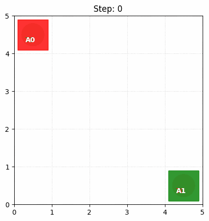

**MAPPO (Multi-Agent PPO)** は、シングルエージェント向けに非常に高い実績を持つ **PPO (Proximal Policy Optimization)** を、マルチエージェント環境（複数のエージェントが協力・競合する環境）に拡張したアルゴリズムです。

現在、マルチエージェント強化学習（MARL）において、最も標準的かつ強力な手法の一つとして知られています。

## MAPPOの基本構造：CTDE

MAPPOは、 **CTDE (Centralized Training, Decentralized Execution)** という枠組みを採用しています。

* **集中学習 (Centralized Training):** 訓練中は、自分以外のエージェントの情報や、環境全体の「グローバルな状態」をすべて使って学習します（主にCriticが担当）。
* **分散実行 (Decentralized Execution):** 実際に動くときは、各エージェントは自分の目の前にある「部分的な観測」だけを見て行動を決定します（Actorが担当）。

## 解決しようとした課題

解決しようとした主な課題は、 **「マルチエージェント環境における学習の不安定性と、集中学習・分散実行（CTDE）の効率的な実現」** です。

具体的には、以下の3つの大きな壁（課題）を突破することを目的としています。

### 1. 非定常性問題（Non-stationarity）

シングルエージェントの強化学習をそのまま複数エージェントに適用すると、「自分が学習している間に、他のエージェントも勝手に動きを変えてしまう」という問題が起きます。
各エージェントから見れば、環境のルールが常に変化しているように見えるため、学習が収束しません。

* **MAPPOの解決策:** **集中Critic（Centralized Critic）**を導入しました。自分だけの情報ではなく、他者の状態や行動を含んだ「グローバルな情報」をもとに報酬の期待値を判断することで、環境の変化を正確に捉えられるようにしました。

### 2. 集中学習と分散実行（CTDE）のジレンマ

訓練中はチーム全体の情報（すべてのドローンの位置や荷物の場所など）が見えていても良いですが、 **実行時（本番）は各ドローンが自分のセンサー情報だけで判断する** 必要があります。

* **MAPPOの解決策:** PPOのアルゴリズム上で、 **「訓練時（Critic）は全体情報を使うが、実行時（Actor）は局所的な観測のみを使う」** という切り分けを高い精度で実現しました。

### 3. データ効率とクレジット割り当てのバランス

エージェントが増えるほど「誰が報酬に貢献したのか」の判断が難しくなり、勾配の分散が大きくなって学習が困難になります。

* **MAPPOの解決策:** 全エージェントでネットワークの **パラメータを共有（Parameter Sharing）** することを標準としました。一人が学んだ知識を全員で共有できるため、学習のサンプル効率（データ効率）が劇的に向上しました。

以前のディスカッションでは、これらを解決するための「Agent IDの付与」や「集中Criticの実装コード」についても詳しくお話ししましたね。もし、これらの中でより深掘りしたい特定のポイントや、実装に関する疑問があれば教えてください。

## 3つの大きな特徴

#### ① 集中Critic (Centralized Critic)

通常、エージェントが増えると「環境が勝手に変わってしまう（非定常性）」という問題が起きます。MAPPOでは、Critic（価値を判断する部分）に全エージェントの情報を見せることで、「今の状況がチーム全体にとってどれくらい良いのか」を正確に評価させ、学習を安定させます。

#### ② パラメータ共有 (Parameter Sharing)

全エージェントが同じ重みのネットワークを共有して学習します。

* **メリット:** 全員の経験を一つのモデルに集約できるため、データ効率が劇的に上がります。
* **区別:** 自分が何番機かを識別するために「Agent ID」を観測に加えて入力します。

#### ③ PPOの安定性を継承

信頼領域（Trust Region）の考え方に基づき、一度の更新でポリシーが劇的に変わりすぎないように制限（クリッピング）をかけます。これにより、マルチエージェント特有の複雑な環境でも、着実に賢くなっていきます。

## なぜ協調学習ができるか

MAPPOがマルチエージェント環境で「協調」を学習できる理由は、主に **「集中Critic（Centralized Critic）」** という仕組みが、チーム全体の状況を俯瞰して評価を下すからです。

具体的に、なぜこの仕組みが協調を生むのか、3つのポイントで解説します。

### 1. 「チーム全体の利益」を評価する審判（集中Critic）

MAPPOでは、実際に行動するエージェント（Actor）とは別に、学習時のみ働く **「審判（Critic）」** がいます。この審判は、全エージェントの位置、全荷物の場所、他者の行動など、 **環境のすべてを見渡すこと（集中学習）** ができます。

* **単独学習の場合:** エージェントAが荷物を拾うと、自分だけの報酬を見て「よし」と思います。しかし、その荷物がエージェントBの目の前にあった場合、Bの効率を下げているかもしれません。
* **MAPPOの協調:** 集中Criticは「Aがそこを拾うより、Bに任せてAは遠くの荷物へ向かったほうが、チーム全体の報酬（配送完了までの時間短縮など）が上がるぞ」と評価します。これにより、エージェントたちは **「自分勝手な行動」ではなく「チームに貢献する行動」** を学習します。

### 2. パラメータ共有による「共通言語」の獲得

MAPPOでは通常、全エージェントが同じネットワーク（パラメータ）を共有します。

* これにより、あるエージェントが「相手を避けると衝突を回避できて報酬が減らない」という経験を積むと、その知識が即座に全エージェントに共有されます。
* 全員が同じ「ルール（知識）」に基づいて動くため、お互いの行動が予測しやすくなり、結果として「阿吽の呼吸」のような協調行動が成立しやすくなります。

### 3. PPO特有の「一歩ずつ、着実な改善」

マルチエージェント環境は、他のエージェントが動くせいで状況が激しく変わるため、非常に不安定です。

* PPO（MAPPOのベース）は、 **「一度にポリシーを変えすぎない（クリッピング）」** という特徴があります。
* 他のエージェントの動きが少し変わっても、パニックにならずに少しずつ自分を適応させていくため、複雑な連携（例えば、一方が道を譲り、もう一方が荷物を運ぶといった順序だった行動）を壊さずに学習を積み上げることができます。

### まとめると

MAPPOが協調できるのは、 **「神の視点（集中Critic）でチーム全体の成功を採点し、その反省を全員で共有（パラメータ共有）しながら、一歩ずつ着実に改善していくから」** だと言えます。

## 実装法

MAPPO（Multi-Agent PPO）をゼロから実装するための手順を、論理的なステップに分けて解説します。MAPPOは「PPOの安定性」と「集中学習（Centralized Training）」を組み合わせるのが肝心です。

### 1. ネットワークアーキテクチャの設計

まずは、エージェントが「共有する脳（Actor）」と、学習時のみ使う「神の視点の脳（Critic）」を定義します。

* **Shared Actor (方策ネットワーク):**  **入力:** 個々の観測（Local Observation） + **Agent ID**。
* **役割:** どのエージェントも同じ重みを使用しますが、Agent ID（例: `[1, 0]` や `[0, 1]`）を混ぜることで、個別の役割を演じ分けさせます。

* **Centralized Critic (価値ネットワーク):**
* **入力:** 全エージェントの観測を結合した「Global State」。
* **役割:** チーム全体の状況を見て、「今の状態がどれくらい良いか」をスコアリングします。

### 2. データ収集（ロールアウト）フェーズ

環境（Env）の中でエージェントを動かし、学習に必要なデータを蓄積します。

1. **行動選択:** 各エージェントの観測をActorに入れ、行動（Actions）と、その行動の発生確率（Log Probs）を取得します。
2. **環境の実行:** `env.step(actions)` を呼び出し、次の観測、報酬、Doneフラグを取得します。
3. **メモリ保存:** ここで「各々の観測」「全員の観測（Global State）」「行動」「確率」「報酬」を1セットとして `MAPPOMemory` に保存します。

### 3. 学習（トレーニング）フェーズ

収集したデータを用いて、PPOのアルゴリズムに従って更新します。

#### ① アドバンテージ（Advantage）の計算

集中Criticを使って、現在の価値（Value）を推定し、実際の報酬と比較して「予想よりどれくらい良かったか」を計算します。

#### ② Actorの更新（PPO Clipping）

「今の行動が良かったなら、その確率を上げる。ただし、一度に変えすぎない」というPPOの基本ルールを適用します。

* **Ratio:**  を計算。
* **Clipped Loss:** Ratioが  の範囲に収まるように制限し、アドバンテージを掛け合わせます。
* **Entropy:** 探索を維持するために、行動の多様性（Entropy）をボーナスとして加えます。

#### ③ Criticの更新

集中Criticが「チーム全体の報酬」を正しく予測できるように、平均二乗誤差（MSE Loss）で更新します。

### 4. 集中Critic特有のテクニック

MAPPOを成功させるために、論文でも推奨されている重要な実装ポイントです。

* **Value Normalization:** Criticが学習する「報酬」のスケールを正規化します。
* **Global Stateの設計:** Criticの入力には、個人の観測をただ並べるだけでなく、ターゲットまでの全エージェントの相対距離など、強力な情報を持たせます。

## 簡単な問題

2台のドローンがあり、お互いに入違って、相手側が初めにいた場所に飛行するという問題をMAPPOを用いて解いてみます。

報酬：
1. エージェントがゴールに近づくとだんだん大きな報酬を与える。
2. お互いがゴールしたときに大きな報酬を与える。
ペナルティ：意味もなくうろうろするとペナルティ。

### 実装コード
以下レポジトリを参考下さい。

https://github.com/Shinichi0713/Reinforce-Learning-Study/tree/main/miulti-agent/src/exe-5

### 実験結果

実際にMAPPOで協調学習したうえで、エージェントを動作させた結果を示します。

__トライアル1__

問題をそのままコードにしただけだと以下のような状態でした。

__トライアル2__

ゴールの近くで停止すると報酬がもらえることから停止するという動作につながってました。
→エージェントが両方ゴールするときの報酬を大きくする + 停止した場合はペナルティを与えるように修正。

最短距離で両エージェントがゴールするようになりました。

## 結果
今回はお互いがあるという意味で強調学習にはなりましたが、MAPPOでなくてもゴール出来ていたと思います。
今度は少し協調学習らしい問題設定を行います。

