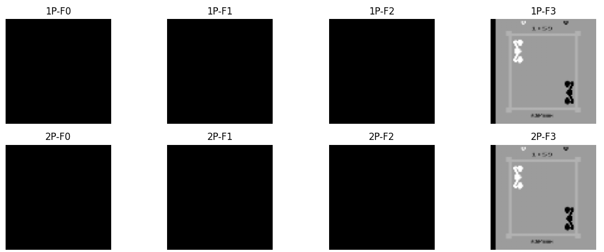

昨日のボクシングゲームをMARLで経験学習するネットワークを構築していきます。

__ここまでの関連記事__  
1. petting-zooの導入(MARL環境の導入)
https://yoshishinnze.hatenablog.com/entry/2026/05/09/043000

2. 解くためのアルゴリズム選定


## 解法のシナリオ
以下の流れに沿って今回のボクシングゲームの解決を行っていきます。

1. データパイプライン構築: ゲームの画像から「集中クリティック用の入力」を作成し、バッファに正しく保存・取り出しができる仕組みを作ります。
2. ネットワーク設計: 210x160の画像を処理するための畳み込み層を設計します。
3. 学習用エージェント設計: 学習を実際に進めるエージェントを構築します。
4. 強化学習してエージェントにデモプレイします。

今回は1. データパイプライン構築を実施していきます。

## データパイプライン構築

ここで行うことは、ゲームの画面を学習用に加工して、エージェントとクリティックモデルが使えるようにすることです。
そしてそのために行うことは、ゲームの画面を2人のエージェントのものとして取り出して、統合することです。

### なぜ統合するのか

物理的な画像は1枚ですが、MAPPOの心臓部である「集中クリティック（Centralized Critic）」を機能させるためには、1つの画面を「2つの異なる役割」として使い分ける必要があります。

なぜ実装上、1枚の画像だけでは足りない（2人分として扱わなければならない）のか、その理由は以下の3点に集約されます。

__1. 「自分」と「相手」を区別するため__

ボクシングの画面には「白いボクサー」と「黒いボクサー」が映っています。

* Actor（1P用）にとっては、自分が「白」で相手が「黒」です。
* Actor（2P用）にとっては、自分が「黒」で相手が「白」です。

ニューラルネットワーク（Actor）は「自分がどちらか」を理解していません。そのため、1Pの学習時には「1Pから見た視点」として画像を処理し、2Pの学習時には「2Pから見た視点」として処理します。これを同時に行うため、データ上は2つの画像（観測）として扱います。

__2. クリティックに「全体像」を理解させるため__

MAPPOの最大の特徴は、クリティックに「すべてのエージェントの情報」を流し込むことです。

もし1枚の画像（4フレームスタック）だけをクリティックに渡すと、それは単一エージェントのPPOと同じになってしまいます。MAPPOでは、「1Pがどう動こうとしているか」と「2Pがどう動こうとしているか」を同時に評価するために、2人分の情報（観測のペア）をガッチャンコして入力します。

__3. 実装上の「チャンネル」の重なり__

具体的にコードに落とし込む際、以下のようなデータの作り方をします。

* **1Pの観測**: 4枚の連続した画像（スタック） = `(4, 84, 84)`
* **2Pの観測**: 4枚の連続した画像（スタック） = `(4, 84, 84)`
* **集中クリティックへの入力**: これらを重ねた **8枚分** の画像 = `(8, 84, 84)`

このように、「1枚の画面から抽出した2つの視点」を重ねて1つの巨大な情報（8チャンネルの画像）に作り変えるステップがあるため、「2人分の画像が必要」という表現になります。

__まとめ：なぜ2人分必要なのか？__

1. **Actor用**: 1Pと2Pがそれぞれ「自分の行動」を決めるために、個別の入力として必要。
2. **Critic用**: 2人の位置関係や意図を「神の視点」で同時に評価するために、2人分を合体させた入力が必要。

もしこれを1人分（1枚の画像）だけで済ませようとすると、それは「マルチエージェント」ではなく「1人で環境を操作している」ことになり、相手の学習による変化（非定常性）に対応できなくなってしまいます。

## 実装
ここからパイプラインの構築を行います。
自作MAPPOを動作させるための「データパイプライン構築」の手順を、実装の流れに沿って整理します。
ボクシングの1画面から、MAPPOの心臓部である「8チャンネルの状態」を作り出す工程は以下の**4つのステップ**で構成されます。


### ステップ1：環境から「辞書形式」の観測を受け取る
まずは環境から観測情報を受け取ることからです。
ボクシングの環境を `ParallelPettingZooEnv` を通した環境では、`env.step()` や `env.reset()` の戻り値は、エージェント名をキーとした辞書になります。

```python
# 環境を1ステップ進める
obs_dict, rewards, terminations, truncations, infos = env.step(actions)

# obs_dictの中身（イメージ）:
# {
#   'first_0': array([4, 84, 84]),  <- 1Pの4フレームスタック画像
#   'second_0': array([4, 84, 84])  <- 2Pの4フレームスタック画像
# }

```

>__ParallelPettingZooEnv__  
>このラッパーは **「PettingZooというマルチエージェント環境を、標準的なGym（Gymnasium）の形式として扱えるように翻訳する」** 役割を担っています。
>主な役割は以下の3点です。
>__1. インターフェースの統一__  
>PettingZooの `parallel_env` は、もともとエージェントごとの辞書形式でデータを返しますが、AIのライブラリ（Ray/RLlibなど）や自作のループで扱う際、標準的なGymのメソッド（`reset`, `step`）と戻り値の形式が微妙に異なる場合があります。
>このラッパーを通すことで、**「どんなマルチエージェント環境でも同じ書き方で動かせる」** 状態にしてくれます。
>__2. 戻り値の「タプル化」の保証__  
>先ほどエラーが出た `obs, info = env.reset()` という形式は、最新のGymnasiumの標準仕様です。
>PettingZoo単体だと古いAPI（`obs` のみ返す）で動くことがありますが、このラッパーを被せることで、強制的に **「観測データ（obs）」と「付随情報（info）」の2つをセットで返す** ように変換してくれます。これが先ほどのエラー（NoneTypeのアンパック失敗）を解決した直接の理由です。
>__3. エージェント情報の管理__  
>このラッパーを適用すると、環境オブジェクトの中に以下の情報が整理されます。
>- `env.possible_agents`: 全エージェントの名前リスト（`['first_0', 'second_0']`）
>- `env.observation_space`: 共通の観測空間の定義
>- `env.action_space`: 共通の行動空間の定義
>これがあるおかげで、自作MAPPOのネットワークを作る際に「入力サイズは何にすべきか？」を自動的に取得できるようになります。
>自作MAPPOを組む際、このラッパーを通した環境を使うことで、データパイプラインは以下のようにスッキリします。
>- **Input**: ラッパーがAtariの複雑な内部状態を整理し、`(4, 84, 84)` の綺麗な画像スタックにして渡してくれる。
>- **Output**: こちらが送る `actions = {'first_0': 1, 'second_0': 0}` という辞書を、正しくゲーム画面（Atari）に反映してくれる。
>PettingZooが生の「ボクシングゲーム機」だとしたら、`ParallelPettingZooEnv` は **「パソコンで操作しやすくするための専用コントローラー変換アダプター」** です。

### ステップ2：NumPy配列をPyTorchテンソルに変換・正規化

Atariの画像データは通常 `0-255` の整数（uint8）です。これを計算可能な浮動小数点に変換し、`0.0-1.0` に正規化します。
また、PyTorchでは (チャンネル, 高さ, 幅) の順序にする必要があります。
データ取得の後にテンソル並べ替え→正規化を行います。

```python
import torch

# 1Pと2Pの画像をそれぞれテンソル化
# 形状: [4, 84, 84]
t1 = torch.as_tensor(obs_dict['first_0'], dtype=torch.float32, device=device)
t2 = torch.as_tensor(obs_dict['second_0'], dtype=torch.float32, device=device)

# 2. 軸の入れ替え [H, W, C] -> [C, H, W] に変換
# これにより PyTorch の Conv2d が扱える形状 [4, 84, 84] になる
obs_1p = t1.permute(2, 0, 1) / 255.0
obs_2p = t2.permute(2, 0, 1) / 255.0

```

### ステップ3：チャンネル方向に「結合（Concatenate）」する

ここが最も重要なステップです。2人分の4枚スタック画像を「重ねる」ことで、**8チャンネルの1つのデータ**にします。
PyTorchの `torch.cat` を使い、`dim=0`（チャンネル次元）で結合します。

```python
# 2つの画像を重ねて「統合状態（Joint State）」を作る
# [4, 84, 84] + [4, 84, 84] -> [8, 84, 84]
joint_state = torch.cat([obs_1p, obs_2p], dim=0)

# バッチ処理のために先頭に次元を追加 (1, 8, 84, 84)
joint_state_input = joint_state.unsqueeze(0)

```

### ステップ4：集中クリティックモデルへ入力する

作成した8チャンネルのデータを、集中クリティックのCNNに入力します。CNNの最初の層（`Conv2d`）の `in_channels` は **8** で設計しておく必要があります。

```python
# モデルの定義（抜粋）
# self.conv1 = nn.Conv2d(in_channels=8, out_channels=32, kernel_size=8, stride=4)

# 予測実行
state_value = critic_model(joint_state_input)
# 出力: 1Pと2Pの状況を俯瞰した上での「現在の盤面の価値（スコア予測）」

```

__実装上の注意点：1P用と2P用のクリティック__

MAPPOにおいて、クリティックは「全員の情報をみる」ものですが、**出力（価値）はエージェントごと**に計算します。

1. **共通入力**: 常に `joint_state` (8ch) を入力。
2. **個別出力**:
* クリティックAの出力：1Pにとっての価値 $V_1$
* クリティックBの出力：2Pにとっての価値 $V_2$
（※1つのネットワークで出力を2つに分岐させるのが効率的です）

### まとめ：データフローのコード

これらをまとめた、1ステップごとの統合処理の全容です。

```python
def get_critic_input(obs_dict, device):
    # 1. 抽出
    o1 = obs_dict['first_0']
    o2 = obs_dict['second_0']
    
    # 2. テンソル化 & 正規化
    t1 = torch.as_tensor(o1, dtype=torch.float32, device=device) / 255.0
    t2 = torch.as_tensor(o2, dtype=torch.float32, device=device) / 255.0
    
    # 3. 結合 (4ch + 4ch = 8ch)
    joint_s = torch.cat([t1, t2], dim=0)
    
    return joint_s # これをバッファに保存し、Criticに渡す

```

取得したテンソルデータが正しいかを可視化してみました。

ボクシング環境が開始（reset）された直後の時点では、まだ「過去の映像」が存在しません。
- Frame 4 (最新): 現在の画面が映ります。
- Frame 1〜3 (過去): 過去の履歴がないため、デフォルト値である「0（真っ黒）」で埋められます。

ということで以下のように絵が得られました。




## 総括

今回は環境から得られる画像情報をニューラルネットワーク用に加工するデータパイプラインの構築を行いました。

ボクシングゲームのMAPPOにおけるCriticモデルへのデータ生成の勘所は、**「1枚の画面を2人の視点に分解し、それらを1つの8チャンネル状態に統合してCriticに渡す」** という点に集約されます。

### 1. なぜ2人分の観測が必要か
- Actorは「自分から見た観測」だけを使って行動を決めるので、1P用・2P用で別々の観測（4フレームスタック）が必要です。
- Criticは「全エージェントの状況を同時に見て価値を評価する」ため、1P・2Pの観測を**両方**まとめた入力が必要です。
- 1枚の画面だけでは、相手の行動や位置関係を考慮した「マルチエージェントとしての評価」ができず、非定常な相手の変化に追従できません。

### 2. 8チャンネル状態の作り方（データパイプラインの要）
1. **環境から辞書形式の観測を取得**  
   - `obs_dict['first_0']`（1P用）と `obs_dict['second_0']`（2P用）の4フレームスタック画像 `(4,84,84)` を取得します。
2. **PyTorchテンソル化＋正規化**  
   - `torch.as_tensor` で `float32` に変換し、`0-255` → `0.0-1.0` に正規化します。
   - `permute` で `(H,W,C)` → `(C,H,W)` に並べ替え、CNNが扱える形状 `(4,84,84)` にします。
3. **チャンネル方向で結合**  
   - `torch.cat([obs_1p, obs_2p], dim=0)` で `(4,84,84)` + `(4,84,84)` → `(8,84,84)` の統合状態（joint state）を作ります。
4. **Criticへの入力**  
   - CriticのCNNの `in_channels=8` で設計し、この8チャンネル状態を入力します。

### 3. 実装上の注意点
- Criticは**入力は共通（8ch）**ですが、**出力はエージェントごと**（1P用の価値V₁、2P用の価値V₂）に分けて計算します。
- リセット直後は過去フレームがないため、Frame 1–3 は0（真っ黒）で埋められますが、スタックが溜まれば自然に過去フレームも反映されます。
- `ParallelPettingZooEnv` ラッパーを通すことで、PettingZooの辞書形式をGym風に統一し、1P/2Pの観測を安定して取得できます。

