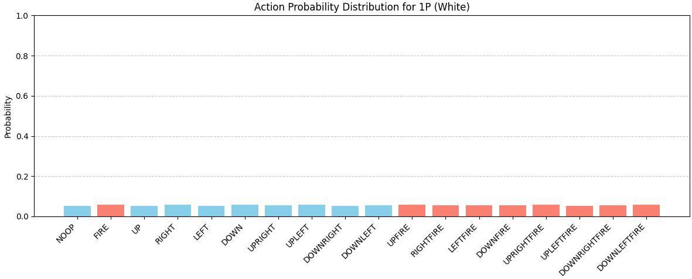

連日Atariのボクシングを強化学習エージェントで勝利するためのアルゴリズム構築を行っています。

__ここまでの関連記事__  
1. petting-zooの導入(MARL環境の導入)
https://yoshishinnze.hatenablog.com/entry/2026/05/09/043000

2. 解くためのアルゴリズム選定

3. データパイプライン構築


## 解法のシナリオ
以下の流れに沿って今回のボクシングゲームの解決を行っていきます。

1. データパイプライン構築: ゲームの画像から「集中クリティック用の入力」を作成し、バッファに正しく保存・取り出しができる仕組みを作ります。
2. ネットワーク設計: 210x160の画像を処理するための畳み込み層を設計します。
3. 学習用エージェント設計: 学習を実際に進めるエージェントを構築します。
4. 強化学習してエージェントにデモプレイします。

今回は2. ネットワーク設計構築を実施していきます。

## ネットワーク設計

データパイプラインが正常に動作していることが確認できたので、次は**強化学習の本体であるモデル（Network）** と**リプレイバッファ（Buffer）** の設計に入ります。
[MAPPO](https://yoshishinnze.hatenablog.com/entry/2026/01/10/153824)をボクシング環境で成功させるために、設計段階で考慮すべきクリティカルなポイントをリストアップしました。

### 1. ネットワーク設計（Model Architecture）

分散実行・集中学習（[CTDE](https://yoshishinnze.hatenablog.com/entry/2025/11/18/053506)）を支えるための、ActorとCriticの構造上の工夫です。

* **重み共有（Parameter Sharing）の採用**
1Pと2Pは、色（白と黒）や立ち位置が違うだけで、ボクシングとしての基本動作（パンチ、移動、回避）のルールは同じです。1Pと2Pで同じActorネットワークを共有することで、学習効率を2倍にし、片方が見つけた「良い動き」を即座にもう片方が模倣できるようにします。
* **入力情報の差異（Actor vs Critic）**
* **Actor**: 自分の観測（4ch）のみを入力。自分の動きに集中させます。
* **Critic**: 統合状態（8ch）を入力。相手の動きや、自分と相手の距離感（間合い）を価値判断の基準に含めます。


* **マルチヘッド出力の検討**
1つのバックボーン（CNN）から、1P用の価値出力（$V_1$）と2P用の価値出力（$V_2$）を別々のブランチで出す設計にします。これにより、「相手にパンチが当たった＝自分にとってプラス、相手にとってマイナス」という対立する評価を一つのモデルで同時に学習できます。

### 2. リプレイバッファ設計（Replay Buffer）

PPOは「オンポリシー」アルゴリズムであるため、データの保持方法とサンプリング方法に独自の配慮が必要です。

* **ペアデータの完全同期**
1Pの行動、2Pの行動、そしてその時の「統合状態（8ch）」が1つのインデックスで紐付いている必要があります。ここがズレると、集中学習の理論的根拠（CTDE）が崩壊します。
* **GAE（一般化アドバンテージ推定）の計算準備**
バッファ内に「エピソードが途切れたかどうか（Doneフラグ）」と「その時の価値予測値（Value）」を保持し、ミニバッチを作る前に各ステップのアドバンテージを算出する処理を組み込みます。
* **シャッフルとミニバッチの整合性**
更新時にはデータをシャッフルしますが、マルチエージェントの場合、「1Pのデータだけシャッフルして、2Pはそのまま」にすると相関が壊れます。常に**1P・2P・統合状態をセットにしたままシャッフル**する仕組みが必要です。

### 3. 学習の安定化・戦略（MARL Strategy）

ボクシングという対戦ゲーム特有の性質への対策です。

* **報酬の正規化（Reward Normalization）**
Atariのボクシングは1打ごとに報酬が入りますが、学習初期の不安定な報酬の振れ幅を抑えるため、バッファ内で報酬のスケールを調整する処理を検討します。
* **セルフプレイ（Self-Play）の管理**
「今の自分」とだけ戦い続けると、特定のハメ技に特化してしまい、汎用的な強さが身につきません。バッファにデータを溜める際、対戦相手として「過去のモデル」を一定確率で呼び出すロジックを設計に含めます。
* **エントロピー・ボーナスによる探索の促進**
ボクシングは「待ち」が強い戦略になりがちです。Actorの損失関数にエントロピー項を追加し、積極的に様々なパンチを試す（探索する）ように仕向けます。

## モデルの実装

重み共有（Parameter Sharing）と集中クリティック（Centralized Critic）を統合した、MAPPO向けのネットワーク設計を実装します。

ボクシング環境の特性に合わせ、「1つのモデルで1P・2Pの両方を制御し、かつ神の視点での評価も同時に行う」効率的なアーキテクチャです。

### MAPPO Actor-Critic モデルの実装

このモデルは、Actor（行動決定）とCritic（盤面評価）のバックボーンを共通化しつつ、入力チャンネル数と出力ヘッドを切り分ける設計にしています。

```python
import torch
import torch.nn as nn
import torch.nn.functional as F

class MAPPOAgent(nn.Module):
    def __init__(self, action_space_n=18):
        super().__init__()
        
        # --- 共通のCNNバックボーン (特徴抽出器) ---
        # ActorもCriticも同じ構造のCNNを使用しますが、重みは別々に管理します
        def make_cnn(in_channels):
            return nn.Sequential(
                nn.Conv2d(in_channels, 32, kernel_size=8, stride=4),
                nn.ReLU(),
                nn.Conv2d(32, 64, kernel_size=4, stride=2),
                nn.ReLU(),
                nn.Conv2d(64, 64, kernel_size=3, stride=1),
                nn.ReLU(),
                nn.Flatten(),
                nn.Linear(64 * 7 * 7, 512),
                nn.ReLU()
            )

        # Actor: 自分の4フレーム分を見る (in=4)
        self.actor_encoder = make_cnn(in_channels=4)
        self.action_head = nn.Linear(512, action_space_n)

        # Centralized Critic: 自分と相手の計8フレームを見る (in=8)
        self.critic_encoder = make_cnn(in_channels=8)
        # 1P用と2P用の価値をそれぞれ出力するヘッド
        self.value_head_1p = nn.Linear(512, 1)
        self.value_head_2p = nn.Linear(512, 1)

    def get_action(self, obs, action=None):
        """
        Actor: 行動と対数確率、エントロピーを返す
        obs: (batch, 4, 84, 84)
        """
        features = self.actor_encoder(obs)
        logits = self.action_head(features)
        probs = torch.distributions.Categorical(logits=logits)
        
        if action is None:
            action = probs.sample()
        
        return action, probs.log_prob(action), probs.entropy()

    def get_value(self, joint_obs):
        """
        Centralized Critic: 神の視点での評価値を返す
        joint_obs: (batch, 8, 84, 84)
        """
        features = self.critic_encoder(joint_obs)
        v1 = self.value_head_1p(features)
        v2 = self.value_head_2p(features)
        return v1, v2

```

### この設計のポイント

__1. パラメータ共有（Actor）__

`self.actor_encoder` は1つだけ定義しています。

* 1Pの行動を決めるときは `obs_1p` を入力。
* 2Pの行動を決めるときは `obs_2p` を入力。
同じ重みを使うことで、例えば「相手との距離が詰まったらパンチを打つ」という知識を、1Pと2Pで別々に学習する必要がなくなります。

__2. 集中クリティック（Critic）__

`self.critic_encoder` は8チャンネル（1Pの4枚 + 2Pの4枚）を入力として受け取ります。
これにより、「自分がパンチを打とうとしている瞬間に、相手が避けているか」という相関関係を1つの特徴マップとして抽出できます。

__3. 価値ヘッドの分離__

ボクシングはゼロサムゲームに近い性質を持つため、「1Pにとって良い状況」は「2Pにとって悪い状況」であることが多いです。

* `value_head_1p`: 1Pの報酬に基づいた価値予測。
* `value_head_2p`: 2Pの報酬に基づいた価値予測。
これらを分けることで、エージェントごとの微妙な利害の差を正確にアドバンテージとして抽出できます。

### 前回コードとの結合
動作確認してみます。
ここまで作ったネットワークで行動確率を出力し、可視化してみます。

```python
import matplotlib.pyplot as plt
import numpy as np

device = torch.device("cuda" if torch.cuda.is_available() else "cpu")
agent = MAPPOAgent().to(device)

# 1. データの準備 (前回の preprocess_joint_obs を使用)
o1, o2, joint_s = preprocess_joint_obs(obs_dict, device)

# 2. Actorによる行動決定 (重みを共有して2人分計算)
a1, log_p1, _ = agent.get_action(o1.unsqueeze(0))
a2, log_p2, _ = agent.get_action(o2.unsqueeze(0))

# ボクシングの18アクション（公式ドキュメント準拠）
ACTION_MEANING = [
    "NOOP", "FIRE", "UP", "RIGHT", "LEFT", "DOWN", 
    "UPRIGHT", "UPLEFT", "DOWNRIGHT", "DOWNLEFT",
    "UPFIRE", "RIGHTFIRE", "LEFTFIRE", "DOWNFIRE",
    "UPRIGHTFIRE", "UPLEFTFIRE", "DOWNRIGHTFIRE", "DOWNLEFTFIRE"
]

def visualize_action_probs(agent, obs, agent_name="1P"):
    """
    特定の観測に対するエージェントの行動確率をグラフ化する
    """
    agent.eval()
    with torch.no_grad():
        # Actorネットワークを通してロジットを取得
        features = agent.actor_encoder(obs.unsqueeze(0))
        logits = agent.action_head(features)
        
        # ソフトマックス関数で確率(0.0~1.0)に変換
        probs = F.softmax(logits, dim=-1).cpu().numpy()[0]

    # グラフ描画
    plt.figure(figsize=(12, 5))
    colors = ['skyblue' if "FIRE" not in name else 'salmon' for name in ACTION_MEANING]
    plt.bar(ACTION_MEANING, probs, color=colors)
    plt.xticks(rotation=45, ha='right')
    plt.ylabel("Probability")
    plt.title(f"Action Probability Distribution for {agent_name}")
    plt.ylim(0, 1.0) # 確率なので最大は1.0
    plt.grid(axis='y', linestyle='--', alpha=0.7)
    plt.tight_layout()
    plt.show()

# --- 実行例 ---
o1, o2, _ = preprocess_joint_obs(obs_dict)
visualize_action_probs(agent, o1, agent_name="1P (White)")
```

環境から得られた情報をネットワークより得られた get_action の内部で計算されている「18種類のアクションの確率（Logits）」を可視化しました。
未だ学習していないので、行動は横一直線っぽいですが。



※実際のAI開発でもステップバイステップで上記のように動作チェックしながら進めていきます。

## マルチエージェント・リプレイバッファの実装

ボクシング環境でのMAPPO（Multi-Agent PPO）を支える、「マルチエージェント・リプレイバッファ」を実装します。

このバッファの設計で最も重要なのは、「1Pと2Pのデータ、そして共通の統合状態を、インデックスがズレないように並列で管理すること」です。

### マルチエージェント・リプレイバッファの実装

学習に必要なすべての情報（観測、行動、報酬、価値、対数確率、終了フラグ）を一括して管理し、PPOの更新に必要なミニバッチを生成します。

```python
import torch
import numpy as np

class MAPPORolloutBuffer:
    def __init__(self, buffer_size, obs_shape, joint_shape, device="cpu"):
        self.device = device
        self.buffer_size = buffer_size

        # 各エージェント(2人分)のデータを保持するテンソル
        # obs: (buffer_size, 2, 4, 84, 84)
        self.obs = torch.zeros((buffer_size, 2, *obs_shape), device=device)
        # joint_states: (buffer_size, 8, 84, 84) -> 集中クリティック用
        self.joint_states = torch.zeros((buffer_size, *joint_shape), device=device)
        
        self.actions = torch.zeros((buffer_size, 2), device=device)
        self.log_probs = torch.zeros((buffer_size, 2), device=device)
        self.rewards = torch.zeros((buffer_size, 2), device=device)
        self.values = torch.zeros((buffer_size, 2), device=device)
        self.dones = torch.zeros((buffer_size, 2), device=device)
        
        self.ptr = 0

    def insert(self, obs_1p, obs_2p, joint_state, actions, log_probs, rewards, values, dones):
        """1ステップ分のデータを格納"""
        self.obs[self.ptr, 0] = obs_1p
        self.obs[self.ptr, 1] = obs_2p
        self.joint_states[self.ptr] = joint_state
        
        # actions, log_probs 等は [1Pの値, 2Pの値] のリストや配列を想定
        self.actions[self.ptr] = torch.tensor(actions, device=self.device)
        self.log_probs[self.ptr] = torch.tensor(log_probs, device=self.device)
        self.rewards[self.ptr] = torch.tensor(rewards, device=self.device)
        self.values[self.ptr] = torch.tensor(values, device=self.device)
        self.dones[self.ptr] = torch.tensor(dones, device=self.device)
        
        self.ptr = (self.ptr + 1) % self.buffer_size

    def get_batches(self, batch_size):
        """学習用にデータをシャッフルしてバッチを生成するイテレータ"""
        indices = np.arange(self.buffer_size)
        np.random.shuffle(indices)
        
        for start in range(0, self.buffer_size, batch_size):
            end = start + batch_size
            batch_idx = indices[start:end]
            
            # 各データのバッチを辞書で返す
            yield {
                "obs": self.obs[batch_idx],
                "joint_states": self.joint_states[batch_idx],
                "actions": self.actions[batch_idx],
                "log_probs": self.log_probs[batch_idx],
                "rewards": self.rewards[batch_idx],
                "values": self.values[batch_idx],
                "dones": self.dones[batch_idx]
            }

    def clear(self):
        """更新後にバッファをリセット"""
        self.ptr = 0

```

### この実装の工夫点

* **次元の管理**: `self.obs` の形状を `(buffer_size, 2, 4, 84, 84)` としています。`2` という次元があることで、1Pと2Pの視覚情報をひとまとめに扱いつつ、インデックス `0` と `1` で明確に分離できます。
* **集中学習への対応**: `joint_states` を独立して保持しています。これにより、Criticの学習時に「あの瞬間、相手はどこにいたか」を8チャンネルの画像として即座に引き出せます。
* **シャッフルの整合性**: `np.random.shuffle(indices)` を使うことで、1Pの行動と2Pの行動、そしてその結果の報酬がバラバラにならないよう、**「時間軸上の1セット」を維持したまま**シャッフルされます。


### 実装後のデータ構造イメージ

バッファ内では、以下のような「1行」が `buffer_size` 分積み重なっているイメージです。

| インデックス | Obs (2x4ch) | Joint State (8ch) | Actions (2) | Rewards (2) | Values (2) |
| --- | --- | --- | --- | --- | --- |
| `t` | [1P画像, 2P画像] | [1P+2P統合画像] | [Punch, Move] | [+1, -1] | [0.5, -0.4] |
| `t+1` | ... | ... | ... | ... | ... |


## 総括

ボクシングゲーム用MAPPOのネットワーク・バッファ設計の勘所は、**「Actorは自分の視点だけ、Criticは全体を見る」「1P/2Pを同じ重みで動かす」「バッファでは1P・2P・統合状態をセットで管理する」** の3点に集約されます。

### 1. ネットワーク設計の勘所
- **Actor（行動決定）**
  - 入力：自分の観測のみ（4フレームスタック `(4,84,84)`）。
  - 役割：自分の行動（パンチ・移動など）を決める。
  - 重み共有：1Pと2Pで同じ `actor_encoder` を使い、ボクシングの基本動作（距離感・パンチタイミング）を共有学習させる。

- **Critic（集中評価）**
  - 入力：1P＋2Pの統合状態（8フレームスタック `(8,84,84)`）。
  - 役割：神の視点で「1Pと2Pの位置関係・意図」を同時に評価。
  - マルチヘッド出力：1つのCNNバックボーンから、1P用価値 `V₁` と2P用価値 `V₂` を別々のヘッドで出す。ゼロサムに近いボクシングの対立評価を正しく扱うため。

- **設計のコア**
  - Actorは「自分視点」、Criticは「全体視点」というCTDE（分散実行・集中学習）の原則を画像チャンネル数で表現。
  - CNNバックボーンは共通構造だが、Actor/Criticで重みは分離し、入力チャンネル（4ch vs 8ch）と出力ヘッド（行動 vs 価値）で役割を切り分ける。

### 2. リプレイバッファ設計の勘所
- **ペアデータの完全同期**
  - 1Pの観測、2Pの観測、統合状態（joint state）、行動、報酬、価値、終了フラグを「1インデックス＝1ステップ」で紐付ける。
  - `obs` を `(buffer_size, 2, 4,84,84)` とし、`0` が1P、`1` が2Pとしてまとめて管理。

- **シャッフル時の整合性**
  - ミニバッチ生成時はインデックスでシャッフルし、1P・2P・統合状態がバラバラにならないようにする。
  - PPOのオンポリシー性を保ちつつ、マルチエージェントの相関（誰が何をした結果どうなったか）を壊さない。

- **Critic学習への対応**
  - `joint_states` を独立して保持し、Critic更新時に「その瞬間の全体像（8ch）」を即座に引き出せるようにする。
  - GAE計算や報酬正規化、セルフプレイ管理など、MARL特有の戦略を後から組み込みやすい構造にしておく。

