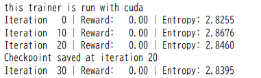

連日Atariのボクシングを強化学習エージェントで勝利するためのアルゴリズム構築を行っています。

__ここまでの関連記事__

1. petting-zooの導入(MARL環境の導入)

https://yoshishinnze.hatenablog.com/entry/2026/05/09/043000

2. 解くためのアルゴリズム選定
3. データパイプライン構築

## 解法のシナリオ

以下の流れに沿って今回のボクシングゲームの解決を行っていきます。

1. データパイプライン構築: ゲームの画像から「集中クリティック用の入力」を作成し、バッファに正しく保存・取り出しができる仕組みを作ります。
2. ネットワーク設計: 210x160の画像を処理するための畳み込み層を設計します。
3. 学習用エージェント設計: 学習を実際に進めるエージェントを構築します。
4. 強化学習してエージェントにデモプレイします。

今回は4. 強化学習してエージェントにデモプレイを実施していきます。

## 学習中の確認点
強化学習は通常の教師あり学習に比べると学習が不安定と言えます。
このため、学習の度に状態監視を行いうまくいっていない場合、原因分析を行うことが重要と思われます。
強化学習、特にマルチエージェント（MAPPO）でのボクシング攻略において、学習が「順調か」「停滞しているか」「崩壊しているか」を判断するための重要な指標を整理しました。
これらを出力する、あるいは単純な `matplotlib` でグラフ化して確認することをお勧めします。

### 1. 報酬（Reward / Score）

最も直感的な指標ですが、ボクシングのような対戦型では少し工夫が必要です。

* **エピソードごとの合計報酬**: 1Pと2Pそれぞれのスコアを確認します。
* **勝率・得点差**: 1Pと2Pが同じネットワークを共有している場合、互いに高め合うため得点差は小さくなる傾向がありますが、ランダムな動きの相手（初期状態）に対してどれだけ差を広げられるかが重要です。
* **エピソードの長さ**: ボクシングはKOかタイムアップで終わります。学習が進むと、効率的にKOを奪ってエピソードが短くなるか、逆に守備が上手くなって長期戦になるかの変化が現れます。

### 2. 損失関数（Loss）

モデルが正しく数学的に最適化されているかを確認します。

* **Policy Loss (Actor Loss)**:
* 緩やかに減少、または一定の範囲で振動するのが理想です。
* 急激なスパイク（跳ね上がり）は、学習率が高すぎるか、 Clipping が機能していない予兆です。


* **Value Loss (Critic Loss)**:
* **最も重要です。** 盤面の評価が正確になれば減少します。
* これが高いままだと、エージェントは「自分の行動が良いのか悪いのか」を正しく判断できていません。


### 3. ポリシーの性質（Policy Stats）

AIの「心の状態」を読み解く指標です。

* **エントロピー (Entropy)**:
* **探索の度合い**を示します。学習が進むにつれて徐々に下がっていく（行動が洗練され、迷いがなくなる）のが正常です。
* 下がりきって「0」に張り付くと、新しい戦略を試さなくなる「早期収束」の状態です。

>__エントロピー__  
>強化学習における**エントロピー**とは、一言で言えば「エージェントの迷いや、行動の多様さ」を表す指標です。
>__1. 直感的な意味__  
>- **エントロピーが高い**: エージェントが「どの行動がベストか分からない」状態で、いろいろな行動をランダムに試そうとします（**探索モード**）。
>- **エントロピーが低い**: エージェントが「この状況ではこの行動が絶対正解だ」と確信している状態で、特定の行動に固執します（**活用モード**）。
>__2. なぜ強化学習で重要なのか__  
>学習が進むにつれてエージェントは賢くなりますが、あまりに早く「これが正解だ」と決めつけると、もっと良い戦略（例：ボクシングでの強力なコンボなど）を見つけるチャンスを逃してしまいます。
>これを防ぐために、損失関数にエントロピー項を加え、**「ある程度は迷い（多様性）を残しなさい」**と命令します。これを**エントロピー・ボーナス**と呼びます。
>__3. モニタリングのポイント__
>- **正常な推移**: 学習開始時は高く（デタラメに動く）、学習が進むにつれて緩やかに下がっていくのが理想的です。
>- **異常な推移**:
>- **急激にゼロになる**: 特定の動き（例：ずっと左に逃げるだけ）に固執して、学習が「詰まった」状態です。
>- **ずっと高いまま**: 学習が全く進んでおらず、報酬と行動の関係が見出せていない状態です。


* **KL散度 (KL Divergence)**:
* 更新前後のポリシーの差です。これが大きすぎると、一回の更新で動きが激変しすぎて学習が壊れます（PPOのClippingがこれを防ぎます）。


### 4. 価値予測の精度（Value Estimates）

* **平均価値（Mean Value）**:
* クリティックが予測している期待報酬です。実際の獲得報酬の推移と連動しているか確認します。


* **説明分散（Explained Variance）**:
* 実際の報酬をどれだけ価値関数で説明できているかを示す指標です。1.0に近いほど完璧で、0以下は予測がランダムより悪いことを意味します。


### モニタリングの優先順位（トラブルシューティング）

| 現象 | 確認すべき指標 | 対策 |
| --- | --- | --- |
| **動きが固まる** | エントロピー | `ent_coef` を上げて探索を促す |
| **Lossが爆発する** | KL散度 / 勾配のノルム | 学習率（LR）を下げる |
| **スコアが上がらない** | Value Loss | クリティックのネットワークを深くするか、学習時間を増やす |

## 学習コードへの反映
今回は例えば報酬とエントロピーを監視対象とします。
この場合変更するのは `MAPPOAtariTrainer` と 学習コード です。

出力する報酬については、1エピソードが終わるたびにスコアが確定するため、学習ステップ（イテレーション）ごとの「平均スコア」として算出するのが一般的です。


### 修正された `MAPPOAtariTrainer` クラス

`collect_rollouts` でエピソード報酬をカウントし、`train_step` でエントロピーを返すように変更しました。

```python
class MAPPOAtariTrainer:
    def __init__(self, env, agent, buffer_size=2048, batch_size=64, lr=3e-4, gamma=0.99, gae_lambda=0.95, ppo_epochs=10):
        # ... (既存の初期化コード) ...
        self.stats = {"reward_history": [], "entropy_history": []}

    def collect_rollouts(self):
        """環境を動かしてデータを収集し、報酬を記録する"""
        self.buffer.clear()
        obs_dict, _ = self.env.reset()
        
        episode_rewards = []
        current_ep_reward = {'first_0': 0, 'second_0': 0}

        for _ in range(self.buffer.buffer_size):
            o1, o2, joint_s = preprocess_joint_obs(obs_dict, self.device)
            
            with torch.no_grad():
                a1, logp1, _ = self.agent.get_action(o1.unsqueeze(0))
                a2, logp2, _ = self.agent.get_action(o2.unsqueeze(0))
                v1, v2 = self.agent.get_value(joint_s.unsqueeze(0))
            
            actions = {'first_0': a1.item(), 'second_0': a2.item()}
            next_obs_dict, rewards, terms, truncs, infos = self.env.step(actions)
            
            # 報酬の記録
            current_ep_reward['first_0'] += rewards['first_0']
            current_ep_reward['second_0'] += rewards['second_0']

            dones = [terms['first_0'] or truncs['first_0'], terms['second_0'] or truncs['second_0']]
            self.buffer.insert(
                o1, o2, joint_s, [a1.item(), a2.item()], [logp1.item(), logp2.item()],
                [rewards['first_0'], rewards['second_0']], [v1.item(), v2.item()], dones
            )
            
            obs_dict = next_obs_dict
            if any(dones):
                # エピソード終了時に報酬を保存してリセット
                episode_rewards.append(current_ep_reward['first_0']) # 1P側のスコアを代表値とする
                current_ep_reward = {'first_0': 0, 'second_0': 0}
                obs_dict, _ = self.env.reset()

        # 平均報酬を統計に追加
        avg_reward = np.mean(episode_rewards) if episode_rewards else 0
        self.stats["reward_history"].append(avg_reward)

        # GAE計算 (既存通り)
        _, _, last_joint_s = preprocess_joint_obs(obs_dict, self.device)
        with torch.no_grad():
            last_v1, last_v2 = self.agent.get_value(last_joint_s.unsqueeze(0))
        self.buffer.compute_returns_and_advantages(
            torch.tensor([last_v1.item(), last_v2.item()], device=self.device),
            self.gamma, self.gae_lambda
        )
        return avg_reward

    def train_step(self, clip_param=0.2, ent_coef=0.01, vf_coef=0.5):
        """学習を行い、平均エントロピーを返す"""
        entropies = []
        
        for _ in range(self.ppo_epochs):
            for batch in self.buffer.get_batches(self.batch_size):
                obs = batch['obs'].view(-1, 4, 84, 84)
                actions = batch['actions'].view(-1)
                old_log_probs = batch['log_probs'].view(-1)
                advantages = batch['advantages'].view(-1)
                returns = batch['returns'].view(-1)

                _, new_log_probs, dist_entropy = self.agent.get_action(obs, actions)
                entropies.append(dist_entropy.mean().item()) # エントロピーを記録

                # --- Loss計算 (既存通り) ---
                ratio = torch.exp(new_log_probs - old_log_probs)
                surr1 = ratio * advantages
                surr2 = torch.clamp(ratio, 1.0 - clip_param, 1.0 + clip_param) * advantages
                actor_loss = -torch.min(surr1, surr2).mean()

                v1_pred, v2_pred = self.agent.get_value(batch['joint_states'])
                v_preds = torch.cat([v1_pred, v2_pred], dim=0).squeeze()
                critic_loss = F.mse_loss(v_preds, returns)

                loss = actor_loss + vf_coef * critic_loss - ent_coef * dist_entropy.mean()
                
                self.optimizer.zero_grad()
                loss.backward()
                nn.utils.clip_grad_norm_(self.agent.parameters(), 0.5)
                self.optimizer.step()
        
        avg_entropy = np.mean(entropies)
        self.stats["entropy_history"].append(avg_entropy)
        return avg_entropy

```

### 実行とモニタリング

`train` 関数内でこれらを受け取り、表示するようにします。

```python
def train():
    env = get_env()
    agent = MAPPOAgent(action_space_n=18)
    trainer = MAPPOAtariTrainer(env, agent)

    for iteration in range(101):
        # 1. データ収集時に平均報酬を取得
        avg_reward = trainer.collect_rollouts()
        
        # 2. 学習時に平均エントロピーを取得
        avg_entropy = trainer.train_step()

        if iteration % 10 == 0:
            print(f"Iteration {iteration:3d} | Reward: {avg_reward:6.2f} | Entropy: {avg_entropy:.4f}")

        if iteration > 0 and iteration % 20 == 0:
            trainer.save_checkpoint(iteration)

```

### 出力の見方

* **Reward（報酬）**:
ボクシング環境では、相手にパンチを当てると $+1$、食らうと $-1$ です。最初は $0$ 前後（あるいはマイナス）からスタートし、学習が進むにつれてプラスに転じていけば成功です。
* **Entropy（エントロピー）**:
最初はアクションが18種類あるため、$\ln(18) \approx 2.89$ に近い値から始まります。学習が進むにつれて「無駄な動き」が削ぎ落とされ、徐々に数値が下がっていく（例：$1.0 \sim 1.5$ 程度まで）のを確認してください。

もしエントロピーが最初から極端に低い場合は、特定の行動に固執してしまっている可能性があるため、`ent_coef` を少し大きくするなどの調整を検討してみてください。

### 学習の結果
初回学習時に出力したrewardを確認したところ、まったく報酬が出ていませんでした。




Atari 2600の「Boxing」におけるアクション（0〜17）は、基本的に「8方向の移動」と「パンチ（攻撃ボタン）」の組み合わせで構成されています。

PettingZooやGymのAtari環境において、アクション番号は通常以下の順序で定義されています。

### Boxingのアクション対応表

| Index | 行動の内容 | ボタン同時押し |
| --- | --- | --- |
| **0** | **NOOP** (何もしない) | なし |
| **1** | **FIRE** (その場でパンチ) | ボタンのみ |
| **2** | **UP** (上に移動) | なし |
| **3** | **RIGHT** (右に移動) | なし |
| **4** | **LEFT** (左に移動) | なし |
| **5** | **DOWN** (下に移動) | なし |
| **6** | **UPRIGHT** (右上に移動) | なし |
| **7** | **UPLEFT** (左上に移動) | なし |
| **8** | **DOWNRIGHT** (右下に移動) | なし |
| **9** | **DOWNLEFT** (左下に移動) | なし |
| **10** | **UPFIRE** (上に移動しながらパンチ) | 上 + ボタン |
| **11** | **RIGHTFIRE** (右に移動しながらパンチ) | 右 + ボタン |
| **12** | **LEFTFIRE** (左に移動しながらパンチ) | 左 + ボタン |
| **13** | **DOWNFIRE** (下に移動しながらパンチ) | 下 + ボタン |
| **14** | **UPRIGHTFIRE** (右上に移動パンチ) | 右上 + ボタン |
| **15** | **UPLEFTFIRE** (左上に移動パンチ) | 左上 + ボタン |
| **16** | **DOWNRIGHTFIRE** (右下に移動パンチ) | 右下 + ボタン |
| **17** | **DOWNLEFTFIRE** (左下に移動パンチ) | 左下 + ボタン |

---

### ログから見えるエージェントの状態

ご提示いただいたログをこの表に当てはめると、現在のエージェントの状況が見えてきます。

* **多様な行動**: 1（パンチ）、2（上移動）、17（左下パンチ）、14（右上パンチ）など、かなり広範囲のアクションを選択しています。
* **パンチ率**: 10番以降のアクションはすべて「パンチを伴う行動」です。ログを見ると `14, 17, 12, 15, 13, 10, 17` など、**かなりの頻度でパンチボタン自体は押せている**ことがわかります。

### なぜ報酬が 0 なのか？

パンチ（10〜17番）をこれだけ繰り出しているのに報酬が0である理由は、やはり「パンチを打つ瞬間に相手が射程内にいない」ことが決定的です。

ボクシングの当たり判定は意外とシビアで、相手の懐に潜り込む必要があります。現在のエージェントは「パンチは打つようになったが、相手の場所を狙って打つ」という**位置と行動の相関**がまだ学習できていない状態と言えます。

### 対策のヒント

距離報酬を実装済みですので、ここからは「10〜17番（パンチ系）」のアクションを選んだときに、**相手との距離が非常に近い場合のみ、さらに小さなボーナス**を与えるように条件を絞ると、より早く「当てる感覚」を覚えるかもしれません。

現在のログを見る限り、AIは「ガチャ押し」の段階を卒業しようとしています。このまま Iteration を増やせば、偶然距離が詰まった瞬間にパンチがヒットし、そこから一気に学習が加速するはずです！


## 総括

