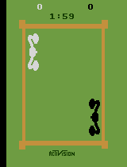
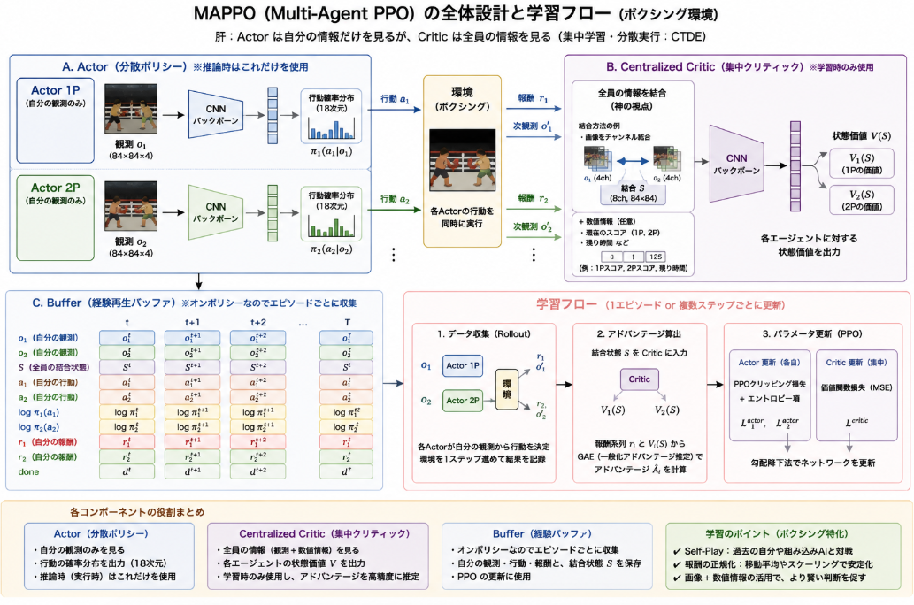

昨日[導入したPettingZoo](https://yoshishinnze.hatenablog.com/entry/2026/05/09/043000)を用いてMARLの試行を行っていきます。
今回はAtariの強化学習環境でボクシングを題材をして選定しようと思います。
解くための情報を集めていると、唯のボクシングと侮れない部分がありました。
本日はその侮れない部分について語っていきます。

Atariのボクシングゲームはこんな感じのゲームです。


## 問題
今回のボクシングゲームが抱える問題は、**相手が学習によって動いてしまうこと**です。
このため、単一のエージェントにおける強化学習では正しく経験学習させることが難しく、学習段階では、マルチエージェント強化学習で使われる集中学習が必要となります。

実行時はバラバラなのに学習時だけ「集中（Centralized）」させるのかには、非常に明確な理論的理由があります。
一言で言えば、**「相手が学習によって動いてしまうことで、環境のルールが常に変わってしまう問題（非定常性）」を解決するため**です。

### 1. 非定常性（Non-stationarity）の問題
単一エージェントの強化学習（DQNや通常のPPOなど）では、「壁は動かない」「穴に落ちたら死ぬ」という環境のルールが固定されていることが前提です。

しかし、ボクシングのような対戦ゲームで、エージェントAとBが同時に独立して学習すると、以下のことが起こります。
- エージェントAから見ると、昨日まで「右に避ければ安全」だったのに、今日はエージェントBが賢くなって「右にパンチを打ってくる」ようになる。
- つまり、**「環境（相手）の挙動が学習中にどんどん変わる」** ため、Aは何が正しい行動なのか確信が持てず、学習が収束しません。

### 2. 集中学習・分散実行（CTDE）の役割
この問題を解決するために考案されたのが **CTDE (Centralized Training, Decentralized Execution)** という枠組みです。

(CTDEとは？と感じたらこちらの[記事](https://yoshishinnze.hatenablog.com/entry/2025/11/18/053506)もご参考下さい。)

__学習時：集中（Centralized Training）__

学習フェーズでは、シミュレータ内のすべての情報（自分と相手の画像、相手が選んだ行動など）を「神の視点」で見ることができます。
- **メリット**: クリティック（価値を判断する部分）が、「相手が今こう動こうとしているから、この状況の価値はこれくらいだ」と、相手の意図を含めて正しく評価できます。これにより、非定常性の影響を抑え、安定した学習が可能になります。

__実行時：分散（Decentralized Execution）__

一方で、実際にゲームをプレイする時は、自分の画面（観測）だけで判断しなければなりません。
- **仕組み**: 実行時は「神の視点（クリティック）」を捨て、学習済みの「自分の目（アクター）」だけで動きます。学習時に「相手がこう来るかもしれない」という可能性を考慮して訓練されているため、自分の視界だけでも賢く動けるようになっています。


### 3. 強化学習アルゴリズムの選定
今回問題を解くアルゴリズムの選定を行います。

__CTDEアルゴリズムの比較・判定__

評価基準は学習の探索性、非定常性への対応力、学習の安定性に設定の上、評価を行いました。

| アルゴリズム | 探索性 | 非定常性への対応力 | 学習の安定性 | 特徴と選定理由 |
| --- | --- | --- | --- | --- |
| **MAPPO** | **○** | **○** | **◎** | **最有力候補。** PPOをベースにしており、クリッピングによって学習が非常に安定します。ボクシングのような画像入力環境でも収束しやすく、CTDEの恩恵を最も受けやすいです。 |
| **MADDPG** | **△** | **○** | **△** | 決定論的ポリシーのため探索が不足しがちです。また、ハイパーパラメータに敏感で、学習が発散しやすい欠点があります。連続的なアクションには強いですが、Atariのような離散アクションには不向きな面があります。 |
| **QMIX** | **○** | **△** | **○** | **協力型に特化。** 各エージェントのQ値を統合（Mixing）しますが、ボクシングのような「対戦（ゼロサム）」では報酬が対立するため、価値関数の単調性仮定が崩れ、本来の性能を発揮しにくいです。 |
| **COMA** | **○** | **○** | **△** | カウンターファクチュアル（もし自分が別の行動をしていたら）を計算して報酬を割り振ります。理論上は非定常性に強いですが、実装が複雑で、分散が大きくなりやすいため学習が不安定です。 |


__推奨アルゴリズムの選定__

ボクシングゲームの実装において、最もおすすめするのは **MAPPO (Multi-Agent PPO)** です。

__MAPPOが最適な理由__

* **安定性の高さ**: PPO譲りの安定性により、対戦相手が急に動きを変えても、パラメータが極端に破壊されることがありません。
* **共有クリティックによる非定常性の解消**: 「相手の画像」をクリティックに含めることで、相手の改善による報酬の変化を「環境の変化」ではなく「状態の変化」として正しく捉えられます。
* **実装の容易さ**: すでにPPOの知識がある場合、クリティックの入力層を拡張するだけでMAPPOの根幹を実装できるため、自作コードとの相性も抜群です。


## 問題の解き方

自作MAPPOの実装に向けて、**「集中学習（Centralized Training）」** の核となる概念図と、その具体的なネットワーク構造の設計指針をまとめました。
なぜ集中学習が必要なのか、その構造を視覚的に理解すると、コードへの落とし込みがスムーズになります。


### 1. MAPPOの基本アーキテクチャ
MAPPO（Multi-Agent PPO）の最大の特徴は、**Actor（行動決定）** と**Critic（価値評価）** で入力する情報が異なる点です。

__Actor (分散実行 / Decentralized Execution)__
- **役割**: 自分の目の前の画面（観測）だけを見て、パンチや移動を決定します。
- **入力**: エージェント自身が見ている画像（84x84x4など）。
- **出力**: 18種類の行動に対する確率分布。
- **数式イメージ**: $\pi(a_i | o_i)$

__Critic (集中学習 / Centralized Training)__
- **役割**: 「自分」と「相手」の両方の状況を
- 俯瞰して、現在の状況がどれくらい有利（価値があるか）を判断します。
- **入力**: 全エージェントの観測を結合（Concatenate）したもの、あるいはゲーム全体のグローバルな状態。
- **出力**: 状態価値 $V(s)$（スカラー値）。
- **数式イメージ**: $V(s_1, s_2, ..., s_n)$

### 2. なぜこれが「非定常性」を解決するのか
ボクシング環境において、相手（エージェントB）が急に強くなった場面を想像してください。

1. **独立学習（通常のPPO）の場合**:
   エージェントAは「昨日と同じ行動をしたのに、なぜか報酬が減った。自分の行動が間違っていたのか？」と混乱します。
2. **集中学習（MAPPO）の場合**:
   Criticは **「相手の状態」** も見ています。「報酬が減ったのは、Aが悪くなったのではなく、Bがこう動いたからだ」と正しく評価できます。その結果、Actorに送られるアドバンテージ（報酬の質）が正確になり、Aは冷静に「Bの新しい動きに対する対策」を学習できます。

### 3. 自作実装時のネットワーク構成案
ボクシング環境を自作コードで動かす場合の、推奨されるネットワーク設計です。

__共通モジュール (CNN Encoder)__

画像から特徴を抽出する部分は、ActorとCriticで共有（あるいは同構造を別々に保持）します。
- `Conv2d` -> `ReLU` -> `Conv2d` -> `ReLU` -> `Flatten` -> `Dense(512)`

__Criticの入力結合ロジック__

ラッパーを使わずロジックを自作する場合、ここが一番のポイントです。
```python
# イメージコード
obs_a = cnn_encoder(agent_a_obs) # Aの画像特徴
obs_b = cnn_encoder(agent_b_obs) # Bの画像特徴

# AとBの特徴をガッチャンコしてCriticに渡す
joint_features = torch.cat([obs_a, obs_b], dim=-1)
value_a = critic_head_a(joint_features)
value_b = critic_head_b(joint_features)
```

### 4. 学習のステップ
自作MAPPOを回す際は、以下の手順でデータを処理します。

1.  **収集**: 各エージェントが自分のActorに従って行動し、軌跡（観測、行動、報酬、**相手の観測**）をバッファに保存。
2.  **評価**: 保存した「自分の観測＋相手の観測」を集中Criticに入れ、価値 $V$ を計算。
3.  **更新**: PPOの目的関数に基づき、ActorとCriticの重みを更新。

## 概略設計

自作のMAPPOをボクシング環境向けに実装するための設計概略をまとめました。
MAPPOの肝は、**「Actorは自分の情報だけを見るが、Criticは全員の情報を見る」** という構造をどうデータフローに落とし込むかです。

### 1. 全体構造の設計
MAPPOは「集中学習・分散実行（CTDE）」を実現するため、以下の3つの主要コンポーネントで構成します。

__A. Actor（分散ポリシー）__

各エージェント（1P, 2P）が個別に持ちます。
- **入力**: 自分の観測画像（84x84x4）
- **出力**: 行動の確率分布（18次元）
- **役割**: 推論時（ゲームプレイ時）はこのネットワークのみを使用します。

__B. Centralized Critic（集中クリティック）__

__学習時のみ使用する「神の視点」を持つ評価器です。
- **入力**: 全エージェントの情報を結合したもの。
  - 基本形：`concat(エージェント1の観測, エージェント2の観測)`
  - 理想形：画像特徴量に加え、現在のスコアや残り時間などの数値を付与。
- **出力**: 各エージェントに対する状態価値 $V$
- **役割**: 「今の状況は自分にとってどれくらい有利か」を相手の動きを含めて判定します。

__C. Buffer（経験再生バッファ）__
PPOはオンポリシー（On-policy）アルゴリズムなので、エピソードごとにデータを集めて更新します。
- **保存内容**: $o_i$（自分の観測）, $s$（全員の観測）, $a_i$（自分の行動）, $log\pi(a_i)$（行動確率）, $r_i$（自分の報酬）。

### 2. ネットワーク設計（PyTorchイメージ）

Atariの画像を処理するため、バックボーンにはCNNを使用します。



__Actorの設計__
```python
class Actor(nn.Module):
    def __init__(self, action_dim):
        super().__init__()
        # 共有のCNNバックボーン
        self.cnn = nn.Sequential(
            nn.Conv2d(4, 32, 8, stride=4), nn.ReLU(),
            nn.Conv2d(32, 64, 4, stride=2), nn.ReLU(),
            nn.Conv2d(64, 64, 3, stride=1), nn.ReLU(),
            nn.Flatten(),
            nn.Linear(64 * 7 * 7, 512), nn.ReLU()
        )
        self.action_head = nn.Linear(512, action_dim)

    def forward(self, x):
        # x: (batch, 4, 84, 84)
        features = self.cnn(x)
        probs = F.softmax(self.action_head(features), dim=-1)
        return probs
```

__Centralized Criticの設計__
```python
class CentralizedCritic(nn.Module):
    def __init__(self):
        super().__init__()
        # 入力チャンネル数が 4*2(エージェント数) = 8 になる
        self.cnn = nn.Sequential(
            nn.Conv2d(8, 32, 8, stride=4), nn.ReLU(), # 入力chを倍にする
            # ... Actorと同様の構造 ...
            nn.Flatten(),
            nn.Linear(64 * 7 * 7, 512), nn.ReLU()
        )
        self.value_head = nn.Linear(512, 1)

    def forward(self, joint_obs):
        # joint_obs: (batch, 8, 84, 84) -> 1Pと2Pの画像をチャンネル方向に結合
        features = self.cnn(joint_obs)
        return self.value_head(features)
```

### 3. 学習のアルゴリズム・フロー

自作する場合、以下のステップをループさせます。

1. **データ収集 (Rollout)**:
   - $o_1, o_2$ を取得し、各Actorで行動 $a_1, a_2$ を決定。
   - 環境を1ステップ進め、$r_1, r_2$ と次状態を取得。
   - 集中学習用に、$(o_1, o_2)$ を結合した状態 $S$ を記録。

2. **アドバンテージ算出**:
   - $S$ を Critic に入れ、各ステップの価値 $V(S)$ を計算。
   - 一般化アドバンテージ推定（GAE）を用いて、アドバンテージ $\hat{A}$ を算出。
   - **ポイント**: 集中Criticのおかげで、相手が強くなったことによる報酬の低下を、価値の低下として正しく分離できます。

3. **パラメータ更新**:
   - Actor損失：PPOのクリッピング関数を用いて更新。
   - Critic損失：平均二乗誤差（MSE）を用いて $V(S)$ が実際の報酬和に近づくよう更新。
   - **エントロピー項**: 探索を促すために追加。

### 4. 実装上の工夫：ボクシング特化
- **Self-Play**: 最初はランダムな相手（または組み込みAI）と戦わせ、ある程度強くなったら「過去の自分（のチェックポイント）」と対戦させるようにループを組みます。
- **報酬の正規化**: 報酬が +1 / -1 と極端なので、移動平均でスケーリングすると学習が安定します。

## 総括
ということで折角解こうと思っても、結構ヘビーということが分かりました。
ボクシング環境で自作MAPPOを実装する際の最重要ポイントを、5つの項目に凝縮してまとめました。

__1. 集中学習・分散実行 (CTDE) の徹底__

MAPPOのアイデンティティは、**「情報の非対称性」** を学習に利用することです。
- **Actor (推論用)**: 自分の観測（自分側の画像）のみを入力。実戦（対戦）で使える形にします。
- **Critic (学習用)**: 自分と相手の両方の観測を結合して入力。「相手がどう動こうとしているか」を考慮して、現在の状況の価値を正確に評価させます。

__2. Atari特有の「前処理」パイプライン__

生のピクセルデータは情報過多で学習が進みません。以下の加工を**Actor/Critic両方の入力前**に行う必要があります。
- **リサイズ & グレースケール**: 84x84程度の白黒画像に圧縮。
- **フレームスタッキング**: 直近4フレームを重ねて「動き（速度・方向）」を認識可能にする。
- **型変換 & 正規化**: `uint8` (0-255) から `float32` (0.0-1.0) へ変換。


__3. セルフプレイ (Self-Play) の導入__

対戦相手が固定（ランダムや弱いAI）だと、ある一定のレベルで学習が頭打ちになります。
- 過去の自分自身のモデル（チェックポイント）と戦わせることで、常に「自分と同等か、少し強い相手」と対戦し続け、戦略を段階的に進化させます。

__4. オンポリシーデータの同期__

MAPPOはPPOベースのオンポリシーアルゴリズムです。
- 1Pと2Pのデータ（観測、行動、報酬、ログ確率）を**ペアで保存**し、同時にバッチ更新を行う必要があります。片方のエージェントだけを更新すると、対戦相手とのバランスが崩れ、学習が不安定になります。

__5. 集中クリティックのネットワーク設計__

自作実装で最も工夫が必要な箇所です。
- **入力の結合**: 1Pと2Pの画像をチャンネル方向に重ねる（例: 4枚スタック×2人分 = 8チャンネル）手法が一般的です。
- **アドバンテージ算出**: 集中クリティックから得られた安定した価値 $V$ を使って $GAE$（一般化アドバンテージ推定）を計算することで、相手の挙動に左右されない「純粋な自分の行動の良さ」を抽出します。


<div class="shop-card">
<div class="shop-card-image"></div>
<div class="shop-card-content">
<div class="shop-card-title">強化学習 (機械学習プロフェッショナルシリーズ)</div>
<div class="shop-card-description">同シリーズで緑本のPythonによる強化学習の本を何度も何度も読んだのですが、どうしても読み進めません。試しにと思って3年前に買ったこの本を読み返してみるとすっと読めました。 これからのコーディングは生成AIが書いてくれるのだから、難しい理論本で勉強してコーディングはお任せ（直すべき所は直す）というのが正解なのかもしれない。。。</div>
<div class="shop-card-link"><a href="https://www.amazon.co.jp/%E5%BC%B7%E5%8C%96%E5%AD%A6%E7%BF%92-%E6%A9%9F%E6%A2%B0%E5%AD%A6%E7%BF%92%E3%83%97%E3%83%AD%E3%83%95%E3%82%A7%E3%83%83%E3%82%B7%E3%83%A7%E3%83%8A%E3%83%AB%E3%82%B7%E3%83%AA%E3%83%BC%E3%82%BA-%E6%A3%AE%E6%9D%91%E5%93%B2%E9%83%8E-ebook/dp/B07XJXMQGD?__mk_ja_JP=%E3%82%AB%E3%82%BF%E3%82%AB%E3%83%8A&amp;crid=2Q7JANDTXMDRQ&amp;dib=eyJ2IjoiMSJ9.YZxuAtwvMTmksETM7b4V5tEFcZKwS3FH_fG2YEbWKvrGjHj071QN20LucGBJIEps.GCkT5rik7rfwPmJpLUkBFsUfiUvfOc-QO8WH5HT0oSA&amp;dib_tag=se&amp;keywords=MARL+%E5%BC%B7%E5%8C%96%E5%AD%A6%E7%BF%92&amp;qid=1777879215&amp;sprefix=marl+%E5%BC%B7%E5%8C%96%E5%AD%A6%E7%BF%92%2Caps%2C165&amp;sr=8-1&amp;linkCode=ll2&amp;tag=yoshishinnze-22&amp;linkId=a3ac27efe00549a8b95a7d948fa658b0&amp;ref_=as_li_ss_tl" target="_blank" rel="noopener">Amazonで詳細を見る</a></div>
</div>
</div>
