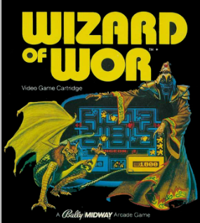
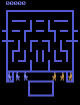

前回MAPPOを使ってAtariのboxingゲームでMARLを行いました。[1]
次なるMARLの課題について"wizard_of_wor"を選定しました。
今日はMARLに取り組む前に環境の特性を確認＋デモでプレイしてみます。

[1] 前回のMAPPO記事も御覧ください。

https://yoshishinnze.hatenablog.com/entry/2026/05/17/043000

## ゲーム概要

`wizard_of_wor_v3` は、Atari 2600のゲーム『Wizard of Wor』をベースにした**2プレイヤー協力＋競合のマルチエージェント環境**です。  
PettingZooのAtari環境として提供されており、MARL（Multi-Agent Reinforcement Learning）の研究対象としてよく使われます[PettingZoo Documentation](https://pettingzoo.farama.org/environments/atari/wizard_of_wor/)。



以下、ゲーム内容と環境仕様を順に説明します。


### 1. ゲームの目的と基本ルール

- **プレイヤー（エージェント）**: 2人（`first_0`, `second_0`）  
- **操作キャラクター**: 「Worrior（戦士）」と呼ばれるキャラクター
- **目的**:  
  - 迷路状のダンジョン内を移動し、**モンスター（Wizard of Wor）を撃ち倒す**  
  - ステージをクリアしながら**スコアを稼ぐ**
- **敵の種類**:  
  - 複数種類のモンスターが登場し、それぞれ動き方や攻撃パターンが異なります。
- **ライフ**:  
  - 各プレイヤーは**3ライフ**を持ち、敵に触れるか撃たれると1ライフ失います。  
  - **両プレイヤーが3ライフ失うとゲーム終了**です[Pettingzoo Documentation](https://pettingzoo.farama.org/environments/atari/wizard_of_wor/)。


### 2. マップとゲームの進行

- **マップ**: 迷路状のダンジョン（部屋と通路）で構成されています。
- **進行**:  
  - 敵を倒しながら迷路を進み、**ステージをクリア**すると次のステージに進みます。  
  - ステージが進むごとに敵の数や種類が増え、難易度が上がります。
- **Wizard of Wor（ボス的存在）**:  
  - 特定の敵（Wizard）を倒すとボーナス得点が入るなど、ゲーム内の重要なターゲットです。


### 3. 2プレイヤー（2エージェント）の関係：協力と競合

`wizard_of_wor_v3` の特徴は、**協力と競合が混在する点**です[Pettingzoo Documentation](https://pettingzoo.farama.org/environments/atari/wizard_of_wor/)。

#### 協力的な側面
- **ステージクリア**:  
  - ステージをクリアすると、**両プレイヤーが次のステージに進み、さらに得点機会が増える**ため、協力して敵を倒す動機があります。
- **共通の敵**:  
  - 敵モンスターは両プレイヤーにとって共通の脅威であり、協力して倒すことで生存確率が上がります。

#### 競合的な側面
- **相手プレイヤーへの攻撃**:  
  - 相手プレイヤーに弾を当てると**自分に+1点、相手に-1点**が入ります。  
  - つまり、**相手を攻撃して自分のスコアを稼ぐ**ことができます。
- **スコア競争**:  
  - ゲーム終了時の総スコアを競うため、**相手を妨害する戦略**も成立します。

このように、**「協力してステージを進める」と「相手を攻撃してスコアを奪う」の両方の要素**が混在しているため、MARLの研究対象として非常に興味深い環境です。


### 4. PettingZoo環境としての仕様

__エージェント__
- `env.agents` で `["first_0", "second_0"]` のような2エージェントIDが取得できます。
- 各エージェントは**独立した観測・行動・報酬**を持ちます。

__観測空間__
- デフォルトは**RGB画像**で、`Box(0, 255, (210, 160, 3), uint8)`（画面サイズ 210×160、3チャネル）です[Pettingzoo Documentation](https://pettingzoo.farama.org/environments/atari/wizard_of_wor/)。
- `obs_type` オプションで `"grayscale"`（グレースケール）や `"ram"`（128バイトのRAM状態）も選択可能です。

__行動空間__
- `Discrete(N)` の離散アクション（Nはゲームに意味のあるアクション数に絞られたサブセット）。
- 内容は「NOOP（何もしない）」「FIRE（発射）」「上下左右への移動」および「移動＋FIRE」の組み合わせなどです。

__報酬__
- **敵や相手プレイヤーに弾を当てるとスコアが入る**仕組みです。
- PettingZoo環境では、各エージェントごとに `reward` が返されます。
  - 例: 自分が敵を倒す → 自分に+1、相手は0  
         自分が相手を倒す → 自分に+1、相手に-1

__終了条件__
- **両プレイヤーが3ライフ失うとゲーム終了**です[Pettingzoo Documentation](https://pettingzoo.farama.org/environments/atari/wizard_of_wor/)。
- これに加え、PettingZooの `max_cycles` パラメータで**最大ステップ数**を設定することもできます。

### 5. MARLとしての位置づけ

- **エージェント数**: 2  
- **観測**: 部分観測（自分の画面のみ）  
- **行動**: 離散（移動＋発射）  
- **報酬**: 協力（ステージクリア）＋競合（相手攻撃）の混合報酬  
- **終了条件**: 両エージェントのライフ喪失 or 最大ステップ数


### まとめ

`wizard_of_wor_v3` は、  
- **2人の戦士が迷路ダンジョンでモンスターを撃ちながら進む協力ゲーム**でありながら、  
- **相手プレイヤーを攻撃してスコアを奪う競合要素**も含む、  
**混合報酬型のマルチエージェント環境**です。  

MARLの観点では、「協力と競合のバランスをどう学習させるか」を研究するのに適した環境と言えます。

## 環境の特徴

`wizard_of_wor_v3` の**状態量（観測）・行動・報酬**は、PettingZooのAtari環境として以下のように定義されています[PettingZoo Documentation](https://pettingzoo.farama.org/environments/atari/wizard_of_wor/)。

### 1. 状態量（観測：Observation）

__観測の種類__
PettingZooのAtari環境では、**3種類の観測形式**が選べます。

1. **RGB画像（デフォルト）**  
   - `obs_type="rgb"`  
   - `Box(0, 255, (210, 160, 3), np.uint8)`  
   - 画面サイズ 210×160 ピクセル、3チャネル（R, G, B）の画像です。

2. **グレースケール画像**  
   - `obs_type="grayscale"`  
   - `Box(0, 255, (210, 160), np.uint8)`  
   - RGB画像をグレースケール化したもの。

3. **RAM状態**  
   - `obs_type="ram"`  
   - `Box(0, 255, (128,), np.uint8)`  
   - Atari 2600の128バイトのメモリ状態をそのまま観測として使います。

__部分観測かどうか__
- 各エージェントは**自分の画面（またはRAM）だけを見る**ため、**部分観測（Partial Observability）** です。
- 相手プレイヤーの位置や行動は、画面上に映っている範囲でのみ把握できます。


### 2. 行動（Action）

__行動空間__
- **離散行動空間** `Discrete(N)`（Nはゲームに意味のあるアクション数に絞られたサブセット）。
- デフォルトでは、**ゲーム内で実際に効果のあるアクションだけ**が含まれます（無効なボタンは除外）。

__行動の内容__
Atariのジョイスティック操作に基づき、以下のような組み合わせが含まれます。

- **NOOP（何もしない）**
- **FIRE（発射）**
- **方向移動**（上・下・左・右）
- **方向移動＋FIRE**（例: 上に移動しながら撃つ）

具体的なアクション番号と意味は環境ごとに異なりますが、  
`env.action_space(agent).sample()` でランダムに選べる範囲が「有効な行動」です。

__エージェントごとの行動__
- `env.action_space(agent)` で各エージェントの行動空間を取得できます。
- 2エージェント（`first_0`, `second_0`）は**同じ行動空間**を持ちます（同じ種類の戦士として操作されます）。

### 3. 報酬（Reward）

__得点の仕組み__
PettingZoo公式の説明では、以下のように定義されています[Pettingzoo Documentation](https://pettingzoo.farama.org/environments/atari/wizard_of_wor/)。

- **敵モンスターやNPCを撃つ**とスコアが入る。
- **相手プレイヤーを撃つ**と、自分に+1点、相手に-1点が入る（競合的な報酬）。
- ステージをクリアすると、**両プレイヤーが次のステージに進み、さらなる得点機会が得られる**（協力的な報酬）。

__報酬の性質__
- **エージェントごとの個別報酬**  
  - `env.last()` で返される `reward` は、**そのエージェントに対する報酬**です。
  - 例: 自分が敵を倒す → 自分に+1、相手は0  
          自分が相手を倒す → 自分に+1、相手に-1
- **混合報酬（Mixed Reward）**  
  - 協力（ステージクリア）と競合（相手攻撃）が混在するため、  
    MARLの観点では「協力・競合が共存するタスク」として扱われます。

__終了条件と報酬__
- **両プレイヤーが3ライフ失うとゲーム終了**です[Pettingzoo Documentation](https://pettingzoo.farama.org/environments/atari/wizard_of_wor/)。
- 終了時の総スコアが、そのエピソードの**累積報酬**となります。

## デモプレイ

どんな感じか動かしてみました。

```python
import glob
import io
import base64
import cv2
import numpy as np
import gymnasium as gym
from IPython.display import HTML
from IPython import display as ipythondisplay
from pyvirtualdisplay import Display
from pettingzoo.atari import wizard_of_wor_v3

# 5. Colab上で再生
def show_local_video(path):
    video_file = io.open(path, 'r+b').read()
    encoded = base64.b64encode(video_file)
    ipythondisplay.display(HTML(data='''<video alt="test" autoplay 
                loop controls style="height: 400px;">
                <source src="data:video/mp4;base64,{0}" type="video/mp4" />
             </video>'''.format(encoded.decode('ascii'))))

# 1. 仮想ディスプレイの起動
display = Display(visible=0, size=(1400, 900))
display.start()

# 2. 環境の構築
env = wizard_of_wor_v3.env(render_mode="rgb_array")
env.reset()

frames = []

# --- MARL用の設定 ---
# 各エージェントの直前の状態を保持する辞書
prev_data = {agent: {"obs": None, "action": None} for agent in env.possible_agents}
experience_buffer = {agent: [] for agent in env.possible_agents}

def policy(agent, observation):
    # ここに将来的にモデル（Q-Network等）を組み込む
    return env.action_space(agent).sample()

# 3. 実行ループ
for agent in env.agent_iter():
    # 現在のターンのエージェントの情報を取得
    obs, reward, termination, truncation, info = env.last()
    done = termination or truncation

    # 【重要】前回の自分の行動の結果（報酬と次状態）をバッファに記録
    if prev_data[agent]["action"] is not None:
        experience_buffer[agent].append((
            prev_data[agent]["obs"],
            prev_data[agent]["action"],
            reward,
            obs,
            done
        ))

    if done:
        action = None
    else:
        # 現在の観測に基づいて行動を選択
        action = policy(agent, obs)
        # 次の自分のターンのために現在の情報を保存
        prev_data[agent]["obs"] = obs
        prev_data[agent]["action"] = action

    # 行動を実行
    env.step(action)
    
    # 画面キャプチャ（全プレイヤー共通）
    frames.append(env.render())
    
    if len(frames) > 1000:
        break

env.close()

# 4. 動画の書き出し
video_path = 'wizard_marl_fixed.mp4'
height, width, _ = frames[0].shape
video = cv2.VideoWriter(video_path, cv2.VideoWriter_fourcc(*'mp4v'), 30, (width, height))
for f in frames:
    video.write(cv2.cvtColor(f, cv2.COLOR_RGB2BGR))
video.release()

show_local_video(video_path) # 前述の関数を使用
```

動かしてみるとこんなのでした。
結構黒い。



## 総括

`wizard_of_wor_v3` は、Atari 2600の『Wizard of Wor』をベースにした**2エージェント・混合報酬型のマルチエージェント環境**です。

- **エージェント**: 2人（`first_0`, `second_0`）  
- **目的**: 迷路ダンジョンでモンスターを撃ち倒しつつ、ステージをクリアしてスコアを稼ぐ  
- **観測**: RGB/グレースケール画像（210×160）またはRAM（128バイト）の**部分観測**  
- **行動**: 離散アクション（NOOP, FIRE, 上下左右移動, 移動＋FIRE）  
- **報酬**:  
  - 敵を倒すと得点（協力）  
  - 相手プレイヤーを撃つと自分+1・相手-1（競合）  
  - ステージクリアで両プレイヤーが利益（協力）  
- **終了条件**: 両プレイヤーが3ライフ失うと終了  

つまり、**協力と競合が混在する2エージェント・部分観測・離散行動のMARLタスク**として、MAPPOやQMIXなどのアルゴリズムのベンチマークに適した環境です[PettingZoo Documentation](https://pettingzoo.farama.org/environments/atari/wizard_of_wor/)。


