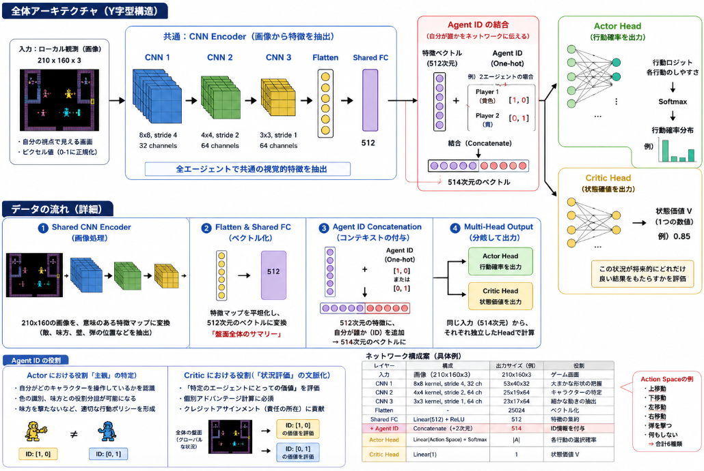

先日[動作確認したWizard of War](https://yoshishinnze.hatenablog.com/entry/2026/05/23/043000)の強化学習の実装を行っていきます。

Wizard of Wor のようなアタリ環境で MAPPO を実装する場合、ネットワーク設計が学習の成否を分ける最大の鍵となります。

「共通のCNNエンコーダ」から「分散 Actor」と「集中 Critic」へ分岐させる構成について、具体的な構造とメリットを詳しく解説します。

## 1. ネットワークの全体構造（アーキテクチャ）

Wizard of Wor は 210x160 ピクセルの画像を入力とするため、生のピクセルから低次元の特徴量（特徴ベクトル）を抽出する **CNN Encoder** をフロントエンドに配置します。

### 構成イメージ

> **[入力: 画像]**
> ↓
> **[Shared CNN Encoder]**（全エージェント・全ネットワークで共通）
> ↓
> ├─ **[Actor Head]** (各エージェントの行動確率分布を出力)
> └─ **[Critic Head]** (集中状態に基づき価値 V を出力)

### 共通 CNN エンコーダの役割

画像処理において、エッジの検出や敵キャラクター（モンスター）、自機、弾丸の認識といった「視覚的な特徴抽出」は、行動決定（Actor）でも価値評価（Critic）でも共通して必要な能力です。

* **効率性:** Actor と Critic で別々に CNN を持つと、パラメータ数が増大し学習が極めて遅くなります。共通化することで、視覚情報の理解を一気に加速させます。
* **勾配の安定:** 報酬に基づく Critic からの勾配と、行動改善に基づく Actor からの勾配が両方 CNN に流れ込むため、より頑健な特徴表現が獲得されやすくなります。

### 分散 Actor (Decentralized Execution)

各エージェントの行動を決定する部分です。

* **入力:** **Local Observation**（CNNで処理された自分の視点の特徴） + **Agent ID**。
* **役割:** 画面内の自分の位置や周囲の敵、壁の状況から「次にどのボタンを押すべきか」を判断します。
* **MAPPO の肝:** 実行時（推論時）は Critic を切り離し、この Actor 部分のみを各プレイヤーが独立して動かします。

### 集中 Critic (Centralized Training)

チーム全体の状況を評価する「司令塔」の視点を持つ部分です。

* **入力:** **Global State**。MAPPO では、以下のように情報を統合します。
* **エージェント全員の観測情報:** 全プレイヤーがどこにいて、どこに弾を撃っているか。
* **隠れた情報:** 残機数、現在のスコア、ステージ全体の敵の配置など。
* **役割:** 「現在のチーム全体の状況は、将来的にどれだけの報酬をもたらすか（価値 $V$）」を計算します。
* **メリット:** 自分の観測範囲外で味方がピンチになっていても、Critic がそれを「悪い状態」と評価できるため、エージェントは「味方を助けに行く」といった協調行動を学習できます。

## 実装時の具体的なチップス

### Agent ID の埋め込み（One-hot）

パラメータ共有（Parameter Sharing）を行う場合、ネットワークは「自分がプレイヤー1（黄色）なのか2（青）なのか」を判別できません。CNN の出力（特徴ベクトル）に、自身の ID を示す One-hot ベクトルを結合（Concatenate）させてから全結合層に渡すのが定石です。

Agent IDのOne-hotベクトルは、ActorとCriticにおいてそれぞれ **「主観の特定」** と **「客観的な状況整理」** という異なる役割を果たします。

パラメータ共有（Parameter Sharing）を行っている場合、ネットワークの重み自体は共通ですが、このIDを入力に混ぜることで、ネットワークは「今、誰の視点で考えているか」を切り替えることができます。

__1. Actorにおける役割： 「主観」の特定__

Actor（分散実行）にとって、IDは「自分がどのキャラクターを操作しているか」を認識するための唯一の手がかりです。

* **色の識別:** Wizard of Worではプレイヤーの色（黄色/青）が異なります。IDが入力されることで、CNNが抽出した「画面内の2つの戦士」のうち、どちらが自分の入力に応じて動く存在かを紐付けます。
* **役割の分担:** 例えば「自分（ID:0）は前衛で敵を食い止め、相方（ID:1）は後ろから援護する」といった戦略的な役割分担を、同じ重みのネットワークで使い分けられるようになります。
* **誤射の回避:** 「自分以外の動く味方」を認識することで、味方を撃たないようなポリシーを形成します。

__2. Criticにおける役割： 「状況評価」の文脈化__

MAPPOのCritic（集中学習）はチーム全体の価値を評価しますが、IDを渡すことで「特定のエージェントから見た状況の良し悪し」をより正確に計算できます。

* **個別アドバンテージの計算:** MAPPOでは各エージェントに対してアドバンテージ（期待以上の結果だったか）を計算します。CriticにIDを渡すことで、「このグローバルな盤面において、エージェントA（自分）にとって現在の状況はどれほど有利か」を個別に評価できます。
* **責任の所在（Credit Assignment）:** チーム全体の報酬が発生した際、それが「ID:0のナイスプレイによるものか、ID:1のミスをカバーしたものか」を区別して価値予測に反映させる助けになります。

__3. 具体的な結合（Concatenate）イメージ__

実装上は、CNNで画像を低次元のベクトルに圧縮した直後にIDを結合します。

| 入力要素                     | 次元例        | 内容                                               |
| ---------------------------- | ------------- | -------------------------------------------------- |
| **CNN Feature**        | 512           | 画像から抽出された空間・物体情報                   |
| **Agent ID (One-hot)** | 2             | `[1, 0]` (Player 1) または `[0, 1]` (Player 2) |
| **結合後のベクトル**   | **514** | これを全結合層（MLP）に流す                        |

__4. ActorとCriticでの使い方の違い（まとめ）__

|                    | Actor (分散実行)                                 | Critic (集中学習)                                |
| ------------------ | ------------------------------------------------ | ------------------------------------------------ |
| **視点**     | 1人称（自分はどう動くか）                        | 3人称（チーム全体はどう見えるか）                |
| **IDの意味** | 「私が操作すべきはこっちだ」という指針           | 「このエージェントに対する評価だ」というラベル   |
| **効果**     | 同じ重みで異なる動き（左右分担など）が可能になる | 個々の行動がチームに与えた影響を正しく評価できる |

因みに実装する場合のイメージは以下のように画像の特徴量とAgent IDを結合することになります。

```python
def forward(self, image, agent_id):
    # 1. CNNで共通の特徴を抽出
    # image: [210, 160, 3] -> features: [512]
    features = self.cnn_encoder(image)
  
    # 2. 特徴ベクトルとIDを結合
    # agent_id: [1, 0] or [0, 1]
    # combined: [514]
    combined = torch.cat([features, agent_id], dim=-1)
  
    # 3. 結合された情報を元に、それぞれの頭（Head）で計算
    # IDの情報が混ざっているため、出力は「そのエージェント専用」の結果になる
    action_logits = self.actor_head(combined)  # Actor: 行動のしやすさ
    state_value = self.critic_head(combined)   # Critic: 状況の良さ
  
    return action_logits, state_value
```

### ネットワーク構成案

PyTorch での実装を想定した標準的な構成は以下の通りです。

__1. 構造のイメージ：Y字型のネットワーク__

このネットワークは、1本の太い幹（CNN層）から、最後に2つの枝（Actor/Critic）に分かれる「Y字型」の形をしています。

* **共通部分（幹）:** 画像を 0-1 のピクセルから、「敵がここにいる」「味方があそこにいる」「自分はこの向きを向いている」といった**意味のある数値ベクトル**に変換します。
* **個別部分（枝）:**
* **Actor Head:** 「この状況なら、右に動いて弾を撃つのがベストだ」と判断。
* **Critic Head:** 「この状況は、死ぬ確率が低くスコアも高いので 85点だ」と評価。

| レイヤー              | 構成                                         | 備考               |
| --------------------- | -------------------------------------------- | ------------------ |
| **CNN 1**       | $8 \times 8$ kernel, stride 4, 32 channels | 大まかな形状の把握 |
| **CNN 2**       | $4 \times 4$ kernel, stride 2, 64 channels | キャラクターの特定 |
| **CNN 3**       | $3 \times 3$ kernel, stride 1, 64 channels | 細かな動きの抽出   |
| **Shared FC**   | Linear(512)                                  | 特徴の集約         |
| **Actor Head**  | Linear(Action Space) + Softmax               | 各行動の選択確率   |
| **Critic Head** | Linear(1)                                    | 状態価値$V$      |

__2. 具体的なデータの流れ（IDの注入ポイント）__

「共通の特徴量」をどこまで使い、どこで「個別の判断」に切り替えるかの設計図が以下です。**Agent IDは、共通のCNNが終わった直後に合流させる**のが一般的です。

1. **Shared CNN Encoder:** 画像処理.
   3層のCNNを通過。210x160の画像が、空間情報を凝縮した小さな特徴マップに圧縮されます。
2. **Flatten & Shared FC:** ベクトル化.
   特徴マップを平坦化し、512次元のベクトルに変換。これが「現在の盤面全体のサマリー」になります。
3. **Agent ID Concatenation:** コンテキストの付与.
   ここで **512次元の共通特徴量 + 2次元のOne-hot ID** を結合し、**514次元**のベクトルにします。
4. **Multi-Head Output:** 分岐.
   514次元の入力を受けて、Actor Headは行動確率（Softmax）を、Critic Headは価値（単一の数値）をそれぞれ独立した全結合層で計算します。

## 実装コード

上記を踏まえて実装したコードは以下のようになります。

```python
import torch
import torch.nn as nn
import torch.nn.functional as F

class WizardOfWorMAPPONet(nn.Module):
    def __init__(self, action_space_n, num_agents=2):
        super(WizardOfWorMAPPONet, self).__init__()
      
        # 1. 共通の CNN Encoder (共通の「目」)
        # 入力画像サイズ: (3, 210, 160) を想定
        self.cnn_encoder = nn.Sequential(
            nn.Conv2d(3, 32, kernel_size=8, stride=4),
            nn.ReLU(),
            nn.Conv2d(32, 64, kernel_size=4, stride=2),
            nn.ReLU(),
            nn.Conv2d(64, 64, kernel_size=3, stride=1),
            nn.ReLU(),
            nn.Flatten()
        )
      
        # CNN出力次元の計算 (210x160入力の場合、64*22*16 = 22528次元程度)
        # shared_fc を通して 512次元に圧縮
        self.shared_fc = nn.Sequential(
            nn.Linear(64 * 22 * 16, 512),
            nn.ReLU()
        )
      
        # 2. Actor Head (分散実行用の「脳」)
        # 入力: 512 (画像特徴) + num_agents (Agent ID の One-hot)
        self.actor_head = nn.Sequential(
            nn.Linear(512 + num_agents, 256),
            nn.ReLU(),
            nn.Linear(256, action_space_n) # 行動ごとのロジットを出力
        )
      
        # 3. Critic Head (集中学習用の「司令塔」)
        # MAPPOではCriticもIDを受け取り「そのエージェントから見た価値」を計算
        self.critic_head = nn.Sequential(
            nn.Linear(512 + num_agents, 256),
            nn.ReLU(),
            nn.Linear(256, 1) # 状態価値 V(s) を出力
        )

    def forward(self, obs, agent_id_onehot):
        """
        引数:
            obs: 画像テンソル [Batch, 3, 210, 160] (0.0~1.0に正規化済み)
            agent_id_onehot: IDのOne-hotテンソル [Batch, num_agents]
        """
        # 共通バックボーンで特徴抽出
        cnn_features = self.cnn_encoder(obs)
        latent = self.shared_fc(cnn_features)
      
        # 特徴ベクトルと Agent ID を結合 (Concatenate)
        # [Batch, 512] + [Batch, 2] -> [Batch, 514]
        combined = torch.cat([latent, agent_id_onehot], dim=-1)
      
        # Actor: 行動分布 (Categorical分布の作成用にロジットを返す)
        action_logits = self.actor_head(combined)
      
        # Critic: 状態価値
        state_value = self.critic_head(combined)
      
        return action_logits, state_value

    def get_action(self, obs, agent_id_onehot, deterministic=False):
        """推論時に行動を選択するためのヘルパーメソッド"""
        action_logits, _ = self.forward(obs, agent_id_onehot)
        probs = F.softmax(action_logits, dim=-1)
      
        if deterministic:
            action = torch.argmax(probs, dim=-1)
        else:
            # 確率分布からサンプリング
            dist = torch.distributions.Categorical(probs)
            action = dist.sample()
          
        return action.item()
```

実装がうまくできたかは、環境から受け取った状態量を入力することで確認出来ます。

```python
import torch
import numpy as np
from pettingzoo.atari import wizard_of_wor_v3

# 1. 環境とモデルの準備
ROM_PATH = "/usr/local/lib/python3.12/dist-packages/AutoROM/roms/"
env = wizard_of_wor_v3.env(render_mode="rgb_array", auto_rom_install_path=ROM_PATH)
env.reset()

# モデルのインスタンス化 (アクション数は環境から取得)
action_space_n = env.action_space("first_0").n
model = WizardOfWorMAPPONet(action_space_n=action_space_n, num_agents=2)
model.eval() # 推論モード

# 2. 実際の環境から 1 ステップ分のデータを取得
# 最初のエージェントの観測を取得
obs, reward, termination, truncation, info = env.last()

# 3. 前処理 (Pre-processing)
# PettingZooの画像は [H, W, C] なので PyTorch用の [C, H, W] に変換
obs_tensor = torch.from_numpy(obs).permute(2, 0, 1).float()
# 0-255 を 0.0-1.0 に正規化し、バッチ次元を追加 [1, 3, 210, 160]
obs_tensor = obs_tensor.unsqueeze(0) / 255.0

# Agent ID (Player 1 = [1, 0]) の One-hot を作成
agent_id_onehot = torch.tensor([[1.0, 0.0]])

# 4. モデルへの入力と出力確認
print("--- Model Input/Output Test ---")
print(f"Input Obs Shape: {obs_tensor.shape}")
print(f"Input ID Shape:  {agent_id_onehot.shape}")

try:
    with torch.no_grad():
        action_logits, state_value = model(obs_tensor, agent_id_onehot)
  
    print("\n[Success] モデルの順伝播に成功しました。")
    print(f"Action Logits (各行動のスコア): \n{action_logits.numpy()}")
    print(f"State Value (状態価値 V): {state_value.item():.4f}")
  
    # 行動決定ヘルパーのテスト
    selected_action = model.get_action(obs_tensor, agent_id_onehot, deterministic=True)
    print(f"Selected Action (決定論的選択): {selected_action}")

except Exception as e:
    print("\n[Error] モデルの実行中にエラーが発生しました。")
    print(e)

finally:
    env.close()
```

出力は以下のように得られます。
環境から出力(行動確率)が得られたことが確認されました。

```
--- Model Input/Output Test ---
Input Obs Shape: torch.Size([1, 3, 210, 160])
Input ID Shape:  torch.Size([1, 2])

[Success] モデルの順伝播に成功しました。
Action Logits (各行動のスコア): 
[[ 0.0230882  -0.02663376  0.04022681 -0.04580431 -0.03913892 -0.04565044
  -0.00065756  0.05635386 -0.02619662]]
State Value (状態価値 V): -0.0588
Selected Action (決定論的選択): 7
```

## 総括

Wizard of Wor（210×160ピクセル）向けのマルチエージェント強化学習ネットワーク設計を、極めて簡潔にまとめると次の通りです。

- **構造**：共通CNNで画像から特徴を抽出し、最後にActor（行動確率）とCritic（状態価値）に分岐するY字型。
- **Actor**：自分の視点特徴＋Agent IDから「次にどのボタンを押すか」を決める（分散実行）。
- **Critic**：全エージェントの観測＋隠れ情報からチーム全体の価値 \(V\) を評価（集中学習）。
- **Agent ID**：One-hotでCNN出力に結合し、同じ重みでも役割分担や個別評価を可能にする。
- **CNN構成**：3層CNN → Flatten → 512次元 → ID結合 → Actor/Critic Head。

要するに、「共通CNN＋分散Actor＋集中Critic＋ID埋め込み」で、MAPPO風の集中学習・分散実行をピクセル入力に適用した設計です。



<div class="shop-card">
<div class="shop-card-image"></div>
<div class="shop-card-content">
<div class="shop-card-title">強化学習 (機械学習プロフェッショナルシリーズ)</div>
<div class="shop-card-description">同シリーズで緑本のPythonによる強化学習の本を何度も何度も読んだのですが、どうしても読み進めません。試しにと思って3年前に買ったこの本を読み返してみるとすっと読めました。 これからのコーディングは生成AIが書いてくれるのだから、難しい理論本で勉強してコーディングはお任せ（直すべき所は直す）というのが正解なのかもしれない。。。</div>
<div class="shop-card-link"><a href="https://www.amazon.co.jp/%E5%BC%B7%E5%8C%96%E5%AD%A6%E7%BF%92-%E6%A9%9F%E6%A2%B0%E5%AD%A6%E7%BF%92%E3%83%97%E3%83%AD%E3%83%95%E3%82%A7%E3%83%83%E3%82%B7%E3%83%A7%E3%83%8A%E3%83%AB%E3%82%B7%E3%83%AA%E3%83%BC%E3%82%BA-%E6%A3%AE%E6%9D%91%E5%93%B2%E9%83%8E-ebook/dp/B07XJXMQGD?__mk_ja_JP=%E3%82%AB%E3%82%BF%E3%82%AB%E3%83%8A&crid=2Q7JANDTXMDRQ&dib=eyJ2IjoiMSJ9.YZxuAtwvMTmksETM7b4V5tEFcZKwS3FH_fG2YEbWKvrGjHj071QN20LucGBJIEps.GCkT5rik7rfwPmJpLUkBFsUfiUvfOc-QO8WH5HT0oSA&dib_tag=se&keywords=MARL+%E5%BC%B7%E5%8C%96%E5%AD%A6%E7%BF%92&qid=1777879215&sprefix=marl+%E5%BC%B7%E5%8C%96%E5%AD%A6%E7%BF%92%2Caps%2C165&sr=8-1&linkCode=ll2&tag=yoshishinnze-22&linkId=a3ac27efe00549a8b95a7d948fa658b0&ref_=as_li_ss_tl" target="_blank" rel="noopener">Amazonで詳細を見る</a></div>
</div>
</div>
<p>[blog:g:4207112889963697807:banner]</p>
<p>[blog:g:10328749687175353006:banner]</p>
<p>[blog:g:11696248318754550880:banner]</p>
<p>[blog:g:11696248318754550877:banner]</p>
