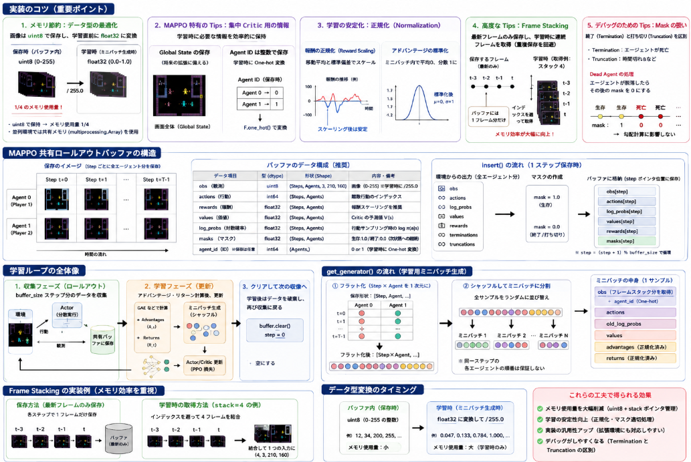

先日のAtari 環境（Wizard of Wor）の実装においてネットワークの次はメモリバッファの実装を行います。

## メモリ実装のコツ

強化学習、特に MAPPO のようなマルチエージェント手法におけるメモリ（ロールアウトバッファ）設計は、学習の「速度・安定性・メモリ消費量」に直結します。
Atari 環境を扱う上で、実戦的なコツを整理しました。



### 1. メモリ節約：データ型の最適化

Atari の画像データ（210x160x3）を `float32` で保存すると、すぐにメモリ（RAM/VRAM）が枯渇します。

* **`uint8` で保存する:** 画像はバッファ内では `0-255` の整数（`uint8`）で保持し、**学習（ミニバッチ生成）の直前で `float32` に変換して `255.0` で割る**ようにします。これだけでメモリ使用量は **1/4** になります。
* **共有メモリの活用:** もし並列環境（複数のシミュレーションを同時に回す）を使う場合は、Python の `multiprocessing.Array` などを用いてメモリを共有し、無駄なコピーを避けます。


### 2. MAPPO 特有の Tips：集中 Critic 用の情報

MAPPO では、Critic が学習時に「自分以外の情報」を必要とします。

* **Global State の明示的保存:** Wizard of Wor は画面全体が見えるため個人の観測（Local Obs）と全体（Global State）がほぼ同じですが、将来的に「自分にしか見えない情報」がある環境に拡張する場合、`state` 用の領域を別途確保しておくと汎用性が高まります。
* **Agent ID のインデックス化:** One-hot ベクトルをそのまま保存するのではなく、整数（0 または 1）として保存し、学習時に `F.one_hot` で変換するとメモリ効率が良いです。

### 3. 学習の安定化：正規化（Normalization）

PPO/MAPPO の論文で強く推奨されている手法です。

* **報酬の正規化（Reward Scaling）:** 報酬をそのまま入れるのではなく、これまでの報酬の移動平均や標準偏差でスケールします。Atari はゲームによってスコアの桁が全く違うため、これは必須級の処理です。
* **アドバンテージの標準化:** バッファからミニバッチを取り出す際、そのミニバッチ内のアドバンテージの平均を 0、標準偏差を 1 に正規化します。これにより、Actor の更新が安定します。

### 4. 高度な Tips：Frame Stacking（フレームスタック）

Atari ゲームにおいて、「弾がどの方向に飛んでいるか」「敵がどちらに動いているか」を認識するには、1枚の画像では不十分です。

* **バッファ内での工夫:** 直近 4 フレームを結合して入力する場合、バッファに「4フレーム分を結合したデータ」をそのまま保存すると重複が多く、メモリが 4倍必要になります。
* **「ポインタ」による管理:** 最新の 1 フレームだけを保存し、学習時にインデックスを遡って 4 フレーム分取り出すように設計すると、メモリ効率が劇的に向上します。

### 5. デバッグのための Tips：Mask（マスク）の扱い

* **Termination vs Truncation:** エージェントが死んだ（Termination）のか、時間切れ（Truncation）なのかを区別して保存します。
* **Dead Agent の処理:** 片方のエージェントが先に脱落した場合、そのエージェントの `mask` を `0` にして、その後のデータが勾配計算に悪影響を与えないように設計します。


### メモリ構成の推奨データ構造例

| データ項目 | 型 | 形状 (Shape) | 備考 |
| --- | --- | --- | --- |
| `obs` | `uint8` | `(Steps, Agents, 3, 210, 160)` | 学習直前に `/255.0` |
| `actions` | `int64` | `(Steps, Agents)` |  |
| `rewards` | `float32` | `(Steps, Agents)` | 報酬スケーリング推奨 |
| `values` | `float32` | `(Steps, Agents)` | Critic の予測値 |
| `masks` | `float32` | `(Steps, Agents)` | 生存なら 1.0, 終了なら 0.0 |
| `log_probs` | `float32` | `(Steps, Agents)` | サンプリング時の対数確率 |

## メモリの実装

MAPPOの学習では、エージェント全員の「観測、行動、報酬、ログ確率、価値」などを保存する、共有ロールアウトバッファ（Shared Rollout Buffer）が必要です。

特にMAPPOは「集中Critic」を用いるため、各エージェントの個別データだけでなく、学習時に必要なグローバル情報も一緒に保持できる構造が望ましいです。

### 1. メモリ設計のポイント

MAPPOの学習（PPOアルゴリズム）はオンポリシー（On-Policy）であるため、以下のサイクルで動作します。

1. **収集:** 一定ステップ（例：128〜2048ステップ）分のデータをバッファに溜める。
2. **学習:** バッファ内のデータを使って数エポック更新を行う。
3. **破棄:** 学習が終わったらデータを全て捨て、また収集に戻る。

### 2. MAPPO用共有ロールアウトバッファの実装

```python
import torch
import numpy as np

class MAPPORolloutBuffer:
    def __init__(self, buffer_size, num_agents, obs_shape, action_dim):
        """
        buffer_size: 1回の学習までに溜めるステップ数
        num_agents: エージェント数 (Wizard of Worなら 2)
        obs_shape: 画像のサイズ (3, 210, 160)
        """
        self.buffer_size = buffer_size
        self.num_agents = num_agents
        
        # データの格納場所 (PyTorchテンソルで確保)
        # すべて [ステップ数, エージェント数, 次元] の形に揃える
        self.obs = torch.zeros((buffer_size, num_agents, *obs_shape))
        self.actions = torch.zeros((buffer_size, num_agents))
        self.log_probs = torch.zeros((buffer_size, num_agents))
        self.rewards = torch.zeros((buffer_size, num_agents))
        self.values = torch.zeros((buffer_size, num_agents))
        self.masks = torch.ones((buffer_size, num_agents)) # 終了判定用 (dones)
        
        self.step = 0

    def insert(self, obs, actions, log_probs, values, rewards, masks):
        """
        1ステップ分の全エージェントデータを一括挿入
        obs: {agent_id: tensor} のような辞書、または [num_agents, C, H, W] のテンソル
        """
        # ここでは辞書からテンソルに変換して格納する例
        for i, agent_id in enumerate(['first_0', 'second_0']):
            self.obs[self.step, i] = obs[agent_id]
            self.actions[self.step, i] = actions[agent_id]
            self.log_probs[self.step, i] = log_probs[agent_id]
            self.values[self.step, i] = values[agent_id]
            self.rewards[self.step, i] = rewards[agent_id]
            self.masks[self.step, i] = masks[agent_id]
            
        self.step = (self.step + 1) % self.buffer_size

    def clear(self):
        """学習後にポインタをリセット"""
        self.step = 0

    def get_generator(self, num_mini_batches, advantages, returns):
        """
        学習用のミニバッチを生成するジェネレータ
        """
        batch_size = self.buffer_size * self.num_agents
        mini_batch_size = batch_size // num_mini_batches
        
        # データを平坦化 (flatten) してシャッフル
        # [Step, Agent, ...] -> [Step * Agent, ...]
        flat_obs = self.obs.view(-1, *self.obs.shape[2:])
        flat_actions = self.actions.view(-1)
        flat_log_probs = self.log_probs.view(-1)
        flat_values = self.values.view(-1)
        flat_advantages = advantages.view(-1)
        flat_returns = returns.view(-1)
        
        # エージェントIDのOne-hotもフラットに作成
        # [Step, Agent, ID_dim]
        ids = torch.eye(self.num_agents).repeat(self.buffer_size, 1, 1).view(-1, self.num_agents)

        indices = np.arange(batch_size)
        np.random.shuffle(indices)

        for start in range(0, batch_size, mini_batch_size):
            idx = indices[start:start + mini_batch_size]
            yield (
                flat_obs[idx],
                ids[idx],
                flat_actions[idx],
                flat_log_probs[idx],
                flat_values[idx],
                flat_advantages[idx],
                flat_returns[idx]
            )

```

### 3. なぜこの設計なのか

* **集中Criticへの対応:** Criticの学習には「その時の状態の価値（Value）」と「実際に得られた収益（Return）」のペアが必要です。このバッファはエージェントごとのValueを並列に持つため、MAPPOの集中評価を効率的に扱えます。
* **フラット化（Flatten）のメリット:** パラメータ共有を行っている場合、プレイヤー1のデータもプレイヤー2のデータも「1つのネットワークを更新するためのサンプル」として同等に扱えます。そのため、ミニバッチ作成時に `Step * Agent` でまとめてシャッフルすることで、学習が安定します。
* **アドバンテージの計算:** PPOでは、バッファがいっぱいになった後に、逆方向に計算して `Advantages`（期待値よりどれだけ良かったか）と `Returns`（割引報酬和）を算出します。このバッファはその計算結果を後付けで受け取れるよう設計しています。

### 4. 学習ループでの使用イメージ

```python
# 1. 収集フェーズ
for step in range(buffer_size):
    actions, log_probs, values = model.get_action_and_value(current_obs) # ネットワークで推論
    next_obs, rewards, terminations, truncations, _ = env.step(actions)
    
    # データを保存 (マスクは終了時0、継続時1)
    masks = {a: 0.0 if terminations[a] or truncations[a] else 1.0 for a in agents}
    buffer.insert(current_obs, actions, log_probs, values, rewards, masks)
    current_obs = next_obs

# 2. 学習フェーズ
# ここでアドバンテージとリターンを計算 (GAEなど)
advantages, returns = calculate_gae(buffer)

# ミニバッチに分けてネットワークを数エポック更新
generator = buffer.get_generator(num_mini_batches, advantages, returns)
for mini_batch in generator:
    train_step(mini_batch) # ここで Actor/Critic Lossを計算

```

> **注意点:**
> Atariの画像はメモリを大量に消費します（3, 210, 160 の float32 は重いです）。もしRAMが不足する場合は、バッファ内では `uint8`（0-255）で保存し、学習時に `generator` の中で `float32` に変換して `/ 255.0` するように改修すると、メモリ使用量を 1/4 に抑えられます。


