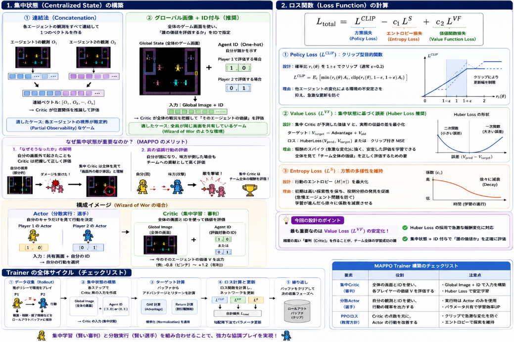

近日続けているAtari 環境（Wizard of Wor）の実装について。

1. ネットワークの実装
2. メモリバッファの実装

を行いました。
次に学習用トレーナー(学習を制御する機能)の構築を行います。

## 学習用トレーナー構築のキーポイント

MAPPO実装の上で学習用トレーナーが学習の直接的な制御を行い、強化学習としての性質も多くはここで決まることになります。
MAPPOのベースはActor-Criticモデルに、Criticモデルがエージェント全体を見渡せる構成にあります。この機能を学習用トレーナーに担ってもらうことになります。

学習用トレーナーのキーポイントは以下の2点です。

### 1. 集中状態 (Centralized State) の構築

MAPPOにおける **「集中状態（Global State）」** は、一言で言えば **「学習全体を見渡す神」** のような役割を果たします。

[MAPPO](https://yoshishinnze.hatenablog.com/entry/2026/01/10/153824)には **分散実行・集中学習（CTDE: Centralized Training, Decentralized Execution）** という原則があります。本番（実行時）は自分の画面しか見えませんが、**訓練中だけは、味方の状況や敵の位置を含めた「全知全能の視点」をCritic（評価役）に与えて学習を加速させる**、という機能です。

構築法には連結法とグローバル画像+ID付与の2パターンがあります。
それぞれの構築手法を技術的に解説します。

__1. 連結法 (Concatenation)__

各エージェントが持つ「部分的な視界」をすべて繋ぎ合わせる方法です。

* **仕組み:** エージェント1の観測 $O_1$、エージェント2の観測 $O_2$、... $O_n$ をフラットに並べて一つの長いベクトル $[O_1, O_2, \dots, O_n]$ を作ります。
* **機能:** Criticは「味方が右側にいて、自分が左側にいる」という位置関係を、それぞれの視界の組み合わせから逆算して理解します。
* **適したケース:** 各エージェントが「自分の周囲数マスしか見えない」ような、限定的な視界（Partial Observability）を持つゲームに向いています。

__2. グローバル画像 + ID付与__

Wizard of Worのように、そもそも1つの画面（1枚の画像）に全員が映っている場合に非常に有効な方法です。

* **仕組み:**
* **Global State:** 全体のゲーム画面そのもの。
* **ID（One-hot）:** 「今、この画面をもとに評価しているのはプレイヤー1（自分）である」という情報を $[1, 0]$ や $[0, 1]$ というベクトルで追加します。


* **機能:** Criticはゲーム全体の戦況（敵が何体残っているか、迷路の構造など）を1枚の画像から一気に把握できます。
* **なぜIDが必要か:** 同じ「全画面」を見ていても、Player 1の位置にいるのとPlayer 2の位置にいるのとでは、その状況の「価値（Value）」が変わるからです（例：敵に囲まれているプレイヤー側は価値が低くなる）。


__MAPPOで上記が重要な理由:__

通常の独立したPPO（IPPO）では、他のエージェントが勝手に動き回るため、自分から見ると「環境のルールが常に変わっている」ように見え、学習が非常に不安定になります（非定常性問題）。

しかし、Global State を使うことで以下のメリットが生まれます。

__1. 「なぜそうなったか」の解明__

自分がダメージを受けた際、自分の画面外から敵が来たのかもしれません。Global State を見ている Critic は「画面外のあそこに敵がいたから、その行動の価値は低かったんだよ」と正しく Actor にフィードバックできます。

__2. 真の協調行動の評価__

「自分が囮（おとり）になり、味方が敵を倒した」という状況は、自分の観測だけでは「損をした」と判定されがちです。しかし、集中 Critic は全体を見て「チーム全体の得点に貢献した」と高く評価できます。

__どちらを選ぶべきか？__

今回課題であるWizard of Wor の場合、「グローバル画像+ID付与」方式が有利です。

> **理由:**
> 1. ゲーム画面が共通で、すべての情報が1つのフレーム内に収まっている。
> 2. 連結法を使うと、全く同じ画像データを2枚分連結することになり、メモリと計算コストが単純に2倍になって無駄が多い。

__構成イメージ__

* **Actor:** 共通の画面画像 $\rightarrow$ 自分の行動を選択。
* **Critic:** 共通の画面画像 + **[1, 0]（自分のID）** $\rightarrow$ 今の自分の状況の価値を判定。

これにより、同じ画面を見ながらも「Player 1としての価値」と「Player 2としての価値」を正確に書き分けることができるようになります。


### 2. ロス関数 (Loss Function) の計算

ロス関数により **「複数のエージェントをどう同時に進化させるか」** という方向付けが出来ます。

MAPPOにおけるロス関数の設計は、**「個別のエージェントの最適化」と「チーム全体の協調」のバランス**をどう取るかが重要なポイントです。

基本構造は PPO を踏襲しますが、マルチエージェント特有の不安定さを抑えるために以下の設計が推奨されます。


$$L_{total} = L^{CLIP} - c_1 L^{S} + c_2 L^{VF}$$

各項の設計意図と「なぜそうすべきか」を詳述します。

__1. Policy Loss ($L^{CLIP}$): クリップ型目的関数__

**【設計】**
単一エージェントの PPO と同様に、確率比（$r_t(\theta)$）を $1 \pm \epsilon$ （通常 $\epsilon=0.2$）でクリップします。

**【理由】**
マルチエージェント環境では、「他人の変化が自分の環境の変化」になります。全員が同時に大幅にポリシーを更新すると、環境が劇的に変わりすぎて学習が崩壊します。クリップによって「一歩ずつ、互いの変化を伺いながら更新する」ことが可能になり、非定常性（環境が勝手に変わる問題）を緩和できます。

__2. Value Loss ($L^{VF}$): 集中状態（Global State）に基づく MSE__

**【設計】**
**「Huber Loss」** または **「クリップ付き Value Loss」** の採用を強く推奨します。

* ターゲット: $V_{target} = Advantage + V_{old}$
* ロス: $MSE(V_{pred}, V_{target})$ または Huber Loss

**【理由】**
MAPPO では「集中 Critic」が全員の報酬を評価します。特に Wizard of Wor のようなゲームでは、敵を倒した瞬間に大きな報酬（スパイク）が入ります。

* **Huber Loss:** 外れ値（急激な報酬変化）に対して勾配が爆発するのを防ぎます。
* **集中学習:** 全員の情報を反映した $V$ を学習することで、「自分が撃たなくても、味方が敵を倒せばチームの価値が上がる」ことを Critic が正しく理解し、Actor にフィードバックできるようになります。

__3. Entropy Loss ($L^{S}$): 方策の多様性__

**【設計】**
通常のエントロピー項ですが、「初期段階で高めに設定し、徐々に減衰（Decay）」させる設計が理想的です。

**【理由】**
マルチエージェントの最大の難所は「役割分担」の発見です。

* もし一人がすぐに「敵を撃つ」ことを覚えると、もう一人が「何もしない」のが最適解（味方の邪魔をしない）だと誤学習してしまうことがあります（怠慢エージェント問題）。
* 高いエントロピーを維持することで、もう一人のエージェントも「囮になる」「別のルートから攻める」といった複雑な協調行動を試行錯誤する余裕が生まれます。

__今回の設計のポイント__

今回の設計で最も重要なのは **「Value Loss ($L^{VF}$) の安定化」** です。

> **理由:**
> MAPPO において Actor は Critic の出す「点数（Advantage）」を信じて進化します。Critic が集中状態（Global State）を見て「今、チームとして良い状態だ」と正確に判定できなければ、Actor はどう動いていいか混乱します。
> したがって、**「Huber Loss の採用」** と **「集中状態への ID 付与」** によって、精度の高い審判（Critic）を作ることが、ロス関数設計の成功の鍵となります。

### Trainer構築時の全体像（チェックリスト）

上記の2つのキーポイントを柱として、Trainerは以下のサイクルを回すことになります。

| 要素 | 役割 | 注意点 |
| --- | --- | --- |
| **集中Critic** | **「審判」** | 画面全体を見て、各プレイヤーの立ち回りに点数をつける。 |
| **分散Actor** | **「選手」** | 自分のキャラだけを見て、最善の操作を行う。 |
| **PPOロス** | **「教育方針」** | 審判の点数を元に、選手の操作を少しずつ改善する。 |





## 実装

前節のキーポイントを踏まえながら実装したコードが以下です。
これまでの議論を踏まえ、MAPPO（Multi-Agent PPO）のコアロジックを凝縮した `MAPPOTrainer` の実装例を作成しました。

この実装では、集中Criticによる価値評価、Huber Lossによる安定化、そしてエージェントごとのIDを考慮したロス計算を統合しています。

### MAPPOTrainer の実装

```python
import torch
import torch.nn as nn
import torch.nn.functional as F

class MAPPOTrainer:
    def __init__(self, 
                 actor_critic, 
                 device, 
                 ppo_epoch=10, 
                 num_mini_batch=4, 
                 clip_param=0.2, 
                 value_loss_coef=0.5, 
                 entropy_coef=0.01, 
                 max_grad_norm=0.5, 
                 huber_delta=10.0):
        self.ac = actor_critic
        self.device = device
        
        # ハイパーパラメータ
        self.ppo_epoch = ppo_epoch
        self.num_mini_batch = num_mini_batch
        self.clip_param = clip_param
        self.value_loss_coef = value_loss_coef
        self.entropy_coef = entropy_coef
        self.max_grad_norm = max_grad_norm
        self.huber_delta = huber_delta

        # 最適化（ActorとCriticを同時に更新）
        self.optimizer = torch.optim.Adam(self.ac.parameters(), lr=3e-4, eps=1e-5)

    # def train(self, buffer):
    #     # アドバンテージを計算（バッファ内で正規化済みを想定）
    #     advantages = buffer.advantages
    #     advantages = (advantages - advantages.mean()) / (advantages.std() + 1e-8)

    #     train_info = {
    #         'value_loss': 0,
    #         'policy_loss': 0,
    #         'entropy': 0
    #     }

    def train(self, buffer):
        advantages = buffer.advantages
        advantages = (advantages - advantages.mean()) / (advantages.std() + 1e-8)

        train_info = {
            'value_loss': 0,
            'policy_loss': 0,
            'entropy': 0
        }

        for _ in range(self.ppo_epoch):
            data_generator = buffer.get_generator(advantages, self.num_mini_batch)

            for sample in data_generator:
                # flat_ids を sample から受け取る
                obs_b, state_b, actions_b, old_log_probs_b, \
                return_batch, adv_targ, masks_b, agent_ids_b = sample

                # evaluate_actions に agent_id_onehot を渡す
                values, action_log_probs, dist_entropy = self.ac.evaluate_actions(
                    obs_b, state_b, actions_b, agent_id_onehot=agent_ids_b
                )

                # 2. Policy Loss (L^CLIP)
                ratio = torch.exp(action_log_probs - old_log_probs_b)
                surr1 = ratio * adv_targ
                surr2 = torch.clamp(ratio, 1.0 - self.clip_param, 1.0 + self.clip_param) * adv_targ
                policy_loss = -torch.min(surr1, surr2).mean()

                # 3. Value Loss (L^VF) - Huber Lossを採用
                # 目標値との差分
                error = return_batch - values
                value_loss = F.huber_loss(values, return_batch, delta=self.huber_delta)

                # 4. Total Loss
                self.optimizer.zero_grad()
                (policy_loss - dist_entropy * self.entropy_coef + 
                value_loss * self.value_loss_coef).backward()
                
                # 勾配爆発の抑制
                nn.utils.clip_grad_norm_(self.ac.parameters(), self.max_grad_norm)
                self.optimizer.step()

                # ログ用
                train_info['value_loss'] += value_loss.item()
                train_info['policy_loss'] += policy_loss.item()
                train_info['entropy'] += dist_entropy.item()

        return train_info
```

### 実装の重要ポイント

1. **アドバンテージの正規化:** 前処理.
ミニバッチごとではなく、エポックの開始時に全エージェント・全ステップのアドバンテージをまとめて正規化します。これにより、特定のステップだけ勾配が極端に大きくなるのを防ぎます。


2. **evaluate_actions での並列処理:** Actor-Critic連携.
`obs_b`（分散Actor用）と `state_b`（集中Critic用）を同時にモデルに渡します。ここで、`state_b` には「画像 + エージェントID」が既に埋め込まれていることが前提です。


3. **Huber Loss による価値関数の安定化:** Value Loss.
Wizard of Worでは敵を倒した際の報酬が大きいため、通常のMSEでは勾配が爆発しがちです。`huber_delta`（例: 10.0）を設定し、大きな誤差を線形に抑えることでCriticの学習を安定させます。


4. **勾配クリッピング:** 最適化.
マルチエージェント環境ではパラメータの更新が互いに影響し合うため、`clip_grad_norm_` は必須です。これにより、一人のエージェントの極端な更新がチーム全体を壊すリスクを下げます。


### 集中状態 (state_b) の構成に関する補足

この Trainer が受け取る `state_b` は、前段のバッファまたはデータ生成時に以下の構成になっている必要があります。

* **画像入力の場合:**
エージェント1用の `state` = `[全画面画像, 1, 0]`（Player 1 IDを付与）
エージェント2用の `state` = `[全画面画像, 0, 1]`（Player 2 IDを付与）

> **注意:** Trainer内で画像を処理する場合、`state_b` のうち画像部分は CNN で処理し、ID部分は全結合層の直前で結合（Concatenate）するように `actor_critic` モデル側を設計してください。

ここまで実装すすめたコードを以下レポジトリのtrain.pyより実行いただければ学習が進むようになります。

```
Update 0/50000: Value Loss: 8.1017
Update 0/50000: Value Loss: 12.0305
```

## 総括

Wizard of Wor での MAPPO 実装の Trainer 設計は、次の2点が肝です。

1. **集中状態（Centralized State）**  
   - 全画面画像にエージェントID（one-hot）を付与し、Critic に「誰の視点で見ているか」を伝える。  
   - これにより、Critic は全体を見て協調行動や非定常性を正しく評価できる。

2. **ロス関数設計**  
   - PPO のクリップ付き Policy Loss で、全員が同時に大きく方針を変えるのを防ぐ。  
   - Huber Loss による Value Loss で、急激な報酬変化（敵撃破など）での勾配爆発を抑える。  
   - エントロピー項で役割分担の探索を促し、怠慢エージェントを防ぐ。

これにより、マルチエージェント特有の不安定さを抑えつつ、協調的な学習を実現します。


<div class="shop-card">
<div class="shop-card-image"></div>
<div class="shop-card-content">
<div class="shop-card-title">強化学習 (機械学習プロフェッショナルシリーズ)</div>
<div class="shop-card-description">同シリーズで緑本のPythonによる強化学習の本を何度も何度も読んだのですが、どうしても読み進めません。試しにと思って3年前に買ったこの本を読み返してみるとすっと読めました。 これからのコーディングは生成AIが書いてくれるのだから、難しい理論本で勉強してコーディングはお任せ（直すべき所は直す）というのが正解なのかもしれない。。。</div>
<div class="shop-card-link"><a href="https://www.amazon.co.jp/%E5%BC%B7%E5%8C%96%E5%AD%A6%E7%BF%92-%E6%A9%9F%E6%A2%B0%E5%AD%A6%E7%BF%92%E3%83%97%E3%83%AD%E3%83%95%E3%82%A7%E3%83%83%E3%82%B7%E3%83%A7%E3%83%8A%E3%83%AB%E3%82%B7%E3%83%AA%E3%83%BC%E3%82%BA-%E6%A3%AE%E6%9D%91%E5%93%B2%E9%83%8E-ebook/dp/B07XJXMQGD?__mk_ja_JP=%E3%82%AB%E3%82%BF%E3%82%AB%E3%83%8A&amp;crid=2Q7JANDTXMDRQ&amp;dib=eyJ2IjoiMSJ9.YZxuAtwvMTmksETM7b4V5tEFcZKwS3FH_fG2YEbWKvrGjHj071QN20LucGBJIEps.GCkT5rik7rfwPmJpLUkBFsUfiUvfOc-QO8WH5HT0oSA&amp;dib_tag=se&amp;keywords=MARL+%E5%BC%B7%E5%8C%96%E5%AD%A6%E7%BF%92&amp;qid=1777879215&amp;sprefix=marl+%E5%BC%B7%E5%8C%96%E5%AD%A6%E7%BF%92%2Caps%2C165&amp;sr=8-1&amp;linkCode=ll2&amp;tag=yoshishinnze-22&amp;linkId=a3ac27efe00549a8b95a7d948fa658b0&amp;ref_=as_li_ss_tl" target="_blank" rel="noopener">Amazonで詳細を見る</a></div>
</div>
</div>
<p>[blog:g:4207112889963697807:banner]</p>
<p>[blog:g:10328749687175353006:banner]</p>
<p>[blog:g:11696248318754550880:banner]</p>
<p>[blog:g:11696248318754550877:banner]</p>

