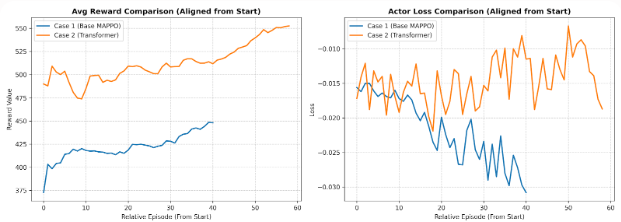
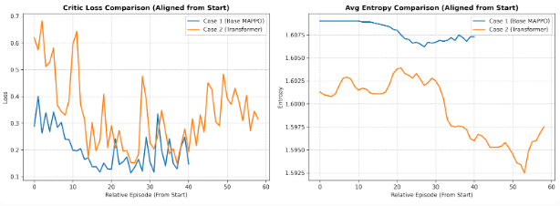
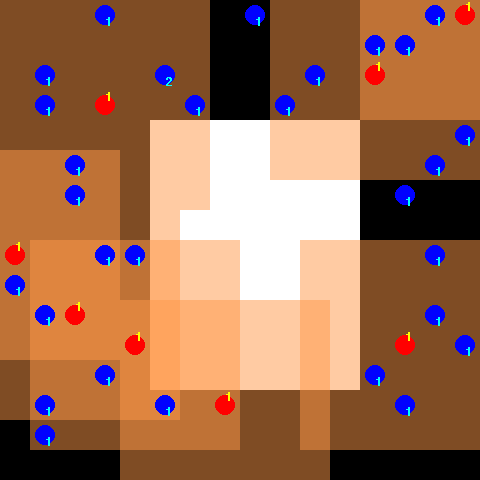

前回の報酬系の変更の今一つな結果を受けて次の取り組みを考えました。
しかし思うような結果ではありませんでした。

前回の結果を踏まえて次の取り組みを検討します。


## 課題と考えたこと

Pursuit（追跡）環境において、従来のCNNベースのアーキテクチャでは学習が行き詰まり、Transformerへ移行することで劇的に改善する可能性が高い理由は、この環境が要求する **「空間的な相対関係の把握」** と **「エージェント間の動的な協調（コミュニケーション）」** の性質にあります。

前回までエージェントとして使っていたCNNの構造的な限界と、解決するのではという仮説について考察を行います。

### 1. CNNベースのネットワークに存在した「課題」

PettingZooのPursuit環境は、グリッドマップ上で複数のエージェントがターゲットを「四方から囲い込む」必要があります。CNNがこのタスクで失敗した原因は、主に以下の2点に集約されます。

__課題①：畳み込み（Convolution）の「局所性」と受容野の限界__

CNNは、3x3 や 5x5 といった小さなカーネル（フィルター）を使って、隣り合う画素（局所特徴）を段階的にまとめていく構造をしています。

- **Pursuitでの実態**: 今回の観測（7x7）は一見小さいですが、エージェントが「マップ全体のどこに仲間がいて、どの方角にターゲットが逃げているか」という広域な位置関係（マクロな視点）を捉えるには、CNNの層が浅すぎたり、カーネルサイズが小さすぎたりすると、端と端の情報がネットワークの奥深く（全結合層の手前）まで統合されません。
- **結果**: エージェントは「自分の目の前に敵（または味方）がいる」というミクロな情報にしか反応できず、「あっちのルートを塞ぎに行こう」という大局的な判断が困難になります。

__課題②：位置情報の消失（並進対称性）__

CNNは「画像のどこに何が写っているか」を識別するのが得意ですが、それは裏を返せば「位置が多少ズレても同じものとして認識する（位置を曖昧にする）」という特性（並進対称性）を持っています。特に、プーリング層などを挟むと厳密な座標データは失われやすくなります。

- **Pursuitでの実態**: グリッド環境では、「味方が自分の『2マス右』にいるか『3マス右』にいるか」という**1マスの正確なズレが、包囲網を敷く上で死活問題**になります。CNNはゲーム的な厳密な絶対・相対座標を保持するのが苦手なため、精密な位置調整ができずにターゲットをすり抜けさせてしまいます。

### 2. 仮説

CNNではダメだった正確な位置の把握やグローバルな重要性の把握の欠如ですが、解決するならばTransformerに替えることになるのではと考えています。
Transformer（特にSelf-Attention機構）は、CNNの上記の弱点を完全にカバーできる性質を持っています。

__解消理由①：全域的な視野（Global Context）の一発統合__

Transformerの核である **Self-Attention（自己注意機構）** は、入力されたデータの全要素（今回の場合は、7x7マップ内のすべてのマス、あるいは全エージェントの全観測データ）の**ペア（2者間）の関係性をダイレクトに、かつ同時に計算**します。

- CNNのように「徐々に視野を広げる」のではなく、**最初からマップ全体・チーム全員の状況を一望した上で、どこに注目すべきかを判断**します。これにより、「仲間が右から追い込んでいるから、自分は左を塞ぐ」という協調行動の因果関係を1ステップで結びつけることができます。

__解消理由②：Positional Embedding（位置エンコーディング）による精密な座標把握__

Transformerは、データそのものに「これは(X, Y)の位置の情報である」という厳密な位置インデックス（Positional Embedding）を足し算して入力します。

- これにより、CNNのように処理の過程で位置情報がボヤけることがなく、**「ターゲットとの正確な距離」や「グリッド上の位置関係」を完璧に維持したまま特徴量を抽出**できます。

__解消理由③：マルチエージェントの「関係性」のモデル化__

MAPPOのCentralized Critic（価値関数）にTransformerを採用した場合、その恩恵はさらに大きくなります。

- 「味方1、味方2、……味方8」という可変、あるいは多数のエージェントの観測を「トークン（並び順に依存しない独立したデータ）」として入力できるため、「どのエージェントとどのエージェントが協力してターゲットを追い詰めているか」という動的な関係性（グラフ構造のような繋がり）をSelf-Attentionが直接学習します。

### 解決案の整理

CNNとTransformerの特性を比較すると以下のようになります。

| 特性 | CNN（従来型） | Transformer（今回） | Pursuit環境への影響 |
| --- | --- | --- | --- |
| **視野の広さ** | 局所的（層を重ねて徐々に広がる） | **常に全体（一撃で全域をカバー）** | 仲間とターゲットの配置を瞬時に把握できる |
| **位置の正確さ** | 曖昧になりやすい（識別重視） | **厳密（位置の埋め込みを持つ）** | 1マス単位の精密な包囲・ポジショニングが可能 |
| **関係性の学習** | 近くの要素との連動がメイン | **遠くの要素とも直接連動可能** | 離れたエージェント同士の協調・連携がスムーズになる |

CNNが「狭い視野で目の前の標的をがむしゃらに追いかける（結果、囲めない）」モデルだったのに対し、Transformerは「チェス盤全体を見渡して、チーム全員の最適な布陣を計算して動く」モデルへの進化を可能にします。だからこそ、今回のアーキテクチャ変更は学習を成功させるための大きな鍵となります。

## 実装のポイント

「ネットワークをCNNから**Transformer（MAPPO_TransformerActor / Critic）へ差し替えるために、コードのどの部分を変更・調整する必要があったか**」という、実装上の具体的な変更ポイントについて整理します。

キーとなる変更箇所は以下の3点です。

### 1. 観測（入力）次元数の変更：CNNの3次元からTransformerの「1次元（平坦化）」へ

CNNでは画像の形状（高さ, 幅, チャンネル）をそのまま `(7, 7, 3)` で入力していましたが、Transformer（および全結合層）の入力レイヤーは**1次元のベクトル**、または**シーケンス（トークン）の並び**としてデータを受け取る必要があります。

* **変更点**: ラッパーの `get_obs` 内で、新しく構築した4チャンネルのセマンティック・テンソル `(7, 7, 4)` を、そのまま返すのではなく、最後に **`.reshape(-1)` を使って `196次元` のフラットな1次元配列に変換して出力する**ように変更しました。
* **理由**: これにより、環境から出てくるデータのインターフェースが綺麗に1次元に統一され、Transformer Actor内の線形埋め込み層（Linear Embedding）へそのままスムーズに投入できるようになります。

### 2. Centralized Criticへの「ターゲットID（トークン）」のインジェクション実装

今回のTransformer Criticは、全エージェントの統合情報を見つつ、「特定の一人」の価値を予測する構造（IDベース）になっています。これに対応するため、Criticを呼び出すコード側で「誰の価値を計算しているか」というID情報をテンソル化して動的に注入する必要がありました。

* **変更点**: 価値推定を行うループの中で、以下のコードを追加しました。
```python
target_id_tensor = torch.tensor([i], dtype=torch.long, device=device)
val = mappo.critic(global_state_tensor, target_id_tensor).item()

```


* **理由**: Transformer Criticの内部では、この `target_id_tensor` を元に、全エージェントのトークン（観測）の中から「指定されたエージェントのトピック」にSelf-Attentionを強く働かせる処理を行っています。コード側からこのIDを正確に手渡してあげる実装が必須でした。

### 3. Critic用グローバル状態の「バッチ次元・シーケンス次元」の成形

TransformerのSelf-Attention機構は、基本的に `(バッチサイズ, シーケンス長, 特徴量次元)` という3次元のテンソル形状を期待します。今回のモデルでは、**「シーケンス長 ＝ エージェント数（num_agents）」** として処理するアーキテクチャになっています。

* **変更点**: 全エージェントの観測（196次元 $\times$ 8人）を集約したあと、Criticに放り込む直前で、単なるフラットな1次元ベクトルではなく、**`.unsqueeze(0)` を用いて明示的にバッチ次元を追加し、`(1, num_agents, 196)` という綺麗な3次元構造に組み替えてから入力する**ように変更しました。
```python
global_state_tensor = torch.FloatTensor(np.array(global_state_list)).unsqueeze(0).to(device)

```


* **理由**: この形状に整えることで、Transformer内部のマルチヘッドアテンションが「8人のエージェント（＝8つのトークン）」同士の関係性を正しくマトリックス計算できるようになります。

### 4. 実際のコード

以下レポジトリにコードを置いています。

https://github.com/Shinichi0713/Reinforce-Learning-Study/tree/main/miulti-agent/petting_zoo/src/4_pursuit/src

モデルはこんな感じにしています。

```python
import numpy as np
import torch
import torch.nn as nn
from torch.distributions import Categorical
import torch.optim as optim

# =====================================================================
# 1. Transformer アーキテクチャ
# =====================================================================

class MAPPO_TransformerActor(nn.Module):
    def __init__(self, obs_range=7, in_channels=4, d_model=64, nhead=4, num_layers=2, act_dim=5, num_agents=8, id_dim=8, hidden_size=256):
        super().__init__()
        self.obs_range = obs_range
        self.num_tokens = obs_range * obs_range  # 7x7 = 49
        
        # 1. 各マスの4次元情報を d_model(64次元) に引き上げる線形埋め込み
        self.embedding = nn.Linear(in_channels, d_model)
        
        # 2. 2次元空間用の学習可能な位置エンコーディング
        self.pos_embedding = nn.Parameter(torch.randn(1, self.num_tokens, d_model))
        
        # 3. エージェント固有IDの埋め込み（譲り合いの個性を学習）
        self.id_embedding = nn.Embedding(num_embeddings=num_agents, embedding_dim=id_dim)
        
        # 4. Transformer Encoder（GELUを内部で採用）
        encoder_layer = nn.TransformerEncoderLayer(
            d_model=d_model, nhead=nhead, dim_feedforward=d_model * 2, 
            activation="gelu", batch_first=True
        )
        self.transformer = nn.TransformerEncoder(encoder_layer, num_layers=num_layers)
        
        # 5. 出力用MLP：中心セルの特徴量（64） + エージェントID（8）
        input_dim = d_model + id_dim
        self.mlp = nn.Sequential(
            nn.Linear(input_dim, hidden_size),
            nn.GELU(),
            nn.Linear(hidden_size, act_dim)
        )

    def forward(self, obs, agent_id):
        """
        Args:
            obs: (batch_size, 196) のフラットな4チャンネル観測
            agent_id: (batch_size,) のエージェント固有ID
        """
        batch_size = obs.shape[0]
        
        # (batch_size, 196) -> (batch_size, 49, 4) へトークン変形
        x = obs.view(batch_size, self.num_tokens, 4)
        
        # トークン埋め込み + 位置エンコーディング
        x = self.embedding(x) + self.pos_embedding  # (batch_size, 49, 64)
        
        # Transformer処理
        features = self.transformer(x)  # (batch_size, 49, 64)
        
        # 視界の中心(3,3) ＝ インデックス 24 (3*7 + 3) の自身のトークン特徴量を抽出
        my_feature = features[:, 24, :]  # (batch_size, 64)
        
        # ID特徴量の統合
        if agent_id.dim() == 2:
            agent_id = agent_id.squeeze(-1)
        id_feats = self.id_embedding(agent_id)  # (batch_size, 8)
        
        # 結合して行動のカテゴリカル分布を返却
        combined = torch.cat([my_feature, id_feats], dim=-1)
        logits = self.mlp(combined)
        
        return Categorical(logits=logits)


class MAPPO_TransformerCritic(nn.Module):
    def __init__(self, num_agents=8, obs_range=7, in_channels=4, d_model=64, nhead=4, num_layers=2, agent_emb_dim=16):
        super().__init__()
        self.num_agents = num_agents
        self.num_tokens_per_agent = obs_range * obs_range  # 49
        self.total_tokens = self.num_tokens_per_agent * num_agents  # 49 * 8 = 392
        
        # 各エージェントマスの特徴抽出埋め込み
        self.embedding = nn.Linear(in_channels, d_model)
        
        # 全トークン（392個）の位置・所属エージェント認識用エンコーディング
        self.pos_embedding = nn.Parameter(torch.randn(1, self.total_tokens, d_model))
        
        # 評価対象ターゲットエージェントのID埋め込み
        self.agent_embedding = nn.Embedding(num_agents, agent_emb_dim)
        
        # Transformer Encoder
        encoder_layer = nn.TransformerEncoderLayer(
            d_model=d_model, nhead=nhead, dim_feedforward=d_model * 2, 
            activation="gelu", batch_first=True
        )
        self.transformer = nn.TransformerEncoder(encoder_layer, num_layers=num_layers)
        
        # 統合価値出力ヘッド
        self.v_head = nn.Sequential(
            nn.Linear(d_model + agent_emb_dim, 128),
            nn.GELU(),
            nn.Linear(128, 1)
        )

    def forward(self, global_states, target_agent_id):
        """
        Args:
            global_states: (batch_size, num_agents, 196) またはフラットなテンソル
            target_agent_id: (batch_size,) の対象エージェントID
        """
        device = next(self.parameters()).device
        global_states = global_states.to(device)
        target_agent_id = target_agent_id.to(device)

        # 形状の安全な復元 (batch_size, num_agents, 196)
        if global_states.dim() == 1:
            global_states = global_states.view(1, self.num_agents, -1)
        elif global_states.dim() == 2:
            global_states = global_states.view(-1, self.num_agents, self.num_tokens_per_agent * 4)

        batch_size = global_states.size(0)

        # 全員分を1つの巨大なトークンシーケンスに変形 (batch_size, 392, 4)
        x = global_states.view(batch_size, self.total_tokens, 4)
        
        # 埋め込みと自己アテンション処理
        x = self.embedding(x) + self.pos_embedding
        features = self.transformer(x)  # (batch_size, 392, 64)
        
        # 平均プーリングによるグローバル盤面表現の圧縮
        global_feature = torch.mean(features, dim=1)  # (batch_size, 64)
        
        # 評価ターゲットIDの結合
        if target_agent_id.dim() == 2:
            target_agent_id = target_agent_id.squeeze(-1)
        elif target_agent_id.dim() == 0:
            target_agent_id = target_agent_id.unsqueeze(0).repeat(batch_size)
            
        agent_emb = self.agent_embedding(target_agent_id)
        
        combined = torch.cat([global_feature, agent_emb], dim=-1)
        return self.v_head(combined)
```

## 学習の推移

前回報酬を設計変更した場合と、今回モデルをTransformerに置き換えた場合での学習での推移を示します。
Lossは基本値は小さくなっていかないので、こんなものかと。
報酬とエントロピには明確な違いが出たように思います。

Transformerは報酬がどんどん高くなっていき、エントロピも低下していく様子が確認されました。





そして学習した後のエージェントの動作はこのようになりました。
今度は明確です。
味方がどんどん集まっていき、敵の周りを味方で連携している様子が確認できるようになりました。
Transformerに替えれば、という仮説が当たったということになります。



## 総括
久しぶりに手ごたえを感じました。
今回取り組みをまとめていきます。

### 1. CNNが抱えていた課題

- **局所性と受容野の限界**  
  CNNは小さなカーネルで局所特徴を段階的に集約するため、7×7マップ全体の「誰がどこにいるか」「どの方角を塞ぐべきか」といった**大局的な位置関係**を捉えにくい。  
  結果として、目の前の敵を追うだけで、**チームとしての包囲・連携**がうまく学習されない。

- **位置情報の消失（並進対称性）**  
  CNNは「位置が多少ずれても同じもの」と見なす性質が強く、グリッド上の**1マス単位の正確な相対位置**を維持しづらい。  
  Pursuitでは「味方が右2マスか3マスか」が包囲網の成否に直結するため、精密なポジショニングができず、ターゲットをすり抜けさせてしまう。

### 2. Transformerへの切り替えで解決できた理由（仮説）

- **全域的な視野（Global Context）**  
  Self-Attentionにより、**マップ全体・全エージェントの関係性を一発で計算**できる。  
  CNNのように「徐々に視野を広げる」のではなく、**最初から全体を見渡してどこに注目すべきかを決められる**ため、仲間との協調行動が取りやすくなる。

- **Positional Embeddingによる精密な位置保持**  
  位置エンコーディングにより、**グリッド上の厳密な座標情報を維持したまま特徴量を抽出**できる。  
  これにより、ターゲットとの距離や相対位置を正確に扱えるようになり、精密な包囲・ポジショニングが可能になる。
  (CNNの場合、畳み込みされる間に座標情報の正確さは失われていくことになる。)

- **マルチエージェントの関係性のモデル化**  
  各エージェントの観測を「トークン」として扱い、Self-Attentionで**誰と誰が協力しているか**を直接学習できる。  
  Centralized CriticにTransformerを採用することで、**チーム全体の状況を見つつ、特定エージェントの価値を評価**する構造が自然に実現できる。

### 3. 実装上の主な変更点

- **観測の形状変更**  
  7×7×4のセマンティック・テンソルを `.reshape(-1)` で196次元の1次元ベクトルに変換し、Transformerの線形埋め込み層にそのまま投入できるようにした。

- **Centralized CriticへのターゲットID注入**  
  Critic呼び出し時に `target_id_tensor` を渡し、**どのエージェントの価値を評価しているか**を明示。  
  Transformer Critic内部で、そのIDに応じたSelf-Attentionの重み付けが行われる。

- **グローバル状態の形状整形**  
  全エージェントの観測を集約した後、`.unsqueeze(0)` で `(1, num_agents, 196)` に成形し、  
  Transformerが期待する `(バッチ, シーケンス長, 特徴量)` の形に合わせた。

### 4. 学習結果の変化

- **報酬の上昇とエントロピーの低下**  
  Transformer導入後は、報酬が明確に上昇し、エントロピーも低下する傾向が確認された。  
  これは、**エージェントが特定の有効な戦略に収束しつつある**ことを示唆する。

- **エージェントの挙動改善**  
  学習後の挙動では、味方がターゲットの周囲に集まり、**連携して包囲する動き**がはっきりと見られるようになった。  
  CNNでは「目の前を追うだけ」だったのに対し、Transformerでは**チームとしての戦略的な動き**が学習できた。

