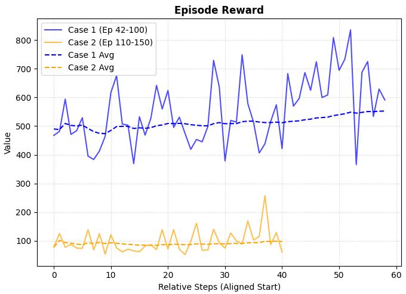
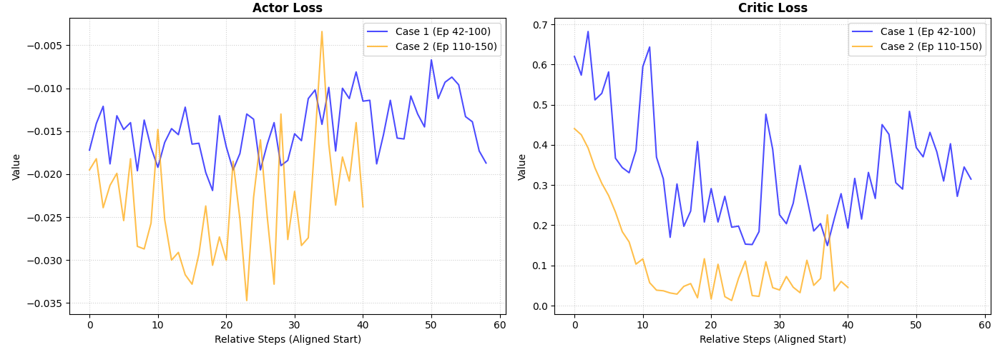
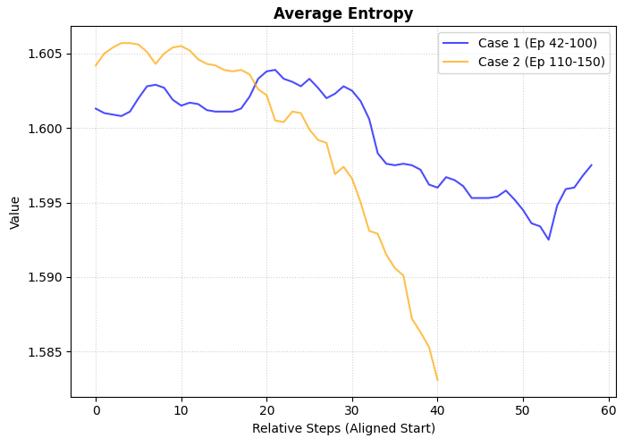
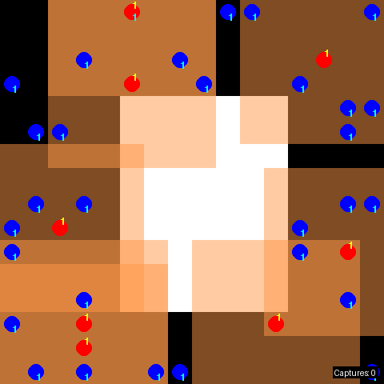

前回はモデルをCNNからTransformerに変更したことで、集団で追跡するチーム連携の動作が出来るようになりました。
(ついでに捕獲の実績もカウントが入るようになりました)

その後、動作を見ていると一角の捕獲を終えた後の動作にまごまごする傾向があります。
限られた時間で捕獲を効率よく歩調を合わせた動作を行えるならないかと考えました。

本日テーマ：
>捕獲のターゲットを効率よく切り替えられるような仕組みを検討・実装

## ここまでの課題

**「1体を捕獲した直後に『まごまご』と歩調が乱れる・動きが止まる」** という現象から考えられる課題について考察してみます。

### 1角の捕獲直後に「まごまご」する3つの想定原因

なぜ1体目を捕獲した直後、あれだけ鮮やかだった連携が急にぎこちなくなるのか。主に以下の3つの課題が絡み合っています。

__① 報酬の不連続性と「燃え尽き症候群（Goal-Loss Panic）」__

それまでエージェントたちは、特定の獲物を取り囲むために「じわじわと距離を詰める報酬（または捕獲報酬 $+5$）」の勾配を必死に追いかけていました。しかし、1体目を捕獲した瞬間に**そのターゲット（目標）が環境から消滅、または再配置**されます。

* **課題：** 1ステップ前まで「すぐ目の前にいたはずのインセンティブ」が突然ゼロになり、次のターゲット（2体目）は遥か遠くにいる状態になります。ポリシー（Actor）から見ると、入力（状態）が不連続に大激変するため、次にどこを目指すべきか一瞬見失い、ステップごとの行動に一貫性がなくなって「まごまご」してしまいます。

__② AEC（非同期ステップ）環境における「環境の過渡状態」__

PettingZooのPursuit環境はAEC（Agent-Environment Coevolution）を採用しており、`pursuer_0` から順に1人ずつ行動を決定していきます。

* **課題：** 例えば `pursuer_2` の行動によって捕獲が成立したとします。その直後、環境はリセット処理や獲物の再配置を行いますが、他のエージェント（`pursuer_3` や `pursuer_0`）は、**「まだ古い獲物の残像（直前の位置）を意識した観測」を持ったまま、次のステップの行動選択に突入**させられる時間的なズレ（過渡状態）が発生しやすく、これが足並みを乱す原因になります。

__③ マルコフ性の喪失（部分観測による迷子）__

エージェントの視野は $7 \times 7$ と限定的（部分観測、POMDP）です。

* **課題：** 1体目の捕獲に全員で群がっていたということは、エージェントたちの視野は「身内のエージェントの体」と「捕獲した獲物」で埋め尽くされていました。そこから獲物が消えた瞬間、彼らの $7 \times 7$ の狭い視野には「仲間しか映っていない（次の獲物がどこにいるか全く見えない）」状態になります。過去の記憶がない（静的な観測のみの）状態では、「どっちの方角からアプローチしてきたか」「どっちに次の獲物がいた形跡があったか」を思い出すことができず、視界が開けるまでランダムウォーク（まごまご）せざるを得なくなります。

## 今回とろうとする方法

今回は先述した課題への対応策として、**「Opponent Modeling（対戦相手モデリング）」** や **「Action-In-Action」** と呼ばれる、マルチエージェント強化学習（MARL）における手法を取り入れていこうと思います。

### 1. 手法の概要

__(1) 基本アイデア__
- 各エージェントが、**自身の観測**に加えて、**他エージェントの行動（または行動の予測）** を入力として受け取ります。
- これにより、他エージェントの意図や戦略を推論し、**協調や競合をより効果的に行う**ことができます。

__(2) 入力の組み込み方__
- **直近の行動履歴**: 他エージェントが直前にとった行動を状態に追加。
- **行動予測（Opponent Modeling）**: 他エージェントの方策を推定し、次に取りそうな行動を予測して入力に組み込む。
- **通信ベース**: 他エージェントから明示的なメッセージ（意図・計画）を受け取り、状態に統合。

### 2. 特徴

__(1) 部分観測の補完__
- マルチエージェント環境では、各エージェントが世界の一部しか観測できない（部分観測）ことが多いです。
- 他エージェントの行動を入力に加えることで、**観測できない部分を推論**し、より正確な意思決定が可能になります。

__(2) 協調・競合の最適化__
- 協調タスクでは、他エージェントの行動を考慮して**役割分担や経路計画**を最適化できます。
- 競合タスクでは、相手の戦略を読み、**先読みした行動**を取ることができます。

__(3) 非定常性への適応__
- マルチエージェント環境では、他エージェントの方策が変化するため、環境が非定常になります。
- 他エージェントの行動をモデル化することで、**変化する相手に適応**しやすくなります。

### 3. メリット

__(1) 協調タスクでの性能向上__
- **文献**: Foerster et al., "Learning to Communicate with Deep Multi-Agent Reinforcement Learning" (2016)  
  - エージェント間でメッセージ（行動の意図）をやり取りし、協調タスクの性能を大幅に向上させた。
  - 他エージェントの意図を入力に組み込むことで、**役割分担と協調が強化**されることを示した。

__(2) 競合タスクでの戦略的優位__
- **文献**: He et al., "Multi-Agent Actor-Critic for Mixed Cooperative-Competitive Environments" (MAPPOの元となるMADDPG, 2017)  
  - 各エージェントが他エージェントの行動を観測し、**中央化されたCritic**で評価する手法を提案。
  - 他エージェントの行動を考慮することで、**競合環境での戦略的優位**を実現。

__(3) 部分観測環境での推論能力向上__
- **文献**: Lowe et al., "Multi-Agent Actor-Critic for Mixed Cooperative-Competitive Environments" (MADDPG, 2017)  
  - 他エージェントの行動を状態に含めることで、**部分観測下での推論能力が向上**し、協調・競合タスクの両方で性能が改善することを報告。

__(4) 対戦相手モデリング（Opponent Modeling）の有効性__
- **文献**: Hernandez-Leal et al., "A Survey of Learning in Multiagent Environments: Dealing with Non-Stationarity" (2019)  
  - 対戦相手モデリング（Opponent Modeling）は、**非定常環境での適応**に有効であると総括。
  - 他エージェントの行動を予測し、自身のポリシーを調整することで、**長期的な報酬を最大化**できる。

### 4. 期待する効果

ご提示いただいた3つの課題に対して、**「Action-In-Action」や「Opponent Modeling」** がどのように効果的に機能するかを、それぞれの課題ごとに考察します。

### 1. 報酬の不連続性と「燃え尽き症候群」への効果

__課題の本質__
- 1体目の捕獲直後に、**ターゲット（獲物）が消滅・再配置**され、報酬勾配が急激に変化。
- エージェントが「次にどこを目指すべきか」を見失い、行動が一貫性を失う。

__Action-In-Action / Opponent Modeling の効果__
- **他エージェントの行動履歴や意図を入力に組み込む**ことで、**「次の共同ターゲット」への移行をスムーズに**できます。
- 例：
  - 他エージェントが「2体目の獲物に向かって移動し始めた」という行動パターンを観測すれば、自身も自然にその方向へ追随できる。
  - これにより、報酬が不連続に変化しても、**他者の行動を手がかりに次の目標を推定**できる。

__理由__
- 報酬がゼロになっても、**他エージェントの行動は連続的**です。
- 他者の行動を観測することで、**環境の変化を補完する「擬似的な連続性」** を確保できます。

### 2. AEC環境における「過渡状態」への効果

__課題の本質__
- AEC環境では、捕獲が成立した直後に環境が更新されるが、他のエージェントは**古い観測のまま行動選択**に突入する。
- これにより、足並みが乱れる。

__Action-In-Action / Opponent Modeling の効果__
- **他エージェントの直近の行動を状態に含める**ことで、**「環境が更新される前の共同意図」を保持**できます。
- 例：
  - 捕獲直前まで全員が「獲物A」に向かっていたという行動履歴があれば、獲物Aが消えても、**「次は獲物Bに向かうべき」という共通認識**を維持しやすい。

__理由__
- 環境の更新タイミングとエージェントの行動タイミングにズレがあっても、**他者の行動という「共通の文脈」を共有**することで、過渡状態での混乱を軽減できます。

### 3. マルコフ性の喪失（部分観測による迷子）への効果

__課題の本質__
- 視野が狭く（7×7）、捕獲直後は**仲間しか映っていない**状態になる。
- 過去の記憶がないため、「次の獲物がどこにいたか」を思い出せず、ランダムウォークになる。

__Action-In-Action / Opponent Modeling の効果__
- **他エージェントの行動履歴をRNNやTransformerで統合**し、**「過去の共同ターゲットの位置」や「移動の軌跡」** を記憶できます。
- 例：
  - 捕獲前に全員が「北東方向」からアプローチしていたという履歴があれば、獲物が消えても「北東方向に次の獲物がいる可能性が高い」と推論できる。
  - これにより、視界が開けるまでの**ランダムウォークを減らし、目的志向の移動**が可能になる。

__理由__
- 部分観測環境では、**自身の観測だけではマルコフ性を満たさない**ため、他者の行動を「外部メモリ」として利用することで、**実質的なマルコフ性を回復**できます。

## 実装

### 実装のキーポイント

「Action-In-Action」や「Opponent Modeling」を実装する際の**コツ・キーポイント**を、実装手順に沿って整理します。

__1. 他エージェントの行動をどう表現するか？__

__キーポイント：行動のエンコーディング__
- **離散行動**の場合：one-hotベクトル（例：4方向なら長さ4のベクトル）
- **連続行動**の場合：そのままの値 or 正規化した値
- **マルチエージェント**の場合：各エージェントの行動を連結（例：8エージェント×4行動=32次元）

__コツ__
- 行動ベクトルを**状態ベクトルと同程度のスケール**に正規化する（例：-1〜1 or 0〜1）。
- 行動の**直近数ステップ分を履歴**として保持し、RNNやTransformerで時系列処理する。

__2. どこに組み込むか？__

__(1) 状態への直接追加__
- 自身の観測ベクトルに、他エージェントの行動ベクトルを**単純に連結（concat）** 。
- 例：`state = [own_obs, other_actions]`

__(2) 別モジュールとして統合__
- 他エージェントの行動を**専用の埋め込み層**で処理し、その後で自身の観測と統合。
- 例：Transformerのトークンとして扱い、Self-Attentionで関係性を学習。

__コツ__
- **行動情報と観測情報を分離**して処理し、最後に統合する方が学習が安定しやすい。
- マルチエージェント環境では、**エージェントID埋め込み**と組み合わせると、誰の行動かが明確になる。

__3. Opponent Modeling（相手方策の推定）の実装__

__キーポイント：相手方策ネットワークの学習__
- 他エージェントの観測と行動のペアから、**相手の方策（ポリシー）を推定するネットワーク**を学習。
- 入力：他エージェントの観測（または共有観測）
- 出力：他エージェントの行動分布（確率 or Q値）

__コツ__
- **教師あり学習**として、実際の行動をターゲットに学習（クロスエントロピー損失など）。
- 学習済みの相手モデルの出力（行動予測）を、自身の状態に組み込む。

__4. Action-In-Action（直近行動の利用）の実装__

__キーポイント：行動履歴の保持__
- 各エージェントが**直近Kステップの行動履歴**を保持。
- これをRNN（LSTM/GRU）やTransformerで処理し、**「現在の共同意図」** を抽出。

__コツ__
- 履歴長Kは**タスクの時間スケール**に合わせて調整（短すぎると情報不足、長すぎるとノイズ増加）。
- 部分観測環境では、**他者の行動が「外部メモリ」** として機能するため、履歴を長めに取ると効果的。

__5. マルチエージェントTransformerでの実装例__

__キーポイント：トークン設計__
- 各トークン = [エージェントの観測, エージェントの行動, エージェントID埋め込み]
- TransformerのSelf-Attentionで、**エージェント間の関係性**を学習。

__コツ__
- 位置エンコーディングに加え、**エージェントID埋め込み**を追加し、誰の情報かがわかるようにする。
- 出力時には、**自身のトークンの特徴量**を抽出し、行動選択に利用。

__6. 学習の安定化テクニック__

__(1) 勾配の分離__
- 相手モデリングネットワークの勾配を、**自身のポリシー更新に直接流さない**（stop_gradientなど）。
- これにより、相手モデルの不安定性が自身の学習に悪影響を与えにくくなる。

__(2) ターゲットネットワークの利用__
- Opponent Modelingネットワークにも**ターゲットネットワーク**を導入し、更新を安定化。
- 特に非定常環境（相手方策が変化）では重要。

__(3) 経験再生の工夫__
- 他エージェントの行動を含む経験を**まとめて保存**し、バッチ学習で相関を減らす。
- マルチエージェント対応のReplayBufferを設計。

### 実装コード

以下のレポジトリにコードを保管しています。

https://github.com/Shinichi0713/Reinforce-Learning-Study/tree/main/miulti-agent/petting_zoo/src/4_pursuit/src

## 学習の結果

### 学習の推移

前回の結果と、今回の結果を比較してみます。

報酬は前回の設計が少し大きかったようなので、1/5にしています。
あんまり・・・変わらないかもしれません。

ロスとエントロピは低下が早くなったように思います。

前回と同程度以上には学習できたような手ごたえかと思いました。

### 実際の動作

開始時点は前回とあまり変わらないかもしれませんが、集まってからは敵を真ん中に置いて、周囲を囲むような動作が見えます。
また、動画右下の `capture` は捕獲のカウントですが、味方同士が集まってから急にカウントが大きくなっています。

そして、捕獲を終えてからは周囲に味方と歩調を合わせながら移動している様子が確認出来ます。
前回に比べると、一回敵を捕獲してから味方と歩調合せながら次の行動をとるようになった感触があります。
(指標で見てないので、断言はできませんが)

## 総括

今回のまとめを行います。 
課題としたのは、捕獲直後にエージェントが「まごまご」して連携が崩れる問題を解消し、**効率的なターゲット切り替え**を実現することです。

**課題の原因仮説**  
1. **報酬の不連続**：捕獲でターゲットが消え、報酬勾配が急にゼロになる。  
2. **AECの過渡状態**：環境更新とエージェントの行動タイミングがずれ、古い観測のまま動く。  
3. **部分観測による迷子**：視野が狭く、捕獲直後は仲間しか見えず、過去の記憶がないと次の獲物がわからない。

**今回の解決策（Action-In-Action / Opponent Modeling）**  
- 各エージェントが、**自身の観測＋他者の行動（または行動予測）** を状態に組み込む。  
- これにより：
  - 報酬が途切れても「他者の動き」を手がかりに次のターゲットを推定できる。  
  - AECの過渡状態でも「共通の意図」を保持し、足並みをそろえられる。  
  - 部分観測を補完し、過去のターゲット位置や移動方向を推論できる。

**実装のポイント**  
- 他者の行動を one-hot や正規化値で表現し、状態に連結。  
- 直近Kステップの履歴をRNN/Transformerで処理し、「共同意図」を抽出。  
- 必要に応じて相手方策を推定するネットワーク（Opponent Modeling）を学習し、その出力を状態に組み込む。  
- 学習安定化のため、勾配分離・ターゲットネットワーク・マルチエージェント対応ReplayBufferを活用。

**結果（手応え）**  
- ロス・エントロピーの低下が早く、学習は安定。  
- 実際の動作では：
  - 集団で獲物を囲む連携が明確になった。  
  - 捕獲直後も味方と歩調を合わせて移動し、「まごまご」が軽減された。  
- 指標は厳密には測っていないが、**ターゲット切り替えの効率が向上した感触**がある。

**一言で言うと**  
「他者の行動や意図を状態に組み込むことで、報酬の不連続・AECの過渡状態・部分観測という3つの課題を同時に緩和し、捕獲直後もスムーズに次のターゲットへ移行できるようになった」というのが、これまでの総括です。

