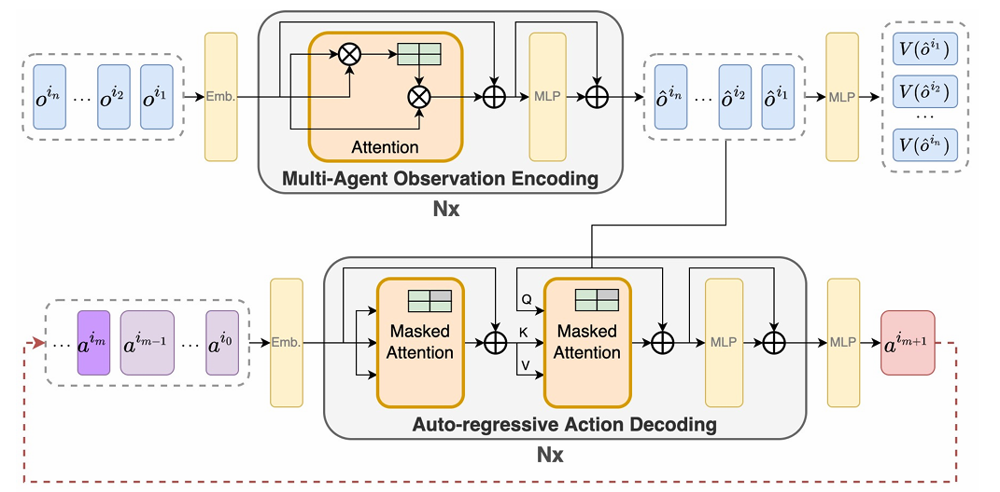
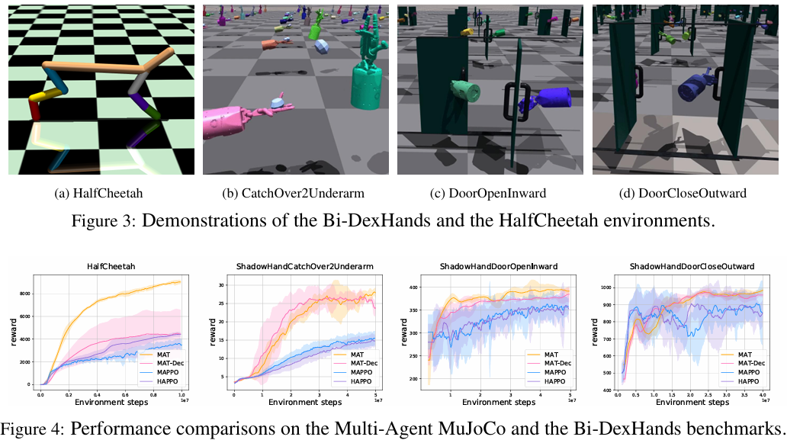

本日は論文読んでいこうシリーズ(!?)です。
著者が取り組んでいる協調型マルチエージェント強化学習（MARL）の精度に影響する手法として見つけた論文について。

本日は、MARLの手法として国際学会NeurIPS 2022（Neural Information Processing Systems） に採択された論文である Multi-Agent Reinforcement Learning is a Sequence Modeling Problem について説明していきます。

## 概要
Multi-Agent Transformer（MAT）は、**協調型マルチエージェント強化学習（MARL）を「系列モデリング（sequence modeling）問題」として定式化する**ためのニューラルネットワークアーキテクチャです[arXiv](https://arxiv.org/abs/2205.14953)。

### 1. 目的
- GPT や BERT のような大規模系列モデル（SM）は、自然言語処理や単一エージェント強化学習で高い汎化性能を示しています。
- MAT は、**「複数エージェントの意思決定も系列モデルで扱えないか？」** という問いから生まれました。
- 具体的には、**各エージェントの観測系列を入力として、最適な行動系列を出力する**ように設計されています[arXiv](https://arxiv.org/abs/2205.14953)。

### 2. アーキテクチャの概要
MAT は **エンコーダ・デコーダ型のTransformer** です。

- **エンコーダ**：  
  各エージェントの観測（observation）を入力として、エージェント間の相互作用や環境の状態を Transformer の自己注意（self-attention）で表現します。
- **デコーダ**：  
  その表現をもとに、**エージェントの行動を順次（系列として）生成**します。  
  これにより、MARL の「どのエージェントがいつ・何をするか」という問題を、**系列生成問題**として扱うことができます[arXiv](https://arxiv.org/abs/2205.14953)。

### 3. 理論的な裏付け：multi-agent advantage decomposition theorem
MAT の中心にあるのは、**multi-agent advantage decomposition theorem** という理論的結果です[arXiv](https://arxiv.org/abs/2205.14953)。

- これは、**共同行動のアドバンテージ（advantage）を、エージェントごとに順番に分解できる**ことを示す定理です。
- この定理を利用することで、
  - 「全エージェントの同時最適化」という高次元の問題を、
  - **「エージェントを順番に最適化する系列決定問題」** に変換できます。
- その結果、
  - エージェント数に対して**線形時間計算量**でスケールし、
  - **性能が単調に改善する（monotonic improvement）** という保証が得られます[arXiv](https://arxiv.org/abs/2205.14953)。

### 4. 学習方式と特徴
- **オンライン・オンポリシー学習**：  
  Decision Transformer などがオフラインデータを使うのに対し、MAT は **環境とのオンライン試行錯誤（on-policy）** で学習します[arXiv](https://arxiv.org/abs/2205.14953)。
- **スケーラビリティ**：  
  エージェント数に対して線形オーダーで計算量が増えるため、多数エージェント環境でも扱いやすい設計です。
- **汎化性能**：  
  StarCraftII、Multi-Agent MuJoCo、Google Research Football などのベンチマークで、MAPPO や HAPPO といった既存のMARL手法を上回る性能が報告されています[arXiv](https://arxiv.org/abs/2205.14953)。

## 解決したい課題

MAT（Multi-Agent Transformer）が主に解決しようとしている課題は、**「協調型マルチエージェント強化学習（MARL）を、スケーラブルかつ汎化性能の高い形で扱うこと」** です。もう少し分解すると、以下のような点が挙げられます[arXiv](https://arxiv.org/abs/2205.14953)。

### 1. 「エージェント数が増えると計算・表現が大変になる」問題
- マルチエージェント環境では、エージェント数が増えると
  - 行動空間が指数的に大きくなる、
  - エージェント間の相互作用が複雑になる、
  といった問題があります。
- 既存の多くのMARL手法は、エージェント数に対して**計算量や表現力が非線形に増大**しやすく、大規模環境でのスケーラビリティが課題でした。
- MAT は、**multi-agent advantage decomposition theorem** を利用して、
  - 共同行動の最適化を「エージェントを順番に決める系列決定問題」に変換し、
  - エージェント数に対して**線形時間計算量**でスケールするように設計されています[arXiv](https://arxiv.org/abs/2205.14953)。

### 2. 「大規模系列モデルの力をMARLに活かせていない」問題
- GPT や BERT などの大規模系列モデル（SM）は、自然言語処理や単一エージェントRLで高い汎化性能を示していましたが、
  - **マルチエージェントの意思決定には、そのままでは適用しづらい**、
  - MARL と SM の間に「橋渡し」が足りない、
  という状況がありました。
- MAT は、
  - MARL を**「観測系列 → 行動系列」の系列モデリング問題**として定式化し、
  - Transformer のエンコーダ・デコーダ構造で直接扱うことで、
  - **系列モデルの表現力を MARL に持ち込む**ことを目指しています[arXiv](https://arxiv.org/abs/2205.14953)。

### 3. 「性能保証のある、スケーラブルなオンポリシーMARL」の不足
- 既存のオンポリシー型MARL（例：MAPPO, HAPPO）は実用上強力ですが、
  - エージェント数が増えたときの理論的保証やスケーラビリティには限界がありました。
- MAT は、
  - オンライン・オンポリシー学習で訓練しつつ、
  - 上記の分解定理により**単調性能改善（monotonic improvement）の保証**を持ち、
  - 多数エージェント環境でも扱いやすい設計になっています[arXiv](https://arxiv.org/abs/2205.14953)。

## 解決方法

MAT（Multi-Agent Transformer）が「スケーラブルで汎化性能の高いMARL」を実現するために取った具体的な方法は、主に以下の4点に集約されます[arXiv](https://arxiv.org/abs/2205.14953)。

### 前提

ここから読み進める上で、MATの前提について説明させて頂きます。

MATは、

- **「エージェントごとに独立したポリシーネットワークを持つ」のではなく、**
- **「全エージェントをまとめて扱う単一のTransformerモデル（エンコーダ・デコーダ）」として設計されています**[arXiv](https://arxiv.org/abs/2205.14953)。

もう少し正確に言うと：

__1. モデルは「全体で1つ」__
- MAT は、**1つのエンコーダ・デコーダ型Transformer**で、
  - 入力：**全エージェントの観測系列**
  - 出力：**全エージェントの行動系列**
  を一度に扱います[arXiv](https://arxiv.org/abs/2205.14953)。
- つまり、**「エージェントごとに別々のニューラルネットを用意する」のではなく、「1つの大きなモデルが全エージェントの意思決定を同時に行う」** という構造です。

__2. ただし「1体のエージェント」というより「1つの中央頭脳」__
- 通常の「単一エージェントRL」では、環境に対して**1つの行動**を出力します。
- MAT は、**1つのモデルが複数のエージェントの行動を同時に出力する**ので、
  - 「1体のエージェント」というより、
  - **「中央の頭脳（centralized brain）が、複数の身体（エージェント）を制御する」** イメージに近いです。
- その中央頭脳が Transformer であり、自己注意（self-attention）を通じて、
  - どのエージェントがどのタイミングで何をすべきかを**一括で計算**します。
 
__3. エージェントごとの独立性は「系列内の順序」で表現__
- MAT は、**multi-agent advantage decomposition theorem** に基づき、
  - 共同行動の最適化を「エージェントを順番に決める系列決定問題」に変換します[arXiv](https://arxiv.org/abs/2205.14953)。
- つまり、
  - モデルは1つですが、
  - デコーダが**エージェントの順序に従って行動を1つずつ生成**することで、
  - 各エージェントの意思決定を**系列内の位置**として表現しています。
- この意味で、「エージェントごとにモデルを持つ」のではなく、
  - **「1つのモデルが、系列の中にエージェントごとの意思決定を埋め込む」** という設計になっています。

### 1. MARLを「系列モデリング問題」として定式化する
- 通常のMARLでは、各時刻に**全エージェントの行動を同時に決める**問題として扱います。
- MAT はこれを、
  - **入力**：各エージェントの観測系列（observation sequence）
  - **出力**：各エージェントの行動系列（action sequence）
  という「**系列 → 系列**」の写像問題として再定義します[arXiv](https://arxiv.org/abs/2205.14953)。
- これにより、
  - GPT や BERT などで成功している**Transformer系モデルの枠組み**をそのままMARLに適用できるようになります。

1. 時間ステップで、エンコーダはエージェントの観測情報を入力として受け取る
2. 潜在表現の系列情報に変換してデコーダに渡す
3. デコーダは各エージェントの最適化行動を逐次的かつ、自己回帰的に生成していく。

この時、エージェントは自身より前の行動のみにアクセスできるように、アテンションがマスクされています。

### 2. エンコーダ・デコーダ型Transformerでエージェント間相互作用をモデル化
MAT は **エンコーダ・デコーダ構造のTransformer** を用います[arXiv](https://arxiv.org/abs/2205.14953)。

- **エンコーダ**：
  - 各エージェントの観測（および必要に応じて過去の行動・報酬など）を入力とし、
  - Transformer の自己注意（self-attention）で**エージェント間の依存関係や環境状態**を表現します。
- **デコーダ**：
  - エンコーダの表現をもとに、**エージェントの行動を順次（系列として）生成**します。
  - このとき、**エージェントの順序**を決めて、あるエージェントの行動を決める際に、すでに決まった他のエージェントの行動も参照できるようにします。

これにより、
- エージェント間の協調・競合を**系列モデルとして自然に表現**し、
- Transformer の強力な表現力を MARL に直接持ち込むことができます。

### 3. multi-agent advantage decomposition theorem による「順次最適化」
MAT の最も特徴的な点は、**multi-agent advantage decomposition theorem** を利用していることです[arXiv](https://arxiv.org/abs/2205.14953)。

- この定理は、
  - **共同行動のアドバンテージ（advantage）を、エージェントごとに順番に分解できる**ことを示します。
- MAT はこれを用いて、
  - 「全エージェントの同時最適化」という高次元問題を、
  - **「エージェントを順番に最適化する系列決定問題」**に変換します。
- 具体的には、
  - あるエージェントの行動を決めるとき、**それ以前に決まったエージェントの行動を固定**し、
  - その条件のもとで**自分の行動だけを最適化**する、という形で順次更新します。

この仕組みにより、
- エージェント数に対して**線形時間計算量**でスケールし、
- 理論的に**単調性能改善（monotonic performance improvement）** が保証されます[arXiv](https://arxiv.org/abs/2205.14953)。

### 4. オンポリシー・オンライン学習で訓練
- Decision Transformer など一部の系列RLは**オフライン学習**（事前に集めたデータのみで学習）ですが、
- MAT は **オンポリシー・オンライン学習** で訓練されます[arXiv](https://arxiv.org/abs/2205.14953)。
  - 環境とインタラクションしながら、
  - 得られた軌跡（trajectory）を使ってポリシーを更新します。
- これにより、
  - 実際のマルチエージェント環境での**探索と協調の学習**を直接行い、
  - 環境変化やエージェント数の変動にも柔軟に対応できるようになっています。

## 効果

MAT（Multi-Agent Transformer）の効果は、主に **「性能」「スケーラビリティ」「汎化性能」** の3つの観点で現れます[arXiv](https://arxiv.org/abs/2205.14953)。

### 1. 既存MARL手法に対する性能の向上
- MAT は、StarCraftII、Multi-Agent MuJoCo、Google Research Football などの代表的ベンチマークで、
  - **MAPPO** や **HAPPO** といった既存のオンポリシー型MARL手法を**上回る性能**を示しています[arXiv](https://arxiv.org/abs/2205.14953)。
- 特に、
  - 複雑な協調タスク（例：StarCraftIIのユニット協調、MuJoCoの多関節ロボット協調制御）において、
  - Transformer の表現力を活かした**長期的な依存関係の学習**により、高い報酬を達成しています。

以下は現論文に掲載されていた結果です。
変動環境の中で手を使ってドアを開けるオペレーションでしょうか？
MATを従来手法であるMAPPOやHAPPOと比較していますが、取得報酬の安定性や収束性で大きく改善していることが確認出来ます。

### 2. エージェント数に対するスケーラビリティ
- MAT は、**multi-agent advantage decomposition theorem** を用いて、
  - 共同行動の最適化を「エージェントを順番に決める系列決定問題」に変換しています[arXiv](https://arxiv.org/abs/2205.14953)。
- これにより、
  - エージェント数に対して**線形時間計算量**でスケールし、
  - 多数エージェント環境でも計算負荷を抑えつつ学習が可能になります。
- 既存の多くのMARL手法では、エージェント数が増えると計算量や表現の複雑さが急増しがちですが、MATはその点で**スケーラブルな設計**になっています。

### 3. 汎化性能とfew-shot学習能力
- MAT は、MARLを**系列モデリング問題**として扱うことで、
  - Transformer の**汎化能力**を MARL に持ち込んでいます[arXiv](https://arxiv.org/abs/2205.14953)。
- 実験的には、
  - 学習時に見たことのないエージェント数やタスク設定に対しても、
  - **few-shot（少数の試行）で適応できる**ことが報告されています。
- これは、系列モデルとして「観測系列 → 行動系列」という汎用的な写像を学習しているため、
  - 環境やエージェント構成が変わっても、ある程度**構造を再利用できる**ためと考えられます。

### 4. 理論的な保証（単調性能改善）
- MAT は、上記の分解定理に基づく更新則により、
  - **単調性能改善（monotonic performance improvement）** が理論的に保証されています[arXiv](https://arxiv.org/abs/2205.14953)。
- これは、
  - 学習の進行に伴って性能が必ず悪化しない（少なくとも改善または維持される）ことを意味し、
  - 実用上も**安定した学習曲線**が期待できます。

## 総括

MAT（Multi-Agent Transformer）は、MARLを「系列モデリング問題」として扱う**Transformerベースの手法です[arXiv](https://arxiv.org/abs/2205.14953)。

- **目的**：  
  GPT/BERTのような大規模系列モデルの力をMARLに持ち込み、**観測系列から行動系列を直接生成**することで、高い汎化性能とスケーラビリティを実現すること[arXiv](https://arxiv.org/abs/2205.14953)。

- **アーキテクチャ**：  
  1つの**エンコーダ・デコーダ型Transformer**で、全エージェントの観測を入力し、全エージェントの行動を系列として出力する中央集権型モデル[arXiv](https://arxiv.org/abs/2205.14953)。

- **理論的裏付け**：  
  **multi-agent advantage decomposition theorem**により、共同行動のアドバンテージをエージェントごとに順次分解し、**エージェントを順番に最適化する系列決定問題**に変換。これによりエージェント数に対して**線形時間計算量**と**単調性能改善の保証**を得る[arXiv](https://arxiv.org/abs/2205.14953)。

- **学習方式**：  
  Decision Transformerとは異なり、**オンポリシー・オンライン学習**で環境と直接インタラクションしながら訓練[arXiv](https://arxiv.org/abs/2205.14953)。

- **効果**：  
  StarCraftII、Multi-Agent MuJoCo、Google Research FootballなどでMAPPO/HAPPOを上回る性能を示し、**スケーラブルで汎化性能が高く、理論的保証を持つMARLフレームワーク**として評価されている[arXiv](https://arxiv.org/abs/2205.14953)。

