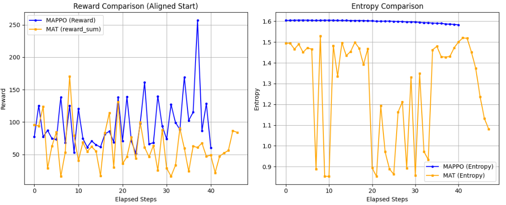
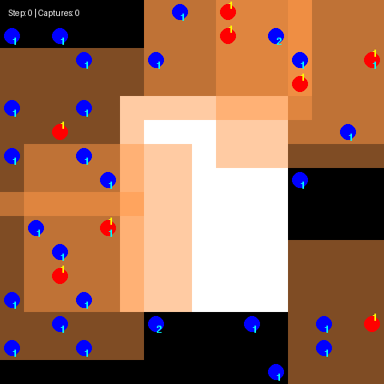
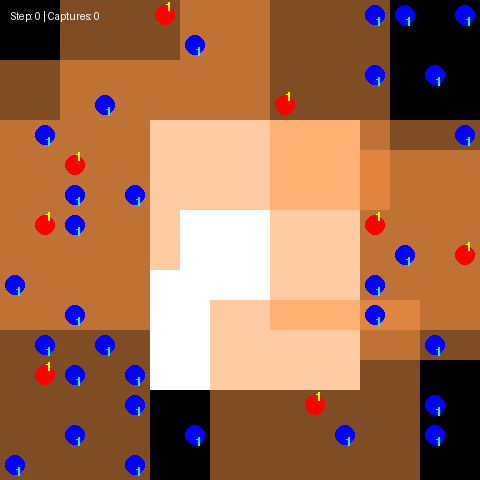

今日は毎週行っているPursuitの試行を扱っていきます。
先日のトライでモデルに他メンバーの事前行動、モデルをTransformerに替えることでチーム連携の動画が出来ることが分かりました。

ですが、敵を捕まえる動作でみんなで塊すぎたり、一角の敵を捕まえた後迅速に行動を切り替えるという面で課題がありました。
本日はそんな課題に対する対応を試してみようと思います。

## 前回の課題整理

### 課題整理
前回の試行の最後に記載した課題を引用します。

>現状前よりましになったかもしれないという程度で、例えばコンスタントに30人を捕まえるという状態にはなっていません。
>何より気になっているとのは敵を効率的に追い詰めるような動作とは、まだ言えません。みんなでとりあえず敵をおいかける、味方を見つけると集まりだす。そして一角の敵をとりつくすとなんとなくばらける。
>この繰り返しになっています。

### 原因の考察

現状の実装を踏まえて課題の原因を考えていきます。

**現在のActor (`MAPPO_TransformerActor`)**: Transformerは「7×7=49マスの空間トークン」に対して使われており、**エージェント間では自己注意していません**。各エージェントは「自分の局所視野＋全員の直前の行動履歴（40次元）」だけをもとに、独立に行動分布を出力しています。つまり今の意思決定は事実上**同時・独立**（現在のことは知らず、直前ステップの行動しか他人の情報がない）です。

**現在のCritic (`MAPPO_TransformerCritic`)**: こちらは既に8体×49マス＝392トークンを1つのシーケンスとして自己注意しており、**エージェント間の相互作用は実質的に考慮済み**です。ただし出力は1つのプールされたグローバル特徴を全エージェントで使い回し、エージェントID埋め込みで区別しているだけなので、各エージェント自身の文脈化された表現から直接valueを出しているわけではありません。

ここでもし、本質的に**Actor側に「今この瞬間の他エージェントの意思決定」を条件づける自己回帰構造を導入する**ことが出来れば。つまり：

$$\text{現状: } \pi_i(a_i \mid o_i, \text{全員の直前の行動}) \quad\longrightarrow\quad \text{理想形: } \pi_i(a_i \mid o_1,\dots,o_8,\ a_1,\dots,a_{i-1})$$

現在の状態を見ながら配置を、こうしていこうという思考に持っていければ、今この瞬間のベストを選択できるようになります。

### 対策案

ずばり、前回本ブログで説明したMATが解決手段でなるのではと考えています。
今回課題に対してMATを使うメリットは、**「Actor側に自己回帰的な協調構造を直接組み込める」**点に集約されます。MAPPOとの比較で整理します。

__1. 現在のMAPPO系の構造と課題__
ご説明の通り、現在の実装は概ね以下の構造です。

- **Actor (`MAPPO_TransformerActor`)**：
  - 各エージェントは「自分の局所視野＋全員の直前行動履歴」だけを見て、**独立に行動分布を出力**。
  - Transformerは空間トークン（7×7）に対してのみ自己注意し、**エージェント間の自己注意はなし**。
  - つまり、**「今この瞬間の他エージェントの意思決定」を条件づけられていない**。
- **Critic (`MAPPO_TransformerCritic`)**：
  - 8体×49マス＝392トークンを1シーケンスとして自己注意し、**エージェント間の相互作用は考慮済み**。
  - ただし、出力はグローバル特徴を全エージェントで使い回す形で、**各エージェントの文脈化された価値関数**を直接出しているわけではない。

結果として、
- **Actorは「同時・独立」に行動を決める**ため、
  - 「誰がどの敵を追うか」「どの方向に散開するか」といった**協調的な配置・役割分担**をリアルタイムで調整しづらい。
- Criticは「全体として良いか悪いか」は評価できるが、
  - **「今この瞬間、誰が何をすべきか」をActorに直接伝える構造にはなっていない**。

__2. MATを使うと何が変わるか__

MATは、**MARLを「観測系列 → 行動系列」の系列モデリング問題として扱う**手法です[arXiv](https://arxiv.org/abs/2205.14953)。

- **中央集権Transformer**で、
  - 入力：全エージェントの観測系列
  - 出力：全エージェントの行動系列
  を**自己回帰的に生成**します。
- **multi-agent advantage decomposition theorem** により、
  - 共同行動の最適化を「エージェントを順番に決める系列決定問題」に変換し、
  - あるエージェントの行動を決めるとき、**それ以前に決まったエージェントの行動を固定**し、自分の行動だけを最適化します[arXiv](https://arxiv.org/abs/2205.14953)。

この構造を現在の課題に当てはめると、

$$\text{現状: } \pi_i(a_i \mid o_i, \text{全員の直前の行動})$$

$$\text{MAT: } \pi_i(a_i \mid o_1,\dots,o_8,\ a_1,\dots,a_{i-1})$$

という**自己回帰的な条件づけ**が可能になります。

__3. MATを使うメリット（現在の課題に対する具体的な効果）__

__(1) 「今この瞬間の他エージェントの意思決定」をActorが直接見られる__
- MATのデコーダは、
  - エージェント1の行動 → エージェント2の行動 → … という順序で**系列生成**します。
  - エージェント i の行動を決めるとき、**すでに決まったエージェント1〜i-1の行動**を条件として利用できます。
- これにより、
  - 「誰がどの敵を追っているか」「どの方向に散開しているか」を**リアルタイムで把握**し、
  - 「自分は空いている敵を追う」「味方と重ならない方向に移動する」といった**協調的な役割分担**が自然に学習できます。

__(2) 協調的な配置・包囲行動の学習が容易になる__
- 現在の「みんなで一角の敵をとりつくす → ばらける」という挙動は、
  - **局所的に敵が密集していると全員がそこに集まり、敵がいなくなると方向性を失う**という、独立Actorの限界を反映しています。
- MATのように**自己回帰的に行動を決める**と、
  - 「先に決まったエージェントが敵Aを追っているなら、自分は敵Bを追う」
  - 「味方が左側を固めているなら、自分は右側に回り込む」
  といった**空間的な役割分担**を、系列モデルとして自然に表現できます。

__(3) Criticの役割が「全体評価」から「系列生成のガイド」に近づく__
- 現在のMAPPOでは、Criticは「全体として良いか悪いか」を評価しますが、
  - Actorは独立に行動を決めるため、**「誰が何を変えるべきか」が曖昧**になりがちです。
- MATでは、
  - **系列生成の過程そのものが協調構造**になっており、
  - Criticは「この行動系列（＝協調パターン）が全体として良いか」を評価する役割を持ちます。
- これにより、
  - **「協調的な行動系列」そのものを学習対象**にできるため、
  - 「敵を効率的に追い詰めるような動作」を**一連の協調パターンとして捉えやすくなります**。

__(4) 理論的保証による安定した協調学習__
- MATは、multi-agent advantage decomposition theorem に基づき、
  - **単調性能改善（monotonic performance improvement）**が保証されています[arXiv](https://arxiv.org/abs/2205.14953)。
- これは、
  - 協調パターンが崩れたり、学習が不安定になったりするリスクを減らし、
  - **「敵を効率的に追い詰める」ような協調行動が、学習の進行に伴って確実に改善されていく**ことを期待できます。

__4. まとめ：現在の課題に対するMATの位置づけ__
- 現在のMAPPO系実装では、
  - Actorが**同時・独立**に行動を決めるため、
  - 「今この瞬間の他エージェントの意思決定」を条件づけられず、
  - 結果として「みんなで一角を固める → ばらける」という**協調の質が低い挙動**になっています。
- MATを使うと、
  - **Actor側に自己回帰的な協調構造を直接組み込める**ため、
  - 「誰がどの敵を追うか」「どの方向に散開するか」を**リアルタイムで調整**できるようになります。
  - これにより、「敵を効率的に追い詰めるような動作」を**一連の協調パターンとして学習**しやすくなります[arXiv](https://arxiv.org/abs/2205.14953)。

したがって、**「協調的な配置・役割分担をActor側で直接表現したい」という現在の課題に対して、MATは適切な対策**となりえると言えます。

## MAPPOとの比較

MATを使うメリットを、ここまで使ってきた**MAPPO（Multi-Agent PPO）と比較して**整理すると、以下のようになります。

### 1. 性能（報酬・タスク達成度）
- **MAT**：
  - StarCraftII、Multi-Agent MuJoCo、Google Research Football などのベンチマークで、**MAPPOやHAPPOを上回る性能**を示すことが報告されています[arXiv](https://arxiv.org/abs/2205.14953)。
  - Transformerの自己注意により、**長期的な依存関係や複雑な協調パターン**を捉えやすいため、複雑な協調タスクで有利です。
- **MAPPO**：
  - 強力なベースラインではありますが、**単純なMLP＋PPO**の構造では、Transformerほどの表現力を持たないため、**特に長い時間スケールの協調**ではMATに劣る傾向があります。

**→ 性能面では、MATの方が多くのベンチマークで優位。**

### 2. スケーラビリティ（エージェント数に対する計算量）
- **MAT**：
  - **multi-agent advantage decomposition theorem** により、
    - 共同行動の最適化を「エージェントを順番に決める系列決定問題」に変換し、
    - エージェント数に対して**線形時間計算量**でスケールします[arXiv](https://arxiv.org/abs/2205.14953)。
- **MAPPO**：
  - 共同行動空間が大きくなると、**批評家（critic）の入力次元が急増**し、計算量・メモリ使用量が非線形に増大しがちです。
  - エージェント数が非常に多い場合、**スケーラビリティが課題**になります。

**→ 多数エージェント環境では、MATの方がスケーラブル。**

### 3. 汎化性能・few-shot適応
- **MAT**：
  - MARLを**系列モデリング問題**として扱うため、
    - Transformerの**汎化能力**を活かし、
    - 学習時に見ていないエージェント数やタスク設定にも**few-shotで適応できる**ことが報告されています[arXiv](https://arxiv.org/abs/2205.14953)。
- **MAPPO**：
  - 基本的には**学習時の環境・エージェント数に強く依存**し、
    - 環境が変わると再学習やファインチューニングが必要になることが多いです。

**→ 環境変化やエージェント数の変動に強いのはMAT。**

### 4. 理論的保証
- **MAT**：
  - 上記の分解定理に基づく更新則により、
    - **単調性能改善（monotonic performance improvement）** が理論的に保証されています[arXiv](https://arxiv.org/abs/2205.14953)。
  - 学習が進むにつれて性能が必ず改善（または維持）されるため、**安定した学習曲線**が期待できます。
- **MAPPO**：
  - PPO系のクリッピングにより安定性は高いものの、
    - **単調改善の保証はなく**、ハイパーパラメータに敏感な場面もあります。

**→ 理論的保証の面ではMATが優位。**

### 5. 実装・運用のしやすさ
- **MAT**：
  - **中央集権型Transformer**で全エージェントの行動を系列生成するため、
    - モデル構造がやや複雑で、
    - 推論時も**中央で一括計算**する必要があり、**分散実行（各エージェントが独立に推論）には向きにくい**です。
  - Transformerの系列長が長くなると、**計算コスト・メモリ使用量が増大**しやすい。
- **MAPPO**：
  - CTDE（Centralized Training, Decentralized Execution）構造で、
    - 学習時は中央批評家を使うが、**実行時は各エージェントが独立に行動**できる。
  - PPOベースで実装がシンプルで、**既存のPPOコードを流用しやすい**。
  - 実システム（ロボット群、ゲームAIなど）での**分散実行と相性が良い**。

**→ 実装・運用のしやすさではMAPPOが有利。**

### 6. 計算コスト・学習効率
- **MAT**：
  - Transformerの自己注意は**系列長の二乗に比例**する計算コストを持つため、
    - 長い軌跡や多数エージェントを扱うと**計算負荷が高くなりがち**です。
  - ただし、エージェント数に対しては線形スケールするため、**エージェント数が非常に多い場合には相対的に有利**になることもあります。
- **MAPPO**：
  - MLPベースの批評家・アクターで、**計算コストは比較的軽め**。
  - ハイパーパラメータチューニングが比較的容易で、**実装・実験の回転が速い**。

**→ 計算資源が限られる場合や、実験の速さを重視する場合はMAPPOが有利。**

## 実装

完成版コードは以下のレポジトリに保管致しました。

https://github.com/Shinichi0713/Reinforce-Learning-Study/tree/main/miulti-agent/petting_zoo/src/4_pursuit

実装のキーポイントについてまとめていきます。

### 1. モジュール構成のキーポイント
MATは大きく3つのモジュールに分かれています。

__(1) `MATObsEncoder`：各エージェントの局所観測を要約__
- 元の `MAPPO_TransformerActor` の空間Transformer部分を流用し、
  - 7×7マスの局所観測（＋全員の直前行動履歴）を
  - **1エージェント分の d_model 次元の要約ベクトル**に変換します。
- 特徴：
  - 空間トークン（49マス）に対して自己注意し、**自分の位置（中心マス）の特徴**を抽出。
  - 全員の直前行動履歴を埋め込んで、**直前ステップの協調情報**を条件づけています。

__(2) `MATEncoder`：8体分の要約特徴を相互に文脈化__
- 8体分の要約特徴を1つの系列（8トークン）とみなし、**エージェント間で自己注意**させます。
- 元の `MAPPO_TransformerCritic` が「392トークン（8体×49マス）を1シーケンスとして自己注意」していたのを、
  - **「8トークン（各エージェント1トークン）」に圧縮**した形です。
- 出力：
  - `enc_out`：相互に文脈化された各エージェントの表現（B, 8, d_model）
  - `values`：各エージェントの価値推定（B, 8）

__(3) `MATDecoder`：自己回帰的に行動系列を生成__
- エージェント0→1→…→7の順に、
  - **直前エージェントの実際の行動を条件として**次のエージェントの行動分布を予測します。
- 構造：
  - `TransformerDecoder` を使用し、**因果マスク（causal_mask）** で「自分より後のエージェントは見えない」ように制限。
  - `START` トークンから始め、`autoregressive_decode` で実際に1体ずつサンプルしながら系列を生成。

### 2. 自己回帰デコーダのキーポイント
MATの核心は、**「エージェントを順番に決める系列決定問題」としてMARLを扱う**点です。

__(a) 学習時（`forward_train`）：教師強制__
- 入力：
  - `joint_obs`：全エージェントの観測（B, 8, obs_dim）
  - `joint_actions`：ロールアウト時に実際に取った行動（B, 8）
- 処理：
  1. `enc_out` をエンコーダで計算。
  2. 行動系列を1つ右にシフトし、`[START, a_0, a_1, ..., a_6]` を作成。
  3. デコーダに `enc_out` と `shifted_actions` を渡し、**各位置の行動ロジット**を計算。
  4. `Categorical` 分布からログ確率・エントロピーを算出。
- これにより、
  - **「a_i を予測するとき、a_0〜a_{i-1} を条件として見ている」**という自己回帰構造を教師強制で学習します。

__(b) 推論時（`autoregressive_decode`）：実際に1体ずつサンプル__
- エージェント0から順に、
  - 現在までの行動系列（`current_input`）をデコーダに入力し、
  - 次のエージェントの行動をサンプル（またはgreedy選択）して系列を伸ばします。
- これにより、
  - **「今この瞬間の他エージェントの意思決定」をリアルタイムで条件づけ**ながら行動を決めることができます。

### 3. 学習アルゴリズム（`MAT_PPO`）のキーポイント
- **PPO（Proximal Policy Optimization）**をベースに、
  - Actor（デコーダ）と Critic（エンコーダのvalue_head）を同時に更新します。
- 特徴：
  - **各エージェントごとに独立した価値関数（values: B, 8）** を持ち、
    - 元のMAPPOのように「1つのグローバル特徴を全員で使い回す」構造ではありません。
  - 行動確率は**自己回帰的な系列分布**として計算されるため、
    - PPOのクリップ対象は「各エージェントの行動確率」ですが、
    - その背後には**エージェント間の協調構造（系列生成）** が含まれています。

### 4. MAPPOとの違い（実装上の観点）
__(1) Actor側の構造__
- **MAPPO**：
  - 各エージェントが独立にMLP/Transformerで行動分布を出力（同時・独立）。
- **MAT**：
  - 1つのデコーダが**全エージェントの行動系列を自己回帰的に生成**。
  - Actorは「今この瞬間の他エージェントの意思決定」を条件として見られる。

__(2) Critic側の構造__
- **MAPPO**：
  - 多くの実装では、**1つのグローバル特徴を全エージェントで使い回し**、エージェントID埋め込みで区別。
- **MAT**：
  - `MATEncoder` で8トークンを相互に文脈化し、**各エージェントごとに独立したvalue**を出力。
  - これにより、「どのエージェントがどの程度貢献しているか」をより細かく評価できます。

__(3) 協調の表現__
- **MAPPO**：
  - Criticは全体の協調を評価するが、Actorは独立に行動を決めるため、**協調パターンが暗黙的**。
- **MAT**：
  - **系列生成そのものが協調パターン**であり、
  - 「誰がどの敵を追うか」「どの方向に散開するか」を**明示的な系列として学習**します。

## 学習の効果

### ロスと報酬の推移

ロスと報酬の推移を前回のMAPPOと比較しました。
期待していたMATですが、あまり、芳しくない可能性があります。。
なぜかエントロピが波打つ傾向が出ました。

### 実際の動作

学習させたエージェントで動作させた結果は以下の動画の通りです。
うーん。。。
先日結果と大きな違いが感じられません。

因みに、"もしかしたら報酬を捕獲だけにしたら、捕獲の効率化を目指すのでは？"と考えて敵を追跡に対して報酬を無くすよう報酬を加工してみました。
結果、タコがとどまって、獲物が近づくと捕まえにいく、という待ち構え方になってしまいました。

MATでも改善はしていないという結論になりそうです。

## 総括

今回の試行についてまとめていきます。

### 1. 現状の課題（MAPPO系実装の限界）
- Actorは**各エージェントが独立に行動を決める**ため、「今この瞬間の他エージェントの意思決定」を条件づけられない。
- 結果として「みんなで一角の敵をとりつくす → ばらける」という**協調の質が低い挙動**が続いている。

### 2. MAT導入の狙い（理論的・構造的なメリット）
- MARLを**系列モデリング問題**として扱い、中央集権Transformerで**全エージェントの行動を自己回帰的に生成**。
- Actorが **$\pi_i(a_i \mid o_1,\dots,o_8,\ a_1,\dots,a_{i-1})$** のように、「今この瞬間の他エージェントの意思決定」を直接条件づけられる。
- multi-agent advantage decomposition theorem により**単調性能改善が理論的に保証**され、安定した協調学習が期待できる。

### 3. MAPPO vs MAT の比較（超要約）
- **性能・理論保証・スケーラビリティ・汎化**：MATが優位。
- **実装のしやすさ・分散実行・計算コスト**：MAPPOが優位。

### 4. 実装のポイント（MATの構造）
- **MATObsEncoder**：各エージェントの局所観測を1トークンに要約。
- **MATEncoder**：8体分の要約特徴を相互に文脈化し、**各エージェントごとの価値関数**を出力。
- **MATDecoder**：エージェント0→…→7の順に、**直前エージェントの実際の行動を条件として**次のエージェントの行動分布を予測（因果マスク付きTransformerDecoder）。
- 学習はPPOベースで、**自己回帰的な系列分布**として行動確率を扱う。

### 5. 実験結果と結論
- ロス・報酬の推移を見ても、**MAPPOから決定的な改善は見られず**、エントロピーが波打つなど学習の安定性も課題。
- 実際の動作では、「みんなで一角の敵をとりつくす → ばらける」という**協調の質が低い挙動**は改善されていない。
- 報酬を「捕獲のみ」に絞ると、**待ち構え型（敵が近づいたら捕まえる）**に変わるだけで、効率的な追い詰め行動には至らない。
- **結論**：MATは理論的には強力だが、今回の環境・実装・報酬設計では**MAPPOから決定的な改善には至らなかった**。協調の質を上げるには、モデル構造だけでなく**報酬設計・観測設計・学習安定化の総合的な見直しが必要**。

