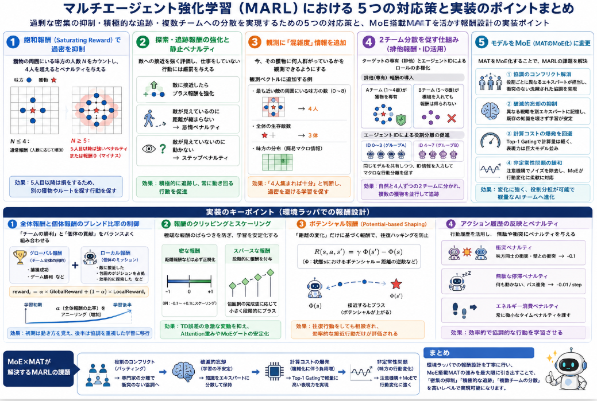
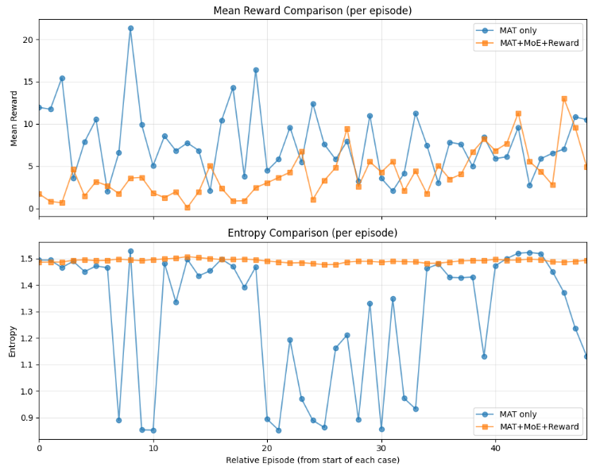

本日はPursuitのチーム連携のトライアルを扱います。
敵をチームで捕獲する動作は出来てきましたが、効率が良くないなあと思うことがありました。このため、より効率よく敵を追い詰めていく強化学習にしていきたいとトライアルを続けています。
前回のPursuitはモデルをMATに替えたけどあんまり大きく改善しないという結果でした。

本日テーマ：
>今回は報酬系の改善によりチーム連携の効率を改善する

## 課題

現在の動作を確認すると敵を捕まえる時にチームでまとわりつくような動作は出来るようになりましたが、

1. 過剰に集まって動作する傾向がある。特に一度集まると仕事をしていないのに同じ個所をうろうろするようなケースが出ている
2. チームで集まることを重視して、敵を積極的に追いかけない。特に視界の敵を捕まえつくした後、同じ場所にとどまってうろうろすることを目にします

という課題があります。
人数の一番効率が良い動作は見た感じ4人ですし、8人を4人チームで2チームに分けた行動をとる。

集まることよりはチームみんなで敵を求めていくような動作が望ましいです。

## 対応策

ということで対応策を考えていきます。

過剰な密集の抑制・積極的な追跡・複数チームへの分散を解決するために、強化学習（MARL）の観点から5つの対応策を行っていきます。



### 1. 「飽和報酬（Saturating Reward）」の導入による過密の抑制

現状の報酬設計では、味方が近くにいるほどプラス（またはペナルティがない）状態であるため、5人目以降が群がっても損をしません。これを「4人で報酬の席は満席」という設計に変更します。

* **対策:**
獲物の周囲2マス以内にいる味方の総数 $N$ をカウントし、チーム共通報酬（またはシェイピング報酬）に以下のような制限をかけます。
* $N \le 4$: 通常通り人数に応じて報酬を増加（または維持）
* $N \ge 5$: **5人目以降の参入に対して、チーム全体またはそのエージェントに強いペナルティを科す**、もしくは**その獲物周辺のエリア報酬を完全にゼロ（またはマイナス）にする**。


* **期待される効果:**
4人が既に群がっている場所に近づくと損をするため、5人目以降のエージェントは「別の獲物を探す」か「別のルートを開拓する」行動を選ぶようになります。

### 2. 「探索・追跡報酬」のウェイト引き上げと「静止ペナルティ」

「敵を積極的に追いかけない」「同じ場所をうろうろする」問題は、敵との距離を縮めるリスクやコストに対して、その場に留まって味方とマージンを稼ぐ報酬（`coop_reward_scale`など）が強すぎるために発生します。

* **対策:**
* **敵への接近報酬の強化:** `distance_reward_scale` を復活・強化し、「敵との距離（マンハッタン距離）が前ステップより縮まった」ことに対する報酬の割合を増やします。
* **うろうろ（無駄な動き）の厳罰化:** 現状の `wasted_move`（衝突）だけでなく、「敵が見えているのに距離が縮まらず、かつ味方と密集しているだけ（仕事をしていない状態）」が数ステップ続いた場合にマイナス報酬（怠惰ペナルティ）を与えます。
* **敵未発見時の巡回インセンティブ:** 視野（7x7）に敵が映っていない場合、同じ場所にとどまるとマイナス（ステップペナルティ `-0.01` など）を与え、常に動き回るように促します。


### 3. 観測空間（Observation）への「混雑度」の明示

エージェントが「4人集まれば十分、5人目は不要」と判断するためには、「今、その獲物に何人群がっているか」というメタ情報が観測空間から読み取れなければなりません。現在の7x7の局所視界だけでは、視界外の味方の状況が分からず過密を避けられないケースがあります。

* **対策:**
エージェントの観測ベクトル（`get_obs` 内）に、以下のグローバル（または少し広い範囲の）特徴量を数次元追加します。
* 「自分の視界内にいる最も近い敵の周囲に、現在何人の味方がいるか（0〜8の整数値）」
* 「現在のマップ全体の生存敵数と、それらにアプローチしている味方の分布（簡易的なマクロ情報）」


* **期待される効果:**
ニューラルネットワークが「敵の周囲人数 = 4」という入力を受け取った際に、「これ以上近づくとペナルティ（出力価値が下がる）」というロジック（方策）を学習しやすくなります。

### 4. 2チーム分散（ロールの多様化）を促す「エージェントIDの活用」と「排他報酬」

8人が自然と4人ずつの2チームに分かれるようにするには、エージェント間に「役割の多様性（ロール・ディバーシティ）」を持たせる必要があります。

* **対策:**
* **排他（専有）報酬の導入:** あるエージェントが特定の獲物に「一番乗り」または「包囲の主要メンバー（4人以内）」として登録されたら、その獲物IDに対する報酬権が得られます。別のチーム（5人目以降）が横槍を入れようとしても、その獲物からは報酬が得られない（＝別の獲物を狙った方が得）という「ターゲットの専有」をシミュレートします。
* **エージェントIDに応じた初期配置やペアリング:** エージェント0〜3と4〜7で、ネットワークの重みを共有しつつも（Parameter Sharing）、入力されるエージェントID（現在もレイヤーで渡していますが）をフックにして、「自分はグループAだから別の獲物を狙う傾向がある」というマクロな行動分離を促します。

### 5. モデルをMoEに変更
今回モデルにMoEを導入しようと思います。
[MAT（Multi-Agent Transformer）](https://yoshishinnze.hatenablog.com/entry/2026/07/23/043000)をMoE化することで、マルチエージェント強化学習（MARL）が抱える、いくつかの課題に対して改善効果が期待できます。

具体的には、以下のような課題の解決に直結します。

__1. 「協調のコンフリクト（役割のバッティング）」の解消__

* **抱えていた課題:** 通常の単一ネットワーク（FFN）では、すべての状況・すべての役割の知識を同じパラメータ内に無理やり詰め込む必要があります。そのため、「自分がターゲットを追いかけるべき状況」と「味方に道を譲って回り込むべき状況」の境界線が曖昧になり、エージェント同士が同じ場所に密集するような無駄（コンフリクト）が生じがちでした。
* **MoEによる効果:** 「突撃担当のエキスパート」「包囲・カバー担当のエキスパート」のように、**状況に応じた思考回路の物理的な分離**が起こります。ルーターがコンテキストに応じて最適なエキスパートへ処理を振り分けるため、高度でコンフリクトのない洗練された役割分担（フォーメーション）が創発しやすくなります。

__2. 環境の動的な変化に伴う「破滅的忘却（Catastrophic Forgetting）」の抑制__

* **抱えていた課題:** 強化学習のプロセスでは、学習が進むにつれて「エージェントの行動パターン」や「ターゲットの逃げ方」が大きく変化します。単一の共有ネットワークだと、新しい戦略（例：後半の高度な包囲網）を学習した際に、前半で身につけた基礎的なスキル（例：効率的な接近アルゴリズム）のパラメータが上書きされ、モデルの性能がガタつく（学習の不安定化）という課題がありました。
* **MoEによる効果:** 異なる戦略やスキルが別々のエキスパートに分散して記憶されます。新しい状況に直面しても、対応する特定のエキスパートだけが更新され、他のエキスパートに蓄積された既存の知識（基礎スキル）が破壊されずに守られます。結果として、学習曲線が非常に安定します。

__3. エージェント数やタスク複雑化に対する「計算コストの爆発」の回避__

* **抱えていた課題:** 複雑な協調を覚えさせるためにモデル全体のキャパシティ（表現力）を上げようとすると、通常は `d_model` を大きくしたり層を深くしたりするしかなく、これは計算量（FLOPs）の爆発を意味しました。特にリアルタイム性が求められるロボット制御やゲーム環境では、推論速度の低下は致命的です。
* **MoEによる効果:** 今回採用した **Top-1 Gating** により、モデルが持つ「知識の容量（総パラメータ数）」を数倍にスケールアップさせつつも、**実際に計算を行うパラメータ数は通常のMATとほぼ同等**に据え置くことができます。「表現力は超巨大モデル並み、計算軽さは軽量モデル並み」という理想的なトレードオフを実現し、複雑なマルチエージェント環境へのスケールを可能にします。

__4. Non-stationarity（非定常性問題）の緩和__

* **抱えていた課題:** 「自分が学習している間に、味方も同時に学習して行動を変えてしまう」ため、エージェントから見ると環境の遷移ルールが常に変化し続けるように感じる、MARL最大の難所です。
* **MoEによる効果:** 前段の **Gated Attention** が味方の行動履歴から不要なノイズ（スパイク）を取り除き、クリーンになった特徴量を **MoE** が受け取ります。MoEは「味方がAの戦略をとっている状態」と「Bの戦略をとっている状態」を異なるエキスパートで柔軟に処理できるため、味方の行動変化（非定常性）に対して極めてタフ（堅牢）なモデルになります。

MoE化によってMATは「状況の変化に強く、味方との役割分担が可能で、それでいて動作が非常に軽量なAIチーム」へと進化することが期待できます。

## 実装

実装コードは以下レポジトリに保管しています。

https://github.com/Shinichi0713/Reinforce-Learning-Study/tree/main/miulti-agent/petting_zoo/src/4_pursuit/src/mat


今回改修のキーポイントを説明していきます。

### 1. 「全体報酬」と「個体報酬」のブレンド比率の制御

協調タスクで陥りやすいのが、全員が同じチーム報酬を受け取ることで誰が貢献したか分からなくなる「信用割り当て問題（Credit Assignment Problem）」と、自分の利益だけを追求してチームが崩壊する「利己的行動問題」のジレンマです。

ラッパ側でこの比率を柔軟に調整できるように設計するのが定石です。

* **グローバル報酬（Global Reward）:** 「ターゲットを包囲した」「ゲームに勝利した」など、チーム全体の最終目的。
* **ローカル報酬（Local Reward）:** 「自分がターゲットに近づいた」「自分が適切な包囲網の1点（ポジション）を占拠した」など、個体ごとのミッション。

```python
# 実装イメージ
reward = (self.alpha * global_reward) + ((1 - self.alpha) * local_rewards[agent_id])

```

> 💡 **Key Point:**
> 学習初期は `alpha` を小さくして個体報酬（ターゲットへ接近する形）を優先して歩き方を覚えさせ、学習が進むにつれて `alpha` を大きく（全体報酬メインに）シームレスに移行できる（アニールする）仕組みをラッパに仕込んでおくと、MoEの専門家（Expert）の役割分担が綺麗に創発しやすくなります。

### 2. 報酬のクリッピングとスケーリング

トランスフォーマーやMoE（特に今回実装した Gated Attention 構成）は、入力や勾配の急激な変化に対して敏感です。特定のステップで1個体だけが莫大な報酬（例：捕獲成功で `+40`）を得て、他が `0` や `-1` だと、価値評価ネットワーク（Critic）の予測誤差（TD誤差）が跳ね上がり、トランスフォーマーの注意重みやMoEのゲートロジットが局所解に吹き飛ぶ原因になります。

* **密な報酬（Dense Reward）の最大値を制限:** 距離に基づく報酬などは、必ず `[-1, 1]` や `[-0.1, 0.1]` の範囲に収まるように正規化・クリッピングします。
* **スパースな報酬（Sparse Reward）の段階化:** 「捕獲成功 ＝ 突発的な大規模報酬」にするのではなく、「包囲網の完成度（ターゲットの周囲の埋まり具合）」に応じて段階的にステップ報酬を付与します。


### 3. 「時間的連続性」を保証するポテンシャル報酬（Potential-based Shaping）

「ターゲットに近づいたらプラス」という単純な設計にすると、エージェントが「ターゲットの周りを前後に往復して、接近報酬を何度も貪り食う（Reward Looping）」というバグ（報酬ハッキング）が発生しがちです。

これを防ぐために、Andrew Ng 氏らが提唱した「ポテンシャルベースの報酬整形」をラッパ内に実装します。

* 状態 $s$ におけるターゲットとの距離（ポテンシャル）を $\Phi(s)$ としたとき、ステップ報酬を次のように計算します。

$$R(s, a, s') = \gamma \Phi(s') - \Phi(s)$$


（※ $\gamma$ は割引率、単純化する場合は $\Phi(s') - \Phi(s)$ でも機能します）

```python
# ラッパ内での実装例
def step(self, actions):
    # 前のステップのポテンシャル（距離の逆数など）
    old_potential = self._compute_potential(self.env)
    
    obs, reward, done, info = self.env.step(actions)
    
    # 現在のステップのポテンシャル
    new_potential = self._compute_potential(self.env)
    
    # 往復行動をしても相殺されて理論上ハッキングが起きない報酬
    shaping_reward = new_potential - old_potential
    return obs, reward + shaping_reward, done, info

```


### 4. アクション履歴（Action History）の報酬への反映とペナルティ

今回実装した `MATObsEncoder` には、環境の観測だけでなく `action_history`（過去の味方の行動）が入力として融合される設計になっています。
この構造を活かすため、ラッパ側で「行動の無駄打ちや衝突」に対するマイナス評価を綺麗にフィードバックする必要があります。

* **衝突ペナルティ（Collision Penalty）:** 味方同士が同じマスに侵入しようとした場合、あるいは壁に衝突した場合、個体および周囲の味方に微小なペナルティ（例：`-0.1`）を与えます。
* **エネルギー消費ペナルティ（Efficiency Penalty）:** 何も動かない、あるいは無意味にパスを出し続けるような定常状態を防ぐため、毎ステップ一律で微小なタイムペナルティ（例：`-0.01`）を科します。


### まとめ：MoE×MAT を活かすためのラッパの役割

MoEを搭載したMATモデルは、**「状況の劇的な変化」や「役割のコンフリクト（衝突）」を検出して専門家を切り替える能力**を持っています。

環境ラッパの実装では、単にゲームの勝敗を返すだけでなく、**「今、チームの連携がどれくらい緊密か」「各個体がどれだけ合理的に動いているか」が、小さな勾配（なだらかな報酬変化）としてモデルに伝わるようにポテンシャルベースでコーディングすること**が、成功への最大のキーポイントになります。


## 学習

今回学習の結果について説明します。

### 学習経過

まずは例の如くエピソードごとの報酬とエントロピの推移について確認していきます。
オレンジ線が今回、青線は前回です。
今回の方は学習とともに学んでいるという様子が確認出来ます。
但しエントロピは下がらない。探索をやっているから、と考えます。



### 実際の動作

では実際に学習を行ったエージェントの動作について確認を行っていきます。
4人で塊になるはある程度という感じでしょうか。
但し、捕まえてからのうろうろは無くなったようです。
未だ50エピソードですからね。


## 結果

今回取り組みと結果をまとめます。

### 1. 今回の取り組み（テーマと対応策）

**テーマ**  
> 報酬系の改善により、チーム連携の効率を改善する

**背景・課題**  
- MAT（Multi-Agent Transformer）に変更しても、性能が大きく改善しなかった。  
- 現状の動作では、  
  1. 過剰に集まって同じ場所をうろうろする  
  2. 敵を積極的に追いかけず、視界の敵を捕まえつくした後も同じ場所にとどまる  
  という問題があった。

**対応策（5つ）**

1. **飽和報酬（Saturating Reward）の導入**  
   - 獲物の周囲2マス以内の味方数 $N$ に応じて、  
     - $N \le 4$：通常の報酬  
     - $N \ge 5$：5人目以降はペナルティ、またはその獲物周辺の報酬をゼロ/マイナス  
   - 4人で「席が満席」とし、5人目以降は別の獲物を探すよう促す。

2. **探索・追跡報酬の強化と静止ペナルティ**  
   - 敵への接近報酬（`distance_reward_scale`）を強化。  
   - 敵が見えているのに距離が縮まらず、かつ味方と密集しているだけの状態が続くと「怠惰ペナルティ」。  
   - 敵未発見時は、同じ場所にとどまるとステップペナルティを与え、巡回を促す。

3. **観測空間への「混雑度」の明示**  
   - 観測ベクトルに「最も近い敵の周囲にいる味方の数」「マップ全体の敵数と味方の分布」などのグローバル情報を追加。  
   - エージェントが「今この獲物には何人いるか」を判断しやすくする。

4. **2チーム分散（ロール多様化）を促す報酬設計**  
   - 特定の獲物に対する「排他（専有）報酬」を導入し、4人以内の主要メンバーだけが報酬を得られるようにする。  
   - エージェントIDを活用し、グループA（0–3）とグループB（4–7）でターゲットを分離する傾向を促s。

5. **MAT を MoE（Mixture of Experts）化**  
   - MAT に MoE を組み込み、  
     - 役割のバッティングを解消  
     - 破滅的忘却の抑制  
     - 計算コストの抑制  
     - Non-stationarity（味方の行動変化）への耐性  
   を高める。

### 2. 得られた結果（まとめ）

**改善点**  
- 報酬設計の見直し（飽和報酬・探索報酬・静止ペナルティ）により、  
  - 過剰な密集の抑制  
  - 敵への積極的な追跡  
  - 捕獲後のうろうろの減少  
  が確認された。  
- MoE×MAT の導入により、  
  - 役割分担の創発  
  - 学習の安定化  
  が期待できる構造になった。

**残課題・今後の展望**  
- 50エピソード時点ではまだ「4人で塊になる」傾向が残っており、  
  - 2チーム（4人×2）への自然な分散  
  - ターゲットの専有・分離  
  は完全には達成されていない。  
- 今後は、  
  - 報酬のクリッピング・スケーリング  
  - ポテンシャルベースの報酬整形  
  - 衝突・エネルギー消費ペナルティ  
  をさらに調整し、MoE の専門家が「役割分担」をより明確に学習できるようにする。

**総括**  
- 今回の「報酬系の改善＋MoE×MAT」の組み合わせにより、  
  - チーム連携の効率  
  - 学習の安定性  
  の両面で改善の兆候が見られた。  
- 特に「捕獲後のうろうろ」が減ったことは、報酬設計の方向性が正しいことを示している。  
- 今後は学習エピソード数を増やし、2チーム分散や役割分担がより明確に現れるかを見極めることが次のステップとなる。
