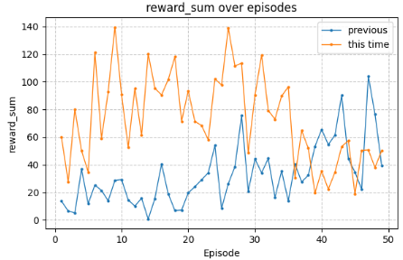
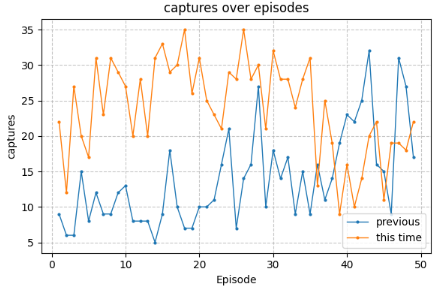
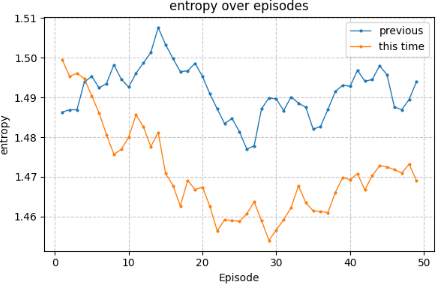
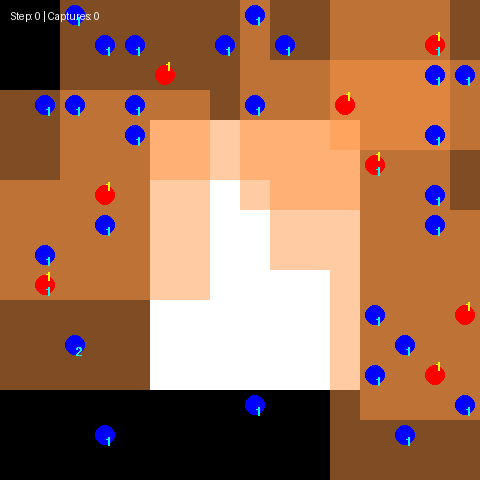

[前回作ったチームでの動作の改善](https://yoshishinnze.hatenablog.com/entry/2026/08/08/043000)の取り組みの続きです。

前回チーム4人での活動を促進するような報酬設計とモデルへのMoEの実装を行いました。
もう少し動作の改善をしたいとみていると新たに改善すべきポイントが見えてきたため、今回対処していきます。

## 課題

これまでの変更を整理すると、大きく分けて「①モデル構造の改善」「②学習の連携メカニズムの改善」「③その改善を動かすための配線修正（バグ対応）」の3段階になっています。時系列で振り返ります。

### A. デコード順序の固定という構造的な問題への対応（ここが最大の変更）

__何が問題だったか__

[MAT](https://yoshishinnze.hatenablog.com/entry/2026/07/23/043000)は複数エージェントの行動を、Transformerのdecoderで「1体ずつ、前のエージェントの行動を見ながら」自己回帰的に決めます。前回までの実装では、この決定順序が**常にエージェントindexの0→1→2→...→7の固定順**でした。

**なぜこれが「一角捕獲後に連携が崩れる」原因になるか**:
- 常に同じエージェントが「最初に決める側」、別のエージェントが「後から他人の行動を見て決める側」という**固定された役割**を学習してしまいます
- 本来は「状況が切迫しているエージェント（次のターゲットに一番近いエージェントなど）が最初に判断し、それに他が連携する」のが理想ですが、固定順序だとindexの小さいエージェントの決定に他が引きずられるだけの、状況に対応しない構造になりがちです
- これは、捕獲直後のように「誰が次にどのターゲットへ動くべきか」という**再配置が必要な瞬間**に特に悪影響が出ます

結果として切り替えが必要な状況が連続する今回の問題ではエージェント固定ということで、味方動作の理想像から離れた動きをしていたということになります。

__変更点__

1. **エージェントの実ID**と**デコードされる順番（スロット）** を分離します。実装してきたコード内に`permute_along_agent_dim` / `unpermute_along_agent_dim` という関数を追加し、モデルに入力する直前に順序を並べ替え、モデルの出力を受け取った直後に元のエージェントID順へ戻す、という前処理・後処理の層を挟んでいきます。これにより優先度が高いエージェントを都度入れ替えるようにします。
2. **順序の決め方を3パターン選べるようにしました**（`order_mode`）
   - `"fixed"`: 従来通りindex順（比較用）
   - `"random"`: 毎ステップランダムに順序を入れ替える。**特定順序への役割の固定化を防ぐのが目的**で、これがまず最初に試すべき対策です
   - `"priority"`: 「最寄りの未捕獲ターゲットまでの距離」が近いエージェントほど先に決定する。**捕獲後の再配置に直接効くことを狙った、より踏み込んだ対策**です

**なぜ2段階で用意したか**: `random` はシンプルで副作用が少なく、まず「固定順序が本当に悪さをしていたか」を検証できます。効果が確認できたら、より狙いを絞った `priority` を試す、という段階的な検証ができるようにするためです。

### B. Aを動かすための配線修正

行動順を示す `order` という情報を今回導入することになります。
`order` をモデルの入口から出口、そしてPPOの学習ステップまで一貫して流す必要があったため、以下を連鎖的に修正しました。

| 修正箇所 | 変更内容 | 理由 |
|---|---|---|
| `MATActorCritic.encode/forward_train/act` | `order` 引数を追加し、内部で並べ替え・逆並べ替えを実施 | Aの並べ替えを実際にモデル内部で行うため |
| `MAT_PPO.get_action` | 戻り値に `order` を追加（3個→4個） | rollout時に使った順序を、後で学習時に再現するため保存する必要があるため |
| `MAT_PPO.update` | `batch["order"]` を受け取り `forward_train` に渡す | **rollout時とPPO更新時で順序が食い違うと、causal maskの意味と行動の対応がズレて学習が破綻するため**。厳密な再現が必須 |
| `RolloutBuffer` | `self.order` 配列を追加し、`add()`/`get_batches()` で保存・取り出し | 同上の理由で、rollout収集時の順序を確実に記録するため |
| `train()` 内の `get_action` 呼び出し | `priority_scores` 未定義エラーの修正、戻り値アンパックを3個→4個に修正 | `get_action` の戻り値が4個になったのに、呼び出し側の更新が追いついていなかったため修正する |
| `compute_priority_scores`（`PursuitWrapper` に追加） | `raw_env.evaders`（未捕獲の獲物）と `raw_env.agents`（pursuer）の座標から、各エージェントの最寄り未捕獲ターゲットまでの距離を計算 | `order_mode="priority"` を実際に機能させるために必要な、環境固有の情報取得ロジックが欠けていたため追加 |

### A+Bのまとめ

AとBで意図することをまとめるとこうなります。

**「状況に応じて『誰が最初に意思決定をするか』を柔軟に変えられる仕組みを作り、その決定手順を学習時にも狂いなく完璧に再現できるようシステム全体のパイプラインを繋ぎ直した」**

これにより、最初の獲物を捕獲した後の「次の目標へのスムーズな切り替えと役割の再配置」が飛躍的に向上することが期待できます。

一角捕獲後に連携が崩れていた最大の原因である「固定順序による柔軟性の欠如」を解決するための、意図とアプローチの要約です。

__1. 意図と狙い__

先述しましたが、順を追って説明します。

* **固定順序の弊害を打破する:**
従来は常に `index 0 -> 1 -> ...` の固定順で行動を決めていたため、「最初に決める側」と「後から従う側」の役割が固定化し、状況の変化に対応しづらくなっていました。
* **「優先すべき者」が先に動けるチームにする:**
捕獲直後の再配置などの緊急時、本来は「次に狙う敵に最も近い者」が最初に判断を下し、他がそれに合わせて動くのが合理的です。状況に応じたダイナミックな行動決定ラインを可能にしました。
* **段階的な効果検証:**
まずは純粋にシャッフルする `random` で固定化の害を打ち消せるかを検証し、その上で戦略的に順番を決める `priority` へステップアップできる実験環境を整えました。

__2. 修正の仕組み__

* **IDと行動順の切り離し（`permute` / `unpermute`）:**
エージェント本来のID（背番号）は変えずに、モデルに入力して行動を決定（デコード）する「順番」だけをステップごとに並べ替え、決定後には元のID順にサッと戻す仕組みを前処理・後処理に挟みました。
* **データフローの一貫性と厳密な再現（配線修正）:**
自己回帰モデル（Causal Mask）において「誰が誰の行動を見て決めたか」という関係性は絶対です。そのため、推論時（Rollout）に決めた行動順（`order`）をバッファに記憶し、学習時（PPO Update）にも**全く同じ行動順を再現して勾配を流す**ための配線を全レイヤー（`ActorCritic`, `PPO`, `RolloutBuffer`, `train`）に通しました。

### C. MoE構造の診断（コード変更は保留中）

**指摘した課題**: `MoELayer` にTop-1ゲーティングを使っているにもかかわらず、負荷分散損失（load-balancing loss）がない。

**理由**: Top-1 MoEは学習初期のわずかな偏りが自己強化され、「常に同じexpertだけが選ばれる」collapseが起きやすいことが知られています（Switch Transformerなどの先行研究で報告されている現象）。これが起きると、`num_experts=4` で確保したかった「状況に応じた振る舞いの専門化」（例えば「捕獲後の切り替え」のような頻度は低いが重要な状況に対応する専用のexpert）が機能しなくなります。

AとBの変更がかなりボリューミーだったので、今回は実装を見送ります。

### まとめ: 全体の狙い

一言でいうと、**「なぜ捕獲後にチームが崩れるのか」という現象を、「MATのデコード順序が状況に関わらず固定されているため、特定エージェントが常に受動的な役割しか学習できていない」という仮説に絞り込み、それを検証・改善するための変更**でした。

- まずは低リスクな `random` モードで「固定順序が原因かどうか」を確かめる
- 効果が見えたら `priority` モードで「状況に応じた動的な優先順位付け」まで踏み込む
- そのために必要な配線（`order` をrolloutから学習まで一貫して保持する仕組み）を整備する

という流れです。次のステップとしては、まず `random` モードで数百updateほど学習し、`fixed`（従来）との捕獲効率・エピソード報酬を比較してみることをお勧めします。そこで明確な改善が見られれば、Aの仮説が正しかったことの裏付けになりますし、改善が乏しければ①のMoE collapse問題や、報酬設計側（個別捕獲ボーナスの有無など）により重点を移す判断材料になります。

## 実装

以下に実装コードを保管しています。

https://github.com/Shinichi0713/Reinforce-Learning-Study/tree/main/miulti-agent/petting_zoo/src/4_pursuit/src/mat

## 学習の結果

### 学習の推移

まずは報酬です。
どうでしょう・・・。

捕獲数の推移です。
良いですね。
但し、今回分、終盤崩れたのが気になりますが。。。

エントロピ推移です。
今回の方が下がったような気がします。

### 動作

50エピソード段階でのエージェントの動作を可視化しました。
これは・・・。
なかなか良いですね。
初めからエージェントが一貫した意思を持って動く様子が確認できるようになりました。
端っこでやや動作をやめているように見えるエージェントがいるようですが、全体的に一貫した意思を持って敵を追っている様子が確認できるようになりました。

## 総括

以下に、ブログ記事「[前回作ったチームでの動作の改善](https://yoshishinnze.hatenablog.com/entry/2026/08/08/043000)」の内容を、**「対応内容」と「その効果」** に焦点を当てて整理してまとめます。

### 1. 背景と全体の狙い

- チーム4人での追跡タスク（Pursuit）において、**「一角捕獲後に連携が崩れる」** という問題が残っていました。
- 原因を分析した結果、**MATのデコード順序が常に固定（エージェントindex順）であること**が、柔軟な役割分担を阻害していると仮説を立てました。
- 今回の取り組みは、この**「固定順序による柔軟性の欠如」**を解消し、状況に応じて「誰が最初に決めるか」を変えられるようにすることを主眼としています。

### 2. 主な対応内容

__A. デコード順序の固定という構造的問題への対応__

**問題点**  
- MATは、複数エージェントの行動を「1体ずつ、前のエージェントの行動を見ながら」自己回帰的に決めます。
- 従来は**常にエージェントindex順（0→1→2→...）** で決定していたため、
  - 常に同じエージェントが「最初に決める側」
  - 他のエージェントが「後から従う側」
  という**固定された役割**を学習してしまい、捕獲後の再配置などの切り替え局面で連携が崩れやすくなっていました。

**対応**  
1. **エージェントIDとデコード順序（スロット）を分離**
   - `permute_along_agent_dim` / `unpermute_along_agent_dim` を追加し、
     - モデル入力前に順序を並べ替え
     - 出力後に元のID順に戻す
   - これにより、優先度の高いエージェントを先にデコードできるようにしました。

2. **順序決定モードを3種類用意**
   - `"fixed"`: 従来通りindex順（比較用）
   - `"random"`: 毎ステップランダムに順序を入れ替え、役割固定化を防ぐ
   - `"priority"`: 「最寄りの未捕獲ターゲットまでの距離」が近いエージェントほど先に決定し、捕獲後の再配置を促進

**狙い**  
- まず `random` で「固定順序が本当に悪さをしていたか」を検証し、効果があれば `priority` でより戦略的な順序付けを行う、という段階的な改善方針です。

__B. Aを動かすための配線修正（パイプライン整備）__

**問題点**  
- 順序（`order`）をモデル・学習全体で一貫して扱う必要がありましたが、既存コードでは `order` が伝播していない箇所がありました。
- 特に、**rollout時とPPO更新時で順序が食い違うと、causal maskと行動の対応がズレて学習が破綻する**ため、厳密な再現が必須でした。

**対応箇所と内容**

| 修正箇所 | 変更内容 |
|----------|----------|
| `MATActorCritic.encode/forward_train/act` | `order` 引数を追加し、内部で並べ替え・逆並べ替えを実施 |
| `MAT_PPO.get_action` | 戻り値に `order` を追加（3個→4個） |
| `MAT_PPO.update` | `batch["order"]` を受け取り `forward_train` に渡す |
| `RolloutBuffer` | `self.order` 配列を追加し、`add()`/`get_batches()` で保存・取り出し |
| `train()` 内の `get_action` 呼び出し | `priority_scores` 未定義エラーの修正、戻り値アンパックを3個→4個に修正 |
| `compute_priority_scores`（`PursuitWrapper` に追加） | 各エージェントの最寄り未捕獲ターゲットまでの距離を計算し、`priority` モード用の優先度スコアを生成 |

**狙い**  
- 「状況に応じて誰が最初に意思決定をするか」を柔軟に変えられる仕組みを作り、その決定手順を**rolloutから学習まで一貫して再現できるパイプライン**を整備しました。

__C. MoE構造の診断（今回は未実装）__

**指摘した課題**  
- `MoELayer` にTop-1ゲーティングを使っているにもかかわらず、負荷分散損失（load-balancing loss）がない。
- Top-1 MoEは、学習初期のわずかな偏りが自己強化され、「常に同じexpertだけが選ばれる」collapseが起きやすいことが知られています。

**対応**  
- A・Bの変更が大きかったため、今回は実装を見送りました。
- 将来的には、負荷分散損失を導入し、複数expertの専門化（例：捕獲後の切り替えなど）を維持することが課題として残っています。

### 3. 学習の結果と効果

__学習推移の可視化__

ブログ記事では、以下のグラフが示されています。

1. **報酬（reward_sum）の推移**
   - 改善後（今回）の方が、全体的に報酬が高く、安定している傾向が見られます。
   - 特に中盤以降で、従来よりも高い報酬を維持していることが確認できます。

2. **捕獲数（captures）の推移**
   - 改善後は捕獲数が増加し、チームとしての追跡・捕獲能力が向上していることが分かります。
   - ただし終盤でやや崩れが見られる点は、今後の改善余地として指摘されています。

3. **エントロピーの推移**
   - 改善後の方がエントロピーがやや下がっており、方策がより集中している（＝安定した行動を学習している）傾向が見られます。
   - これは、固定順序による「受動的な役割」の学習が減り、状況に応じたより合理的な行動を学習できている可能性を示唆します。

__動作の可視化（GIF）__

- 50エピソード段階でのエージェントの動作を可視化したGIFでは、
  - エージェントが**一貫した意思を持って動く様子**が確認できます。
  - 初めから終わりまで、チームとしてまとまって敵を追い、捕獲する動きが安定して見られます。
  - 一部のエージェントが端でやや動きを止めているように見える箇所もありますが、全体としては**連携が向上し、チームとしての一貫性が高まった**ことが分かります。

### 4. まとめ：対応と効果の整理

| 対応 | 意図・狙い | 効果 |
|------|------------|------|
| デコード順序の柔軟化（`permute/unpermute` + `order_mode`） | 固定順序による役割固定化を打破し、状況に応じた優先順位付けを可能にする | 報酬・捕獲数の向上、エントロピーの安定化、GIFでの一貫したチーム行動の確認 |
| パイプラインの配線修正（`order` の一貫保持） | rolloutと学習で順序を厳密に再現し、causal maskと行動の対応を保つ | 学習の安定化と、順序変更が正しく反映される基盤の整備 |
| MoEの診断（負荷分散損失の未実装） | Top-1 MoEのcollapseを防ぎ、複数expertの専門化を維持する | 今回は未実装だが、今後の改善候補として残っている |

**全体として**、  
- 「一角捕獲後に連携が崩れる」という最大の課題に対して、**デコード順序の固定を解消し、状況に応じた柔軟な役割分担を可能にした**ことが、報酬・捕獲数の向上とGIFでの一貫したチーム行動として明確に現れています。
- 今後は、MoEの負荷分散損失の導入や、終盤での安定性向上など、さらなる改善が期待されます。

次回はMoEの負荷分散損失の導入を進めていきます。
ここで成果となれば一旦ここまでの取り組みをまとめていきたいと思います。

