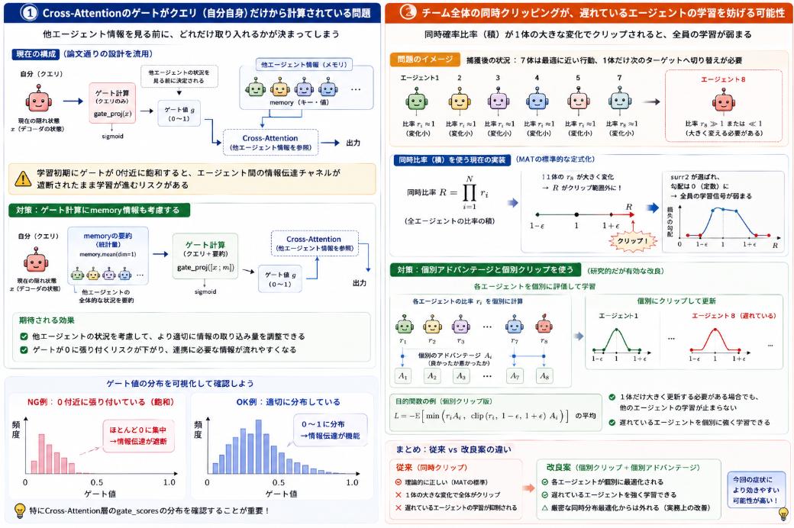
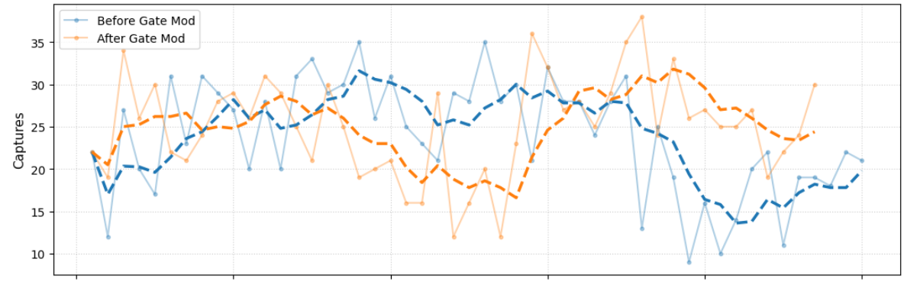
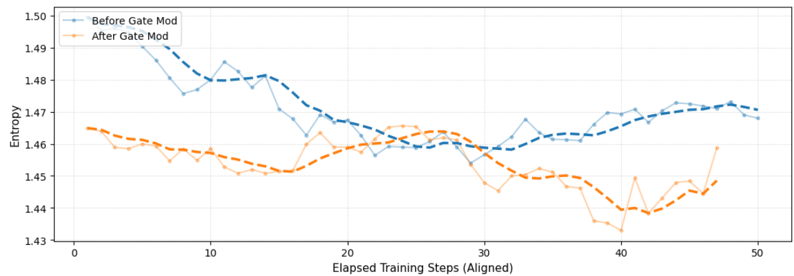
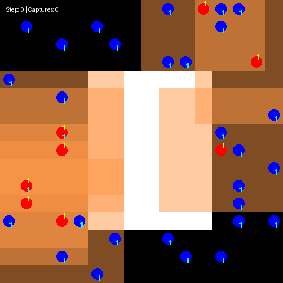

前回実施した[チーム連携の仕組みの改善](https://yoshishinnze.hatenablog.com/entry/2026/08/15/043000)の続きで、今回の結果が良ければ一旦、今回で区切りとしようと思います。

本日テーマ：
>Cross-Attentionゲートの改修を実施して、結果が改善するか確認

## 目的・経緯

このタスクは敵を味方が3人で周囲を囲んで、**捕獲**状態にすることが目的です。
3人で囲むということもやりやすいタスクではなく、行けそうと踏んだ敵に対して味方が連携しながら捕獲を実施する必要があります。

初めは捕獲することも出来ずバラバラに動いていました。
[この辺りの記事](https://yoshishinnze.hatenablog.com/entry/2026/07/25/043000)で初めて捕獲できるようになりました。

ですが、捕獲も安定せず、捕獲終わったと、味方がうろうろするようなことが多々ありました。

そこでMARLの強化学習法を[MAPPO](https://yoshishinnze.hatenablog.com/entry/2026/01/10/153824)から[MAT](https://yoshishinnze.hatenablog.com/entry/2026/07/23/043000)に替えました。

その後、MATの行動順序の見直し(固定エージェントでなくす)という修正で、敵から近いエージェントが攻撃対象を選択し、後続するエージェントが敵に近いエージェントの行動を見て行動を決めるという方法をとれるようにしました。

## 課題

今回の対応する課題について説明します。

### Cross-Attentionのゲートが「クエリ（自分自身）」だけから計算されている

```python
class MoETransformerDecoderLayer(nn.Module):
    def forward(self, tgt, memory, tgt_mask=None):
        ...
        # Cross Attention
        x = self.norm2(tgt)
        attn_out2, _ = self.multihead_attn(query=x, key=memory, value=memory, attn_mask=None)
```

`GatedMultiheadAttention` のゲートは `gate_proj(query)` として**クエリ（＝自分自身のデコーダ隠れ状態）のみ**から計算されます。これは自己注意（self-attention）では論文通りの妥当な設計ですが、**Cross-Attention（他エージェント情報の参照）でも同じ実装を流用**している点に注意が必要です。

Cross-Attentionのゲートが「自分の現在の隠れ状態」だけに依存すると、**「他のエージェント（memory側）が今何をしているか」を見る前に、どれだけその情報を取り入れるかが決まってしまう**構造になります。学習初期にこのゲートが0付近に飽和すると、**エージェント間の情報伝達（＝連携に必要なチャネル）がほぼ遮断されたまま学習が進む**リスクがあります。

**対策**: 一度、学習済みモデルで `gate_scores`（特にCross-Attention層のもの）の分布を可視化し、0付近に張り付いていないか確認してください。もし飽和していたら、ゲートの入力に `memory` の統計量（例: `memory.mean(dim=1)`）も連結して計算するよう変更することを検討してください。

```python
# Cross-Attention用にゲート計算をmemory情報も考慮する形に変更する案
self.gate_proj = nn.Linear(d_model * 2, d_model)  # query + memory summary
...
memory_summary = memory.mean(dim=1, keepdim=True).expand(-1, T, -1)
gate_scores = torch.sigmoid(self.gate_proj(torch.cat([query, memory_summary], dim=-1)))
```

### チーム全体の同時クリッピングが、遅れているエージェントの学習を妨げる可能性

```python
joint_new_log_prob = new_log_probs.sum(dim=-1)
joint_old_log_prob = old_log_probs.sum(dim=-1)
ratio = torch.exp(joint_new_log_prob - joint_old_log_prob)
...
surr1 = ratio * step_advantages
surr2 = torch.clamp(ratio, 1-eps, 1+eps) * step_advantages
actor_loss = -torch.min(surr1, surr2).mean() - ...
```

これ自体はMAT論文の標準的な定式化（同時確率比率＋共有アドバンテージ）通りなので「バグ」というほどのものではないかもしれませんが、副作用として次のようなことが起こりえます。

ある捕獲後の状況で、7体のエージェントはすでに最適に近い行動（比率≈1）を取っているが、1体だけが「次のターゲットへ切り替える」ために大きく方策を変える必要があるとします。この時、**同時比率（積）はその1体の大きな変化によって容易にクリップ範囲外に出ます**。クリップされると `surr2` が選ばれ、その勾配は比率に対して定数（勾配0）になるため、**その1体を含む全エージェントの当該サンプルへの学習信号がまとめて弱まります**。つまり「遅れているエージェントを個別に強く学習させたい」場面で、かえって学習が抑制されるという、集団最適化特有のジレンマが起きえます。

**対策（研究的だが効果があり得る）**:
- `clip_epsilon` をやや大きめにする、あるいはエピソード後半でclip範囲を緩和するスケジューリングを試す
- 可能であれば、アドバンテージだけでもエージェントごとの値（`(B, N)` のまま）を保持し、`step_advantages = advantages.mean(dim=-1)` で潰さずに、`(new_log_probs * advantages_per_agent).sum(-1)` のような**個別重み付けの和**に変更する（これは厳密なMATの定式化からは外れますが、実務上の改善として報告例があります）

```python
# 個別アドバンテージを保持する代替実装例
per_agent_ratio = torch.exp(new_log_probs - old_log_probs)  # (B, N)
surr1 = per_agent_ratio * advantages  # advantagesは(B, N)のまま
surr2 = torch.clamp(per_agent_ratio, 1-eps, 1+eps) * advantages
actor_loss = -torch.min(surr1, surr2).mean(dim=-1).mean() - entropy_coef * entropy.mean()
```
これにより、各エージェントが個別にクリップされるため、「1体だけ大きく更新が必要」という状況でも他のエージェントの学習が道連れで止まることがなくなります。MATの厳密な同時分布最適化ではなくなりますが、実用上はこちらの方が今回の症状には効きやすい可能性があります。



## 修正法

前節で説明した課題に対して行った修正法について説明します。

### 1. Cross-Attentionゲートがmemory情報を見ずに計算されている問題

__変更方針__

`GatedMultiheadAttention` は現在、Self-Attention・Cross-Attention共用の実装で、ゲートは常に `query` だけから計算されています。Cross-Attentionでは「相手（memory側）の情報を見てから、どれだけ取り入れるか」を決められた方が自然なので、**Cross-Attention専用のゲート付きAttentionクラス**を新設し、`query` と `memory` の要約の両方からゲートを計算するようにします。既存の `GatedMultiheadAttention`（Self-Attention用）はそのまま残し、影響範囲を限定します。

```python
# ==========================================
# 1-A. 🌟 追加: Cross-Attention専用のGated Attention
#      (ゲートを query と memory の両方から計算する)
# ==========================================
class GatedCrossAttention(nn.Module):
    """
    Cross-Attention用。ゲートスコアを「クエリ自身」だけでなく
    「参照先(memory)の要約情報」も考慮して計算する。
    これにより、他エージェントの状況を見た上でどれだけ情報を取り込むかを
    決定できるようにする。
    """
    def __init__(self, d_model, nhead):
        super().__init__()
        self.d_model = d_model
        self.nhead = nhead
        self.head_dim = d_model // nhead
        assert self.head_dim * nhead == d_model, "d_model must be divisible by nhead"

        self.q_proj = nn.Linear(d_model, d_model)
        self.k_proj = nn.Linear(d_model, d_model)
        self.v_proj = nn.Linear(d_model, d_model)

        # 🌟 変更点: 入力を [query, memory_summary] の連結 (d_model*2) にする
        self.gate_proj = nn.Linear(d_model * 2, d_model)

        self.out_proj = nn.Linear(d_model, d_model)

    def forward(self, query, key, value, attn_mask=None):
        # query: (B, T, d_model)  key/value(=memory): (B, S, d_model)
        B, T, _ = query.shape
        S = key.shape[1]

        q = self.q_proj(query).view(B, T, self.nhead, self.head_dim).transpose(1, 2)
        k = self.k_proj(key).view(B, S, self.nhead, self.head_dim).transpose(1, 2)
        v = self.v_proj(value).view(B, S, self.nhead, self.head_dim).transpose(1, 2)

        # 🌟 変更点: memoryの要約(平均)をqueryと連結してゲートを計算
        # memory側の「全体的な状況」(例: 他エージェントの平均的な移動意図)を
        # ゲート判断に反映させる
        memory_summary = value.mean(dim=1)  # ここではv_proj前のmemory=key/valueの元入力を使う方が直感的なので下で修正
        # -> 実際には key(=value, 通常同一)の元テンソルを使う。呼び出し側は key=value=memory なので:
        memory_summary = key.mean(dim=1, keepdim=True).expand(-1, T, -1)  # (B, T, d_model) 相当に拡張するため元次元のkeyを使う

        # 上のmemory_summaryはprojection後のk(=(B,S,d_model))ではなく元のmemoryテンソルを使うべきなので、
        # forward引数として元のmemoryテンソル(=key引数, projection前)を利用する
        gate_input = torch.cat([query, memory_summary], dim=-1)  # (B, T, d_model*2)
        gate_scores = torch.sigmoid(self.gate_proj(gate_input))   # (B, T, d_model)
        gate_scores = gate_scores.view(B, T, self.nhead, self.head_dim).transpose(1, 2)

        attn_logits = torch.matmul(q, k.transpose(-2, -1)) / np.sqrt(self.head_dim)

        if attn_mask is not None:
            if attn_mask.dtype == torch.bool:
                attn_logits = attn_logits.masked_fill(attn_mask.unsqueeze(0).unsqueeze(1), float('-inf'))
            else:
                attn_logits = attn_logits + attn_mask

        attn_probs = F.softmax(attn_logits, dim=-1)
        sdpa_out = torch.matmul(attn_probs, v)

        gated_out = sdpa_out * gate_scores
        gated_out = gated_out.transpose(1, 2).contiguous().view(B, T, self.d_model)
        return self.out_proj(gated_out), attn_probs
```

上のコードは説明のため冗長になったので、実際に使うクリーンな版を示します（`memory_summary` の計算を一箇所に整理）。

```python
class GatedCrossAttention(nn.Module):
    """
    Cross-Attention用ゲート付きAttention。
    ゲートは query と memory(key=value)の要約の両方から計算する。
    """
    def __init__(self, d_model, nhead):
        super().__init__()
        self.d_model = d_model
        self.nhead = nhead
        self.head_dim = d_model // nhead
        assert self.head_dim * nhead == d_model, "d_model must be divisible by nhead"

        self.q_proj = nn.Linear(d_model, d_model)
        self.k_proj = nn.Linear(d_model, d_model)
        self.v_proj = nn.Linear(d_model, d_model)
        self.gate_proj = nn.Linear(d_model * 2, d_model)  # 🌟 query + memory要約
        self.out_proj = nn.Linear(d_model, d_model)

    def forward(self, query, key, value, attn_mask=None):
        # query: (B, T, d_model), key == value == memory: (B, S, d_model)
        B, T, _ = query.shape
        S = key.shape[1]

        q = self.q_proj(query).view(B, T, self.nhead, self.head_dim).transpose(1, 2)
        k = self.k_proj(key).view(B, S, self.nhead, self.head_dim).transpose(1, 2)
        v = self.v_proj(value).view(B, S, self.nhead, self.head_dim).transpose(1, 2)

        # 🌟 memory(key引数=projection前のmemoryテンソル)を平均して要約
        memory_summary = key.mean(dim=1, keepdim=True).expand(-1, T, -1)  # (B, T, d_model)
        gate_input = torch.cat([query, memory_summary], dim=-1)           # (B, T, d_model*2)
        gate_scores = torch.sigmoid(self.gate_proj(gate_input))           # (B, T, d_model)
        gate_scores = gate_scores.view(B, T, self.nhead, self.head_dim).transpose(1, 2)

        attn_logits = torch.matmul(q, k.transpose(-2, -1)) / np.sqrt(self.head_dim)
        if attn_mask is not None:
            if attn_mask.dtype == torch.bool:
                attn_logits = attn_logits.masked_fill(attn_mask.unsqueeze(0).unsqueeze(1), float('-inf'))
            else:
                attn_logits = attn_logits + attn_mask

        attn_probs = F.softmax(attn_logits, dim=-1)
        sdpa_out = torch.matmul(attn_probs, v)

        gated_out = sdpa_out * gate_scores
        gated_out = gated_out.transpose(1, 2).contiguous().view(B, T, self.d_model)
        return self.out_proj(gated_out), attn_probs
```

__`MoETransformerDecoderLayer` の修正（Cross-Attention部分だけ差し替え）__

```python
class MoETransformerDecoderLayer(nn.Module):
    def __init__(self, d_model, nhead, num_experts=4, dim_feedforward=128):
        super().__init__()
        self.self_attn = GatedMultiheadAttention(d_model, nhead)       # Self-Attentionは従来通り
        self.multihead_attn = GatedCrossAttention(d_model, nhead)      # 🌟 Cross-Attentionはこちらに変更
        self.moe = MoELayer(d_model, num_experts=num_experts, expert_hidden_dim=dim_feedforward)

        self.norm1 = nn.LayerNorm(d_model)
        self.norm2 = nn.LayerNorm(d_model)
        self.norm3 = nn.LayerNorm(d_model)
        self.dropout = nn.Dropout(0.1)

    def forward(self, tgt, memory, tgt_mask=None):
        x = self.norm1(tgt)
        attn_out, _ = self.self_attn(query=x, key=x, value=x, attn_mask=tgt_mask)
        tgt = tgt + self.dropout(attn_out)

        x = self.norm2(tgt)
        attn_out2, _ = self.multihead_attn(query=x, key=memory, value=memory, attn_mask=None)
        tgt = tgt + self.dropout(attn_out2)

        x = self.norm3(tgt)
        moe_out = self.moe(x)
        tgt = tgt + self.dropout(moe_out)
        return tgt
```

`MATDecoder` や `MATActorCritic` 側のコードは変更不要です（`MoETransformerDecoderLayer` の内部実装だけが変わったため）。

__ゲート値の可視化（飽和確認用）__

学習後、以下のようにCross-Attentionのゲート値の分布を確認できます。

```python
@torch.no_grad()
def inspect_cross_attn_gates(model: MATActorCritic, joint_obs: torch.Tensor, order: torch.Tensor = None):
    """
    デコーダの各層のCross-Attentionゲート値の統計を出力する簡易デバッグ関数。
    joint_obs: (B, N, obs_dim)
    """
    enc_out, _ = model.encode(joint_obs, order=order)
    B = joint_obs.shape[0]
    start_col = torch.full((B, 1), model.decoder.START, dtype=torch.long, device=joint_obs.device)
    dummy_actions = torch.zeros((B, model.decoder.num_agents), dtype=torch.long, device=joint_obs.device)
    shifted_actions = torch.cat([start_col, dummy_actions[:, :-1]], dim=1)

    tgt = model.decoder.action_embedding(shifted_actions) + model.decoder.pos_embedding
    mask = model.decoder.causal_mask

    for i, layer in enumerate(model.decoder.layers):
        x = layer.norm2(tgt)
        ca = layer.multihead_attn
        memory_summary = enc_out.mean(dim=1, keepdim=True).expand(-1, x.shape[1], -1)
        gate_input = torch.cat([x, memory_summary], dim=-1)
        gate_scores = torch.sigmoid(ca.gate_proj(gate_input))
        print(f"[layer {i}] cross-attn gate: mean={gate_scores.mean().item():.4f}, "
              f"std={gate_scores.std().item():.4f}, "
              f"near_zero_ratio={(gate_scores < 0.05).float().mean().item():.4f}")
        tgt = layer(tgt, memory=enc_out, tgt_mask=mask)
```

`near_zero_ratio` が高い（例えば0.8以上）ようであれば、ゲートが飽和して情報がほぼ遮断されている疑いが強いです。

### 2. 同時比率クリッピングによる連帯抑制 → 個別アドバンテージ・個別クリッピングへの変更

__変更方針__

`MAT_PPO.update()` 内の、チーム全体の同時確率比率でクリッピングしている部分を、**エージェントごとの比率・アドバンテージで個別にクリッピングし、その平均を取る**方式に変更します。厳密なMATの定式化（同時分布の最適化）からは外れますが、「1体だけ大きな方策変更が必要な場面で、他のエージェントの学習が道連れで止まる」問題を避けるための実務的な変更です。

`RolloutBuffer` の `advantages` は既に `(buffer_size, num_agents)` の形状で保持されているので、そのまま使えます（現在の `update()` では `advantages.mean(dim=-1)` に潰されているのを、潰さずに使う形に変更します）。

```python
def update(self, batch: dict, epochs: int = 3, use_individual_clipping: bool = True):
    """
    use_individual_clipping:
        True  -> エージェントごとに比率・アドバンテージを個別クリッピング(推奨・新方式)
        False -> 従来通りチーム全体の同時比率でクリッピング(比較用)
    """
    if batch is None:
        return 0.0, 0.0, 0.0

    obs = torch.as_tensor(batch["obs"], dtype=torch.float32, device=self.device)
    actions = torch.as_tensor(batch["actions"], dtype=torch.long, device=self.device)
    old_log_probs = torch.as_tensor(batch["log_probs"], dtype=torch.float32, device=self.device)
    advantages = torch.as_tensor(batch["advantages"], dtype=torch.float32, device=self.device)  # (B, N)
    returns = torch.as_tensor(batch["rewards"], dtype=torch.float32, device=self.device)
    order = torch.as_tensor(batch["order"], dtype=torch.long, device=self.device)

    # 🌟 変更点: アドバンテージの正規化を、エージェント次元も含めた全体で行う
    #    (個別方式でもチーム方式でも、正規化のスケール基準は揃えておく)
    advantages = (advantages - advantages.mean()) / (advantages.std() + 1e-8)

    actor_losses, critic_losses, entropies = [], [], []

    for _ in range(epochs):
        new_log_probs, entropy, values = self.model.forward_train(obs, actions, order=order)
        # new_log_probs, entropy: (B, N)  values: (B, N)

        if use_individual_clipping:
            # 🌟 新方式: エージェントごとに比率とアドバンテージを個別評価
            per_agent_ratio = torch.exp(new_log_probs - old_log_probs)  # (B, N)

            surr1 = per_agent_ratio * advantages
            surr2 = torch.clamp(per_agent_ratio, 1.0 - self.clip_epsilon, 1.0 + self.clip_epsilon) * advantages

            # 各サンプル・各エージェントでmin(surr1, surr2)を取り、全体平均
            actor_loss = -torch.min(surr1, surr2).mean() - self.entropy_coef * entropy.mean()

        else:
            # 従来方式: チーム全体の同時確率比率でクリッピング(比較用に残す)
            joint_new_log_prob = new_log_probs.sum(dim=-1)
            joint_old_log_prob = old_log_probs.sum(dim=-1)
            ratio = torch.exp(joint_new_log_prob - joint_old_log_prob)

            step_advantages = advantages.mean(dim=-1)

            surr1 = ratio * step_advantages
            surr2 = torch.clamp(ratio, 1.0 - self.clip_epsilon, 1.0 + self.clip_epsilon) * step_advantages
            actor_loss = -torch.min(surr1, surr2).mean() - self.entropy_coef * entropy.mean()

        if values.shape != returns.shape:
            returns_reshaped = returns.view_as(values)
        else:
            returns_reshaped = returns

        critic_loss = nn.SmoothL1Loss()(values, returns_reshaped) * self.value_coef

        loss = actor_loss + critic_loss

        self.optimizer.zero_grad()
        loss.backward()
        torch.nn.utils.clip_grad_norm_(self.model.parameters(), 0.5)
        self.optimizer.step()

        actor_losses.append(actor_loss.item())
        critic_losses.append(critic_loss.item())
        entropies.append(entropy.mean().item())

    return float(np.mean(actor_losses)), float(np.mean(critic_losses)), float(np.mean(entropies))
```

__`MAT_PPO.__init__` にオプションを追加しておくと切り替えやすいです__

```python
class MAT_PPO:
    def __init__(self, ..., use_individual_clipping: bool = True, ...):
        ...
        self.use_individual_clipping = use_individual_clipping

    def update(self, batch: dict, epochs: int = 3):
        ...
        # 呼び出し側でいちいち指定しなくて済むよう、self.use_individual_clippingを参照する形にする
        if self.use_individual_clipping:
            ...
```

__検証方法__

両方式を切り替えられるようにしてあるので、`use_individual_clipping=True/False` それぞれで数百updateずつ学習し、以下を比較すると効果を判断しやすいです。

- 捕獲完了までのエピソード長（短くなるほど良い）
- 「1体目捕獲後、2体目までの経過ステップ数」のような**捕獲間隔**の指標（今回の課題に直結する指標として、ログに追加することを推奨します）
- entropy の推移（個別クリッピングの方が、特定エージェントだけが停滞せず全体的に学習が進みやすいはずです）

### まとめ

| 項目 | 変更内容 | 検証のポイント |
|---|---|---|
| Cross-Attentionゲート | `GatedCrossAttention` を新設し、`query`+`memory`要約からゲートを計算 | `inspect_cross_attn_gates` でゲート値が0付近に張り付いていないか確認 |
| クリッピング方式 | チーム同時比率 → エージェント個別比率・個別クリッピングに変更可能に（`use_individual_clipping`で切替） | 捕獲間隔・entropy推移を`True/False`で比較 |

どちらも既存の学習ループ（`train()`関数）やバッファ側の変更は不要で、`MoETransformerDecoderLayer` と `MAT_PPO.update()` の差し替えだけで組み込めます。まずは両方入れた状態で学習を回し、前回までの`order_mode="random"`だけの状態と比べて、捕獲後の連携がどう変わるか確認してみてください。

### 実装コード

以下レポジトリに保存しています。

https://github.com/Shinichi0713/Reinforce-Learning-Study/tree/main/miulti-agent/petting_zoo/src/4_pursuit/src/mat


## 学習結果

### 学習の経過

学習の経過を前回と今回で捕獲数、エントロピで比較します。

捕獲数はあんまり変わらなかったかもしれません。



エントロピは低下したようです。
agentが迷いなく行動するようになったということでしょうか。



### 実際の動作

注目の学習後のエージェントの動作についてです。
初期の動きの良さは前回と同程度、味方が集まってからは集中して敵を捕獲していきます。
近づいてくる敵をさっと捕獲する速度は速くなったように見えます。
残念ながら見つけた敵がいなくなった後、自分から進んで探しに行くという動作までは確認できませんでした。
チーム連携まではここまでの技術で達成可能、全体を見る必要があるような作戦立てまでは未だ能力不足という感じが感触です。



## 総括

**課題**
- Cross-Attentionのゲートが「自分（query）だけ」から計算されていて、他エージェント情報（memory）を見る前にゲートが決まってしまう。初期学習でゲートが0付近に張り付くと、エージェント間の情報伝達が遮断されるリスクがある。
- PPOのクリッピングが「チーム全体の同時確率比率」で行われているため、1体だけ大きく方策を変えたい場面でも、そのサンプル全体の学習が止まってしまう（遅れているエージェントの学習が抑制される）。

**修正法**
1. Cross-Attention専用のゲート付きAttention（`GatedCrossAttention`）を新設し、`query` と `memory` の要約（平均）の両方からゲートを計算するように変更。
2. PPOの更新で、チーム同時比率ではなく「エージェントごとの比率・アドバンテージ」で個別にクリッピングする方式（`use_individual_clipping=True`）を追加。これにより、1体だけの大きな更新が他のエージェントの学習を止めにくくなる。

**学習結果**
- 捕獲数は前回と大きな差はないが、エントロピーが低下し、エージェントの行動が迷いなく（決定的に）なった。
- 実際の動作では、味方が集まってからの捕獲スピードは向上したが、「敵を見失った後に自ら探しに行く」ような高度な連携・作戦まではまだ到達していない。

今回まででPursuitのチーム連携をする課題について一旦一区切りとしようと思います。
次回はここまで行ったことについて結果をまとめていきます。

