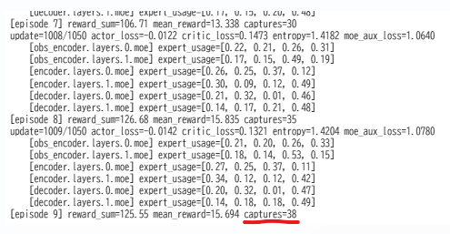

本日はチーム連携の強化学習を行って捕獲を行っていくPursuitのトライアルについてです。
[前回](https://yoshishinnze.hatenablog.com/entry/2026/08/05/043000)改修で以下を課題と考えて、改修を行いました。
- 一角の敵を捕獲後にも停滞してしまう  
   4人ちょうど集まっていると、止まってもペナルティがかからなかったことを受けて、視界内に敵がいないときは、動いていなければ常にペナルティを与えるようにした。
   → 捕獲後に一角に居座る局所解が弱まり、チームで次の敵を探しに行く動きが出るようになった。

- 一角の捕獲の後に敵の居所が分からなくなる
   局所観測だけでは「敵の方向」が分からず、探索のメリットが小さかった。環境の実座標から**最寄りの未捕獲preyまでの距離**を計算し、縮まれば個別に報酬を与える報酬設計に変更した。さらに、チームの一定人数以上が同時に距離を縮めたら追加ボーナスを追加。 
   → 視界外の敵に向かってチームで移動する行動が報酬づけされ、実際に「一角クリア後に北上」などの探索行動が確認された。

結果、敵が少なくなってきたら移動して捕獲するという動作が確認できるようになったのですが、まだ改善できる余地がありそうでした。

## 本日改修の方向性

本日は、捕獲に集中、敵を探索をもう少しメリハリの利いた切り替え出来ないか考えていこうと思います。

### 変更の目的
以前、攻守の交代を行えるようにするようにということでモデルに役割分担を行わせる機能を付与→[MoE（Mixture of Experts）を実装しました](https://yoshishinnze.hatenablog.com/entry/2026/08/08/043000)。

ですが、MoEを実装したのは良いものの、基本的に敵を追いかけるパターンのExpertのみが動作している可能性が感じられます。
一言でいうと、**MoEの中身が、一部のexpertだけを使い続ける状態に固まっていないか**を疑い、それを是正するための変更です。

### 背景: なぜこれを疑ったか

モデル構造を見直した際、`MoELayer`（Top-1ゲーティング方式のMoE）に、**負荷分散のための仕組みが一切ない**ことに気づきました。

```python
top1_probs, top1_indices = torch.topk(gate_probs, k=1, dim=-1)
```

MoEは入力に応じて、どのexpert（専門のサブネットワーク）を使うかをゲート（`self.gate`）に学習させる仕組みです。
ここで何の補正もかけないと、**学習初期のわずかな偶然の偏り（例えば「expert 2がたまたま少し良い出力をした」）が自己強化されてしまう**ことが、MoEの研究（Switch Transformerなど）で広く知られています。

- expert 2が少し良い出力をする
- → gateがexpert 2をより高い確率で選ぶようになる
- → expert 2だけが多くのデータで訓練され、さらに上手くなる
- → 他のexpert（0, 1, 3）はほとんど訓練されず、性能が伸びない
- → gateはますますexpert 2ばかり選ぶ

という**正のフィードバックループ**が起き、最終的に「実質1つのexpertしか使っていない、`num_experts=4`で確保したかった表現力が無駄になっている」状態（collapse）に陥りやすいのです。

### なぜこれが「一角の敵が少なくなった後も居座る味方がいる」症状と結びつくか

このモデルは、Transformerの各層に複数のexpertを配置することで、「状況に応じて異なる振る舞いを専門化して学習する」ことを狙った設計になっています。例えば理想的には、

- 「近くに大量の敵がいて包囲している」状況用のexpert
- 「敵が少なく、次のターゲットを探すべき」状況用のexpert

のように、状況によって使うexpertが切り替わることで、柔軟な行動が学習されることが期待されます。しかし、もしcollapseが起きていて実質1つのexpertしか機能していない場合、**「敵を包囲する」という頻度の高い状況に最適化されたexpertが、そのまま「敵が少なくなった後」という頻度の低い、切り替えが必要な状況にも使われ続けてしまいます**。結果として、「本来なら次の行動に切り替えるべき局面でも、慣れた振る舞い(＝待機・現状維持)」しか出力できない、という症状が起きても不思議ではありません。

つまり今回の改修により、**「モデルの表現力の一部が、実質的に死んでいるのではないか」という仮説を検証・是正するための処置**を行うという意図です。


## 対策

### 具体的に何をしたか

エキスパートの分散を促す機構を入れて役割分担を学習できるようにしていこうと思います。

具体的には以下を行います。
1. **負荷分散損失（load-balancing loss）の追加**: 各expertが「均等に選ばれる」ように誘導する補助的な損失項を追加し、通常の学習損失（`actor_loss + critic_loss`）に小さい重みで加算しました。これにより、gateが特定のexpertだけに偏る動きを、学習の過程で継続的に押し戻します。

2. **expert選択頻度の可視化ログ**: 実際に「各expertがどれくらいの割合で選ばれているか」を学習中に確認できるようにしました。これは仮説そのものが正しいかどうか（本当にcollapseが起きているのか）を、感覚ではなく数値で確認するためのものです。

### 期待される効果

- **主目的**: 各expertが幅広い状況で使われるようになり、「頻度は低いが重要な状況（捕獲後の切り替えなど）」に対応する表現力がモデル内に確保されやすくなる。結果として、**居座り行動が減ることを期待**しています。
- **副次的な効果**: MoE全体としての実効的なパラメータ利用効率が上がるため、単純にモデルの表現力・学習効率自体が改善する可能性もあります（居座り以外の面でも性能向上が見られるかもしれません）。

### この変更で「わからないこと」も正直にお伝えします

この変更は、あくまで **「MoE collapseが症状2の原因である」という仮説に基づく処置** です。ログで確認して、

- **もし `expert_usage` の偏りが実際に解消され、かつ居座り行動も減った** → 仮説が正しかったことになります
- **`expert_usage` の偏りは解消されたが、居座り行動が変わらない** → MoE collapseは実在したが、居座りの主因ではなかったことになります。この場合は、前回提示した「担当ターゲットを明示的に観測へ追加する」対策（対策E）など、別の角度からのアプローチに進む必要があります
- **そもそも `expert_usage` に大きな偏りが見られなかった** → 今回の仮説自体が外れていたことになり、原因は他（報酬設計、観測情報の不足など）にある可能性が高くなります

今回の対応が、**今回の変更は「効果がある対策」というより「原因を1つ検証・除外するための処置」という性格が強い**点はご理解いただければと思います。
学習段階でのログを確認の上、expertの分散が出来るようになったかを確認することも目的の一つです。

## 実装

### 実装方針

以下、コードレベルで「何を」実装するかについて説明していきます。

__1. `MoELayer.forward()` に負荷分散損失の計算を追加__

**変更前**にはこの処理はありませんでした。**変更後**、forwardのたびに以下を追加で計算するようにしました。

```python
one_hot = F.one_hot(top1_indices.squeeze(-1), num_classes=self.num_experts).float()
frac_tokens_per_expert = one_hot.mean(dim=0)   # 実際に各expertへ振り分けられたトークンの割合
frac_prob_per_expert = gate_probs.mean(dim=0)   # gateが平均的に各expertへ割いた確率
aux_loss = self.num_experts * (frac_tokens_per_expert * frac_prob_per_expert).sum()

self.last_aux_loss = aux_loss   # 後で回収できるようモジュールに保持しておく
```

**やっていることの意味**:
- `frac_tokens_per_expert`: 「実際にどのexpertがどれくらいの頻度で選ばれたか」の実測値（例: `[0.7, 0.1, 0.1, 0.1]` なら1番目のexpertに偏っている）
- `frac_prob_per_expert`: gateが出した確率の平均値（実際に選ばれたかは関係なく、gateの"傾向"）
- 両者を掛け合わせて合計することで、「**特定のexpertに実測でも確率でも偏っているほど大きくなる値**」を作っています。これを損失として最小化すると、gateは自然と各expertを均等に選ぶよう学習されます

`self.last_aux_loss` にその値をモジュール自身の属性として保存しています。これは後で他の場所（`update()`関数）から取り出して使うための"置き場"です。

併せて、確認用に選択頻度そのものも保存しています。

```python
with torch.no_grad():
    self.last_expert_usage = frac_tokens_per_expert.detach().clone()
```

__2. モデル全体から損失・使用状況を集めるための2つの関数を追加__

`MATActorCritic` は内部に `obs_encoder` → `encoder` → `decoder` と複数の階層があり、それぞれの中に複数の `MoELayer` が埋め込まれています（`num_layers`分）。1箇所ずつ手で取り出すのは大変なので、**モデル全体を自動的に探索して集める関数**を2つ新設しました。

```python
def collect_moe_aux_loss(model):
    aux_losses = []
    for module in model.modules():         # モデル内の全サブモジュールを走査
        if isinstance(module, MoELayer) and module.last_aux_loss is not None:
            aux_losses.append(module.last_aux_loss)
    return torch.stack(aux_losses).mean()  # 全MoE層の平均を1つの値にまとめる
```

`model.modules()` はPyTorchの標準機能で、「このモデルの中に埋め込まれている全てのモジュールを再帰的に列挙する」ものです。これを使うことで、`obs_encoder`の中のMoE層も、`encoder`の中のMoE層も、`decoder`の中のMoE層も、**構造を意識せず自動的に全部拾えます**。

```python
def collect_moe_expert_usage(model):
    usage = {}
    for name, module in model.named_modules():   # 名前付きで走査(ログでどの層か分かるように)
        if isinstance(module, MoELayer) and module.last_expert_usage is not None:
            usage[name] = module.last_expert_usage.cpu().numpy()
    return usage
```

こちらは損失計算用ではなく、**人間が確認するためのログ出力専用**です。「`obs_encoder.layers.0.moe` というMoE層では、4つのexpertがそれぞれ何%ずつ使われているか」を辞書として返します。

__3. `MAT_PPO.update()` で、通常の損失にこのaux_lossを加算__

これまでは

```python
loss = actor_loss + critic_loss
```

だけでしたが、これを

```python
moe_aux_loss = collect_moe_aux_loss(self.model)   # ①で計算した値を②の関数でモデル全体から回収
loss = actor_loss + critic_loss + self.moe_aux_loss_coef * moe_aux_loss   # 小さい重みを掛けて加算
```

に変更しました。`self.moe_aux_loss_coef`（デフォルト`0.01`）という新しい設定値を追加し、「行動決定の学習(`actor_loss`)や状態価値の学習(`critic_loss`)を邪魔しない程度に、控えめな重みでexpertの均等化も一緒に学習させる」ようにしています。

この `loss` を1つの塊として `loss.backward()` することで、**通常のPPO学習と同時に、gateのパラメータ（`self.gate`）にも「均等に選べ」という勾配が流れる**ようになります。

__4. gate専用の`LayerNorm`を追加__

こちらは、ほとんど参考とされないExpertが出てくることに対する対策です。

`MATEncoder` の入力は

```python
x = agent_feats + self.agent_pos_embedding
```

という**単純な加算**です。`agent_pos_embedding` は `torch.randn(1, num_agents, d_model)` で初期化される学習パラメータで、初期値のノルムが `agent_feats`（実際のエージェントの状態から計算された特徴量）と比べて大きい、あるいは学習が進んでも縮小しない場合、**gateへの入力ベクトルの向き・大きさが「どのスロットか」でほぼ決まってしまい、「今何が起きているか」の情報が埋もれてしまいます**。

`LayerNorm` はベクトルの各次元を平均0・分散1に正規化するので、**特定の次元だけが大きい値を持つ(=位置埋め込みが支配的)という状態を緩和し、各次元が相対的に対等な影響力を持つように補正**します。これにより、gateが「スロット位置」ではなく「特徴の中身」により敏感に反応しやすくなることを期待しています。

**expert本体への入力は正規化していない点が重要**です。もし`x_flat`全体を正規化してしまうと、`agent_pos_embedding`が本来持っていた「このエージェントは何番目か」という有用な位置情報まで、expertの計算からも失われてしまいます。今回は「gateの判断」だけをピンポイントで補正し、expertの表現力自体は変えないようにしています。

__ログ出力への追加__

`train()` 関数側では、以下の2つを新たに画面出力するようにしました。

```python
print(f"... moe_aux_loss={np.mean(aux_losses):.4f}")

expert_usage = collect_moe_expert_usage(mat_ppo.model)
for layer_name, usage in expert_usage.items():
    print(f"    [{layer_name}] expert_usage=[{0.25, 0.24, 0.26, 0.25のような配列}]")
```

これにより、学習を回しながら「aux_lossの値が下がってきているか（＝偏りが解消に向かっているか）」「実際の選択頻度が均等に近づいているか」を、数値として目視確認できるようにしています。

### 変更のイメージ図

```
【変更前】
MoELayer.forward()
  └ gateで選ばれたexpertだけ計算して出力を返す（それだけ）

  MAT_PPO.update()
  └ loss = actor_loss + critic_loss

【変更後】
MoELayer.forward()
  └ gateで選ばれたexpertだけ計算して出力を返す
  └ ＋「偏り具合」を数値化してself.last_aux_lossに保存 ★NEW
  └ ＋「実際の選択割合」をself.last_expert_usageに保存 ★NEW

  collect_moe_aux_loss() / collect_moe_expert_usage()  ★NEW
  └ モデル内の全MoELayerを自動で探し出し、値をかき集める

  MAT_PPO.update()
  └ moe_aux_loss = collect_moe_aux_loss(model)          ★NEW
  └ loss = actor_loss + critic_loss + 0.01 * moe_aux_loss   ★変更

  ログ出力
  └ moe_aux_lossの値、各層の選択頻度を表示            ★NEW
```

やっていることは、**「MoEの中身に、選択の偏りを測るセンサーを仕込み、その偏りを小さくする方向の力を通常の学習と一緒にかける」** という、この1点に尽きます。既存の行動決定ロジック（Attention、デコード順序など）には一切手を加えていません。

### 実装コード

以下のレポジトリに完成コードを保管しています。
ご参考下さい。

https://github.com/Shinichi0713/Reinforce-Learning-Study/tree/main/miulti-agent/petting_zoo/src/4_pursuit/src

後、今回から参照するpursuitのversionが変わってました。
`pursuit_v4`から`pursuit_v5`に変更になっています。

## 学習
今回実装により学習した結果をまとめます。

### 学習の結果

学習中に"おっ"と思ったことがありました。
学習中にエポックごとにどれだけの捕獲者が捕まえられたかを表示しているのですが、通常は良くても 33 か 34 でしたが、今回初めて 38 という捕獲者を得るものが出てきました。



今回の学習の推移を前回と比較して表示します。
横軸が学習時のエポック、縦軸が報酬とエントロピです。

### agentの動作

学習後のエージェントの動作を確認します。

## 総括


