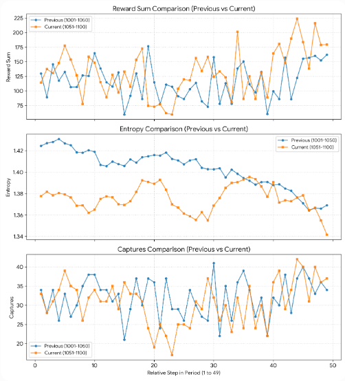

前回[MoE均等化、順序ランダム化によるMoEが抱えるモデルの偏りを解消する方法を実装](https://yoshishinnze.hatenablog.com/entry/2026/09/26/043000)しました。
結果、MoEのルーティングの改善につながりましたが結果として、敵を捕獲した後も同じ場所に居座り続けるという問題が解消されていません。
現状から改善できないか検討していきます。

## 課題

前回記事の考察をそのまま引用しますが。

>敵が近づいたときに味方で集団で上手に囲むため、1体の敵を上手に捕獲していきます。
>ですが、以前課題と感じていた待機型に戻っています。
>スコアは前回よりも良いですが、敵が多いところにわーと集団移動するような動作がなくなってしまった感があります。

行動は状況を見て決めてもらうと良いのですが、現状は一角に待機するような動作となっています。
何とか状況を判断してもらうようにしたいというのが現時点です。

## 対応策

[前回の対応（MoE均等化、順序ランダム化、報酬修正）](https://yoshishinnze.hatenablog.com/entry/2026/09/26/043000)はいずれも「既にある仕組みの偏りを補正する」対策でした。
これはMoEをうまく効率化することで捕獲と待機などの行動パターンをうまく切り替えるようになることを期待していたことによります。
それでも改善しないということは、**モデルに「敵がいない場所を探しに行く」ための情報や仕組みそのものが構造的に欠けている**可能性が高いです。

ということで現状で考えられる問題の原因と対応策について検討します。

### 原因の本質: エージェントは「見えている範囲」でしか判断材料がない

`get_obs()` は7x7の局所観測だけを返します。索敵報酬(`search_stagnation_penalty`など)は改善しましたが、**「罰を避けるために何かしら動く」ことは学習できても、「どちらに向かえば敵がいるか」という方向情報自体が観測に含まれていません**。
局所観測が空なら、モデルにとってはどちらへ動いても「見えている情報」としては同じです。結果、学習が収束するにつれて「無難な、リスクの低い狭い範囲での徘徊」に落ち着きやすくなります。現時点ではこのリスクを避けるための無難な徘徊をしているという仮説が一番確度が高いと考えています。

__対策1（最優先）: 「最寄り未捕獲ターゲットへの相対方向」を観測に直接追加する__

以前`order_mode="priority"`のために作った`compute_priority_scores`は、**順序決定だけに使われ、モデルの入力(観測)には渡っていません**。これをエージェントの観測特徴として直接与えます。

```python
# PursuitWrapper に追加
def get_obs(self, agent):
    ...(既存の処理はそのまま)...
    spatial_flat = semantic_obs.reshape(-1)
    action_history_flat = self.last_actions.reshape(-1)

    # 🌟 追加: グローバル情報(観測範囲外)から、最寄り未捕獲preyへの相対方向を計算
    rel_vec = self._compute_relative_direction_to_nearest_prey(agent)  # (dy, dx)を正規化した値

    full_obs = np.concatenate([spatial_flat, action_history_flat, rel_vec])
    return full_obs

def _compute_relative_direction_to_nearest_prey(self, agent) -> np.ndarray:
    raw_env = self.env.unwrapped
    try:
        evader_positions = [(e.state[1], e.state[0]) for e in raw_env.evaders]
        agent_obj = next(a for a in raw_env.agents if a.name == agent)
        ay, ax = agent_obj.state[1], agent_obj.state[0]
    except Exception:
        return np.zeros(2, dtype=np.float32)

    if not evader_positions:
        return np.zeros(2, dtype=np.float32)  # 全捕獲済み

    ty, tx = min(evader_positions, key=lambda p: abs(ay - p[0]) + abs(ax - p[1]))
    dy, dx = (ty - ay), (tx - ax)
    # マップサイズで正規化(方向のみを与え、絶対距離のスケールに依存しすぎないようにする)
    norm = max(abs(dy), abs(dx), 1)
    return np.array([dy / norm, dx / norm], dtype=np.float32)
```

`self.obs_dim` に `+2` を加え、`MATObsEncoder`側で `spatial_obs` と `action_history` に加えて、この2次元ベクトルも `feature_fuse` に連結するよう変更します。

```python
# MATObsEncoder.__init__
self.feature_fuse = nn.Linear(d_model * 2 + 2, d_model)  # 🌟 +2

# MATObsEncoder.forward
direction_feat = obs[:, -2:]  # 末尾2次元が方向ベクトル
fused = torch.cat([spatial_feature, act_emb, direction_feat], dim=-1)
return self.feature_fuse(fused)
```

**これは「視界の外の情報を使って、視界の中の行動を決める」ことを直接可能にする変更**で、局所観測とグローバル報酬シェイピングの間を埋める、最も直接的な対策です。

### 原因2: 「もう十分に人が集まっている」ことを判断する材料はあるが、「別の場所が手薄」ことを示す材料がない

一角に居座るのは、その場所の情報（味方の密度など）は見えていても、**他の場所に敵がいるという情報が相対的に伝わりにくい**ためとも考えられます。対策1でこれはある程度緩和されますが、さらに踏み込むなら「チーム全体でどこに散らばるべきか」を明示的に割り振る仕組みが有効です。

__対策2: 訪問済みマップ（探索カバレッジ）による内発的報酬__

「敵がいない」という消極的シグナルだけでなく、「まだ訪れていない場所に行くこと自体に価値がある」という内発的動機付け(intrinsic reward)を加えると、居座りに対してより強い力がかかります。

```python
# PursuitWrapper に追加
def reset(self):
    ...(既存)...
    self.visit_counts = {}  # {(y, x): 訪問回数}

def _get_exploration_bonus(self, curr_pos) -> float:
    count = self.visit_counts.get(curr_pos, 0)
    self.visit_counts[curr_pos] = count + 1
    # 訪問回数が少ないマスほど高いボーナス(count-based exploration)
    return 1.0 / np.sqrt(count + 1)
```

`step()`の索敵フェーズ内で、このボーナスを`search_approach_bonus`に加えて併用します。

```python
if not has_moved:
    individual_reward += self.search_stagnation_penalty
else:
    exploration_bonus = self._get_exploration_bonus(curr_pos) * 0.02  # 係数は調整
    individual_reward += exploration_bonus
    ...(既存のsearch_approach_bonus判定)...
```

これは「敵に近づいたか」に関係なく、**単純に「新しい場所に行った」ことを評価する**ので、たとえ敵の手がかりが全くない状況でも、居座りから抜け出す動機になります。対策1（方向情報）と組み合わせると、「手がかりがあればそちらへ、なければ未探索エリアへ」という自然な振る舞いに近づけやすくなります。

### 原因3: モデル構造として「チーム内での役割分担」を強制する仕組みがない

対策1・2は「個々のエージェントに情報を与える」アプローチですが、**「8体全員が同じ情報に基づいて同じように"近くに集まる"最適化をしてしまう」リスク**は残ります。全員が同じ観測(相対方向)を見て、全員が同じ最寄りターゲットを目指せば、結局同じ場所に集まってしまいかねません。

__対策3: エージェントごとに異なる担当エリア/ターゲットを明示的に割り当てる__

前回の`priority_agent_order`をベースに、**割り当て(assignment)そのものをハンガリアン法などで最適化し、各エージェントに「自分が担当するターゲット」を固定して観測に含める**ようにすると、この重複問題を根本的に避けられます。

```python
from scipy.optimize import linear_sum_assignment

def compute_agent_target_assignment(self) -> dict:
    """
    各pursuerに、重複しないよう1体ずつ異なる未捕獲preyを割り当てる(距離コストの最小化)。
    prey数 < agent数の場合、余ったagentは「最も近いprey」に複数人割り当てる。
    """
    raw_env = self.env.unwrapped
    evader_positions = [(e.state[1], e.state[0]) for e in raw_env.evaders]
    if not evader_positions:
        return {agent: None for agent in self.possible_agents}

    agent_positions = []
    valid_agents = []
    for agent in self.possible_agents:
        if agent not in self.env.agents:
            continue
        try:
            obj = next(a for a in raw_env.agents if a.name == agent)
            agent_positions.append((obj.state[1], obj.state[0]))
            valid_agents.append(agent)
        except Exception:
            continue

    cost_matrix = np.array([
        [abs(ay - py) + abs(ax - px) for (py, px) in evader_positions]
        for (ay, ax) in agent_positions
    ])

    # prey数がagent数より少ない場合はタイル(繰り返し)してコスト行列を拡張
    n_agents, n_prey = cost_matrix.shape
    if n_prey < n_agents:
        reps = int(np.ceil(n_agents / n_prey))
        cost_matrix = np.tile(cost_matrix, (1, reps))[:, :n_agents]

    row_idx, col_idx = linear_sum_assignment(cost_matrix)
    assignment = {}
    for r, c in zip(row_idx, col_idx):
        prey_idx = c % n_prey
        assignment[valid_agents[r]] = evader_positions[prey_idx]

    return assignment
```

この割り当てを使って、対策1の「最寄りターゲットへの相対方向」を **「最寄り」ではなく「自分に割り当てられたターゲット」への方向**に差し替えると、**エージェントが自然に散らばって別々のターゲットを追う**ようになります。同じターゲットに全員が向かって過密になる、という現在の症状に対して、より直接的な効果が期待できます。

### 優先順位のまとめ

ここまで上げてきた原因と対策の期待する効果と、実装コストを比較してみました。
仮説では情報不足だろうという考えをベースとした対策1+2と、自然な役割不足が難しいという考えをベースとした対策3に分かれます。
期待する効果はおそらく同程度、実装コストからすると、対策3よりは対策1+2の方が楽だと考えられるため、今回は対策1+2を採用します。

| 対策 | 期待する効果 | 実装コスト |
|---|---|---|
| 1. 方向情報を観測に追加 | 「そもそもどちらに探索すべきか分からない」 | 低 |
| 2. 訪問カバレッジによる内発的報酬 | 「手がかりがなくても居座らず動く」 | 低〜中 |
| 3. ハンガリアン法による明示的な担当割当 | 「一角に全員集中してしまう」重複問題 | 中〜高 |

## 実装
対策1+2を実装していきます。
ここまでのコードへの改修点についてまとめていきます。

### 修正点一覧

| # | 修正対象 | 変更内容 | 変更の根拠 |
|---|---|---|---|
| 1 | `PursuitWrapper.__init__` | `direction_dim = 2` を追加し、`obs_dim` の計算に `+ direction_dim` を含める | `get_obs()` が実際に返すベクトルの長さと `self.obs_dim` の宣言値を一致させるため |
| 2 | `PursuitWrapper.get_obs()` | 最寄り未捕獲 prey への相対方向ベクトル `(dy, dx)` を観測末尾に連結 | エージェントに「敵がどちらにあるか」の方向情報を与え、局所観測の情報不足を補うため |
| 3 | `MATObsEncoder.forward()` のスライス処理 | `spatial_obs` / `action_history` / `direction_feat` のスライス境界を明示的に区切る | 方向ベクトルの2次元が `action_history_embed`（40次元入力期待）に誤って混ざり、サイズ不一致エラーを起こすのを防ぐため |
| 4 | `MATObsEncoder.__init__` の `feature_fuse` | 入力次元を `d_model * 2 + 2` に変更 | `spatial_feature` + `act_emb` + `direction_feat`（2次元）を連結して融合するため |
| 5 | `PursuitWrapper` の探索報酬 | count-based exploration bonus（訪問回数に応じたボーナス）を索敵報酬に追加 | 敵の手がかりがない状況でも「未探索エリアへ移動する」動機を与え、居座りを防ぐため |

### 各修正点の詳細

__修正1：`PursuitWrapper.__init__` の `obs_dim` 計算__

**変更内容**：
```python
self.direction_dim = 2
self.obs_dim = self.spatial_dim + self.action_history_dim + self.direction_dim
```

**変更の根拠**：
- `get_obs()` が返すベクトルは「空間観測（196次元）+ アクション履歴（40次元）+ 方向ベクトル（2次元）= 238次元」です
- `self.obs_dim` が 236 のままだと、`get_global_state()` 内の `reshape` で「238要素を236形状に変形できない」というエラーが発生します
- 観測の生成側と参照側の次元数を一致させることが必須です

__修正2：`PursuitWrapper.get_obs()` に方向ベクトルを追加__

**変更内容**：
```python
rel_vec = self._compute_relative_direction_to_nearest_prey(agent)  # (2,)
full_obs = np.concatenate([spatial_flat, action_history_flat, rel_vec])
```

**変更の根拠**：
- 7×7 の局所観測だけでは「敵が視界の外のどちらにいるか」が分かりません
- 結果としてエージェントは「どちらへ動いても同じ」という状況になり、無難な狭い範囲の徘徊に収束します
- 最寄り prey への正規化された相対方向 `(dy, dx)` を与えることで、「視界の外の情報に基づいて行動を決定できる」ようになります

__修正3：`MATObsEncoder.forward()` のスライス境界の明示__

**変更内容**：
```python
spatial_obs = obs[:, :self.spatial_dim]
action_history = obs[:, self.spatial_dim : self.spatial_dim + self.num_agents * 5]
direction_feat = obs[:, self.spatial_dim + self.num_agents * 5 :]
```

**変更の根拠**：
- 元のコードでは `action_history = obs[:, self.spatial_dim:]` と「残り全部」をスライスしていたため、方向ベクトルの2次元も `action_history_embed` に混ざっていました
- `action_history_embed` は `nn.Linear(num_agents * 5, d_model)` であり、40次元の入力を期待しています
- 42次元（40+2）が入力されるとサイズ不一致のランタイムエラーが発生します
- 各特徴量の境界を明示的に区切ることで、誤った次元の混入を防ぎます

__修正4：`MATObsEncoder.feature_fuse` の入力次元__

**変更内容**：
```python
self.feature_fuse = nn.Linear(d_model * 2 + self.direction_dim, d_model)
```

**変更の根拠**：
- `forward()` 内で `spatial_feature`（`d_model` 次元）+ `act_emb`（`d_model` 次元）+ `direction_feat`（2次元）を連結して渡します
- 融合層の入力次元は `d_model + d_model + 2 = d_model * 2 + 2` である必要があります
- この変更がないと、連結後のテンソル次元と `Linear` 層の期待入力次元が一致せず、エラーになります

__修正5：探索報酬に count-based exploration bonus を追加__

**変更内容**：
```python
# reset() に追加
self.visit_counts = {}

# 報酬計算に追加
exploration_bonus = self._get_exploration_bonus(curr_pos) * 0.02
individual_reward += exploration_bonus
```

**変更の根拠**：
- 対策1によって「敵の方向」は分かるようになりますが、敵の手がかりが全くない状況では依然として居座りやすいです
- 「敵がいない」という消極的シグナルだけでは、エージェントを広範囲に動かす動機が不十分です
- 訪問回数が少ないマスへのボーナスを与えることで、「新しい場所に行くこと自体に価値がある」と学習させ、居座りを防ぎます
- 対策1と組み合わせることで、「手がかりがあればそちらへ、なければ未探索エリアへ」という自然な振る舞いが期待できます

### 変更の全体像

今回の改修は「観測に方向情報を追加する」という一つの目的ですが、**次元数の整合性を保つための4箇所の連鎖的修正**が必要です。

1. **Wrapper側**：`obs_dim` の宣言値を実際の観測長（238）に合わせる
2. **Wrapper側**：`get_obs()` で方向ベクトルを実際に生成して連結する
3. **Encoder側**：観測ベクトルを3つの特徴量に正しく分割する
4. **Encoder側**：分割後の特徴量を融合する層の入力次元を正しく設定する
5. **報酬側**：方向情報だけでは補えない「手がかりゼロ時の探索動機」を内発的報酬で補完する

ということで変更コードはこちらに保管しています。

https://github.com/Shinichi0713/Reinforce-Learning-Study/tree/main/miulti-agent/petting_zoo/src/4_pursuit/src/mat


## 学習の結果

### 学習の経過

今回のエントロピ・報酬合計・捕獲数のみを抽出して比較した結果をまとめます。

__全体比較（前回 vs 今回）__

| 指標 | 前回 (update 1001-1050) | 今回 (update 1051-1100) | 変化 |
|---|---|---|---|
| **エントロピ（平均）** | 1.4031 | 1.3752 | ▼ 0.0279（低下） |
| **報酬合計（平均）** | 116.22 | 132.37 | ▲ 16.15（改善） |
| **捕獲数（平均）** | 32.0 | 30.7 | ▼ 1.3（微減） |

__読み取れること__

__1. エントロピは継続的に低下__

前回前半 1.4162 → 前回後半 1.3894 → 今回前半 1.3763 → 今回後半 1.3741 と、**方針（policy）が徐々に尖ってきています**。これは探索が減り、特定の行動パターンに収束しつつあることを示しています。

__2. 報酬合計は今回後半で大幅改善__

今回後半の平均報酬 **147.9** は前回平均（116.22）を大きく上回っています。個別エピソードの最大報酬も **223.91**（update 1094）と、前回の最大（176.61）を大幅に更新しています。

__3. 捕獲数はほぼ横ばい__

平均捕獲数は前回 32.0 → 今回 30.7 と微減です。ただし今回後半は 31.8 と回復傾向にあり、最大捕獲数も前回 41 → 今回 42 と同等以上です。

__4. 注意点：今回前半の性能低下__

今回前半（update 1051-1075）は平均捕獲数 **29.7** と低下し、最低 **17**（update 1073）が記録されています。これはチェックポイント読み込み時に `feature_fuse.weight` の形状不一致（64×128 → 64×130）が発生し、**オプティマイザが初期状態にリセットされた影響**と考えられます。



### agentの動作

学習後のエージェントの動作です。
途中まで偵察するエージェントがいる状態で、あるときにエージェントが集まって捕獲に集中している挙動が確認出来ます。
中盤から後半に敵が視界に少なくなってからは場所を移ろうとする気配も確認出来ました。
捕獲数は40体。

期待を満足したわけではありませんが、以前よりも行動はあって欲しい状態へ改善したと考えます。


## 総括

以下、本質を簡潔に総括します。

### 前回問題の本質

MoEの偏りを解消しても、エージェントが一角に居座る問題が残ったのは、**「7×7の局所観測だけでは、視界の外にある敵の方向が分からない」** ためでした。索敵報酬で「動け」と促しても、モデルにとっては「どちらに動いても同じ」という情報不足の状態であり、結果としてリスクの低い狭い範囲の徘徊に収束していました。

### 打った手とその意図

| 対策 | 内容 | 意図 |
|---|---|---|
| **方向情報の追加** | 最寄り未捕獲preyへの相対方向 `(dy, dx)` を観測末尾に連結 | 視界の外の敵の方向をモデルに直接教え、探索の目的を与える |
| **内発的報酬** | 未訪問マスへの count-based exploration bonus を追加 | 敵の手がかりがない状況でも、居座りではなく新しい場所へ動く動機を作る |

### 結果の評価

- **報酬は大幅改善**：今回後半の平均報酬は約148（前回約116）、最大は223.91と記録的な上昇
- **動作に改善の兆候**：「偵察→集団で捕獲→敵が減ったら別エリアへ移動」という流れが確認できた
- **捕獲数は横ばい**：平均30.7と微減。報酬は上がっているが、捕獲効率への転換はまだ不完全
- **エントロピの低下**：方針が尖ってきており、探索と活用のバランスが今後の課題

### 結論

**「敵の方向」という情報を観測に直接与えることで、無目的な徘徊から「意図を持った移動」への転換は実現できました。** ただし、全員が同じ方向情報を見て同じターゲットに集まる「過密化」の問題は残っており、次のステップとして「エージェントごとの役割分担（対策3のハンガリアン法による担当割当）」を検討する価値があるかもしれません。


