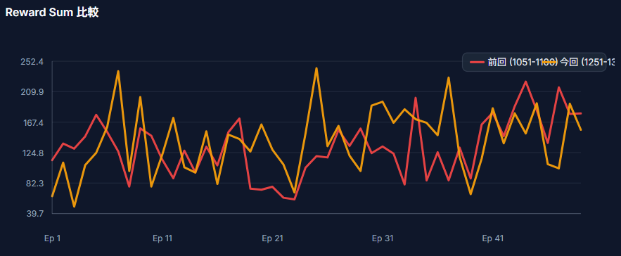
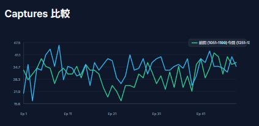
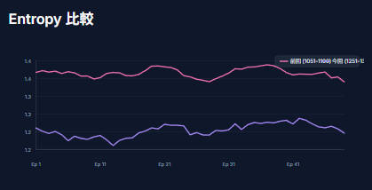
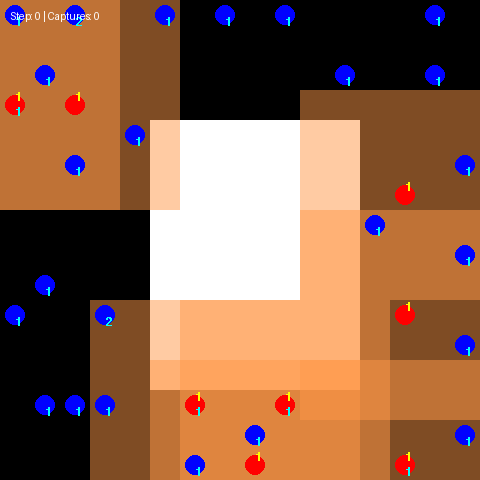

前回[最寄りの敵の位置と、動作に対するモチベーションの実装](https://yoshishinnze.hatenablog.com/entry/2026/09/26/043000)を対応しました。
結果、一カ所の停滞が改善され、捕獲数にも改善が確認されました。
ですが、以前居座り問題が続いていたため、改善できないか試行していきます。

## 課題

前々回記事の考察を引用しますが。

>敵が近づいたときに味方で集団で上手に囲むため、1体の敵を上手に捕獲していきます。
>ですが、以前課題と感じていた待機型に戻っています。
>スコアは前回よりも良いですが、敵が多いところにわーと集団移動するような動作がなくなってしまった感があります。

この一角にエージェントが居座るという問題に対して改善することを考えています。

## ハンガリアンアルゴリズム
今回は対策にハンガリアンアルゴリズムという手法を用います。

**ハンガリアンアルゴリズム（Hungarian Algorithm）** は、組合せ最適化問題における **「割り当て問題（Assignment Problem）」を効率よく（多項式時間で）解くためのアルゴリズム**です。

1955年にハロルド・クーン（Harold Kuhn）によって発表され、ハンガリーの数学者であるコーニグ（Dénes Kőnig）とエゲルヴァリ（Jenő Egerváry）の定理に基づいていることからこの名が付けられました。

### 1. どんな問題を解くのか？

最も典型的な例は「タスクと人員の最適マッチング」です。

* $N$ 人の作業員と $N$ 個のタスクがある。
* 各作業員が各タスクを実行するのにかかるコスト（時間や費用）が与えられている。
* **「全員に1つずつタスクを割り当てるとき、全体の総コストを最小化するにはどうすればよいか？」**

すべての組み合わせをしらみつぶしに探すと $N!$ （階乗）通りの探索が必要になり、$N=20$ 程度で計算が破綻します。ハンガリアンアルゴリズムを使うと、**$\mathcal{O}(N^3)$ の計算量**で確実に最適解を求めることができます。

### 2. コスト行列の例

例として、3人の作業員（A, B, C）と3つのタスク（T1, T2, T3）のコスト行列を考えます。

|  | T1 | T2 | T3 |
| --- | --- | --- | --- |
| **A** | 9 | 2 | 7 |
| **B** | 6 | 4 | 3 |
| **C** | 5 | 8 | 1 |

この行列から、各行・各列で要素を重なりなく1つずつ選び、その和を最小にする組み合わせを見つけるのが目的です。

### 3. アルゴリズムの基本的なアイデア

「コスト行列の特定の行や列全体から一定の値を引き算しても、最適となる割り当ての組み合わせは変化しない」という性質を利用します。

引き算を繰り返すことで**行列内に「0」を作り出し、「0」の位置だけで重なりのない割り当て（0の完全マッチング）を作ること**を目指します。

__基本ステップ__

1. **行の減算**: 各行の最小値を見つけ、その行のすべての要素から引き算する（各行に少なくとも1つの「0」ができる）。
2. **列の減算**: 各列の最小値を見つけ、その列のすべての要素から引き算する（各列に少なくとも1つの「0」ができる）。
3. **最小被覆線の判定**: 行列内のすべての「0」を覆うのに必要な「最小の直線（行または列）」の数をカウントする。
* 直線の数が $N$本 に達した場合 $\rightarrow$ **完了**（「0」の位置だけで最適な割り当てが存在する）。
* 直線の数が $N$本 未満の場合 $\rightarrow$ **ステップ4へ**。


4. **行列の更新**: 直線で覆われていない要素の中から最小値 $k$ を選ぶ。
* 直線で覆われていない要素から $k$ を引く。
* 直線が交差している要素に $k$ を足す。
* ステップ3に戻る。

### 4. 主な用途・応用分野

* **リソース割り当て**: 人員配置、タスクスケジューリング、機械への工数割り当て。
* **マルチオブジェクトトラッキング（MOT）**: 自動運転や防犯カメラの映像解析において、「前フレームで検出した物体」と「現在のフレームで検出した物体」の同一性を判定（データ関連付け）する際によく使われます。
* **グラフ理論**: 二部グラフにおける最大（最小）重み付きマッチング問題の解法。

現代のプログラミングでは、`scipy.optimize.linear_sum_assignment`（Python）などの標準的なライブラリ関数として内部実装されているため、自作せずとも手軽に活用できます。

## 対策の骨組

今回対策はエージェントが狙うターゲットの割り当てをハンガリアンアルゴリズムで行うというもので対策していきます。

### 対応する問題: 「一角の敵が少なくなった後もとどまろうとする味方がいる」
一角に居座るという症状の背景には、これまでの調査で以下のような要因が積み重なっていることが原因だと想定しています。

1. **MoEのcollapse**（一部のexpertしか使われず、状況に応じた行動の切り替えが学習されにくい）→ 負荷分散損失で対処
2. **デコード順序の固定**（特定のエージェントが常に受動的な役割になる）→ ランダム順序化で対処
3. **索敵報酬の抜け穴**（4人揃っていれば停滞が免除される等）→ 報酬ロジックの修正で対処
4. **視界の外に手がかりがない**（局所観測だけでは、どちらに敵がいるか分からない）→ 対策1（方向情報の追加）で対処

しかし対策1を入れても、**「全員が同じ最寄りターゲットに向かう」という判断基準そのものは変わっていません**。敵が少なくなった終盤（例えば残り2体、味方8体）の状況では、

- 8体中の多くが「一番近い敵はこっちだ」と同じ1体を指し示してしまい
- 結果としてそのターゲットに集中し、**もう1体の敵の方には誰も向かわない**

という構造的な偏りが残ります。これは「居座り」というより正確には「**目が向いていない敵が放置される**」現象で、見た目には「捕獲が進まず、そこにとどまっているように見える」症状として現れていたと考えられます。ハンガリアン法は、この「全員が同じ判断をしてしまう」という構造的な原因そのものを解消するための対策です。

### 対応していない問題: 「捕獲でまごまごする（何度も取り逃がす）」

こちらの症状については、**原因は全く別の場所**にあります。

> 現在のモデルは、各タイムステップの観測を独立したスナップショットとしてTransformerに通しています。獲物がどの方向に動いているか（速度・進行方向）の情報が一切ありません。

ハンガリアン法は「誰が、どのターゲットを追うべきか」という**割り当ての最適化**であり、「追っている最中に、逃げる敵にどう先回りするか」という**追跡そのものの精度**には一切関与しません。したがって、この症状に対しては、以前提案した以下のような対策が別途必要です。

- 獲物の動き（速度・進行方向）を観測チャンネルに追加する
- 時間方向の記憶（GRUなど）を導入し、複数ステップの動きのパターンを学習できるようにする
- 未来位置予測を補助タスクとして学習させる

### なぜハンガリアンアルゴリズムを使うか

一言でいうと「**8体全員が同じ判断基準（最寄りのターゲット）で動くと、全員が同じ場所に集まってしまう**」という問題を、数学的に解決するために導入しました。


__これまでの対策1（対策1：方向情報の追加）で何が足りなかったか__

対策1では、各エージェントに「一番近い未捕獲の敵はどっちの方向か」という情報を渡しました。しかしこれには構造的な欠陥があります。

**8体のエージェントが全員、同じ計算式（`min(距離)`）を使っている**ため、もし敵が2体しか残っていない状況で、8体のうち5体にとって「一番近い敵」が偶然同じ1体だったとします。すると、その5体は全員「その敵の方向」を指し示され、**全員がそこに向かって集まってしまいます**。もう1体の敵は誰も見ていない、という状態が起きえます。これはまさに「一角に居座る/敵が少なくなっても捜索していかない」という報告いただいた症状と一致する構造的な原因です。

つまり対策1は「どちらに動けばいいか」というヒントは与えましたが、**「チームとして手分けする」という発想は一切入っていなかった**のです。

__ハンガリアン法が解決すること__

ハンガリアン法（割当問題の最適解を求めるアルゴリズム）を使うことで、

> 「8体のエージェント」と「残っている敵」の組み合わせを、**全体の移動コスト（距離の合計）が最小になるように、重複なく割り振る**

という計算を毎ステップ行うようにしました。

具体例で言うと：
- エージェントA、Bが両方とも「敵Xが一番近い」と感じていても
- 実は「AはXに、BはYに向かった方が、チーム全体としての移動コストの合計は少なくて済む」という組み合わせがあれば
- ハンガリアン法はそちらを選びます

これにより、**「全員が目先の最寄りに殺到する」のではなく、「チームとして手分けして効率よく散らばる」という動きが、計算上、最初から保証される**ようになります。

__なぜこれが「モデルの学習に任せる」より優れているか__

本来、「誰がどの敵を追うべきか」という役割分担は、強化学習のモデル自身に学習させたい理想的な能力です。しかし、これまで議論してきた通り：

- Transformerのattentionによる暗黙的な学習には限界があり
- MoEのcollapseや、デコード順序の固定など、様々な要因でこの「暗黙の役割分担」がうまく学習されていない状態が続いていました

そこで今回は、**「役割分担」という組合せ最適化の部分だけは、学習に頼らず数学的に確実に解いてしまい、エージェント（モデル）には『割り当てられた1体を、具体的にどう追い込むか』という、より簡単で学習しやすい問題だけを解かせる**、という設計に切り替えました。

これは前々回お伝えした「階層型設計」の考え方そのものです。

> 複数エージェントが複数ターゲットに対して「誰がどこを追うか」を決めるのは、本質的に組合せ最適化問題（assignment problem）です。これをEnd-to-EndのRLだけに任せると、特にMARLでは学習が難しく、非効率な割当（重複追跡、放置ターゲット）に陥りやすい

**「割り当てそのものはアルゴリズムに任せ、RLは低レベルの追跡動作だけに集中させる」** という役割分担を、今回のコードで実際に組み込んだ形になります。

__期待される効果と、期待していないこと__

**期待している効果**:
- 敵が複数残っている状況で、エージェントが自然に分散して手分けするようになる
- 「一角に居座る」「敵が少なくなっても他を探さない」という、まさに今回問題視されていた症状が、構造的に起きにくくなる

**注意点として、これは万能ではありません**:
- ハンガリアン法はあくまで「今この瞬間の距離」だけを見て割り振るので、**敵がどちらに逃げるかという動きの予測(以前議論した"まごつき"の問題)までは解決しません**
- 敵の動きによって割り当てが頻繁に入れ替わる可能性がある（実装時に補足した「チャタリング」の懸念）ため、そこは追加のチューニングが必要になる場合があります
- あくまで「pursuer側の座標」と「敵の座標」という、モデルの観測には含まれない特権的なグローバル情報を使って計算しているので、**実際にモデルが学習で獲得すべき「連携」の一部を、外側から補助している**という性質のものです。将来的にモデル自身がこうした役割分担を学習できるようになることが理想ですが、現状はそこまで到達していないための実務的な対応、という位置付けです


## 実装
以下、前回までに行った対策版コード（相対方向の観測追加）を土台に、**「最寄り」ではなく「自分に割り当てられたターゲット」への方向を使う**形に差し替えます。ハンガリアン法（`scipy.optimize.linear_sum_assignment`）で、pursuer-preyの距離コストを最小化する組み合わせを毎ステップ計算します。

### 改版

__1. `PursuitWrapper.__init__` に依存関係を追加__

```python
import numpy as np
from pettingzoo.sisl import pursuit_v4
from scipy.optimize import linear_sum_assignment  # 🌟 追加
```

__2. `reset()` に割り当てキャッシュ用の変数を追加__

```python
def reset(self):
    self.env.reset()
    self.prev_min_distances = {agent: None for agent in self.possible_agents}
    self.prev_agent_positions = {agent: None for agent in self.possible_agents}
    self.last_actions = np.zeros((self.num_agents, 5), dtype=np.float32)
    self.last_actions[:, 4] = 1.0
    self.capture_count = 0
    self.captured_prey_ids = set()

    self.prev_global_min_dist = {agent: None for agent in self.possible_agents}
    self._search_approach_registry = {}
    self._search_team_bonus_given_cycle = -1

    # 🌟 追加: エージェントごとの担当ターゲット割り当てキャッシュ
    #    毎ステップ計算すると同じ状態に対して重複計算になるため、
    #    サイクル単位でキャッシュする
    self._assignment_cache = {}
    self._assignment_cache_cycle = -1
```

__3. ハンガリアン法による割り当て計算メソッドを追加__

```python
def _compute_agent_target_assignment(self) -> dict:
    """
    各pursuerに、重複しないよう1体ずつ異なる未捕獲preyを割り当てる
    (マンハッタン距離コストの総和を最小化、ハンガリアン法)。

    - 未捕獲preyがpursuer数より少ない場合は、preyをタイル(繰り返し)して
      余ったpursuerも(重複を許して)最も割の良いpreyに割り当てる。
    - 未捕獲preyが0体の場合、全pursuerに None を割り当てる。
    - 座標取得に失敗したpursuerには None を割り当てる。

    戻り値: {agent_name: (target_y, target_x) or None}
    """
    raw_env = self.env.unwrapped

    try:
        evader_positions = [(e.state[1], e.state[0]) for e in raw_env.evaders]
    except Exception:
        return {agent: None for agent in self.possible_agents}

    if not evader_positions:
        return {agent: None for agent in self.possible_agents}

    # 生存しているpursuerの座標を集める
    valid_agents = []
    agent_positions = []
    for agent in self.possible_agents:
        if agent not in self.env.agents:
            continue
        try:
            obj = next(a for a in raw_env.agents if a.name == agent)
            agent_positions.append((obj.state[1], obj.state[0]))
            valid_agents.append(agent)
        except Exception:
            continue

    assignment = {agent: None for agent in self.possible_agents}
    if not valid_agents:
        return assignment

    n_agents = len(valid_agents)
    n_prey = len(evader_positions)

    # コスト行列: (n_agents, n_prey)のマンハッタン距離
    cost_matrix = np.array([
        [abs(ay - py) + abs(ax - px) for (py, px) in evader_positions]
        for (ay, ax) in agent_positions
    ], dtype=np.float64)

    # 🌟 pursuer数 > prey数の場合、コスト行列の列をタイルして
    #    全pursuerに割り当てが行き渡るようにする
    #    (同じpreyに複数pursuerが割り当てられることを許容する)
    if n_prey < n_agents:
        reps = int(np.ceil(n_agents / n_prey))
        tiled_cost = np.tile(cost_matrix, (1, reps))[:, :n_agents]
        # linear_sum_assignmentは正方 or 長方行列どちらも扱えるが、
        # ここでは「列数 >= 行数」にしておくと解釈がシンプルになる
        row_idx, col_idx = linear_sum_assignment(tiled_cost)
        for r, c in zip(row_idx, col_idx):
            prey_idx = c % n_prey  # タイルした分を元のprey индексに戻す
            assignment[valid_agents[r]] = evader_positions[prey_idx]
    else:
        # pursuer数 <= prey数の通常ケース: 1対1の最適割り当て
        row_idx, col_idx = linear_sum_assignment(cost_matrix)
        for r, c in zip(row_idx, col_idx):
            assignment[valid_agents[r]] = evader_positions[c]

    return assignment

def _get_agent_assignment(self, agent):
    """
    現在のサイクルの割り当て結果をキャッシュから取得する。
    (毎ステップ・毎エージェントで同じ計算を繰り返さないための最適化)
    """
    current_cycle = getattr(self.env.unwrapped, 'cycles', 0)
    if self._assignment_cache_cycle != current_cycle:
        self._assignment_cache = self._compute_agent_target_assignment()
        self._assignment_cache_cycle = current_cycle
    return self._assignment_cache.get(agent)
```

__4. 方向計算メソッドを「最寄り」から「割り当て先」に差し替え__

前回実装した `_compute_relative_direction_to_nearest_prey` を置き換えます（メソッド名も実態に合わせて変更します）。

```python
def _compute_relative_direction_to_assigned_prey(self, agent) -> np.ndarray:
    """
    自分に割り当てられたターゲット(ハンガリアン法による)への相対方向を返す。
    割り当てがない(全捕獲済み、または座標取得失敗)場合はゼロベクトル。
    """
    raw_env = self.env.unwrapped
    try:
        agent_obj = next(a for a in raw_env.agents if a.name == agent)
        ay, ax = agent_obj.state[1], agent_obj.state[0]
    except Exception:
        return np.zeros(2, dtype=np.float32)

    target = self._get_agent_assignment(agent)
    if target is None:
        return np.zeros(2, dtype=np.float32)

    ty, tx = target
    dy, dx = (ty - ay), (tx - ax)
    norm = max(abs(dy), abs(dx), 1)
    return np.array([dy / norm, dx / norm], dtype=np.float32)
```

__5. `get_obs()` の呼び出し箇所を更新__

```python
def get_obs(self, agent):
    ...(既存の処理はそのまま)...
    spatial_flat = semantic_obs.reshape(-1)
    action_history_flat = self.last_actions.reshape(-1)

    # 🌟 変更: 最寄りターゲットではなく、割り当てられたターゲットへの方向を使う
    rel_vec = self._compute_relative_direction_to_assigned_prey(agent)

    full_obs = np.concatenate([spatial_flat, action_history_flat, rel_vec])
    return full_obs
```

`self.obs_dim`（`spatial_dim + action_history_dim + direction_dim`）は前回修正済みなので、次元数自体に変更は不要です。

### 補足

__補足1: 割り当て結果を報酬シェイピングにも活用する__

観測に方向を与えるだけでなく、既存の索敵報酬（`search_approach_bonus`）も「最寄り」ではなく「割り当てられたターゲット」に近づいたかどうかで評価するよう揃えると、観測と報酬の整合性が取れて学習が安定しやすくなります。

```python
def step(self, agent, action):
    ...(既存)...

    if current_min_dist is None:
        ...
        else:
            # 🌟 変更: 最寄りではなく、割り当てられたターゲットへの距離で評価
            current_global_dist = self._compute_global_dist_to_assigned_prey(agent)
            prev_global_dist = self.prev_global_min_dist.get(agent)
            ...(以下、既存ロジックと同様)...
```

```python
def _compute_global_dist_to_assigned_prey(self, agent) -> float | None:
    raw_env = self.env.unwrapped
    try:
        agent_obj = next(a for a in raw_env.agents if a.name == agent)
        ay, ax = agent_obj.state[1], agent_obj.state[0]
    except Exception:
        return None

    target = self._get_agent_assignment(agent)
    if target is None:
        return None

    ty, tx = target
    return abs(ay - ty) + abs(ax - tx)
```

__補足2: `order_mode="priority"` の優先度スコアも揃える__

以前実装した `compute_priority_scores`（MATのデコード順序決定用）も、同じ割り当て結果を使うよう統一しておくと、「観測」「報酬」「デコード順序」の3つが同じ"担当ターゲット"の概念で一貫します。

```python
def compute_priority_scores(self) -> np.ndarray:
    scores = np.full(self.num_agents, 1e6, dtype=np.float32)
    for i, agent in enumerate(self.possible_agents):
        if agent not in self.env.agents:
            continue
        d = self._compute_global_dist_to_assigned_prey(agent)
        if d is not None:
            scores[i] = d
    return scores
```

### 注意点

__1. 割り当ての不連続な切り替わり（チャタリング）に注意__

ハンガリアン法は「今この瞬間の距離コスト」だけで最適化するため、pursuerとpreyが移動するたびに**割り当て先が頻繁に入れ替わる**可能性があります（例えば2体のpreyまでの距離がほぼ同じ場合、わずかな移動で担当が入れ替わり続ける）。これが起きると、エージェントは方向を頻繁に変えさせられ、かえって非効率な動きになりかねません。

気になる場合は、以下のようなヒステリシス（一定期間は前回の割り当てを維持する、または「持ち替えのコスト」を加える）を検討してください。

```python
# 簡易対策案: 一定サイクル数ごとにしか再割り当てしない
def _get_agent_assignment(self, agent):
    current_cycle = getattr(self.env.unwrapped, 'cycles', 0)
    reassignment_interval = 5  # 🌟 5サイクルに1回だけ再計算
    if (self._assignment_cache_cycle == -1 or
            current_cycle - self._assignment_cache_cycle >= reassignment_interval):
        self._assignment_cache = self._compute_agent_target_assignment()
        self._assignment_cache_cycle = current_cycle
    return self._assignment_cache.get(agent)
```

まずは毎サイクル再計算する版で学習し、報酬やcapturesの推移を見て、もし方向の頻繁な切り替わりが問題になっているようならこちらの間引き版を試してください。

__2. `scipy` の依存追加__

`from scipy.optimize import linear_sum_assignment` が実行環境に入っているか確認してください（Google Colab等では標準で利用可能なことが多いですが、念のため）。

### 実装コード

変更コードはこちらに保管しています。

https://github.com/Shinichi0713/Reinforce-Learning-Study/tree/main/miulti-agent/petting_zoo/src/4_pursuit/src/mat


## 学習の結果

### 学習の経過

今回のエントロピ・報酬合計・捕獲数のみを抽出して比較した結果をまとめます。

__1. 性能の向上が確認できる__

今回（Update 1251-1300）は前回（Update 1051-1100）と比較して、**Reward Sum が約 7% 増加**（132.4 → 141.8）、**Captures が約 17% 増加**（29.4 → 34.4）しています。200 update 進んだ間に、エージェントがより多くの対象を捕獲し、高い報酬を得られる方策へと進化していることが分かります。

__2. 探索の減少と活用の深化__

**Entropy が 1.377 → 1.240 と約 10% 低下**しています。強化学習ではエントロピーは方策の「ランダムさ」を表すため、これはエージェントが無作為な探索を減らし、**すでに学習した有効な行動パターンをより積極的に活用するようになった**ことを示しています。性能向上とエントロピー低下が同時に起きているため、方策が有益な方向へ収束していると考えられます。

ただし、エントロピー 1.24 はまだ完全な決定的方策（deterministic policy）ではなく、**一定の探索は残っている**状態です。アクション空間のサイズにもよりますが、4 つの行動がある想定では最大エントロピーが log(4) ≈ 1.386 なので、まだ中程度の探索余地が保たれています。

__3. 学習の安定性には改善の余地__

今回の方が **Reward Sum の標準偏差が大きく**（37.6 → 45.5）、エピソードごとの性能ばらつきがやや拡大しています。考えられるところはこんなところでしょうか。

- 方策が局所最適に近づく過程で、**特定の状況では高性能だが別の状況では不安定**という挙動になっている
- 環境の確率的要素に対して、方策の頑健性がまだ十分でない
- 200 update の差があるため、**学習率や PPO のクリッピング等の影響で更新の揺らぎが大きくなった**可能性

__4. 損失関数から見える学習の状態__

- **actor_loss** が負の値で推移しているのは、PPO の性質上、方策が改善方向に更新されていることを示唆します。
- **critic_loss** は 0.07 〜 0.27 程度で比較的安定しており、価値関数の推定も大きく崩れていないようです。
- **moe_aux_loss** が 1.00 〜 1.06 と安定しているのは、負荷分散の正則化が一貫して働いている証拠です。


reward推移



捕獲数推移



エントロピ推移



### agentの動作

学習後のエージェントの動作です。
うーん。。。
前回より改善したという感じはしません。
左上の一角に居座りエージェントがまた発生しています。
前回の方がよかったですね。
失敗と考えます。



## 総括

### 今回の試行結果のまとめ

結論から述べると、今回のハンガリアン法の導入は、**学習指標上は一定の改善が見られたものの、「一角への居座りを解消する」という本来の目的は達成できなかった**と評価するのが妥当です。

ただし、完全な失敗というよりは、**割り当てという考え方には可能性があるものの、現在の実装が Pursuit 環境の捕獲条件と十分に整合していない**可能性があります。

### 数値上の比較

最終更新の直後にはエピソード結果が記録されていないため、Rewardと捕獲数は両方に存在する49エピソードで比較しています。

| 指標 | 前回<br>Update 1051–1100 | 今回<br>Update 1251–1300 | 変化 |
|---|---:|---:|---:|
| Reward Sum平均 | 132.37 | 141.53 | **+6.9%** |
| 捕獲数平均 | 30.71 | 34.35 | **+11.8%** |
| Reward標準偏差 | 40.58 | 45.88 | **ばらつき増加** |
| Entropy平均 | 1.3755 | 1.2400 | **-9.8%** |

したがって、記事中の「捕獲数が約17%改善」という記述は、貼り付けられたログから再計算すると、**約12%改善**がより正確です。

一方、最後の10エピソードだけを比較すると、次のようになります。

| 指標 | 前回・最後の10件 | 今回・最後の10件 |
|---|---:|---:|
| Reward Sum平均 | 180.26 | 152.75 |
| 捕獲数平均 | 36.4 | 36.0 |

全期間の平均値は今回の方が高いものの、**学習終盤の性能は前回を上回っていません**。動画でも居座りが再発していることから、「数値上は部分的に改善したが、行動品質は改善していない」という観察と整合していそうです。


### 特に確認すべき実装上の問題

実装してみて気になった点について振り返ります。

### 1. 割り当てキャッシュが更新されていない可能性

今更かんがありますが、提示されたコードでは、現在サイクルを次のように取得しています。

```python
current_cycle = getattr(self.env.unwrapped, "cycles", 0)
```

ところがPettingZoo Pursuitの公式実装では、AEC環境側は`steps`、内部環境側は`frames`で進行状況を管理しており、`cycles`という属性は確認できません。([raw.githubusercontent.com](https://raw.githubusercontent.com/Farama-Foundation/PettingZoo/master/pettingzoo/sisl/pursuit/pursuit.py))

その場合、`getattr(..., 0)`は毎回0を返すため、

1. エピソード開始時に一度だけ割り当てを計算
2. `_assignment_cache_cycle`が0になる
3. 以後、終了まで割り当てを再計算しない

という状態になります。

さらにキャッシュしているのは敵のIDではなく、計算時点の座標です。

```python
assignment[valid_agents[r]] = evader_positions[prey_idx]
```

そのため、移動する敵ではなく、**エピソード開始付近に敵がいた古い座標へ向かい続ける**ことになります。これが起きていれば、一角への居座りを非常にうまく説明できます。

まずは、次のように内部環境の`frames`を使う方法が考えられます。

```python
def _get_current_cycle(self) -> int:
    raw_env = self.env.unwrapped

    if hasattr(raw_env, "env") and hasattr(raw_env.env, "frames"):
        return int(raw_env.env.frames)

    if hasattr(raw_env, "steps"):
        return int(raw_env.steps // self.num_agents)

    return 0
```

```python
def _get_agent_assignment(self, agent):
    current_cycle = self._get_current_cycle()

    if self._assignment_cache_cycle != current_cycle:
        self._assignment_cache = self._compute_agent_target_assignment()
        self._assignment_cache_cycle = current_cycle

    return self._assignment_cache.get(agent)
```

ということで過去見たはずという観測情報を頼みにしてもあまりあてにならないため、居座ることをベストアクションとしている可能性がありそうです。

### 2. 1エージェント・1ターゲットの割り当てが捕獲条件と合っていない

現在のハンガリアン法は、敵の数が追跡エージェント以上の場合、各エージェントを別々の敵に割り当てます。

SciPyの`linear_sum_assignment`は、各行と各列を重複させない線形割り当てを求めるため、例えば追跡者8体、敵30体なら、基本的には8体が別々の敵へ割り当てられます。([docs.scipy.org](https://docs.scipy.org/doc/scipy/reference/generated/scipy.optimize.linear_sum_assignment.html))

しかし、Pursuit環境では敵を囲むために複数のエージェントが必要です。公式実装では、`surround=True`の場合、敵の周囲にある移動可能なマスを埋めることで捕獲が成立します。通常の場所では最大4体、端では3体、角では2体が必要です。([raw.githubusercontent.com](https://raw.githubusercontent.com/Farama-Foundation/PettingZoo/master/pettingzoo/sisl/pursuit/pursuit.py))

したがって現在の実装には、次の矛盾があります。

> 手分けを強くしすぎると、各敵に1体ずつしか向かわず、誰も包囲を完成できない。

捕獲数が改善したのは、モデルが割り当て方向を完全には信用せず、従来の局所観測や学習済み行動によって結果的に集合しているためかもしれません。

### 次に向けた改善案

__改善案1：敵ではなく「包囲位置」を割り当てる__

ハンガリアン法のタスクを敵そのものではなく、**敵の周囲にある捕獲用のマス**にします。

例えば中央の敵なら、次の4タスクを生成します。

```text
       上
左   敵   右
       下
```

そしてコスト行列を次のようにします。

```text
各エージェント → 各包囲位置までの移動コスト
```

これにより、

- 複数のエージェントが同じ敵を担当する
- ただし同じ包囲位置には重複しない
- それぞれが別方向から囲む
- 捕獲に直接つながる役割分担になる

という割り当てが可能になります。

概念的には次の形です。

```python
capture_slots = []

for prey in living_preys:
    for dy, dx in [(-1, 0), (1, 0), (0, -1), (0, 1)]:
        sy = prey_y + dy
        sx = prey_x + dx

        if self._is_valid_capture_position(sy, sx):
            capture_slots.append({
                "prey_id": prey_id,
                "position": (sy, sx),
            })
```

ただし、すべての敵の包囲位置を一度に候補にすると、また各敵へ分散しすぎる可能性があります。先に捕獲対象を数体に絞り、その対象の包囲スロットだけをハンガリアン法へ渡す設計が良いかもしれません。

__改善案2：マンハッタン距離を経路距離に変更する__

現在のコストは次の式です。

```python
abs(ay - py) + abs(ax - px)
```

これは障害物や他のエージェントを考慮しません。

例えば、マンハッタン距離では近くても中央障害物を迂回する必要がある場合、実際には遠いターゲットです。そこで、BFSやA*で求めた最短経路長をコストとして使用します。

```python
cost = shortest_path_distance(
    agent_position,
    capture_slot_position,
    obstacle_map,
)
```

さらに、同じ通路に味方が集中する場合は混雑コストを加えられます。

```python
total_cost = (
    path_distance
    + congestion_weight * expected_congestion
    + switch_weight * target_switch
)
```

__改善案3：敵のIDを保持し、現在座標を毎ステップ取得する__

再割り当てを5サイクルに1回とする場合でも、敵の座標自体は毎サイクル更新する必要があります。

現在のように座標をキャッシュするのではなく、

```python
assignment[agent] = prey_id
```

として敵のIDを保存します。

方向計算時に現在位置を読み直します。

```python
prey_id = self._get_agent_assignment(agent)
prey_position = self._get_current_prey_position(prey_id)
```

これなら担当を数サイクル固定しても、動いている敵の現在位置を追跡できます。

__改善案4：再割り当て間隔より「持ち替えコスト」を導入する__

単純に5サイクルごとに更新すると、その間に敵が捕獲されたり状況が大きく変わったりしても、古い担当を維持してしまいます。

より自然なのは、前回と異なる敵へ切り替える際に追加コストを課す方法です。

```python
if previous_target[agent] != candidate_prey_id:
    cost += switch_penalty
```

こうすると、

- 明確に有利なら担当を変更する
- 差が小さい場合は現在の担当を継続する
- 敵が捕獲されたら直ちに再割り当てする

というヒステリシスを実現できます。

あわせて、以下の場合は強制的に再割り当てします。

- 担当した敵が捕獲された
- 一定時間、担当地点への距離が縮まっていない
- 担当した敵が取得不能になった
- エージェントが一定時間停止している

### 所感

> 今回、複数のエージェントが同じ最寄りの敵へ集中する問題を解消するため、ハンガリアン法によるターゲット割り当てを導入しました。  
>   
> 学習結果では、前回と比較してReward Sumの平均が約6.9%、捕獲数の平均が約11.8%向上しました。一方でRewardのばらつきは拡大し、学習終盤の10エピソードでは前回を上回る結果にはなりませんでした。実際の動作を確認したところ、問題としていた一角への居座りも再発しており、本来の目的を達成したとは言えません。  
>   
> 原因として、現在のハンガリアン法が「1エージェントに1体の敵を割り当てる」構造になっており、複数のエージェントで敵を囲むPursuitの捕獲条件と一致していない点が考えられます。また、割り当てキャッシュの更新に使用しているサイクル番号が正しく取得できず、初期の敵座標を追い続けている可能性もあります。  
>   
> 次回はキャッシュ更新を修正したうえで、敵そのものではなく、敵の周囲にある包囲位置を各エージェントへ割り当てる方式を試します。また、ターゲット切り替えコストと探索モードを導入し、捕獲後に一角へ残り続ける問題への対策を進めていこうと考えました。

