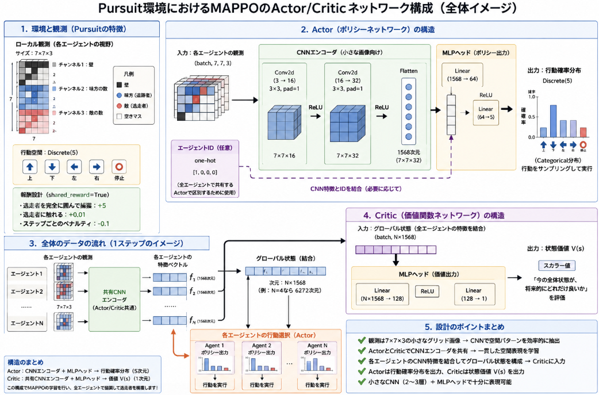

先日のpettingの[Pursuit](https://yoshishinnze.hatenablog.com/entry/2026/06/06/043000)について学習するプログラムの実装を進めていきます。

実装は以下の順に沿って進めていきます。
1. **環境ラッパ**でPursuitをMAPPO向けに整形
2. **Actor/Criticネットワーク**を設計
3. **バッファ**で経験を保存・計算
4. **学習ループ**でPPO更新を繰り返す
5. **評価・可視化**で性能を確認

前回は1. 環境ラッパーを実装しました。
今回は2. Actor/Criticネットワークの実装を進めていきます。

今回のテーマ：
>Pursuitの環境で学習するネットワークを設計・実装する

## Actor/Criticネットワークの役割

PursuitをMAPPOで学習するときのActor/Criticネットワークの役割は、以下のように整理できます。

### Actor（ポリシーネットワーク）の役割
- **入力**: 各エージェントの観測（Pursuitのローカルグリッドをフラット化したベクトル）＋必要に応じてエージェントID。
- **出力**: そのエージェントの行動確率分布（例: 上下左右など行動空間上の確率）。
- **役割**:
  - 「**どのエージェントが、今の観測に対してどの行動を取るのが良いか**」を決定する。
  - Pursuitでは「追跡者（pursuer）がどの方向に動けば獲物を捕まえやすいか」を学習する。
  - MAPPOでは**全エージェントで1つのActorを共有**し、観測とエージェントIDで「誰が誰か」を区別する。

### Critic（価値関数ネットワーク）の役割
- **入力**: グローバル状態（全エージェントの観測を結合したベクトル）。
- **出力**: スカラーの状態価値 V(s)。
- **役割**:
  - 「**今の全エージェントの状態（グローバル状態）が、将来的にどれだけ良い報酬をもたらしそうか**」を評価する。
  - Pursuitでは「全追跡者の配置や獲物の位置を総合的に見て、このまま行けばどれだけ捕獲できそうか」を予測する。
  - PPOの更新で、Actorの行動選択が「期待報酬に対してどれだけ良かったか（advantage）」を計算するための基準として使われる。

## ネットワーク設計

Pursuit（PettingZoo）の仕様とタスクの性質を踏まえると、**観測が小さなグリッド画像（7×7×3）であることから、CNNをベースにした構造が適切**です。

### Pursuit環境の仕様（PettingZoo公式より）
- **観測空間**: `(7, 7, 3)`（3チャンネルのローカルグリッド）  
  - チャンネル1: 壁  
  - チャンネル2: 味方（追跡者）の数  
  - チャンネル3: 敵（逃走者）の数  
- **行動空間**: `Discrete(5)`（上・下・左・右・停止）  
- **報酬設計**:  
  - 逃走者を完全に囲んで捕獲: +5  
  - 逃走者に触れる: +0.01  
  - ステップごとのペナルティ: -0.1  
  - `shared_reward=True` で全エージェントで報酬共有  
- **タスクの性質**:  
  - グリッド上の協調型追跡タスク  
  - 観測は**局所的な空間情報**（周囲7×7マス）  
  - 逃走者の位置・味方の配置・壁の位置を**空間的に把握**する必要がある  

[PettingZoo - Pursuit](https://pettingzoo.farama.org/environments/sisl/pursuit/)

### 今回の環境に適したネットワーク構造の検討

__1. 観測の性質から見た設計方針__
- 観測は `(7,7,3)` の**小さなグリッド画像**であり、  
  - どこに壁があるか  
  - どこに味方がいるか  
  - どこに敵がいるか  
  を**空間的に認識**する必要があります。
- このような局所的な空間パターンは、**CNN（畳み込み層）で扱うのが自然**です。
- MLPでフラット化して扱うことも可能ですが、  
  - 7×7×3 = 147次元と小さいとはいえ、  
  - 空間的な位置関係をMLPが明示的に学習するのはやや不利です。

**結論**:  
**ActorもCriticも、CNNベースのエンコーダ＋MLPヘッド**を採用するのが適切です。

__2. Actor（ポリシー）ネットワークの構造案__

**入力**: `(7,7,3)` の観測（＋必要に応じてエージェントIDのone-hot）  
**出力**: `Discrete(5)` の行動確率分布

**推奨構造（PyTorch例）**:
```python
class Actor(nn.Module):
    def __init__(self, obs_shape=(7,7,3), act_dim=5, hidden_size=64):
        super().__init__()
        # CNNエンコーダ（小さな画像向け）
        self.cnn = nn.Sequential(
            nn.Conv2d(obs_shape[-1], 16, kernel_size=3, stride=1, padding=1),
            nn.ReLU(),
            nn.Conv2d(16, 32, kernel_size=3, stride=1, padding=1),
            nn.ReLU(),
            nn.Flatten()
        )
        # CNN出力の次元を計算（7x7x32 = 1568）
        cnn_out_dim = 7 * 7 * 32
        
        # MLPヘッド
        self.mlp = nn.Sequential(
            nn.Linear(cnn_out_dim, hidden_size),
            nn.ReLU(),
            nn.Linear(hidden_size, act_dim)
        )

    def forward(self, obs):
        # obs: (batch, 7, 7, 3) → (batch, 3, 7, 7) に並べ替え
        obs = obs.permute(0, 3, 1, 2)
        features = self.cnn(obs)
        logits = self.mlp(features)
        return Categorical(logits=logits)
```

**ポイント**:
- 観測を**CNNで空間特徴に変換**し、その特徴をMLPで行動確率にマッピング。
- 7×7は小さいので、大きなCNNは不要。2〜3層の小さなCNNで十分。
- 必要に応じて、CNN出力に**エージェントIDのone-hot**を結合して、1つのActorで全エージェントを区別できます。

__3. Critic（価値関数）ネットワークの構造案__

**入力**: グローバル状態（全エージェントの観測を結合したもの、またはCNNで抽出した特徴を結合）  
**出力**: スカラーの状態価値 V(s)

**推奨構造**:
- **案A（推奨）**: Actorと同じCNNエンコーダを共有し、CriticはMLPヘッドのみ別にする  
- **案B**: Actorとは独立したCNN＋MLPを持つ

**案Aの例（CNNエンコーダ共有）**:
```python
class Critic(nn.Module):
    def __init__(self, cnn_encoder, state_dim, hidden_size=64):
        super().__init__()
        self.cnn = cnn_encoder  # Actorと同じCNNエンコーダ
        self.mlp = nn.Sequential(
            nn.Linear(state_dim, hidden_size),
            nn.ReLU(),
            nn.Linear(hidden_size, 1)
        )

    def forward(self, global_state):
        # global_state: (batch, num_agents * cnn_out_dim)
        value = self.mlp(global_state)
        return value
```

**使い方のイメージ**:
1. 各エージェントの観測をActorのCNNでエンコード → `agent_feature`（例: 1568次元）
2. 全エージェントの `agent_feature` を結合 → `global_state`（例: 4エージェントなら 4×1568 = 6272次元）
3. Criticは `global_state` を入力として V(s) を出力

**メリット**:
- ActorとCriticで**同じCNNエンコーダを共有**することで、観測の空間表現を一貫して学習できる。
- CNN部分のパラメータは共有、Actor/CriticのMLPヘッドのみ別に最適化する設計がシンプル。

__4. MLPのみの構造との比較__

**MLPのみの場合**:
- 観測を `reshape(-1)` で147次元ベクトルにし、MLPで処理。
- 実装は簡単だが、**空間的な位置関係を明示的に扱えない**。
- Pursuitでは「敵がどこにいるか」「味方がどこにいるか」が重要なので、CNNの方が有利。

**CNN＋MLPの場合**:
- 局所的な壁・味方・敵の配置を**畳み込みで自然に捉えられる**。
- 7×7と小さいので、計算コストも大きく増えない。
- MAPPOの文献でも、**グリッドベースのマルチエージェント環境ではCNNベースのエンコーダが一般的**です。

__5. 今回の環境に「適切」な構造のまとめ__

1. **Actor**  
   - 入力: `(7,7,3)` の観測（＋エージェントID）  
   - 構造: **小さなCNNエンコーダ（2〜3層）＋MLPヘッド**  
   - 出力: `Discrete(5)` の行動確率分布

2. **Critic**  
   - 入力: 全エージェントのCNN特徴を結合したグローバル状態  
   - 構造: **Actorと同じCNNエンコーダを共有＋別のMLPヘッド**  
   - 出力: スカラーの状態価値 V(s)

3. **設計のポイント**
   - CNNエンコーダはActor/Criticで共有し、**観測の空間表現を一貫して学習**させる。
   - CNN出力の特徴ベクトルを結合してグローバル状態とし、Criticに入力する。
   - 7×7と小さいので、大きなネットワークは不要。隠れ層は64〜128程度で十分。

このように、**Pursuitの観測が小さなグリッド画像であることを活かし、CNNベースのエンコーダ＋MLPヘッドでActor/Criticを設計する**のが、今回の環境に最も適したネットワーク構造と言えます。

## 実装

### 実装コード
以下レポジトリに保存しています。
ご参考下さい。

### 実装確認

先日のラッパーに対して、今回のネットワークを適用して動作が正常に行われるかを確認します。

```python
def test_network_with_env():
    """
    修正版：PursuitWrapper環境でActor/Criticネットワークが正しく動作するかを確認するテスト。
    """
    env = PursuitWrapper(render_mode=None, max_cycles=10)
    obs_shape = (7, 7, 3)
    act_dim = env.action_dim
    num_agents = env.num_agents
    hidden_size = 64

    cnn_encoder = CNNEncoder(obs_shape)
    actor = Actor(cnn_encoder, act_dim, hidden_size)
    critic = Critic(cnn_encoder, num_agents, hidden_size)

    print(f"観測次元: {env.obs_dim}")
    print(f"グローバル状態次元（観測ベース）: {env.state_dim}")
    print(f"CNN出力次元: {cnn_encoder.output_dim}")
    print(f"Critic入力次元（CNNベース）: {num_agents * cnn_encoder.output_dim}")
    print(f"行動空間: {act_dim}")
    print(f"エージェント数: {num_agents}")
    print("--- テスト開始 ---")

    env.reset()
    step_count = 0
    max_steps = 10  # デバッグ用に短く

    for agent in env.env.agent_iter():
        if step_count >= max_steps:
            print(f"最大ステップ数({max_steps})に達したため終了")
            break
        step_count += 1

        obs_np = env.get_obs(agent)
        print(f"[Step {step_count}] Agent: {agent}")
        print(f"  obs_np shape: {obs_np.shape if obs_np is not None else None}")

        if obs_np is None:
            action = None
            log_prob = None
            value = None
        else:
            # NumPy → PyTorchテンソル（バッチ次元追加）
            obs_tensor = torch.from_numpy(obs_np).unsqueeze(0).float()  # (1,147)
            print(f"  obs_tensor shape: {obs_tensor.shape}")

            # Actor: 行動とログ確率を計算
            dist = actor(obs_tensor)
            action_tensor = dist.sample()
            log_prob_tensor = dist.log_prob(action_tensor)
            action = action_tensor.item()
            log_prob = log_prob_tensor.item()

            # Critic用のグローバル状態を構築（CNN特徴を結合）
            agent_features = []
            for a in env.possible_agents:
                if a in env.env.agents:
                    a_obs_np = env.get_obs(a)
                    if a_obs_np is not None:
                        a_obs_tensor = torch.from_numpy(a_obs_np).unsqueeze(0).float()
                        a_feat = cnn_encoder(a_obs_tensor)  # CNNでエンコード
                        agent_features.append(a_feat)
            if agent_features:
                global_state_tensor = torch.cat(agent_features, dim=-1)  # (1, num_agents * cnn_output_dim)
            else:
                global_state_tensor = None

            print(f"  global_state_tensor shape: {global_state_tensor.shape if global_state_tensor is not None else None}")

            if global_state_tensor is not None:
                # Critic: 状態価値を計算
                value_tensor = critic(global_state_tensor)
                value = value_tensor.item()
            else:
                value = None

            print(f"  action: {action}, log_prob: {log_prob:.4f}, value: {value:.4f}")

        reward, terminated, truncated, info = env.step(agent, action)
        print(f"  reward: {reward:.4f}, terminated: {terminated}, truncated: {truncated}")

        if terminated or truncated:
            print(f"エピソード終了（terminated: {terminated}, truncated: {truncated}）")
            break

    env.close()
    print("--- テスト終了 ---")
```

上記を実行した結果、以下のように表示されれば正常に実装されてことになります。

```
観測次元: 147
グローバル状態次元（観測ベース）: 1176
CNN出力次元: 1568
Critic入力次元（CNNベース）: 12544
行動空間: 5
エージェント数: 8
--- テスト開始 ---
[Step 1] Agent: pursuer_0
  obs_np shape: (147,)
  obs_tensor shape: torch.Size([1, 147])
  global_state_tensor shape: torch.Size([1, 12544])
  action: 1, log_prob: -1.5316, value: 0.0293
  reward: 0.0009, terminated: False, truncated: False
[Step 2] Agent: pursuer_1
  obs_np shape: (147,)
  obs_tensor shape: torch.Size([1, 147])
  global_state_tensor shape: torch.Size([1, 12544])
  action: 3, log_prob: -1.7593, value: 0.0419
  reward: 0.0019, terminated: False, truncated: False
[Step 3] Agent: pursuer_2
  obs_np shape: (147,)
  obs_tensor shape: torch.Size([1, 147])
  global_state_tensor shape: torch.Size([1, 12544])
  action: 2, log_prob: -1.6115, value: 0.0349
  reward: 0.0030, terminated: False, truncated: False
[Step 4] Agent: pursuer_3
  obs_np shape: (147,)
  obs_tensor shape: torch.Size([1, 147])
  global_state_tensor shape: torch.Size([1, 12544])
  action: 0, log_prob: -1.5269, value: 0.0338
  reward: 0.0039, terminated: False, truncated: False
[Step 5] Agent: pursuer_4
  obs_np shape: (147,)
  obs_tensor shape: torch.Size([1, 147])
  global_state_tensor shape: torch.Size([1, 12544])
  action: 2, log_prob: -1.6068, value: 0.0395
  reward: 0.0048, terminated: False, truncated: False
[Step 6] Agent: pursuer_5
  obs_np shape: (147,)
  obs_tensor shape: torch.Size([1, 147])
  global_state_tensor shape: torch.Size([1, 12544])
  action: 0, log_prob: -1.5264, value: 0.0180
  reward: 0.0056, terminated: False, truncated: False
[Step 7] Agent: pursuer_6
  obs_np shape: (147,)
  obs_tensor shape: torch.Size([1, 147])
  global_state_tensor shape: torch.Size([1, 12544])
  action: 0, log_prob: -1.5306, value: 0.0419
  reward: 0.0061, terminated: False, truncated: False
[Step 8] Agent: pursuer_7
  obs_np shape: (147,)
  obs_tensor shape: torch.Size([1, 147])
  global_state_tensor shape: torch.Size([1, 12544])
  action: 2, log_prob: -1.6121, value: 0.0444
  reward: -0.0933, terminated: False, truncated: False
[Step 9] Agent: pursuer_0
  obs_np shape: (147,)
  obs_tensor shape: torch.Size([1, 147])
  global_state_tensor shape: torch.Size([1, 12544])
  action: 3, log_prob: -1.7598, value: 0.0193
  reward: -0.0939, terminated: False, truncated: False
[Step 10] Agent: pursuer_1
  obs_np shape: (147,)
  obs_tensor shape: torch.Size([1, 147])
  global_state_tensor shape: torch.Size([1, 12544])
  action: 2, log_prob: -1.6068, value: 0.0428
  reward: -0.0945, terminated: False, truncated: False
最大ステップ数(10)に達したため終了
--- テスト終了 ---
```

## 総括

**実装の流れ**
1. **環境ラッパ**でPursuitをMAPPO向けに整形（観測フラット化・グローバル状態構成）。
2. **Actor/Criticネットワーク**を設計（CNNベース＋MLP）。
3. **バッファ**で経験を保存・計算（obs, actions, rewards, log_probs, values）。
4. **学習ループ**でPPO更新（Actor: クリップ付き比率、Critic: MSE）。
5. **評価・可視化**で性能確認（報酬推移・動画保存）。

**Actor/Criticの役割**
- **Actor**: 各エージェントの観測から行動確率分布を出力。「どの方向に動けば獲物を捕まえやすいか」を学習。
- **Critic**: 全エージェントの情報をまとめたグローバル状態から状態価値 V(s) を出力。「チーム全体がどれだけ良さそうか」を評価し、PPO更新の基準（advantage）を提供。

**ネットワーク設計の要点**
- Pursuitの観測は `(7,7,3)` の小さなグリッド画像（壁・味方・敵の局所情報）。
- **CNNベースのエンコーダ＋MLPヘッド**が適切（空間パターンを自然に捉えられる）。
- Actor/Criticで**CNNエンコーダを共有**し、観測の空間表現を一貫して学習。
- Actor: 観測 → CNN → MLP → `Discrete(5)` の行動確率。
- Critic: 全エージェントのCNN特徴を結合 → MLP → V(s)。
- 7×7と小さいので、2〜3層の小さなCNN＋64〜128次元のMLPで十分。

**まとめ**
PursuitをMAPPOで学習するには、**CNNで観測の空間情報を抽出し、Actorで行動方針、Criticでチーム全体の価値を評価するネットワーク構造**が最適です。




<div class="shop-card">
<div class="shop-card-image"></div>
<div class="shop-card-content">
<div class="shop-card-title">強化学習 (機械学習プロフェッショナルシリーズ)</div>
<div class="shop-card-description">同シリーズで緑本のPythonによる強化学習の本を何度も何度も読んだのですが、どうしても読み進めません。試しにと思って3年前に買ったこの本を読み返してみるとすっと読めました。 これからのコーディングは生成AIが書いてくれるのだから、難しい理論本で勉強してコーディングはお任せ（直すべき所は直す）というのが正解なのかもしれない。。。</div>
<div class="shop-card-link"><a href="https://www.amazon.co.jp/%E5%BC%B7%E5%8C%96%E5%AD%A6%E7%BF%92-%E6%A9%9F%E6%A2%B0%E5%AD%A6%E7%BF%92%E3%83%97%E3%83%AD%E3%83%95%E3%82%A7%E3%83%83%E3%82%B7%E3%83%A7%E3%83%8A%E3%83%AB%E3%82%B7%E3%83%AA%E3%83%BC%E3%82%BA-%E6%A3%AE%E6%9D%91%E5%93%B2%E9%83%8E-ebook/dp/B07XJXMQGD?__mk_ja_JP=%E3%82%AB%E3%82%BF%E3%82%AB%E3%83%8A&amp;crid=2Q7JANDTXMDRQ&amp;dib=eyJ2IjoiMSJ9.YZxuAtwvMTmksETM7b4V5tEFcZKwS3FH_fG2YEbWKvrGjHj071QN20LucGBJIEps.GCkT5rik7rfwPmJpLUkBFsUfiUvfOc-QO8WH5HT0oSA&amp;dib_tag=se&amp;keywords=MARL+%E5%BC%B7%E5%8C%96%E5%AD%A6%E7%BF%92&amp;qid=1777879215&amp;sprefix=marl+%E5%BC%B7%E5%8C%96%E5%AD%A6%E7%BF%92%2Caps%2C165&amp;sr=8-1&amp;linkCode=ll2&amp;tag=yoshishinnze-22&amp;linkId=a3ac27efe00549a8b95a7d948fa658b0&amp;ref_=as_li_ss_tl" target="_blank" rel="noopener">Amazonで詳細を見る</a></div>
</div>
</div>
<p>[blog:g:4207112889963697807:banner]</p>
<p>[blog:g:10328749687175353006:banner]</p>
<p>[blog:g:11696248318754550880:banner]</p>
<p>[blog:g:11696248318754550877:banner]</p>

