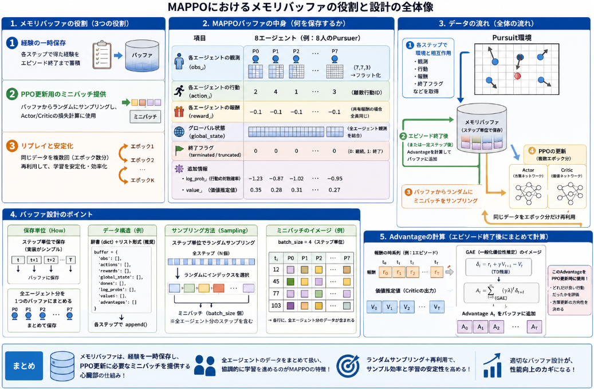

マルチエージェントの強化学習(MARL)のチーム連携が必要となるゲーム[Pursuit](https://yoshishinnze.hatenablog.com/entry/2026/06/06/043000)でAIエージェント学習の実装を進めています。

実装は以下の順に沿って進めていきます。

1. **環境ラッパ**でPursuitをMAPPO向けに整形
2. **Actor/Criticネットワーク**を設計
3. **バッファ**で経験を保存・計算
4. **学習ループ**でPPO更新を繰り返す
5. **評価・可視化**で性能を確認

前回2. Actor/Criticの実装まで進めました。
今回は3. バッファの実装を進めます。


今回のテーマ：
>Pursuitの環境で学習するバッファを設計・実装する

## メモリバッファの役割

MAPPOでPursuit環境を学習する際の「メモリバッファ」の役割は、**エージェントが環境と相互作用して得た経験（transition）を一時的に保存し、PPOの更新に必要なサンプルをまとめて提供すること**です。

主な役割は以下の3つです。

### 1. 経験の一時保存（Experience Storage）

- 各ステップで得られる
  - 観測 `obs`
  - 行動 `action`
  - 報酬 `reward`
  - 終了フラグ `terminated` / `truncated`
  - 追加情報（ログ確率、価値推定値など）
- を、**エピソードが終わるまでバッファに蓄積**します。

### 2. PPO更新用のミニバッチ提供（Mini-batch Sampling）

- PPOは「**過去のポリシーで集めたデータを使って、現在のポリシーを更新**」するアルゴリズムです。
- バッファに溜まった経験から、**ランダムにミニバッチをサンプリング**し、
  - Actor（方策）の損失計算
  - Critic（価値関数）の損失計算
  - Advantage（優位性）の推定
- に使います。

### 3. リプレイと安定化（Replay & Stabilization）

- 同じデータを**複数回（PPOのエポック数分）再利用**することで、
  - サンプル効率を上げる
  - 学習を安定させる
- という役割もあります。

### MAPPOでの具体的な中身

Pursuitのようなマルチエージェント環境では、バッファには以下のような情報を保存します。

- **各エージェントの観測**：`obs_i`（`(7,7,3)` → フラット化）
- **各エージェントの行動**：`action_i`（離散行動ID）
- **各エージェントの報酬**：`reward_i`（`shared_reward=True` なら全員同じ）
- **グローバル状態**：`global_state`（全エージェント観測の結合）
- **終了フラグ**：`terminated`, `truncated`
- **追加情報**：`log_prob`（行動の対数確率）、`value`（Criticの出力）など

これらをまとめておき、PPO更新時に「**全エージェント分のミニバッチ**」として使うのがMAPPOのバッファの役割です。

## メモリバッファが必要な理由

バッファが必要になる理由は、**PPO（Proximal Policy Optimization）の更新ルールと、学習の安定性・効率性**にあります。

### 1. PPOは「オンポリシー」だが「再利用」する

- PPOは基本的に**オンポリシー**（現在のポリシーで集めたデータで更新）です。
- しかし、**1回集めたデータを複数回（エポック数分）再利用**して更新します。
  - 例：K=3エポックなら、同じデータを3回使って方策を更新
- この「**再利用**」のために、データを一時的に保存しておく必要があります。
  - → バッファが必要

### 2. ミニバッチ学習と安定性

- 深層強化学習では、**ミニバッチ学習**（小さなバッチで勾配を更新）が重要です。
  - 全データを一度に更新するとメモリ・計算量が膨大
  - 1サンプルずつ更新するとノイズが大きい
- バッファに溜めたデータから**ランダムにミニバッチをサンプリング**することで、
  - 計算効率が良い
  - 勾配の分散が小さく、学習が安定する

### 3. Advantage推定のため

- PPOでは、**Advantage（A_t）** を推定して「どれだけ良い行動だったか」を評価します。
- Advantageは「**将来の報酬の合計（Return） − 現在の価値推定（Value）** 」で計算されます。
- これを正確に計算するには、
  - エピソード終了まで報酬を蓄積
  - あるいは、複数ステップ分の報酬をまとめて扱う
- 必要があります。
- → バッファに**複数ステップ分のデータをまとめて保存**しておくことで、Advantage計算がしやすくなります。

## 4. マルチエージェント（MAPPO）での重要性

- MAPPOでは、**全エージェントの経験をまとめて更新**します。
- バッファに
  - 各エージェントの観測・行動・報酬
  - グローバル状態
- を保存しておくことで、
  - 「**全エージェント分のミニバッチ**」を一度にサンプリング
  - 協調的な学習（共同報酬の共有）を効率的に実現
- できます。

## バッファ設計のポイント
MAPPOでPursuit環境を学習するためのバッファ設計のキーポイントは、**「何を」「どの単位で」「どう保存するか」** を明確にすることです。

### 1. 保存するデータ項目（What）

MAPPOでは、少なくとも以下を保存します。

- **各エージェントの観測**：`obs_i`（`(7,7,3)` → フラット化）
- **各エージェントの行動**：`action_i`（離散行動ID）
- **各エージェントの報酬**：`reward_i`（`shared_reward=True` なら全員同じ）
- **グローバル状態**：`global_state`（全エージェント観測の結合）
- **終了フラグ**：`terminated`, `truncated`
- **追加情報**：
  - `log_prob_i`：行動の対数確率（Actorの出力）
  - `value_i`：Criticの価値推定（グローバル状態から）
  - `advantage`：Advantage（後で計算）

### 2. 保存単位（How）

__(1) エピソード単位か、ステップ単位か__
- **エピソード単位**：1エピソード終了後にまとめて保存 → PPOの標準的な実装に近い
- **ステップ単位**：各ステップで逐次保存 → 実装がシンプル

Pursuit＋MAPPOでは、**ステップ単位で保存**するのが実装しやすいです。

__(2) マルチエージェントの扱い__
- **全エージェント分を1つの辞書/リストにまとめて保存**：
  - `obs = {'pursuer_0': obs0, 'pursuer_1': obs1, ...}`
  - `actions = {'pursuer_0': a0, 'pursuer_1': a1, ...}`
- または、**エージェントごとに別バッファ**：
  - `buffer_p0`, `buffer_p1`, ...（実装が複雑になるので非推奨）

MAPPOでは、**全エージェント分を1つのバッファにまとめて保存**するのが一般的です。

### 3. データ構造（Data Structure）

__(1) リスト／配列ベース__
- `obs_buffer = []`、`action_buffer = []`、`reward_buffer = []`、...
- 各ステップで `append` し、サンプリング時に `np.array` に変換。
- シンプルで実装しやすい。

__(2) 辞書ベース__
- `buffer = {'obs': [], 'actions': [], 'rewards': [], ...}`
- キーでアクセスしやすく、拡張性が高い。

__(3) 固定サイズのリングバッファ__
- `deque` や `np.roll` で古いデータを自動削除。
- メモリ使用量を制御できる。

### 4. サンプリング方法（Sampling）

__(1) ミニバッチのサイズ__
- `batch_size = 64` や `128` など、ネットワークのサイズに合わせて設定。
- Pursuit（8エージェント）なら、**8の倍数**にすると扱いやすい。

__(2) ランダムサンプリング__
- `np.random.choice` や `random.sample` でインデックスを選ぶ。
- 時間相関を壊し、学習を安定させる。

__(3) エージェント単位か、ステップ単位か__
- **ステップ単位サンプリング**：各ミニバッチに「全エージェント分のステップ」を含める。
- **エージェント単位サンプリング**：各ミニバッチに「特定エージェントの複数ステップ」を含める（複雑なので非推奨）。

MAPPOでは、**ステップ単位サンプリング**が一般的です。

### 5. Advantage計算の扱い

- Advantageは**バッファに保存後、エピソード終了時にまとめて計算**するのが一般的です。
- 計算方法：
  - **GAE（Generalized Advantage Estimation）**：将来報酬の割引和と価値推定の差分から計算。
  - **Return（累積報酬） − Value**：シンプルな方法。

計算したAdvantageをバッファに追加し、PPO更新時に使用します。

## 実装

### 1. 実装コード

上記の設計のポイントに沿って実装しました。
以下のレポジトリにコードを保存しています。

https://github.com/Shinichi0713/Reinforce-Learning-Study/tree/main/miulti-agent/petting_zoo/src/4_pursuit/src


### 2. 動作確認

前回までの環境ラッパーを用いて、今回実装したメモリバッファにデータ保持、デモでデータ取り出しを行います。
以下テストコードで正常動作すれば実装は完了です。

```python
# テスト実行
def test_pursuit_buffer():
    print("=== Pursuit + 環境ラッパ + メモリバッファ テスト開始 ===")
    
    # 環境とラッパの初期化
    env = PursuitWrapper(render_mode=None, max_cycles=50)  # テスト用に短く
    num_agents = env.num_agents
    obs_dim = env.obs_dim
    state_dim = env.state_dim
    action_dim = env.action_dim
    
    print(f"エージェント数: {num_agents}")
    print(f"観測次元: {obs_dim}")
    print(f"グローバル状態次元: {state_dim}")
    print(f"行動空間サイズ: {action_dim}")
    
    # メモリバッファの初期化
    buffer = MultiAgentBuffer(num_agents, obs_dim, state_dim, action_dim)
    
    # 1エピソード実行（ランダムエージェント）
    env.reset()
    step_count = 0
    
    for agent in env.env.agent_iter():
        # 観測とグローバル状態を取得
        obs = env.get_obs(agent)
        global_state = env.get_global_state()
        
        if agent not in env.env.agents:
            action = None
            reward = 0.0
            terminated = True
            truncated = True
        else:
            _, _, terminated, truncated, _ = env.env.last(agent)
            if terminated or truncated:
                action = None
            else:
                # ランダム行動（テスト用）
                action = env.action_space.sample()
            
            # 1ステップ進める
            reward, terminated, truncated, info = env.step(agent, action)
        
        # 各エージェントの観測・行動・報酬・log_probを辞書でまとめる
        obs_dict = {}
        action_dict = {}
        reward_dict = {}
        log_prob_dict = {}
        
        for i in range(num_agents):
            agent_name = f'pursuer_{i}'
            if agent_name in env.env.agents:
                agent_obs = env.get_obs(agent_name)
                if agent_obs is not None:
                    obs_dict[agent_name] = agent_obs
                else:
                    obs_dict[agent_name] = np.zeros(obs_dim, dtype=np.float32)
                
                # 行動と報酬は現在のエージェントのみ実際の値、他は0またはNone
                if agent_name == agent:
                    action_dict[agent_name] = action if action is not None else 0
                    reward_dict[agent_name] = reward
                else:
                    action_dict[agent_name] = 0
                    reward_dict[agent_name] = 0.0
                
                # log_probはテスト用にランダム値（実際はポリシーから計算）
                log_prob_dict[agent_name] = np.log(1.0 / action_dim)  # 一様分布のlog_prob
            else:
                # deadエージェントは0埋め
                obs_dict[agent_name] = np.zeros(obs_dim, dtype=np.float32)
                action_dict[agent_name] = 0
                reward_dict[agent_name] = 0.0
                log_prob_dict[agent_name] = 0.0
        
        # Criticの価値推定（テスト用に0）
        value = 0.0
        
        # バッファに保存
        buffer.store(
            obs_dict, action_dict, reward_dict, global_state,
            log_prob_dict, value, terminated, truncated
        )
        
        step_count += 1
        if terminated or truncated:
            print(f"エピソード終了: {step_count}ステップ")
            break
    
    # バッファの状態を確認
    print(f"\nバッファに保存されたステップ数: {len(buffer)}")
    print(f"エピソード長さのリスト: {buffer.episode_lengths}")
    
    # Advantageを計算
    buffer.compute_advantages(gamma=0.99, gae_lambda=0.95)
    print("Advantage計算完了")
    
    # ミニバッチをサンプリングして形状を確認
    batch_size = min(16, len(buffer))  # 小さいバッチでテスト
    batch = buffer.sample(batch_size)
    
    if batch is not None:
        print(f"\nミニバッチの形状:")
        print(f"obs: {batch['obs'].shape}")           # (batch, num_agents, obs_dim)
        print(f"actions: {batch['actions'].shape}")    # (batch, num_agents)
        print(f"rewards: {batch['rewards'].shape}")    # (batch, num_agents)
        print(f"global_states: {batch['global_states'].shape}")  # (batch, state_dim)
        print(f"log_probs: {batch['log_probs'].shape}") # (batch, num_agents)
        print(f"values: {batch['values'].shape}")      # (batch,)
        print(f"advantages: {batch['advantages'].shape}")  # (batch, num_agents)
        
        # 値の範囲を簡単に確認
        print(f"\n値の範囲（サンプル）:")
        print(f"rewards min/max: {batch['rewards'].min():.3f}, {batch['rewards'].max():.3f}")
        print(f"advantages min/max: {batch['advantages'].min():.3f}, {batch['advantages'].max():.3f}")
        print(f"log_probs min/max: {batch['log_probs'].min():.3f}, {batch['log_probs'].max():.3f}")
    else:
        print("バッファが空です")
    
    # バッファをクリア
    buffer.clear()
    print(f"\nバッファクリア後: {len(buffer)}")
    
    env.close()
    print("=== テスト終了 ===")

# テスト実行
if __name__ == "__main__":
    test_pursuit_buffer()
```

__出力__

正常稼働した場合、エラーなく以下のように出力が得られます。

```
=== Pursuit + 環境ラッパ + メモリバッファ テスト開始 ===
エージェント数: 8
観測次元: 147
グローバル状態次元: 1176
行動空間サイズ: 5
エピソード終了: 400ステップ

バッファに保存されたステップ数: 400
エピソード長さのリスト: [400]
Advantage計算完了

ミニバッチの形状:
obs: (16, 8, 147)
actions: (16, 8)
rewards: (16, 8)
global_states: (16, 1176)
log_probs: (16, 8)
values: (16,)
advantages: (16, 8)

値の範囲（サンプル）:
rewards min/max: -0.095, 0.000
advantages min/max: -0.245, -0.099
log_probs min/max: -1.609, -1.609

バッファクリア後: 0
=== テスト終了 ===
```

## 総括

今回扱ったMAPPOでPursuit環境を学習する際のメモリバッファの役割と設計ポイントについては以下が要点です。



### メモリバッファの役割

- **経験の一時保存**：各ステップの観測・行動・報酬・終了フラグ・追加情報（log_prob, valueなど）をエピソード終了まで蓄積する。
- **PPO更新用のミニバッチ提供**：蓄積した経験からランダムにミニバッチをサンプリングし、Actor/Criticの損失計算とAdvantage推定に使う。
- **リプレイと安定化**：同じデータを複数回（PPOのエポック数分）再利用することで、サンプル効率と学習の安定性を高める。

### バッファが必要な理由

- **PPOの再利用**：1回集めたデータを複数回使って方策を更新するため、一時保存が必要。
- **ミニバッチ学習**：小さなバッチで勾配を更新するため、ランダムサンプリングが可能なバッファが不可欠。
- **Advantage推定**：将来報酬の合計（Return）と価値推定（Value）の差分を計算するため、複数ステップ分のデータをまとめて扱う必要がある。
- **マルチエージェント対応**：全エージェントの経験をまとめて更新するMAPPOでは、各エージェントの観測・行動・報酬とグローバル状態を一括で扱う必要がある。

### バッファ設計のポイント

__1. 保存項目__
- 各エージェントの観測・行動・報酬
- グローバル状態
- 終了フラグ（terminated, truncated）
- 追加情報（log_prob, value, advantage）

__2. 保存単位__
- **ステップ単位で全エージェント分をまとめて保存**（1ステップ＝全エージェントの経験）
- 全エージェント分を1つのバッファにまとめる（エージェントごとの別バッファは非推奨）

__3. データ構造__
- リスト／辞書ベースでシンプルに実装（`buffer['obs'].append(obs_dict)`）
- 必要に応じて固定サイズのリングバッファでメモリ制御

__4. サンプリング__
- ランダムにステップを選び、全エージェント分をミニバッチ化
- バッチサイズは8の倍数など、エージェント数に合わせて設定

__5. Advantage計算__
- エピソード終了後にGAEなどでAdvantageを計算し、バッファに追加
- Return − Value またはGAEで将来報酬の割引和を扱う


