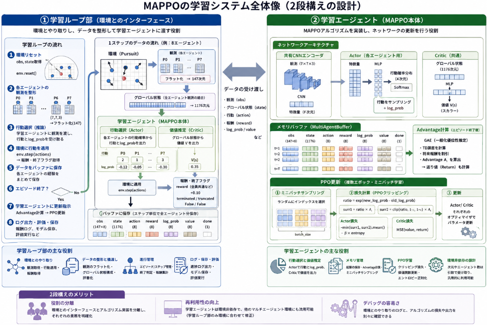

マルチエージェントの強化学習(MARL)のチーム連携が必要となるゲーム[Pursuit](https://yoshishinnze.hatenablog.com/entry/2026/06/06/043000)でAIエージェント学習の実装を進めています。

実装は以下の順に沿って進めています。

1. **環境ラッパ**でPursuitをMAPPO向けに整形
2. **Actor/Criticネットワーク**を設計
3. **バッファ**で経験を保存・計算
4. **学習ループ**でPPO更新を繰り返す
5. **評価・可視化**で性能を確認

前回3. バッファの実装まで進めました。
今回は4. 学習ループの実装を進めます。

今回のテーマ：
>Pursuitの環境で学習するMAPPOのアルゴリズムを実装する

## 学習ループの構成

環境と実際に情報のやり取りを行い、ネットワークアーキテクチャの保存や、デバッグを行う学習ループ部と、学習においてマルチエージェントPPO（MAPPO）の「学習アルゴリズム本体」(以下学習エージェントとします)の2段構えで実装を進めていきます。

以下に、**学習ループ部**と**学習エージェント（MAPPO本体）** の役割を説明します。

### 1. 学習ループ部の役割（環境とのインターフェース）

学習ループ部は、**「環境と実際に情報のやり取りを行い、学習の流れを制御する」** 役割を担います。

__主な役割__
- **環境とのインタラクション**
  - 環境のリセット（`env.reset()`）
  - 各エージェントの観測取得（`env.get_obs(agent)`）
  - グローバル状態の取得（`env.get_global_state()`）
  - 行動の適用と報酬の取得（`env.step(agent, action)`）
- **学習の進行管理**
  - エピソードループ（`for episode in range(max_episodes)`）
  - ステップループ（`for agent in env.env.agent_iter()`）
  - エピソード終了条件（`terminated` / `truncated`）の監視
- **データの整形と橋渡し**
  - 観測のテンソル化（`torch.FloatTensor(obs)`）
  - グローバル状態のテンソル化
  - 各エージェントの行動・報酬・log_probの辞書化
- **学習の進捗管理**
  - 報酬の集計（`episode_reward`）
  - ステップ数の記録
  - ログ出力（`print(f"Episode {episode}: Reward = {episode_reward:.2f}")`）
- **チェックポイントの保存**
  - 特定のインターバルでのモデル保存（`save_checkpoint(mappo, episode)`）
  - 学習の再開（`load_checkpoint(mappo, checkpoint_path)`）

__特徴__
- **環境依存**：Pursuit環境の仕様（エージェント数・観測形状・行動空間）に強く依存
- **実装詳細**：deadエージェントの扱い、観測の整形、グローバル状態の構成など、環境固有の処理を担当
- **制御フロー**：学習の流れ（リセット→行動選択→ステップ→更新）を管理

### 2. 学習エージェント（MAPPO本体）の役割（アルゴリズムの実装）

学習エージェントは、**「マルチエージェントPPOの学習アルゴリズムを実装し、ネットワークの更新を担当する」** 役割を担います。

__主な役割__
- **ネットワークアーキテクチャの管理**
  - Actorネットワーク（各エージェントの行動確率分布）
  - Criticネットワーク（グローバル状態からの価値推定）
  - CNNエンコーダ（観測の特徴抽出）
- **行動選択（推論）**
  - `get_action(obs_tensor)`：各エージェントの行動とlog_probを取得
  - 学習中は探索（確率的サンプリング）、評価時は貪欲（最大確率）に切り替え可能
- **価値推定**
  - `get_value(global_state_tensor)`：グローバル状態から価値を推定
  - Advantage計算（GAE）やリターン計算に必要な状態価値を提供
- **PPO更新（学習）**
  - `update(batch)`：バッファからサンプリングしたミニバッチを用いてPPO更新
  - Actor更新：確率比とAdvantageからPPOクリッピング損失を計算
  - Critic更新：リターンとのMSEで価値関数を更新
  - エントロピー正則化：方策の多様性を維持
- **メモリバッファとの連携**
  - `MultiAgentBuffer` を内部に保持し、経験の保存・Advantage計算・サンプリングを統括
  - エピソード終了後に `buffer.compute_advantages()` を呼び出し、PPO更新に必要なAdvantageを準備

__特徴__
- **環境非依存**：観測次元・行動空間・エージェント数は引数で受け取り、環境に依存しない設計
- **アルゴリズム実装**：PPOの数式（クリッピング損失・GAE・エントロピー正則化）を実装
- **ネットワーク更新**：勾配計算・最適化器の更新を担当

### 3. 2段構えのメリット

__役割の分離__
- **学習ループ部**：環境とのインターフェース、データ整形、学習の進行管理
- **学習エージェント**：アルゴリズムの実装、ネットワーク更新、メモリ管理

__再利用性__
- **学習エージェント**は環境に依存しないため、他のマルチエージェント環境（例：MADDPG環境）にも流用可能
- **学習ループ部**は環境固有の処理を担当するため、環境が変わっても修正が最小限で済む

__デバッグの容易さ__
- **学習ループ部**：環境とのやり取り（観測・行動・報酬）のログを確認
- **学習エージェント**：ネットワークの出力（行動確率・価値）や損失の推移を確認

## 設計

以下に、**学習ループ部**と**学習エージェント（MAPPO本体）** の実装におけるキーポイントを整理します。

### 1. 学習ループ部の実装キーポイント

__1-1. 環境とのインターフェース設計__
- **観測の整形**：Pursuitの観測 `(7,7,3)` をフラット化（147次元）し、テンソル化
- **グローバル状態の構成**：全エージェントの観測を結合（1176次元）し、Criticに渡す
- **deadエージェントの扱い**：`agent in env.agents` で生存確認し、観測・行動・報酬をゼロ埋め

__1-2. データの橋渡し__
- **観測のテンソル化**：`torch.FloatTensor(obs)` でネットワーク入力に変換
- **行動の辞書化**：各エージェントの行動・報酬・log_probを辞書でまとめ、バッファに保存
- **グローバル状態の保持**：Critic用にグローバル状態を毎ステップ保存

__1-3. 学習の進行管理__
- **エピソードループ**：`for episode in range(max_episodes)` で学習回数を制御
- **ステップループ**：`for agent in env.env.agent_iter()` で各エージェントの順番を処理
- **終了条件の監視**：`terminated` / `truncated` でエピソード終了を判定

__1-4. チェックポイントとログ__
- **チェックポイント保存**：特定のインターバルでモデルを保存（`save_checkpoint`）
- **進捗ログ**：報酬・ステップ数・損失を定期的に出力
- **評価実行**：貪欲方策で環境を実行し、性能を確認

### 2. 学習エージェント（MAPPO本体）の実装キーポイント

__2-1. ネットワークアーキテクチャの設計__
- **CNNエンコーダの共有**：Actor/Criticで共通のCNNエンコーダを使用し、観測から特徴量を抽出
- **Actorの設計**：各エージェントの観測を個別に処理し、行動確率分布を出力
- **Criticの設計**：グローバル状態（1176次元）をMLPで処理し、価値を出力

__2-2. 行動選択と価値推定__
- **行動選択**：`get_action(obs_tensor)` で各エージェントの行動とlog_probを取得
- **価値推定**：`get_value(global_state_tensor)` でグローバル状態から価値を推定
- **探索と貪欲の切り替え**：学習中は確率的サンプリング、評価時は最大確率行動

__2-3. PPO更新の実装__
- **確率比の計算**：`ratio = exp(new_log_probs - old_log_probs)`
- **PPOクリッピング**：`surr1 = ratio * advantages`, `surr2 = clamp(ratio) * advantages`
- **Actor損失**：`-min(surr1, surr2).mean()` ＋ エントロピー正則化
- **Critic損失**：`MSE(values, returns)` で価値関数を更新
- **最適化器の更新**：`optimizer.zero_grad()`, `loss.backward()`, `optimizer.step()`

__2-4. メモリバッファとの連携__
- **経験の保存**：`buffer.store()` で各エージェントの観測・行動・報酬・log_prob・価値を保存
- **Advantage計算**：`buffer.compute_advantages()` でGAEを用いてAdvantageを計算
- **ミニバッチサンプリング**：`buffer.sample(batch_size)` でランダムにサンプリング

__2-5. 環境非依存の設計__
- **引数での抽象化**：`num_agents`, `obs_dim`, `state_dim`, `action_dim` を引数で受け取り、環境に依存しない
- **汎用性の確保**：Pursuit以外のマルチエージェント環境にも流用可能な設計

### 3. 2段構えの実装における注意点

__3-1. データの整合性__
- **観測次元の一致**：学習ループ部の観測整形（147次元）とActorの入力次元が一致していること
- **グローバル状態の次元**：Criticの入力次元（1176次元）と学習ループ部の結合結果が一致していること

__3-2. バッファの設計__
- **保存単位**：ステップ単位で全エージェント分の経験を保存
- **Advantage計算**：GAEの実装が正しく、`gamma` と `gae_lambda` が適切に設定されていること

__3-3. 学習の安定性__
- **クリップ係数の調整**：`clip_epsilon` を小さくしすぎると学習が進まない
- **学習率の調整**：`lr_actor` と `lr_critic` を適切に設定し、発散を防ぐ
- **バッチサイズとエポック数**：`batch_size` と `update_epochs` のバランスを取る

## 実装

### 実装コード

上記の設計のポイントに沿って実装しました。
以下のレポジトリにコードを保存しています。

https://github.com/Shinichi0713/Reinforce-Learning-Study/tree/main/miulti-agent/petting_zoo/src/4_pursuit/src

### 動作確認

ここまで進めてきた実装で学習に必要な機能はそろいました。
なので、動作確認は実際に学習がエラーなく進んでいるかということを確認することとします。

上記の実装コードを揃えた状態で実行して以下のように学習が進めば実装は正常に出来たことになります。

```
=== MAPPO（CNNベース）学習開始 ===
エージェント数: 8
観測次元: 147
グローバル状態次元: 1176
行動空間サイズ: 5
Episode 0: Reward = -346.37, Steps = 4000
Epoch 0: Actor Loss: -0.0213, Value Loss: 0.0042
Epoch 0: Actor Loss: -0.0201, Value Loss: 0.0012
Epoch 0: Actor Loss: -0.0272, Value Loss: 0.0011
チェックポイントを保存: /content/drive/MyDrive/rl_pursuit/mappo_episode_0.pth
Episode 1: Reward = -372.38, Steps = 4000
Epoch 0: Actor Loss: -0.0262, Value Loss: 0.0013
Epoch 0: Actor Loss: -0.0288, Value Loss: 0.0013
Epoch 0: Actor Loss: -0.0240, Value Loss: 0.0007
Episode 2: Reward = -377.46, Steps = 4000
Epoch 0: Actor Loss: -0.0329, Value Loss: 0.0009
Epoch 0: Actor Loss: -0.0238, Value Loss: 0.0011
Epoch 0: Actor Loss: -0.0360, Value Loss: 0.0005
```


## 総括

以下に、**学習ループ部**と**学習エージェント（MAPPO本体）** の役割と実装キーポイントを総括します。

### 1. 全体の設計方針

マルチエージェントPPO（MAPPO）の実装は、**「環境固有の処理」と「アルゴリズムの汎用実装」を分離する2段構え**で進めます。

- **学習ループ部**：環境とのインターフェース、データ整形、学習の進行管理
- **学習エージェント**：MAPPOアルゴリズムの実装、ネットワーク更新、メモリ管理

この分離により、**環境依存の複雑さとアルゴリズムの再利用性を両立**します。

### 2. 学習ループ部の役割とキーポイント

__2-1. 役割__
- **環境とのインタラクション**：リセット・観測取得・行動適用・報酬取得
- **学習の進行管理**：エピソードループ・ステップループ・終了条件の監視
- **データの橋渡し**：観測のテンソル化・グローバル状態の構成・行動の辞書化
- **進捗管理**：報酬集計・ログ出力・チェックポイント保存

__2-2. 実装キーポイント__
- **観測の整形**：Pursuitの観測 `(7,7,3)` をフラット化（147次元）し、テンソル化
- **グローバル状態の構成**：全エージェントの観測を結合（1176次元）し、Criticに渡す
- **deadエージェントの扱い**：`agent in env.agents` で生存確認し、観測・行動・報酬をゼロ埋め
- **チェックポイント保存**：特定のインターバルでモデルを保存し、学習の再開を可能にする

### 3. 学習エージェント（MAPPO本体）の役割とキーポイント

__3-1. 役割__
- **ネットワーク管理**：Actor/Critic/CNNエンコーダの設計と共有
- **行動選択と価値推定**：各エージェントの行動確率・log_prob・価値を出力
- **PPO更新**：確率比・PPOクリッピング・価値損失・エントロピー正則化を実装
- **メモリ管理**：マルチエージェントバッファとの連携、Advantage計算、ミニバッチサンプリング

__3-2. 実装キーポイント__
- **CNNエンコーダの共有**：Actor/Criticで共通のCNNを使用し、観測から特徴量を抽出
- **Actorの設計**：各エージェントの観測を個別に処理し、行動確率分布を出力
- **Criticの設計**：グローバル状態（1176次元）をMLPで処理し、価値を出力
- **PPO更新の実装**：確率比・クリッピング・価値損失・エントロピー正則化を正確に実装
- **環境非依存の設計**：`num_agents`, `obs_dim`, `state_dim`, `action_dim` を引数で受け取り、汎用性を確保

### 4. 2段構えのメリット

__4-1. 役割の分離__
- **学習ループ部**：環境固有の処理（観測整形・deadエージェント対応など）を担当
- **学習エージェント**：アルゴリズムの汎用実装（PPO更新・ネットワーク設計）を担当

__4-2. 再利用性__
- **学習エージェント**は環境に依存しないため、他のマルチエージェント環境にも流用可能
- **学習ループ部**は環境固有の処理を担当するため、環境が変わっても修正が最小限で済む

__4-3. デバッグの容易さ__
- **学習ループ部**：環境とのやり取り（観測・行動・報酬）のログを確認
- **学習エージェント**：ネットワークの出力（行動確率・価値）や損失の推移を確認

### 5. 実装における注意点

__5-1. データの整合性__
- **観測次元の一致**：学習ループ部の観測整形（147次元）とActorの入力次元が一致
- **グローバル状態の次元**：Criticの入力次元（1176次元）と学習ループ部の結合結果が一致

__5-2. バッファの設計__
- **保存単位**：ステップ単位で全エージェント分の経験を保存
- **Advantage計算**：GAEの実装が正しく、`gamma` と `gae_lambda` が適切に設定

__5-3. 学習の安定性__
- **クリップ係数**：`clip_epsilon` を適切に設定し、学習の安定性を確保
- **学習率**：`lr_actor` と `lr_critic` を調整し、発散を防ぐ
- **バッチサイズとエポック数**：`batch_size` と `update_epochs` のバランスを取る

### 6. まとめ

- **学習ループ部**は、環境とのインターフェースとして、観測の整形・グローバル状態の構成・deadエージェントの扱い・チェックポイント保存を担当します。
- **学習エージェント**は、MAPPOアルゴリズムの実装として、ネットワーク設計・行動選択・PPO更新・メモリ管理を担当します。
- この2段構えにより、**環境固有の複雑さとアルゴリズムの汎用性を分離**し、実装の保守性・再利用性・デバッグの容易さを高めています。

ということで今回でMAPPOを使った学習を行う環境がようやく整ったことになります。




<div class="shop-card">
<div class="shop-card-image"></div>
<div class="shop-card-content">
<div class="shop-card-title">強化学習 (機械学習プロフェッショナルシリーズ)</div>
<div class="shop-card-description">同シリーズで緑本のPythonによる強化学習の本を何度も何度も読んだのですが、どうしても読み進めません。試しにと思って3年前に買ったこの本を読み返してみるとすっと読めました。 これからのコーディングは生成AIが書いてくれるのだから、難しい理論本で勉強してコーディングはお任せ（直すべき所は直す）というのが正解なのかもしれない。。。</div>
<div class="shop-card-link"><a href="https://www.amazon.co.jp/%E5%BC%B7%E5%8C%96%E5%AD%A6%E7%BF%92-%E6%A9%9F%E6%A2%B0%E5%AD%A6%E7%BF%92%E3%83%97%E3%83%AD%E3%83%95%E3%82%A7%E3%83%83%E3%82%B7%E3%83%A7%E3%83%8A%E3%83%AB%E3%82%B7%E3%83%AA%E3%83%BC%E3%82%BA-%E6%A3%AE%E6%9D%91%E5%93%B2%E9%83%8E-ebook/dp/B07XJXMQGD?__mk_ja_JP=%E3%82%AB%E3%82%BF%E3%82%AB%E3%83%8A&amp;crid=2Q7JANDTXMDRQ&amp;dib=eyJ2IjoiMSJ9.YZxuAtwvMTmksETM7b4V5tEFcZKwS3FH_fG2YEbWKvrGjHj071QN20LucGBJIEps.GCkT5rik7rfwPmJpLUkBFsUfiUvfOc-QO8WH5HT0oSA&amp;dib_tag=se&amp;keywords=MARL+%E5%BC%B7%E5%8C%96%E5%AD%A6%E7%BF%92&amp;qid=1777879215&amp;sprefix=marl+%E5%BC%B7%E5%8C%96%E5%AD%A6%E7%BF%92%2Caps%2C165&amp;sr=8-1&amp;linkCode=ll2&amp;tag=yoshishinnze-22&amp;linkId=a3ac27efe00549a8b95a7d948fa658b0&amp;ref_=as_li_ss_tl" target="_blank" rel="noopener">Amazonで詳細を見る</a></div>
</div>
</div>
<p>[blog:g:4207112889963697807:banner]</p>
<p>[blog:g:10328749687175353006:banner]</p>
<p>[blog:g:11696248318754550880:banner]</p>
<p>[blog:g:11696248318754550877:banner]</p>

