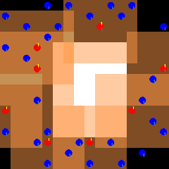

マルチエージェントの強化学習(MARL)のチーム連携が必要となるゲーム[Pursuit](https://yoshishinnze.hatenablog.com/entry/2026/06/06/043000)でAIエージェント学習の実装を進めてきました。

しかし、これだけでうまく学習が進むわけではありません。
強化学習は学習が出来るようになった後の改修が必要です。

因みに学習前の各エージェントの動作はこのような感じでした。


本日テーマ：
>うまくエージェントの学習が進むようにコードの改修を行う

## 実装コードの修正（Critic更新部分）
まずは先日作成してきたコードのレビューです。

### 現状の確認

学習時のCriticのロスがActorに比べて小さすぎました。何か見直すべきことがないかということで確認しました。
バッファの`compute_advantages` メソッドを見ると、`returns` はすでに「リターン（割引累積報酬）」として正しく計算されています。
したがって、学習エージェントMAPPOの「Criticの学習対象をリターンに修正する」が怪しいと踏みました、修正すべき箇所は `MAPPO.update` 内の Critic 更新部分のみです。

### 修正すべき箇所（Critic更新）

**現在のコード（問題あり）**:

```python
# Critic更新
values = self.critic(global_states).squeeze()  # (batch,)
critic_loss = nn.MSELoss()(values, returns.mean(dim=1))  # グローバル報酬で学習
```

- `returns` は `compute_advantages` で計算された「各エージェントのリターン（割引累積報酬）」です。
- `returns.mean(dim=1)` は「各タイムステップの全エージェントリターンの平均」であり、  
  Pursuit の `shared_reward=True` では「各ステップのリターンそのもの」とほぼ同じになります。
- 結果として、Critic が「常にほぼ同じ値（リターンの平均）」を学習し、**Critic Loss がほぼ 0** になります。

**修正案（グローバルリターンで学習）**:

```python
# Critic更新
values = self.critic(global_states).squeeze()  # (batch,)

# returns は「各エージェントのリターン（割引累積報酬）」になっている前提
returns_global = returns.mean(dim=1)  # グローバルリターン（batch,）
critic_loss = nn.MSELoss()(values, returns_global)
```

**ポイント**:
- `returns` は既に「リターン」として正しく計算されているので、  
  `returns.mean(dim=1)` を「グローバルリターン」として Critic に学習させます。
- これにより、Critic は「状態価値 V(s) ≈ 期待グローバルリターン」を学習し、  
  Advantage（`returns - values`）が正しく計算されるようになります。

### 修正後の期待効果

- **Critic Loss**: 0 付近から増加し、**リターンに合わせて学習**するようになります。
- **Advantage**: `returns - values` が正しく計算され、Actor の更新が進みます。
- **報酬・捕獲数**: Critic が正しく学習することで、Actor が「良い行動」を選びやすくなり、  
  報酬・捕獲数が改善する可能性が高まります。


## 報酬系の見直し（距離・協調・回り込み）
現状環境から報酬をもらえるのは4カ所を味方で囲んで敵を捕まえる場合のみですが、こんな状況偶然には絶対起きないと思われます。
ですので接近することや、勝利に近づく行動に報酬を与えていきたいと思います。

### (1) 距離ベースの報酬

**目的**: 獲物との距離が近づくほど報酬を与え、追跡の進捗を評価する。

**修正案**:
- 各ステップで「追跡者と獲物の距離」を計算し、距離が近づくほど +0.01〜+0.1 の報酬を与える。
- 距離が遠ざかるほど -0.01〜-0.1 のペナルティを与える。

**期待効果**:
- 学習初期でも「距離が近づく」ことで報酬が得られ、Critic が正の値を学習しやすくなる。
- Actor が「獲物に近づく行動」を選ぶインセンティブが強まる。

### (2) 協調行動の報酬

**目的**: 追跡者が協調して獲物を囲む行動を評価する。

**修正案**:
- 獲物の周囲に追跡者が複数いる場合、+0.1〜+0.5 の報酬を与える。
- 獲物が「囲まれている」状態（上下左右に追跡者がいる）の場合、+1 の報酬を与える。

**期待効果**:
- Critic が「協調行動」の価値を学習しやすくなる。
- Actor が「獲物を囲む行動」を選ぶインセンティブが強まる。

### (3) 回り込み（包囲）ロジックの追加

**目的**: 追いかけるだけでなく、味方がいない方向から獲物に回り込む行動を強化する。

**ポイント**:

1. **自分の視界を4つの「セクター」に分割**
   - エージェント自身の $7 \times 7$ の視界（ローカル観測）において、  
     最も近い獲物が「上・下・左・右」のどのエリアにいるかをリアルタイムに判定します。
   - 例：獲物が自分より「上」にいれば、視界の上半分をスキャン。
   - これにより、エージェントから獲物へ伸びる **「進路上のエリア」** を特定します。

2. **進路上の「味方の混雑度（flank_allies）」をカウント**
   - 特定したセクター（エリア）の中に、自分以外の味方エージェントが何人映り込んでいるかを計算します。
   - これにより、**「今自分が狙っているルートは、すでに他の味方が通ろうとしていて混んでいるか？それともガラ空きか？」** が数値として分かります。

3. **「ガラ空きのルート」からの接近にボーナス**
   - エージェントが獲物に近づいた（距離が縮まった）際、通常の距離報酬に加えて、  
     以下の条件を満たしている場合に **`flanking_bonus_scale`（回り込みボーナス）** を上乗せします。
     > **条件：獲物に近づいた、かつ、そのエリアの味方数（flank_allies）が「0人」であること**

**期待される行動変化**:

| 項目 | 修正前の挙動 | 修正後の挙動 |
| --- | --- | --- |
| **ルート選択** | 全員が最短距離（直線）で獲物を追いかける。 | 味方がいない空いているルートを探す。 |
| **エージェントの並び** | 獲物の後ろに一列に並んでしまう（一列追従）。 | 獲物を挟み込むように**左右の側面や前方に回り込む**。 |
| **学習のゴール** | 偶然囲めるのを待つ（確率が低い）。 | 意志を持って「包囲網」を形成しにいく。 |

この「誰もいないルートから近づくと美味しい」というインセンティブにより、  
エージェントたちは自然とターゲットを分散して囲い込むような、高度な協調行動（サラウンド）を学習しやすくなることを期待します。


## Actor / Critic ロスの意味と解釈
因みにActor-Criticで学習した場合よくActorのロスがマイナス、Criticのロスがプラスというようにちぐはぐになることがあります。
これはどういう意味かということについて説明します。

__ロスのログ__

```
Episode 66: Reward = -215.72, Captures = 0, Avg Reward = -237.98, Avg Captures = 0.00
Actor Loss: -0.0086 | Critic Loss: 0.0684 | Avg Entropy: 1.5968
Episode 67: Reward = -256.44, Captures = 0, Avg Reward = -238.25, Avg Captures = 0.00
Actor Loss: -0.0053 | Critic Loss: 0.0580 | Avg Entropy: 1.5936
Episode 68: Reward = -258.34, Captures = 0, Avg Reward = -238.54, Avg Captures = 0.00
Actor Loss: -0.0120 | Critic Loss: 0.0263 | Avg Entropy: 1.5957
Episode 69: Reward = -226.41, Captures = 0, Avg Reward = -238.37, Avg Captures = 0.00
Actor Loss: -0.0149 | Critic Loss: 0.0493 | Avg Entropy: 1.5957
Episode 70: Reward = -175.68, Captures = 0, Avg Reward = -237.49, Avg Captures = 0.00
Actor Loss: -0.0177 | Critic Loss: 0.1733 | Avg Entropy: 1.5927
```

### Actor のロスが「マイナス」になる理由

結論から言うと、**Actor のロスはマイナス（負の値）を目指して進むのが正解**です。

強化学習の目的は、累積報酬を「最大化」することです。しかし、PyTorch などの最適化器（Adam など）は、基本的に損失（ロス）を「最小化（ゼロに近づける、あるいはマイナスを大きくする）」するように動きます。

そのため、プログラム内では以下のような工夫をしています。

> **「ポリシーの良さ（目的関数）」にマイナス（$-1$）を掛けて、それを「Actor のロス」とする。**

- **エージェントが良い行動をした時**:  
  「ポリシーの良さ」がプラスの大きな値になります。そこにマイナスを掛けるため、  
  **Actor のロスは $-0.02$ のようにマイナスの値**になります。
- **学習が進むほど**:  
  エージェントが良い行動を選ぶ確率がさらに上がるため、ロスは $-0.1$、$-0.2$ と、  
  さらにマイナス側へ深く沈んでいきます。

つまり、Actor ロスがマイナスになっているのは、  
**「エージェントが、報酬を多くもらえる（Advantage がプラスの）行動の確率をうまく高められているよ」** というサインです。

### Critic のロスが「プラス」になる理由

Critic のロスは、予測と実際の答えのズレ（二乗誤差：MSELoss）を計算しているため、  
数学的に絶対にマイナスにはならず、必ず「プラス（正の値）」になります。

$$Critic\ Loss = (実際の累積報酬 - Criticが予測した価値)^2$$

数式を見てもわかる通り、誤差を2乗しているため、どんなにズレていても必ずプラスになります。  
予測が完璧に的中した時だけ `0.0` になります。

- **現在のログ（0.0003 など極めて低いプラス値）**:  
  これは Critic の予測がかなり安定していることを示しています。
- **今後の変化**:  
  バッファや報酬のバグを直したことで、今後エージェントが獲物を捕まえて  
  「大きめのプラス報酬」を一気に得る瞬間（エピソード）が出てきます。  
  その瞬間、Critic は「急に大金（高報酬）が手に入った」と驚くため、  
  **一時的に Critic のロスがプラス側へピョコッと跳ね上がります。**  
  その後、その高報酬も予測できるようになれば、またゼロに向かって下がっていきます。

-
### 現在のログの解釈

現在のログの状態は、以下のように解釈できます。

- **Actor Loss がマイナス**:  
  「ランダムに動いている割には、少しでもマシな行動（獲物に近い方向など）の確率を上げようと頑張っている」
- **Critic Loss が小さなプラス**:  
  「現在の『どうせ失敗してマイナス300点くらいになる』という絶望的な未来を、かなり正確に予測できている」

今後、バッファの修正版で本格的に学習が始まると、この数値がダイナミックに動き始めます。  
まずは Actor のロスがマイナスを維持、またはさらにマイナスに深く進んでいるかを確認しながら見守ってみてください。


## 実際の学習した結果

学習を実際に回してみました。
うーん。。。微妙な気がします。
エポックは少ないですが、もう少しエントロピに変動が起きて然るべきかという気がします。

```
Episode 0: Reward = -117.37, Captures = 0, Avg Reward = -117.37, Avg Captures = 0.00
Actor Loss: -0.0153 | Critic Loss: 0.0796 | Avg Entropy: 1.6086
Episode 1: Reward = -136.60, Captures = 0, Avg Reward = -126.98, Avg Captures = 0.00
Actor Loss: -0.0163 | Critic Loss: 0.0525 | Avg Entropy: 1.6086
Episode 2: Reward = -146.40, Captures = 0, Avg Reward = -133.46, Avg Captures = 0.00
Actor Loss: -0.0153 | Critic Loss: 0.0612 | Avg Entropy: 1.6088
Episode 3: Reward = -132.11, Captures = 0, Avg Reward = -133.12, Avg Captures = 0.00
Actor Loss: -0.0164 | Critic Loss: 0.0384 | Avg Entropy: 1.6088
Episode 4: Reward = -131.79, Captures = 0, Avg Reward = -132.85, Avg Captures = 0.00
Actor Loss: -0.0161 | Critic Loss: 0.0346 | Avg Entropy: 1.6088
Episode 5: Reward = -157.69, Captures = 0, Avg Reward = -136.99, Avg Captures = 0.00
Actor Loss: -0.0171 | Critic Loss: 0.0346 | Avg Entropy: 1.6088
Episode 6: Reward = -127.66, Captures = 0, Avg Reward = -135.66, Avg Captures = 0.00
Actor Loss: -0.0167 | Critic Loss: 0.0359 | Avg Entropy: 1.6087
Episode 7: Reward = -91.41, Captures = 0, Avg Reward = -130.13, Avg Captures = 0.00
Actor Loss: -0.0173 | Critic Loss: 0.0728 | Avg Entropy: 1.6087
Episode 8: Reward = -104.20, Captures = 0, Avg Reward = -127.25, Avg Captures = 0.00
Actor Loss: -0.0178 | Critic Loss: 0.0546 | Avg Entropy: 1.6086
Episode 9: Reward = -122.71, Captures = 0, Avg Reward = -126.80, Avg Captures = 0.00
Actor Loss: -0.0211 | Critic Loss: 0.0458 | Avg Entropy: 1.6085
Episode 10: Reward = -97.94, Captures = 0, Avg Reward = -124.17, Avg Captures = 0.00
Actor Loss: -0.0181 | Critic Loss: 0.0530 | Avg Entropy: 1.6083
Checkpoint saved: checkpoints/mappo_episode.pth
Episode 11: Reward = -137.81, Captures = 0, Avg Reward = -125.31, Avg Captures = 0.00
Actor Loss: -0.0167 | Critic Loss: 0.0308 | Avg Entropy: 1.6081
Episode 12: Reward = -92.24, Captures = 0, Avg Reward = -122.77, Avg Captures = 0.00
Actor Loss: -0.0193 | Critic Loss: 0.0926 | Avg Entropy: 1.6079
Episode 13: Reward = -122.01, Captures = 0, Avg Reward = -122.71, Avg Captures = 0.00
Actor Loss: -0.0154 | Critic Loss: 0.0531 | Avg Entropy: 1.6077
Episode 14: Reward = -157.67, Captures = 0, Avg Reward = -125.04, Avg Captures = 0.00
Actor Loss: -0.0209 | Critic Loss: 0.0410 | Avg Entropy: 1.6076
Episode 15: Reward = -59.35, Captures = 0, Avg Reward = -120.94, Avg Captures = 0.00
Actor Loss: -0.0177 | Critic Loss: 0.0837 | Avg Entropy: 1.6076
Episode 16: Reward = -126.14, Captures = 0, Avg Reward = -121.24, Avg Captures = 0.00
Actor Loss: -0.0210 | Critic Loss: 0.0475 | Avg Entropy: 1.6076
Episode 17: Reward = -113.32, Captures = 0, Avg Reward = -120.80, Avg Captures = 0.00

```

動画はこんな感じです。
少しエージェントが相手のそばに付きまとうような気がしますが。
エポックは少ないので決めつけはいけませんが、学習において、このままいけば完成するという感じではないという著者のヒューリスティックは想像です。



## 総括


以下、今回の改修内容と学習の進み具合を総括的にまとめます。

### 今回やったことの概要

1. **Critic 更新部分の修正**  
   - `returns.mean(dim=1)` を「グローバルリターン」として Critic に学習させるように変更。
   - これにより、Critic が「状態価値 V(s) ≈ 期待グローバルリターン」を正しく学習し、Advantage が意味を持つようにしました。

2. **報酬設計の見直し（距離・協調・回り込み）**  
   - 獲物との距離が近づく／遠ざかるごとに報酬／ペナルティを与える「距離ベース報酬」を導入。
   - 獲物の周囲に味方が複数いる場合に報酬を与える「協調行動報酬」を導入。
   - 獲物がいる方向の「味方の混雑度（flank_allies）」を計算し、  
     「誰もいないルートから近づく」行動にボーナスを与える「回り込み（包囲）ロジック」を追加。

3. **Actor / Critic ロスの意味の整理**  
   - Actor ロスがマイナスになるのは「良い行動の確率を上げている」正常な挙動であること。
   - Critic ロスがプラスになるのは「予測誤差の二乗誤差」であるため、数学的に当然であること。
   - 現在のログ（Actor: マイナス、Critic: 小さなプラス）は、  
     「ランダムに動きつつも、少し良い行動の確率を上げようとしている」「絶望的な未来をかなり正確に予測している」状態であることを説明。

4. **実際の学習ログと動画の観察**  
   - エピソード報酬は -100〜-150 程度で推移し、捕獲数は 0 のまま。
   - Actor ロスは -0.015〜-0.02 程度で安定、Critic ロスは 0.03〜0.09 程度で小さめ。
   - エントロピーは 1.60 前後でほぼ一定。
   - 動画では、エージェントが獲物の周りにまとわりつくような動きは見られるが、  
     明確な「包囲」や「回り込み」はまだ学習されていない。

### Critic 更新の修正の意味

**修正前の問題点**:
- `returns.mean(dim=1)` は「各タイムステップの全エージェントリターンの平均」であり、  
  `shared_reward=True` の Pursuit では「各ステップのリターンそのもの」とほぼ同じ。
- 結果として Critic は「常にほぼ同じ値」を学習し、Critic Loss がほぼ 0 に張り付く。

**修正後の期待効果**:
- `returns.mean(dim=1)` を「グローバルリターン」として Critic に学習させることで、  
  Critic は「状態価値 V(s) ≈ 期待グローバルリターン」を学習。
- Advantage（`returns - values`）が正しく計算され、Actor の更新が進みやすくなる。
- Critic Loss が 0 付近から増加し、リターンに合わせて学習するようになる。

### 実際の学習進捗と今後の改善ポイント

__現状の学習ログから分かること__

- **報酬**: エピソード報酬は -100〜-150 程度で推移しており、  
  まだ「獲物を捕まえて高報酬を得る」状態にはなっていません。
- **捕獲数**: 0 のままです。  
  これは、まだ「4カ所を味方で囲んで捕獲する」という高度な協調行動が学習されていないことを示しています。
- **ロス・エントロピー**:  
  Actor ロスはマイナス、Critic ロスは小さなプラス、エントロピーは高止まり。  
  これは「ランダムに動きつつも、少し良い行動の確率を上げようとしている」「絶望的な未来を正確に予測している」状態であり、  
  学習がまだ初期段階であることを示しています。

__動画から見える挙動__

- エージェントが獲物の周りにまとわりつくような動きは見られますが、  
  明確な「包囲」や「回り込み」はまだ学習されていません。
- これは、報酬設計の修正がまだ十分に効いていない、  
  あるいは学習エポック数が少ないためと考えられます。

そして、今回の状態で進めたとして、個人個人のエージェントが良い行動をとったとしても、集中学習された時に薄まってしまい、結局なんだったか分からなくなるはずです。
強化学習はとった行動の方向性がある程度しっかりと分からないと改善が難しい学習です。
今回のオーソドックスな修正だけでは、まだ不足している。未だ修正すべき点は存在しているというのが著者の考えです。
