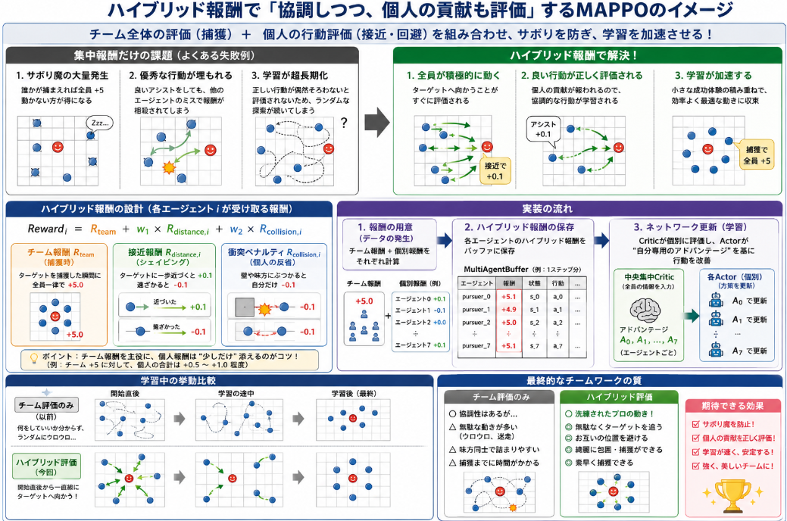
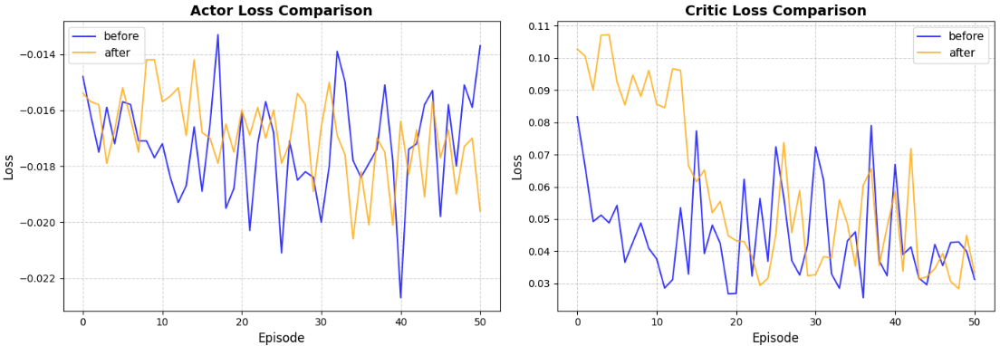
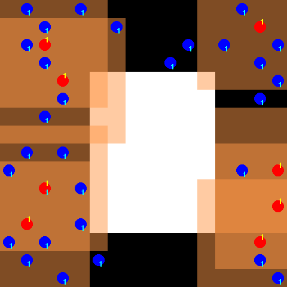

前回の学習コードの見直しの上で学習してみてもまだエージェントは思ったような動作をしませんでした。
課題として考えたことはCriticのみの集中評価に限界があるのではないかと考えました。

本日テーマ：
>MAPPOの集中評価からハイブリッド報酬に切り替えて学習が改善するか確認


## 集中学習の課題

前回までのCriticモデルがすべての報酬を決めるという評価を行う場合「クレジット割り当て問題（Credit Assignment Problem）」と呼ばれる、マルチエージェント強化学習における最も古典的かつ致命的な課題が生じます。

報酬がチーム全体の「集中報酬（チーム全体の成果に対する一括の評価）」のみで決まり、個々のエージェントの具体的な貢献（隠れたファインプレーなど）が評価されない場合、Pursuit環境を解くうえで以下のような課題があると考えました。

### 1. 「サボり魔（Lazy Agent）」の大量発生

報酬が全員一律（例：誰かが捕まえたら全員に `+10`）である場合、ネットワークは「誰か特定の1〜2体が頑張ってターゲットを捕まえ、残りの6体は何もせずただ突っ立っている（あるいは邪魔にならないように端っこで静止している）」という手抜きの戦略を学習しやすくなります。

* **理由**:
強化学習は「最も効率よく、最もリスク（移動コストや衝突ペナルティ）を避けて報酬を得る方法」を探します。自分が動いて衝突ペナルティを受けるリスクを冒すより、「優秀な味方に任せて自分は寝て待つ」ほうが、エージェント個人の目線からは合理的（ローカルな最適解）になってしまうためです。結果として、8体による連携包囲網ではなく、ワンマンプレイのゲームになってしまいます。

### 2. 優秀な行動の「ノイズ化（評価の埋没）」

例えば、エージェントAがターゲットを角に追い詰めるという完璧なアシスト（包囲行動）をしたとします。しかし、その瞬間に別のはるか遠くにいるエージェントBが味方同士で衝突してマイナス行動をとっていたり、ランダムにウロウロしていたりすると、チーム全体の報酬は相殺されて「普通、あるいは低い値」になってしまいます。

* **理由**:
エージェントAからすると、「素晴らしい包囲をしたのに、なぜか報酬が良くない」という状況になり、何が正解行動だったのか分からなくなります。良い行動のシグナルが、他のエージェントのランダム行動（環境のノイズ）に埋もれてしまい、包囲に必要な「おとり役」や「ルート遮断」といった高度な協調性がいつまで経っても学習されません。

### 3. 学習の超長期化（不必要なランダム探索の増加）

個人の行動が直接評価されないため、エージェントたちは「自分のどの動きがチームの勝利に貢献したのか」を完全に運（確率）に頼って探るしかなくなります。

* **理由**:
「8体が偶然、同時に正しい位置に動いて捕獲に成功する」という奇跡的な瞬間が何度も起きない限り、個々の正しい動きのステップが強化されません。これは単体エージェントの学習に比べて、必要なデータ量やエピソード数が数万倍に跳ね上がる原因になります。


## 報酬の見直し

そこで、個人の優れた行動とチームとしての評価を組み合わせたハイブリッド報酬系を考案します。

* **集中Critic ＋ 個別アドバンテージ**:
MAPPOでは、Critic（指導教官）が「チーム全体の状況」を俯瞰で見つつも、各エージェントに対して「今、お前（エージェント0）が取ったその行動は、チーム全体の期待値をこれだけ引き上げた（＝個別アドバンテージがプラス）」という形で、個人の貢献度を切り分けて評価（クレジットの割り当て）してくれます。

これにより、チーム全体の「捕獲」という大目標を見据えつつも、エージェント一人ひとりが「自分がどう動けば褒められるか」を明確に理解できるようになり、サボり魔を出さずに個人が出来ること、チームとしての一体行動が出来るのではと考えました。

__実装に当たって__

上記を行うには、個々のエージェントの見分けがつく必要があります。
すでに前ステップまでの修正で、Criticが「エージェント個別の価値（視点）」を認識できるようになっているため、コード側の基盤はハイブリッド報酬を受け入れる準備ができています。

これをどのように実装し、エージェントがどう変化するのかを具体的に解説します。

## 実装のキーポイント
実装におけるキーポイントについてまとめます。

### 1. 報酬の用意（データの発生）

* **チーム報酬**: ターゲット捕獲時に、全員共通で得られる大きな報酬。
* **個別報酬**: 各エージェントの行動（ターゲットへの接近、壁への衝突回避など）に応じて、エージェントごとに別々に計算される小さな報酬。

### 2. ハイブリッド報酬の算出と保存

* ラッパー（`PursuitWrapper`）内で、上記2つを足し合わせた **「ハイブリッド報酬（チーム報酬 ＋ 個別報酬）」** をエージェントごとに作成します。
* これを `MultiAgentBuffer` の `rewards` に、エージェント別の辞書型データ（`{'pursuer_0': r0, 'pursuer_1': r1, ...}`）としてステップごとに保存します。

### 3. ネットワークパラメータの更新（学習）

* **Critic（評価）**:
保存されたハイブリッド報酬を元に、「割引累積報酬（Return）」と「アドバンテージ（Advantage）」を**エージェントごとに個別に計算**します。中央集中型Criticは、全エージェントの画像情報を見ながら「エージェント $i$ にとって、今の状況はどれくらい良いか」を個別に評価（学習）します。
* **Actor（行動）**:
各Actorは、Criticが計算してくれた「自分専用のアドバンテージ（自分の行動が、自分［チーム含む］にとってどれだけ価値があったか）」の数値を基準にして、ネットワークのパラメータを更新します。



## 実装

実装コードは以下レポジトリに保管しています。

https://github.com/Shinichi0713/Reinforce-Learning-Study/tree/main/miulti-agent/petting_zoo/src/4_pursuit/src

### 1. ハイブリッド報酬の設計例（Pursuit環境）

協調性を崩さずに個々の動きを洗練させるための、具体的な報酬設計の数式とバランス（一例）です。

__各エージェント $i$ が受け取る報酬の構成__

$$Reward_i = R_{team} + w_1 \times R_{distance, i} + w_2 \times R_{collision, i}$$

* **$R_{team}$ （チーム全体の捕獲報酬）**:
ターゲットを捕獲した瞬間に、現場にいたかどうかにかかわらず**全員一律で `+5.0**` を与えます。これで「全員で協力して捕獲する」という大目的を維持します。
* **$R_{distance, i}$ （個人の接近報酬 / シェイピング）**:
エージェント $i$ がターゲットに一歩近づいたら `+0.1`、遠ざかったら `-0.1` を与えます。これで報酬の希薄化を防ぎ、ゲーム開始直後から「ターゲットを追いかける」という基本動作を最速で学習させます。
* **$R_{collision, i}$ （個人の衝突ペナルティ）**:
エージェント $i$ が壁や他の味方にぶつかったら **単独で `-0.1**` のペナルティを与えます。これで「お互いの進路を邪魔し合わない」キビキビとした回避行動を学習させます。

### 2. 実装方法：`PursuitWrapper` の `step` を修正する

これを実現する場合、環境を管理している `PursuitWrapper` クラスの `step` メソッド内で、環境本来の報酬（チーム報酬）に対して、エージェント個別の情報を足し合わせる修正を行います。

__ラッパーの修正コード案__

```python
class PursuitWrapper:
    # ... (他の初期化処理などはそのまま) ...

    def step(self, agent, action):
        # 1. 環境本来のステップを実行（env.env.step）
        # ※PettingZooのAPI仕様に合わせて内部で処理を呼び出している想定
        self.env.step(action)
        
        # 2. 環境から本来の共通報酬を取得
        _, reward, terminated, truncated, info = self.env.last(agent)
        
        # --- 🌟 ここから個別報酬（ハイブリッド化）の追加 ---
        agent_idx = int(agent.split('_')[-1])
        
        # 例A: 接近報酬（前後のステップでのターゲットとの距離の変化を計算）
        # ※現在の距離と1ステップ前の距離の差分から報酬を計算
        dist_reward = self._compute_distance_reward(agent)
        
        # 例B: 衝突ペナルティ（infoや観測から衝突を検知できる場合）
        collision_penalty = -0.1 if info.get('wasted_move', False) else 0.0

        # 3. チーム報酬 と 個別報酬 をミックス
        # チーム報酬(reward)が+5(捕獲)の時はそのまま大きなプラス、
        # 普段の移動時は個人の努力(dist_reward)や反省(penalty)が主導します
        hybrid_reward = reward + (1.0 * dist_reward) + (1.0 * collision_penalty)
        
        return hybrid_reward, terminated, truncated, info

    def _compute_distance_reward(self, agent):
        """エージェントがターゲットに近づいたかを判定するヘルパー関数"""
        # ※環境内の座標情報にアクセスできる場合の擬似ロジック
        # old_dist = 1ステップ前のターゲットとの最短距離
        # current_dist = 現在のターゲットとの最短距離
        # if current_dist < old_dist: return 0.1
        # elif current_dist > old_dist: return -0.1
        return 0.0

```

### 3. ハイブリッド評価の効果

チーム一律の評価（以前）と、ハイブリッド評価（今回）を比較すると、学習のプロセスと最終的な振る舞いは以下のように変化します。

| 評価方法 | 学習初期の挙動 | 最終的なチームワークの質 |
| --- | --- | --- |
| **チーム評価のみ** | 何をしていいか分からず、偶然捕獲できるまで全員がグリッド上をランダムに彷徨う（学習が非常に遅い）。 | 協調性は高いが、無駄な動き（ウロウロする、味方同士で詰まるなど）が多くなりがち。 |
| **ハイブリッド評価** | 開始直後から全員がターゲットに向かって**一直線に突進し始める**（学習の立ち上がりが圧倒的に早い）。 | 衝突ペナルティにより互いの位置を避けるため、**「一列に並んで綺麗に追い詰める」「無駄なく囲い込む」**といった洗練されたプロの動きになる。 |


今回報酬の変更によって「学習が途中で停滞してしまう（局所最適にハマる）」確率がグッと減るはずです。

ただし、注意点として **個人の接近報酬（`dist_reward`）の倍率を高くしすぎないこと** が大切です。個人の報酬が強すぎると、「ターゲットの周りに群がって満足し、誰もトドメの囲い込み（リスクのある移動）をしない」という本末転倒な状態になることがありそうです。

まずは「チーム報酬（+5.0）」に対して、「個人の接近報酬（最高でも合計+0.5〜+1.0程度）」になるよう、小さな重みから試してみるのが良いと思います。


## 学習と動作

学習の推移をActorとCriticのロス関数の推移で表示すると以下が得られます。
50 epochまでのロスは大きく違いは出ません。



実際の動作はこんな感じになりました。
時間の経過とともに赤の味方がどんどん集まっていく様子は確認出来ます。
また青の敵を追いかけるような動作は確認出来ます。
ですが、肝心の組織立った囲いこむような動作がなかなか見れません。
4人の味方が敵に合わせて囲みを小さくしていくと捕獲の確率が高くなるのでしょうが、現状そのような動作になかなかなりません。





## 総括
今回試行から得られる成功点と、考えられる課題については以下の通りです。

__成功点__

- 個別報酬の導入により、基本行動は改善：全員がターゲットに向かって突進するようになり、ランダムウォークから「追跡」への移行は早くなっていると推測される。
- クレジット割り当て問題へのアプローチ：個別アドバンテージを導入したことで、「誰がどの行動で貢献したか」をCriticが評価しやすくなった。
- 報酬設計の方向性は妥当：チーム報酬＋個別シェイピング＋衝突ペナルティという構成は、協調性を崩さずに個人の動きを洗練させるという目的に合致している。


__残る課題・改善余地__

囲い込み行動が学習されていない  

接近報酬だけでは「追跡」は学習されても、「包囲」という高度な協調行動までは自然に生まれにくい。  
追加で「包囲形状に関する報酬」（例：ターゲット周囲のマンハッタン距離の合計が減少したら報酬）などを検討する余地がある。


__報酬の重みバランス__

個別報酬（距離・衝突）の重みが強すぎると、「ターゲットの周りに群がるだけで、誰もリスクを取って囲い込まない」という局所最適に陥る可能性がある。  
チーム報酬（+5.0）に対して、個別報酬の合計が+0.5〜+1.0程度になるよう、重み w1,w2w_1, w_2w1​,w2​ を慎重に調整する必要がある。


__Criticの表現力・学習安定性__  

Actor/Criticロスに大きな差が出ていないことから、Criticが「個々の貢献度」をうまく評価しきれていない可能性もある。  
Criticのネットワーク構造（CNNチャネル数・層数）や学習率・バッチサイズなどのハイパーパラメータ調整も検討の余地がある。


__探索戦略の見直し__  

高度な協調行動は、ランダム探索だけではなかなか発見されにくい。  
カリキュラム学習（簡単なタスクから始めて徐々に難易度を上げる）や、模倣学習（人間や既存アルゴリズムのデモから学ぶ）の導入も有効な選択肢。
