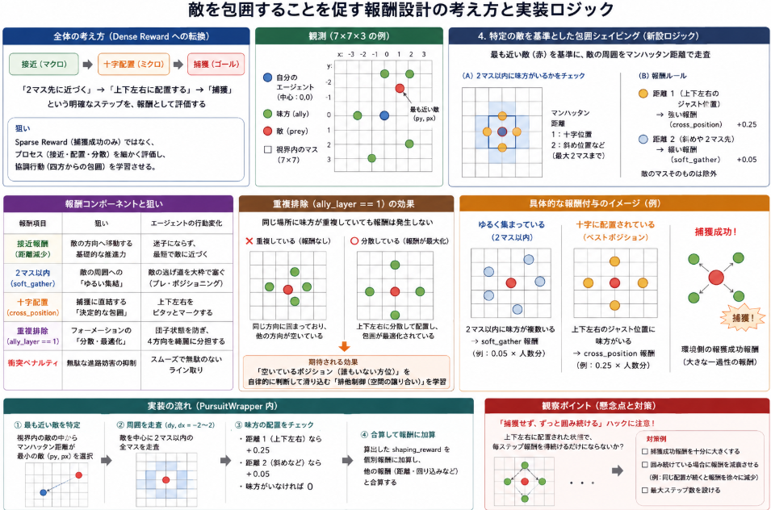
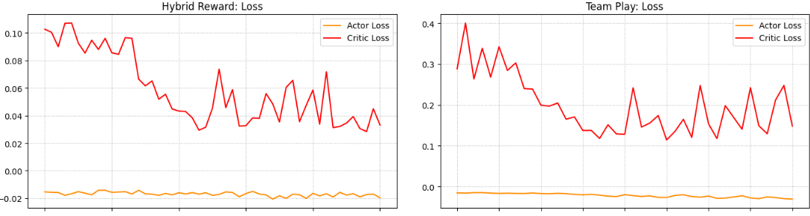
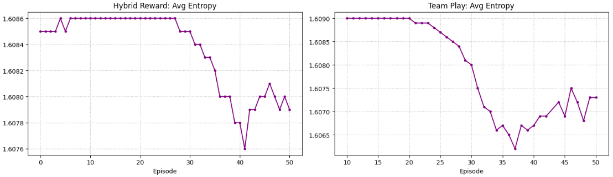

前回[Pursuitの報酬をチーム報酬と個人報酬のハイブリッド報酬]()に評価するように変更しました。
結果敵がいると隣接するように動き回る動作は確認できるようになりました。
他方、チーム連携するような挙動はなかなかつきません。

今回チーム連携の動作がしない課題に対応策を講じていきます。

本日テーマ：
>チーム連携を強化する報酬系を考案、実装する。


## 現状の課題
前回の取り組みで課題と感じたことは以下です。

事象：
>肝心の組織立った囲いこむような動作がなかなか見れません。
>4人の味方が敵に合わせて囲みを小さくしていくと捕獲の確率が高くなるのでしょうが、現状そのような動作になかなかなりません。

この原因と考えるのが、敵の周囲に集まる可能性は非常に高く、周囲を囲むということが非常にレア。
対して、隣接するだけであれば、弱く報酬が出てくるので、個人個人で最寄りの敵にまとわりつくことで弱い報酬がもらえて、共通の敵に隣接することが重要と学べないことにあるのではと考えました。

## 報酬の改善案

直近で実施した報酬設計の変更（**敵中心の2マス以内への接近・十字配置**、および**重複排除条件の追加**）について、強化学習の理論とPursuit環境の特性を踏まえて、その狙いと期待される効果をまとめました。

__1. 変更の本質：Sparse Reward から Dense Reward への転換__

修正前の環境は、最終的な「捕獲成功」という滅多に起きないイベントに対して莫大な報酬を与える **Sparse Reward（疎な報酬）** 状態でした。
これだと、エージェントは何が正解行動なのか分からず、暗闇を模索するような状態になります。

このため、捕獲に至るまでのプロセス（プロセス指標）を細かく評価する **Dense Reward（密な報酬 / 報酬シェイピング）** を取り入れます。

「2マス先に近づく（マクロな接近）」 $\rightarrow$ 「上下左右に配置する（ミクロな包囲）」 $\rightarrow$ 「捕獲（ゴール）」という明確なステップが報酬として評価されることが期待されます。

__2. 重複排除（`ally_layer == 1`）__

1をそのままやったとして、敵の周囲の特定のセルに味方が重複して集まると意味がありません。
このため、「同じセルに味方がいないこと」を報酬の条件に組み込みます。

__期待される効果：マルチエージェントの「排他制御」__

この条件により、すでに味方がいるマスに後から侵入しても報酬がゼロ（実質的な機会損失ペナルティ）になります。これにより、エージェントたちは自然と「空いているポジション（誰もいない方位）」を自律的に判断して滑り込む「排他制御（空間の譲り合い）」を学習します。

### 各報酬コンポーネントの役割とシナジー（相乗効果）

現在の報酬系は、以下のような構成とします。

| 報酬項目 | 設計の狙い | エージェントの行動変化 |
| --- | --- | --- |
| **接近報酬（距離減少）** | 敵の方向へ移動する基礎的な推進力 | 迷子にならず、最短で敵に近づく |
| **2マス以内（`soft_gather`）** | 敵の周囲への「ゆるい集結」 | 敵の逃げ道を大枠で塞ぐ（プレ・ポジショニング） |
| **十字配置（`cross_position`）** | 捕獲に直結する「決定的な包囲」 | 上下左右をピタッとマークする |
| **重複排除（`== 1`）** | フォーメーションの「分散・最適化」 | 団子状態を防ぎ、4方向を綺麗に分担する |
| **衝突ペナルティ** | 無駄な進路妨害の抑制 | スムーズで無駄のないライン取り |



## 観察ポイント（懸念点と対策）

この報酬設計には以下の「報酬ハック（ハメ技）」が起きていないか、今後のログやプレイ画面（render）で観察する必要があります。

* **「捕獲せず、ずっと囲み続ける」の警戒**:
上下左右に綺麗に配置されるだけで毎ステップ `0.25` の報酬が**無限に**手に入ります。もし捕獲成功報酬（一過性のもの）よりも、その場に留まって得られるステップ報酬の総和の方が多くなってしまうと、エージェントは「あえて捕獲を完了させず、ターゲットをいたぶるように囲み続けて永久に報酬を毟り取る」という悪知恵を学習する可能性があります。

この場合は報酬系に、ただ囲んでいるだけだと報酬が減衰するような補正を入れることになります。


## 実装

実装コードは以下レポジトリに保管しています。

https://github.com/Shinichi0713/Reinforce-Learning-Study/tree/main/miulti-agent/petting_zoo/src/4_pursuit/src

### `PursuitWrapper` の修正

今回のロジックを実装するために、`_analyze_observation` の内部で「視界内に写っているすべての敵（または特定のマス）」をベースに、周囲の味方の配置をグリッド距離（マンハッタン距離）で走査する処理を追加します。

以下の変更・追加箇所を示します。

__1. `__init__` に新しい報酬スケールを追加__

```python
        # （既存のパラメータの下に追加）
        # 新設：特定のマス（敵）をターゲットとした包囲網シェイピング報酬
        self.soft_gather_reward_scale = 0.05    # 2マス先までに味方が集まっているとき（緩い報酬）
        self.cross_position_reward_scale = 0.25 # 上下左右のジャスト位置に配置されたとき（強めの報酬）

```

__2. `_analyze_observation` の修正__

視界内の各「敵（特定のマス）」に対して、周囲の味方の配置（2マス以内、および上下左右）をカウントするロジックを組み込みます。

```python
    def _analyze_observation(self, obs):
        """
        1つのエージェントの観測(7, 7, 3)から報酬計算用の情報を抽出する
        """
        if obs is None:
            return None, 0, 0, 0.0

        prey_layer = obs[:, :, 2]
        ally_layer = obs[:, :, 1]

        prey_positions = np.argwhere(prey_layer > 0)

        min_dist = float('inf')
        closest_prey_pos = None
        cy, cx = self.center_idx, self.center_idx

        # 1. 最も近い獲物を特定
        for py, px in prey_positions:
            dist = abs(py - cy) + abs(px - cx)
            if dist < min_dist:
                min_dist = dist
                closest_prey_pos = (py, px)

        if min_dist == float('inf'):
            return None, 0, 0, 0.0  # 視界内に獲物がいない場合

        # 2. 協調判定：自分の隣接4マスにいる味方の総数
        allies_count = 0
        neighbors = [(cy-1, cx), (cy+1, cx), (cy, cx-1), (cy, cx+1)]
        for ny, nx in neighbors:
            if 0 <= ny < self.obs_range and 0 <= nx < self.obs_range:
                allies_count += ally_layer[ny, nx]

        # 3. 獲物がいる「方向（セクター）」に他の味方が何人いるかをカウント
        py, px = closest_prey_pos
        flank_allies = 0

        if py < cy:
            flank_allies += np.sum(ally_layer[0:cy, :])
        elif py > cy:
            flank_allies += np.sum(ally_layer[cy+1:, :])

        if px < cx:
            flank_allies += np.sum(ally_layer[:, 0:cx])
        elif px > cx:
            flank_allies += np.sum(ally_layer[:, cx+1:])

        # 🌟 4. 【新設】特定のマス（最も近い敵）を基準とした包囲報酬の計算
        shaping_reward = 0.0
        
        # 敵の周囲（縦横マスのオフセット）をチェック
        # マンハッタン距離で2マス以内の全範囲を走査
        for dy in range(-2, 3):
            for dx in range(-2, 3):
                target_y = py + dy
                target_x = px + dx
                
                # 視界(7x7)の範囲内、かつ「敵のマスそのもの」は除外
                if (0 <= target_y < self.obs_range) and (0 <= target_x < self.obs_range) and (dy != 0 or dx != 0):
                    # その位置に味方がいるか（ally_layerは0または1以上）
                    if ally_layer[target_y, target_x] > 0:
                        m_dist = abs(dy) + abs(dx)
                        
                        # 条件A: 上下左右のジャスト位置（距離1の十字位置）の場合（やや強めの報酬）
                        if m_dist == 1:
                            shaping_reward += self.cross_position_reward_scale
                        # 条件B: 2マス先までにゆるく集まっている場合（緩い報酬）
                        elif m_dist <= 2:
                            shaping_reward += self.soft_gather_reward_scale

        return min_dist, allies_count, flank_allies, shaping_reward

```

__3. `step` 内での報酬合算の修正__

新しく計算した `shaping_reward` を `individual_reward` に加算します。

```python
    def step(self, agent, action):
        if agent not in self.env.agents:
            return 0.0, True, True, {}

        current_cycle = getattr(self.env.unwrapped, 'cycles', 0)

        _, _, terminated, truncated, _ = self.env.last(agent)
        step_action = None if (terminated or truncated) else action

        self.env.step(step_action)

        if agent not in self.env.agents:
            return 0.0, True, True, {}

        obs, team_reward, terminated, truncated, info = self.env.last(agent)

        # -----------------------------------------------------------------
        # 🌟 個別評価報酬（Individual Reward）の計算開始
        # -----------------------------------------------------------------
        individual_reward = 0.0

        # 🛠️ 変更：戻り値に包囲シェイピング報酬（shaping_reward）を追加
        current_min_dist, allies_count, flank_allies, shaping_reward = self._analyze_observation(obs)

        # 🌟 新設：包囲網シェイピング報酬の適用
        individual_reward += shaping_reward

        # 1. 距離・回り込みベースの評価
        reward_distance = 0.0
        prev_dist = self.prev_min_distances.get(agent)
        
        # （以下、既存の処理がそのまま続きます...）

```


## 学習の効果

学習のロス(Actor、Critic)とエントロピの学習における推移を以下に示します。
ロスの値は報酬変わると変化します。グラフの形状で傾向確認してみると、ほぼ同じ傾向でしょうか。
エントロピの推移は、やや早くエントロピが低下するようになったように見受けられます。
報酬が入るタイミングが分かりやすくなったため、行動の決め手がどこか分かりやすくなったということでしょうか。





そして実際に学習したエージェントを動作させた結果は以下です。


## 総括


