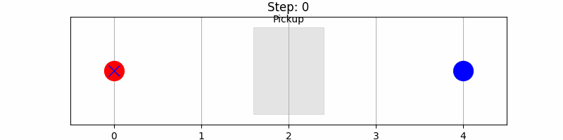

# Puepose

This site is summary of Multi-Agent RL, shows the results of MARL trials.

## Process

| prob no. | status | remarks |
| ----- | ----- | ----------------------------- |
| exe-1 | complete | |
| exe-2 | complete | 2 agent moves |
| exe-3 | complete | random quest |
| exe-4 | doing | 2 drone delivery |
| exe-5 | complete | 2 agent move to goal |
| exe-6 | complete | 2-agemt move to each other's goal |
| exe-7 | doing | 2 robot works collaboratory |

## Coorporative Search

This is an implementation of a **Shared Brain Deep Q-Network (Shared Brain DQN)** aimed at solving the cooperative challenge of **multi-sensor (agent) search and exploration in a disaster area**.

The learning content of this code is centered on establishing a reinforcement learning process to achieve **efficient exploration and coordination**.

## Summary of Learning Content

The agents primarily learn and optimize three key areas in this code:

### 1. Shared Knowledge-Based Decision Making

* **Learning Goal**: Agents learn a strategy that considers the **knowledge of areas already explored by other agents** to decide "where to move next."
* **Implementation**:
  * **State Input**: The input to the agent (`preprocess_state`) includes both the **Shared Exploration Map (Ch0)** and the agent's own position (Ch1). This allows the network to select actions based on **global exploration progress** in addition to local information.
  * **SharedAgent**: All agents **share the weights of a single policy network** ($\text{policy\_net}$). Consequently, the learning outcome of one agent is instantaneously reflected across the entire team, achieving **implicit knowledge sharing**.

### 2. Spatial Load Balancing (Distributed Exploration)

* **Learning Goal**: Agents learn a spatial coordination strategy to move in a way that **avoids clustering together** and instead **divides and covers unexplored, new areas.**
* **Implementation**:
  * **Reward Design**: The reward is given based on the total area of **newly explored cells** by the team (assuming this is how `env.step` is designed). This discourages redundant exploration and guides **distributed actions** toward higher rewards.
  * **CNN Utilization**: The **$\text{DuelingDQN}$** uses a **$\text{CNN}$** to recognize **spatial patterns** like "large unexplored clusters" or "agent congregation spots" from the input map image, learning to estimate higher Q-values for actions leading toward unexplored directions.

### 3. Stable Learning via DQN Mechanisms

* **Learning Goal**: To stabilize Q-value estimation and ensure efficient convergence in a complex exploration task.
* **Implementation**:
  * **Experience Replay ($\text{ReplayMemory}$)**: Past experiences are sampled randomly, which breaks the correlation in the data, enhancing learning stability.
  * **Target Network ($\text{target\_net}$)**: Using the weights of an older network for the Q-value target calculation prevents **divergence due to self-reference** during training.
  * **$\epsilon$-greedy Strategy**: Balances the selection between random actions (exploration) in the early stages of learning and utilizing learned knowledge (optimal action) as training progresses.

## Conclusion

This code learns a strategy where multiple drones complete the disaster site exploration **efficiently and non-redundantly** by optimizing the weights of a **single DQN network** under a **reward system that prioritizes cooperative actions**, using **"shared observations and position information"** as input.

## Two-Agent Switch Task

The collaborative task we are solving is known as the **"Two-Agent Switch Task"**. Here is a concise summary in English:

### **The Problem: Switch Task**

**1. Scenario**

* **Environment:** A narrow  grid corridor.
* **Agents:** Two agents (Red and Blue) start at opposite ends.
* **Objective:** There is one package in the center of the corridor. One agent must pick it up and deliver it to the end-zone behind the other agent.

**2. The Challenge**

* **Bottleneck:** The corridor is too narrow for agents to pass each other. If they both rush to the center, they will collide.
* **Coordination:** Agents must learn a "yield and pass" strategy. One agent needs to wait or move back while the other agent picks up and delivers the package to maximize the **Global Reward**.

### **The Solution: QMIX (MARL)**

**1. Decentralized Execution**

* Each agent chooses actions based solely on its own local observations (its position and status).

**2. Centralized Training**

* **Agent Networks:** Individual "brains" that estimate the local value () of actions.
* **Mixing Network:** A central "manager" that combines all  values into a single team value () using the global state of the environment.

**3. Monotonicity Constraint**

* QMIX ensures that as an individual agent's performance improves, the team’s total value also increases. This aligns individual interests with the team's goal, solving the **Credit Assignment** problem (knowing who contributed what to the success).

### **Key Performance Metrics**

* **Positive Reward:** Granted for picking up () and delivering () the package.
* **Negative Penalty:** Applied for collisions () and every time step taken ().
* **Goal:** Reach the destination in the fewest steps possible without colliding.

Would you like me to translate specific technical terms or explain the **Hypernetwork** part of the algorithm in English as well?

## Conclusion

I tested the agents trained with the method mentioned above in the current environment. I observed that one agent successfully stopped before a collision occurred, appropriately yielding the way to the other agent.

