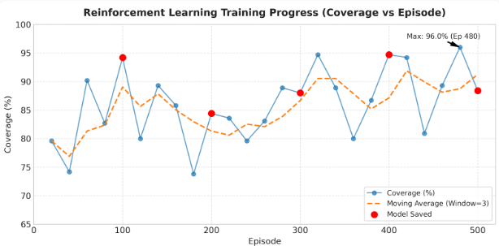
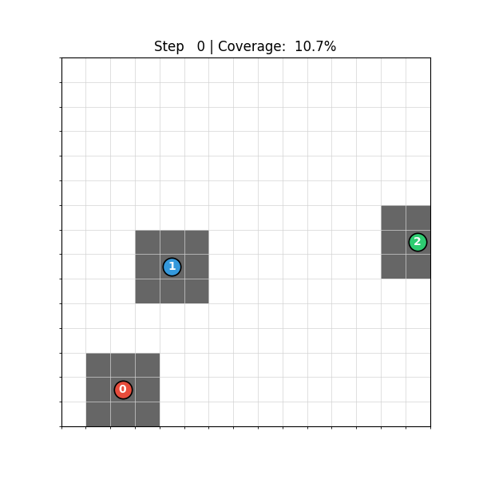

複数ドローンをマルチエージェント強化学習(MARL)を用いて効率的にエリア探索を行うお話の続きです。

[前回は今まで取り組み比較的安定して成果](https://yoshishinnze.hatenablog.com/entry/2026/11/07/043000)を挙げる以下を実装しました。
- ニューラルネットワークはRoPEを用いたTransformer(https://yoshishinnze.hatenablog.com/entry/2026/07/18/043000)
- 強化学習アルゴリズムは[MAPPO](https://yoshishinnze.hatenablog.com/entry/2026/01/10/153824)
- 報酬系はハイブリッド報酬系

結果、学習後のエージェントでカバレッジ96%まで探索出来ました。
ですが、100%は目指してみたいです。

そこで今回より改善を狙って改善を行います。

## 改善方針

先日本ブログで[A2POというMARLのアルゴリズム](https://yoshishinnze.hatenablog.com/entry/2026/11/02/043000)を扱いました。
このA2POはMAPPOの上位互換というべき強化学習アルゴリズムです。

本手法のMAPPOに対する有意点は以下の通りです。

- PreOPCによるエージェントポリシの更新シフトを補正し、より適切にネットワーク更新を行う
- semi-greedyなエージェント選択により、期待改善量が大きいエージェントを優先的に選びます。因みにこれは、環境の更新するエージェントの順序が性能に影響を与えることが既知で、優秀なエージェントを先行させる方が良いという理由によります
- Adaptive Clipping Parameterにより、先行するエージェントの方策の変化により後続の環境の見方が本来は変わっている、従来通りでは追従できていないという課題を適用型 $\epsiron$ により適応させる
- KLダイバージェンスを用いた目的関数により、期待累積報酬を単調に改善することが保証される。(ポリシーが悪化しづらいという根拠)

ということで強化学習アルゴリズムをA2POに変更してみようと思います。

## 実装内容

今回変更するのは学習ループのみです。
今回の実装として主要となる要素は次の3つです。

1. **Preceding-agent Off-Policy Correction (Pre-OPC)**：先に更新した（preceding）エージェントの方策変化を、Retrace風の打ち切り重要度サンプリングで補正したアドバンテージ推定
2. **Semi-greedy agent selection rule**：|アドバンテージ|が大きいエージェントを優先しつつ、一定確率でランダム選択する更新順序決定
3. **Adaptive clipping parameter**：更新順位 k に応じてクリップ幅を徐々に広げる

実際の論文では「単一の共有報酬」を前提とするDEC-MDPで理論構築されていますが、今回の環境は個人報酬+チーム報酬のハイブリッド設計なので、**各エージェント個別の報酬・価値関数に対してPre-OPCを適用する実務的な拡張**として実装します（この適応についてはコード内に明記します）。

### A2POの3つの要素

今回実装したA2POの主要ポイントを、設計判断の理由も含めて整理します。

__1. 元論文の理論設定からの適応__

A2POの単調改善保証は、**エージェント全員が同じ報酬 r(s,a) と同じ価値関数 V(s) を共有する**DEC-MDPを前提に証明されています。しかし本プロジェクトの環境は「個人貢献報酬＋チーム協調報酬」のハイブリッド設計で、モデルも `critic_head` がエージェントごとに独立した価値を出力する構造です。

そこで実装では、論文のPre-OPC補正を**各エージェント自身の報酬・価値関数**に対して適用する形に拡張しています。これはIPPO/MAPPOが「単一報酬の理論」を個別報酬設定に拡張しているのと同じスタンスです。この結果、論文が証明する厳密な単調改善保証はそのままでは成立しませんが、非定常性を緩和するという設計思想（後述の3要素）はそのまま活きます。

__2. パラメータ共有構造とAlgorithm 2の対応__

`RoPETransformerAgent` はもともと1回のforwardで**全エージェント分のlogits/valueを同時出力する共有ネットワーク**です。これは論文のAlgorithm 1（エージェントごとに独立した方策）ではなく、**Algorithm 2（parameter sharing版）** にそのまま対応します。

この構造のおかげで「preceding agent（先に更新したエージェント）の方策が変化した」という状態は、特別な仕組みを作らなくても**共有パラメータが更新された時点で自動的に反映される**という扱いになります。今回は前回のネットワークをそのまま使う理由はこれです。

__3. Pre-OPC（preceding-agent off-policy correction）の再帰計算__

```python
gae = delta + GAMMA * LAMBDA * c_next * gae
```

標準の[GAE](https://yoshishinnze.hatenablog.com/entry/2026/07/24/043000)再帰に、preceding agentsの方策変化を表す打ち切り重要度サンプリング項 `c_t = min(1, Π_{j∈preceding} π_j_current(a_j|s)/π_j_old(a_j|s))` を掛けて更新していきます。

- `preceding` が空集合（そのステージの最初の更新）のときは `c=1` となり、**通常のGAEと完全に一致**します。
- preceding agentsの数が増えるほど `c` は1以下に打ち切られ、「先行エージェントの変化が大きいほど、それ以降の時間ステップのアドバンテージへの寄与を割り引く」という形でRetrace的な補正がかかります。

__4. Semi-greedy agent selection rule__

`|advantage|` の平均が大きいエージェントを優先的に更新する（貢献度の高い学習を加速する）一方、確率0.5で完全ランダムに選ぶことで早期収束を防ぐことが期待できます。
この方法をとることで、論文のablation（Fig.6）でも、純粋greedyより性能が安定することが示されています。

```python
if random.random() < SEMI_GREEDY_PROB:
    i_sel = random.choice(list(remaining))
else:
    i_sel = max(remaining, key=lambda a: scores[a])
```

__5. Adaptive clipping parameter__

```python
eps_i = base_eps * c + base_eps * (1 - c) * (order_k / num_agents)
```

更新順位が後になるほどクリップ幅を広げます。理由は、後から更新されるエージェントほど「先行エージェントの累積的な方策変化」に晒されて非定常性の影響を強く受けるため、十分な更新幅を確保する必要があるからです（論文Fig.2の説明と対応）。さらに、preceding agentsの同時方策比 `g(s,a)` にはこの**半分の幅**でクリップをかけ、先行エージェント分の寄与をより保守的に扱っています。

__6. 勾配の切り離し（`detach`/`no_grad`）の使い分け__

preceding agentsの比率 `g_val` は `torch.no_grad()` 内で計算し、更新対象エージェント `i_sel` の勾配計算に影響しないようにしています。パラメータ共有のため、理論上は全エージェントの出力ヘッドが同じ重みを通っていますが、**「今このステップで最適化しているのはエージェント i_sel の目的関数である」という意味論を保つため**、preceding側の重み付け係数は定数として扱っています。

__7. 2回のforwardパス（計算コストとのトレードオフ）__

1エージェント更新につき、
- 現在の方策を全timestepで評価する`no_grad`パス（アドバンテージ計算・エージェント選択用）
- 勾配を通す実際の更新用パス

の2回、トラジェクトリ全体(T steps)をforwardしています。MAPPOが `T × PPO_EPOCHS` 回のforwardで済むのに対し、A2POは `2 × T × NUM_AGENTS × A2PO_STAGES` 回と増えます。そのため `A2PO_STAGES` をデフォルト2に抑え、計算コストと更新回数のバランスを取ることが期待できます。

### 実装上の注意点

実装・運用において特に注意すべき点を、整理します。

__1. 共有バックボーンによる「意図しない全体方策シフト」__

本モデルは `map_encoder` や Transformer Blockの重みを**全エージェントが共有**しています。あるエージェント `i_sel` の損失で逆伝播すると、`actor_head`/`critic_head`の個別部分だけでなく、**共有バックボーン全体**が更新されます。これは「preceding agentsの比率 `g_val` は定数として扱う」という実装上の工夫だけでは防ぎきれません。なぜなら、`i_sel`の更新が共有バックボーンを通じて**まだ更新していない残りのエージェントの出力まで変えてしまう**ためです。

A2POの理論は「エージェントiを更新する間、他のエージェントの方策は変化しない(または既知の形でのみ変化する)」ことを前提にしていますが、共有バックボーンのせいでこの前提が崩れやすくなっています。論文自身もAlgorithm 2(パラメータ共有版)でこの問題を抱えていますが、本実装はTransformerの共有部分が比較的大きいため、影響がより強く出る可能性があります。

**対策**: 学習が不安定な場合は、`clip_grad_norm_`の閾値をさらに小さくする、学習率を下げる、または`A2PO_STAGES`を減らして1ステージあたりの累積的な共有重み変化を抑える、といった調整を検討してください。

__2. 計算コストと `A2PO_STAGES` のトレードオフ__

1エージェント更新あたり2回(no_grad評価＋勾配ありの更新)、トラジェクトリ全体をforwardするため、計算量は `2 × T × NUM_AGENTS × A2PO_STAGES` に比例します。`A2PO_STAGES` を増やしすぎると学習時間が急増するので、まず `A2PO_STAGES=1〜2` で動作確認し、学習が遅いと感じたら他のハイパーパラメータ(学習率など)を先に調整することをおすすめします。

__3. preceding比率の数値的な不安定性__

```python
ratio_preceding = torch.exp(cur_logprobs[:, preceding].sum(dim=1) - b_old_logprobs[:, preceding].sum(dim=1))
c = torch.clamp(ratio_preceding, max=1.0)
```

複数エージェント分のlog-probの和を`exp`で戻しているため、方策が大きく動くとこの比率が極端に小さくなり(アンダーフロー方向)、アドバンテージ推定が実質的に1ステップのTD誤差に退化してしまうことがあります。`max=1.0`で上振れは抑えていますが、下振れ(極端に小さくなる方)は抑えていません。学習序盤で方策変化が大きい場合に起きやすいので、学習時の**学習曲線が不自然に平坦化していないか確認**してください。

__4. クリップ幅の大小関係を逆にしないこと__

```python
eps_i = base_eps * c + base_eps * (1 - c) * (order_k / num_agents)
```

更新順位が**後**のエージェントほどクリップ幅が**広く**なる設計です(先行エージェントの非定常性を多く被るため)。ハイパーパラメータを調整する際、この大小関係(`order_k`が大きいほど`eps_i`も大きい)を誤って逆転させないよう注意してください。

__5. 価値関数のターゲットが「動く的」になっている__

```python
value_target = (A_i + cur_values[t, i_sel]).detach()
```

`cur_values`はステージ内で逐次更新される現在の価値関数から計算されるため、critic の回帰ターゲット自体が各エージェント更新のたびに変化します。これは論文の設計通りですが、MAPPOのように「ステージ開始時に固定したターゲットに向けて複数epoch回す」実装と比べると、critic学習がやや不安定になりやすい点は意識しておいてください。

__6. 全エージェントは毎ステージ必ず更新される(飢餓は起きない)__

semi-greedy選択は「**順番**」だけを決めており、`remaining`は毎ステージ全エージェント分が消化されるため、特定のエージェントだけ永久に更新されない、ということは起きません。ただし「常に最初に選ばれやすいエージェント」は狭いクリップ幅(保守的な更新)になりやすいので、エージェント間で学習速度に偏りが出ていないか、個別の報酬推移を見ておくとよいでしょう。


## 学習の結果
### 学習の進捗

今回学習の進捗は以下のように得られました。



前回の学習と比較するとこんな感じに分析出来ます。

* 前回はEp 800あたりまで学習を進めなければ80%台に安定して乗りませんでしたが、今回は最初期（Ep 20〜100）から平均80%以上を維持できています。
* 前回見られた10%〜30%台への突発的な大崩れ（Ep 360周辺の14.7%など）が完全に消失しています。最も低いエピソードでも73.8%（Ep 180）に留まっており、方策（Policy）の破壊が起きにくく安定した探索が行われています。
* 前回は90%台の壁を超えるのに約800〜900エピソードを要していましたが、今回はEp 60で90.2%、Ep 480で最大96.0%に達しています。
* 平均値が86%前後まで高止まりしているものの、80%前後と90%超を行き来する周期的なブレが存在します。これは環境の初期配置のランダム性、または探索パラメータ（$\epsilon$-greedyの残りやアクターの分散など）による変動と考えられます。

### 学習エージェントの動作

学習したエージェントの動作の様子です。
赤と青のエージェントが初期同じ方向で探索しているのが少し気になりますね。
これで97%以上の探索を行うようになりました。

違う方向で初めから縁を目指して進むようになるとより効率的な探索につながると思います。
但し、学習がまだ収束していない可能性があるので引き続きという感じでしょうか。



## 総括

### 1. 今回やったこと

**変更点は学習ループのみ**で、ネットワーク（RoPE Transformer）と報酬系（ハイブリッド報酬）は据え置き、アルゴリズムを MAPPO → A2PO に差し替えた、という整理になります。

| 要素 | 実装内容 | 狙い |
|---|---|---|
| Pre-OPC | GAE再帰に打ち切り重要度比 `c = min(1, Π π_new/π_old)` を乗算 | 先行エージェントの更新による非定常性を補正 |
| Semi-greedy選択 | \|advantage\| 最大 or 確率0.5でランダム | 期待改善の大きいエージェントを優先しつつ早期収束を回避 |
| Adaptive clipping | `eps_i = base_eps·c + base_eps·(1-c)·(k/N)` | 後順位ほど非定常性を多く被るため更新幅を拡大 |

さらに、元論文のDEC-MDP（単一報酬・単一価値関数）前提を、**各エージェント個別の報酬・価値関数にPre-OPCを適用する拡張**として実装されています。共有バックボーン構造がそのまま論文のAlgorithm 2（parameter sharing版）に対応する点も、既存ネットワークを流用できた理由として筋が通っています。

### 2. 効果（結果の解釈）

前回比で明確に効いています。特筆すべきは**性能の絶対値よりも「学習の安定性」の改善**です。

- **立ち上がりの高速化**：Ep 20〜100で平均80%以上を維持（前回はEp 800まで必要）
- **破壊的更新の消滅**：最低エピソードが73.8%（前回は14.7%の大崩れあり）
- **90%到達の早期化**：Ep 60で90.2%、Ep 480で最大96.0%

これは「KLベースの目的関数＋保守的クリップ」が方策破壊を抑え、「Pre-OPC」が共有バックボーン経由の意図しない方策シフトを緩和した結果と読めます。**非定常性の抑制というA2POの設計思想が、まさに本環境の弱点（共有パラメータの大きさ）に刺さった**という構図です。

ただし注意点として、**厳密な単調改善保証は個別報酬への拡張時点で成立していません**。安定性の向上は「理論保証の帰結」ではなく「経験的な効果」として記述されるのが正確です。

### 3. 残っている課題

1. **96%の壁＝探索の網羅性不足**。平均86%前後で高止まりし、80%台と90%超を周期的に行き来しています。つまり「収束しきっていない」状態で、100%はおろか96%も再現性のある水準とは言い切れません。
2. **初期探索の対称性が破れていない**。ロールアウトで赤・青が同じ方向へ進むのは、初期配置とエージェント埋め込みの情報量不足による典型的な対称性の崩れ残りです。序盤の重複探索は終盤の取りこぼしに直結します。
3. **残り4%の正体が未特定**。マップ端・狭所・初期配置依存のどれなのかで打ち手が全く変わります。ここを特定せずにハイパラを触るのは非効率です。
4. **計算コストが試行回数を縛る**。`2×T×N×STAGES` のforwardは重く、ハイパラ探索の反復を制限します。

### 4. 次にすべき点

3つの方向性があると考えています。

**診断**
- 未訪問セルのヒートマップを作り、**「どのセルが・どの初期配置で・何ステップ目に取りこぼされるか」** を可視化する。失敗の型が決まれば、報酬かカリキュラムかネットワークかの切り分けが一気に進みます。
- 複数シード×決定論的方策で評価し、96%が実力値か分散の産物かを確認する。

**探索の多様性と報酬設計**
- 初期探索方向の対称性を崩す：エージェント埋め込みの強化、序盤に限定した探索ボーナス（未訪問カウント/好奇心）の**後半まで減衰させないスケジューリング**。
- Potential-based shaping（未訪問セルへの距離ベース報酬）を導入。理論的な方策不変性が保証されるため、既存の報酬系を壊さずに「残り4%への勾配」だけを足せます。
- カバレッジ達成率に対する**非線形な終盤ボーナス**（例：残り1%の価値を大きくする）で、96%→100%の勾配を急峻にする。
- 終盤のε-greedy残量・アクター分散のアニーリングを最後まで実施し、周期的ブレの原因を潰す。

**アルゴリズム側の追い込み**
- 共有バックボーンの影響が大きいなら、**エージェント固有パラメータの比率を上げる**（アダプタ/LoRA的な分離）。「preceding比率を定数扱い」では防げない問題への構造的な対策になります。
- そのうえで `A2PO_STAGES`、semi-greedy確率、クリップ幅、学習率を調整。順序を逆にしないこと、preceding比のアンダーフローで学習曲線が平坦化していないかを監視することは、既に整理されている通りです。


