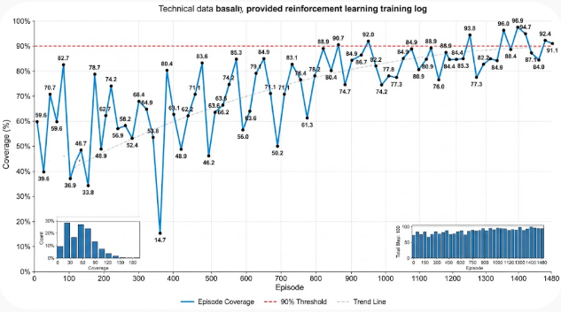
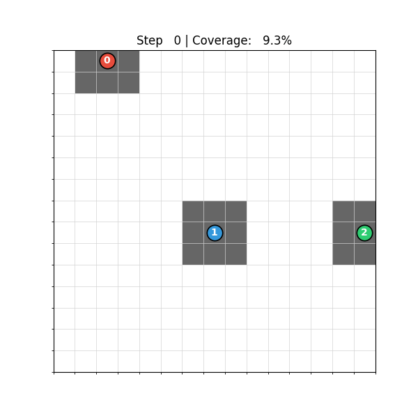

以前取り組んだ[未知の領域をマルチエージェントで探索する問題](https://yoshishinnze.hatenablog.com/entry/2025/11/30/115017)が不完全燃焼だったので、より高精度を求めて改良できないか検証してみました。

本日テーマ：
倉庫のマルチエージェント探索にリトライしてみた。

## 解こうとしている問題

問題の主旨は、複数台のドローン（エージェント）が協力して、未知の領域をいかに効率よく手分けして探索しつくすかという問題をマルチエージェント強化学習（MARL）で解決するという問題です。

### 1. 問題の設定：マルチドローン領域探索問題

__タスクの概要__

* **舞台（環境）**: $15 \times 15$（計225マス）の正方形のマップ（格子状のエリア）。
* **プレイヤー**: 3台のドローン（エージェント）。
* **目標**: 限られたステップ数（最大100ステップ）の中で、**チーム全体でマップの100%（全225マス）を探索（カバレッジ達成）すること**。
* **制約・条件**:
* 各ドローンは自分の周囲（$3 \times 3$マス）しか一気に見ることができません。
* 動きは「上下左右・待機」の5つの行動のみです。


イメージとしては、「視界の狭いロボット掃除機3台を同時に走らせて、部屋全体の床を最短時間で掃除させる」タスクです。

### 2. この問題の難しさと課題

単純にロボットを動かすだけなら簡単に見えますが、強化学習としては以下の高度な難しさ（課題）が存在します。

__① 「集団行動」と「分散行動」のトレードオフ__

ドローン同士が近くに固まって動くと、同じマスを何回も見てしまい重複（無駄）が発生します。一方で、バラバラに離れすぎると、全体マップの情報共有や効率的なルート分担が難しくなります。

__② 報酬割り当ての難しさ（Credit Assignment Problem）__

「エリアが広がった」というチーム全体の成果に対して、「誰がどれくらい貢献したか」を正しく評価しないと学習がうまくいきません。

* チーム全体の成果（チーム報酬）だけを与えると、「他人に任せて遊ぶフリーライダー（サボりエージェント）」が生まれる。
* 個人の成果（個人報酬）だけを与えると、「他人の横取り」や「自分勝手な動き」が生じる。

### 3. 応用イメージ

本問題の近い応用イメージとして以下のようなものが考えられると思います。

工場内の自律搬送ロボット（AGV）のルート最適化、災害現場での複数ドローンによる捜索救助（SAR）、農地・太陽光パネルの分散点検など、実世界のロボティクス分野

## 実装イメージ

### 問題解決の方針

今回の探索問題を解く方針は、**「広域情報（グローバル）の共有」と「局所視界（ローカル）での自律的役割分担」を融合させた分散協調（Decentralized Cooperation with Shared Perception）** とします。

具体的なコアピラーについて説明していきます。

### 1. 全体マップの完全共有による「情報重複の自発的回避」

全エージェントが共通の「グローバル探索マップ（`explored_map`）」を観測空間（Observation）として共有しています。

* **方針**: 個々のドローンが「どこが未探索で、どこが探索済みか」の全体像を常に把握できるようにします。
* **狙い**: 各ドローンに「すでに誰かが探索した場所へわざわざ行く必要はない」ことを明示的に理解させ、不要な重複行動を認知レベルで防止します。

### 2. 空間関係とIDのトークン化による「自律的な役割分担（空間分割）」

単に共有マップを見るだけでは、「誰がどの未探索エリアに向かうべきか」でお見合い（競合）が発生します。これを解決するために、以前取り組んだ[Pursuitで実績がある](https://yoshishinnze.hatenablog.com/entry/2026/07/18/043000) **2D RoPE Transformer** を応用した上で、各エージェントにエージェントIDを埋め込みます。

* **方針**:
* **エージェントID（`agent_id_emb`）**: 「自分は誰か（0, 1, 2）」という固有の役割意識を持たせる。
* **2D RoPE（2D Rotary Position Embedding）**: グリッド上の absolute/relative な距離・角度関係をAttention機構にダイレクトに埋め込む。


* **狙い**:
「ドローン0が北東に近いからそこを担当し、自分（ドローン1）は南西に向かう」といった、**エージェント間の動的なエリア分割・役割分担（Spatial Partitioning）** をSelf-Attentionを通して自然に獲得（自己組織化）させることを意図します。

### 3. ハイブリッド報酬と公平分配（Fair Split）による「協調と個人のインセンティブ統合」

強化学習において最も重要な「行動の導き方（信用割り当て：Credit Assignment）」の方針です。

* **方針**:
* **チーム報酬（全体の進捗）**: 「チーム全体で100%を目指す」という共通目標を提示（全体最適）。
* **個人貢献報酬（Fair Split按分）**: 「単独で新しいマスを発見した者」により高い報酬を支払い、複数機で同じマスを同時発見した場合は按分（`1.0 / 人数`）で共有させるものとします。


* **狙い**:
マルチエージェントを実施すると毎回悩まされる「他人に任せてサボるフリーライダー」を防ぎつつ、「固まって動くと報酬が薄まる（按分される）」というルールを課すことで、**「個々に散らばって未探索領域を開拓する（手分けする）」モチベーションを環境ルール側から強制**しするようにします。


## 実装

### 1. 実装上の工夫

実装上の工夫点について説明します。

__① 「公平な評価」を行うハイブリッド報酬設計__

報酬設計は、先ほど説明した通り、さぼりーを作らないために個人貢献とチーム報酬を分けます。

* **重複時の公平な按分（Fair Split）**: 複数台が同時に同じ未探索エリアを見つけた場合、発見数を「人数で割り算」して分配します（横取りや集団行動による報酬倍増を防ぎます）。
* **チーム報酬 ＋ 個人貢献度のハイブリッド**:

$$\text{報酬} = \text{チーム全体の新規発見数} \times \text{重み} + \text{個人の単独発見数} \times \text{重み} - \text{タイムペナルティ}$$

これにより、「チームのために全体を広げつつ、個々の貢献（手分け）も促す」インセンティブ設計としています。

__② 「2D RoPE Transformer」による空間・識別情報の統合__

各ドローンが「自分が誰で、どこにいて、全体がどうなっているか」を理解するために、エージェントにIDを付与の上、Transformer（Attention機構）と2D Rotary Position Embedding (RoPE)が使います。

```
[全体マップ画像] ───(CNN)───> [マップの特徴] ─┐
[エージェント位置] ──(2D RoPE)─> [空間位置表現] ─┼─> [Transformer] ─> 各ドローンの次の行動
[エージェント ID] ─(Embedding)─> [識別用ID]   ─┘

```

* **位置関係の把握（2D RoPE）**: $15 \times 15$のグリッド上における「絶対位置」と「ドローン同士の相対距離」を、Transformerに正しく認識させています。
* **IDの付与（Agent ID）**: エージェントごとに個別のID（`0, 1, 2`）を持たせることで、「自分はドローン0だから左上を担当しよう」「ドローン1が右に行ったから自分は下へ行こう」といった**ロール（役割分担）の獲得**を可能にしています。

__③ MAPPO（Multi-Agent PPO）による協調学習__

学習アルゴリズムには、近年のマルチエージェント強化学習のデファクトスタンダードである **MAPPO（Multi-Agent PPO）** を採用します。
MAPPOについては[こちら](https://yoshishinnze.hatenablog.com/entry/2026/01/10/153824)をご参考下さい。
他のマルチエージェント強化学習法と比較してMAPPOがどういう手法か確認するのでしたら[こちら](https://yoshishinnze.hatenablog.com/entry/2026/02/19/000000)をご参考を。
効果ならば、[この辺り](https://yoshishinnze.hatenablog.com/entry/2026/07/18/043000)が分かりやすいかもしれません。

* **個別アドバンテージの計算**:
各ステップで得られたハイブリッド報酬を元に、エージェントごとの「アドバンテージ（その行動が平均よりどれくらい良かったか）」を個別に計算し、PPOで方策（Policy）を更新します。

### 2. 実装コード

https://github.com/Shinichi0713/Reinforce-Learning-Study/tree/main/miulti-agent/src/exe-3/src/mappo

## 学習の結果

### 学習曲線

今回は学習のエポックと探索エリアのカバレッジで学習の進み具合を確認しました。
学習当初は探索を推奨する報酬設定してるのでガタガタが大きいですが、徐々に振れ幅が小さくなりました。



### agentの動作

実際に学習を行ったエージェントの動作はこんな感じとなりました。
惜しい。
もう少し隅々まで狙うようにすると完全制覇出来そうです。
今回手法自体は前回トライしたときに比べると全然改善しました。
やっぱりPursuitで鍛えられたことは効いてます(笑)。



## 総括


### マルチエージェント倉庫探索：取り組みと効果の総括

**問題**: 15×15マスを3台のドローンが協力して100ステップ以内に100%探索（カバレッジ達成）するマルチエージェント強化学習（MARL）。

**核心の課題**: 「重複探索の無駄」と「サボり（フリーライダー）」の2つの障壁を同時に克服すること。

### 取り組んだ3つの改良

| 工夫 | 内容 | 狙い |
|------|------|------|
| **全体マップの完全共有** | 全エージェントが共通のグローバル探索マップを観測 | 「誰かが既に探索した場所へ行く必要はない」を認知させ、重複を防止 |
| **2D RoPE Transformer + ID埋め込み** | 各ドローンに固有IDを付与し、2D RoPEで空間的な位置関係をAttention機構に埋め込む | 「自分は左上、あいつは右下」といった**動的な空間分割・役割分担**を自己組織化 |
| **ハイブリッド報酬（Fair Split）** | チーム報酬 + 個人貢献報酬。重複発見時は人数で按分 | サボりを防ぎつつ、固まると報酬が薄まる構造で**分散探索をインセンティブ化** |

**学習アルゴリズム**: MAPPO（Multi-Agent PPO）を採用し、個別アドバンテージで方策を更新。

### 効果

- **前回比で大幅改善**: Pursuitで検証済みの2D RoPE TransformerとMAPPOの組み合わせが、探索問題にも有効に機能した。
- **学習曲線**: 初期は報酬設計の影響で大きく振れたが、エポックが進むにつれて振れ幅が縮小し、安定した学習が確認できた。
- **動作品質**: 「惜しい」レベルまで到達。3台がおおむね分担して広域を開拓する動きを獲得したが、**隅々まで徹底する細部の最適化**が残課題。

**結論**: 「全体情報の共有」「空間的役割分担の自己組織化」「公平な報酬設計」の3本柱により、マルチエージェント探索における協調行動の獲得に大きく近づいた。完全制覇には、未探索箇所へのより精緻な誘導が今後の改善点。

