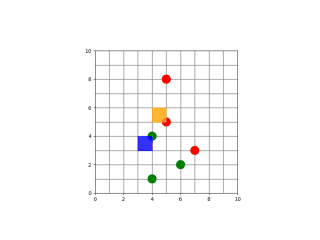

MARLの問題で先日のMAZeroの威力を把握してみたいと思いました。
問題設定の上でMAZeroの威力を把握する実験を行いました。

## 問題設定

MARLの問題を以下のように定義しました。

### 1. 環境の報酬設計

- **移動報酬（距離ベース）**

  - 荷物を持っていないとき：最も近い「未回収」荷物のピックアップ位置までのマンハッタン距離に基づき、近いほど少し報酬が増える（`0.01 * (10 - min(dists))`）。
  - 荷物を持っているとき：
    その荷物の配送先までのマンハッタン距離に基づき、近いほど少し報酬が増える（`0.01 * (10 - dist_to_drop)`）。
- **ピックアップ報酬**

  - エージェントがピックアップ位置にいて「pick（5）」を実行し、まだ回収されていない荷物を拾うと、`+1` の報酬。
- **配送報酬**

  - 荷物を持った状態で配送先にいて「deliver（6）」を実行し、まだ配達されていない荷物を届けると、`+10` の報酬。
- **衝突ペナルティ**

  - 2体のエージェントが同じマスにいると、両方に `-5` の報酬。
- **エピソード終了時の報酬**

  - すべての荷物が配達完了すると、各エージェントに `+5` の追加報酬。
  - 最大ステップ数（`max_steps`）に達すると、成功・失敗にかかわらずエピソード終了。

### 2. 環境が表す問題

- **問題の種類**

  - 2体のエージェントがグリッド上で協調しながら複数の荷物をピックアップし、それぞれの配送先に届ける「**マルチエージェント配送問題**」。
- **環境の構造**

  - `grid_size × grid_size` のグリッド空間。
  - 各荷物は「ピックアップ位置」と「配送位置」を持ち、状態として「未回収」「回収済み」「配達済み」を持つ。
  - エージェントは「荷物を持っているかどうか」を状態として持つ。
- **行動空間**

  - 各エージェントは `{0:stay, 1:up, 2:down, 3:left, 4:right, 5:pick, 6:deliver}` の7種類の行動を選択可能。

一旦エージェントを操作させるとこんな動作となります。



### 3. 環境で学習を行う目的

- **主目的**

  - 2体のエージェントが協調して、**できるだけ少ないステップ数で、すべての荷物をピックアップし、配送先に届ける**こと。
  - その過程で、衝突を避けつつ、ピックアップ・配送の順序や分担を効率よく決める方策を学習すること。
- **副次的な目的**

  - エージェント間の**タスク分担**（どのエージェントがどの荷物を運ぶか）を自然に学習すること。
  - 互いに邪魔にならない**経路計画**（衝突回避）を学習すること。

### 4. 問題を解くための必要条件

- **個々のエージェントが満たすべき条件**

  - グリッド上の移動・ピックアップ・配送のルールを正しく理解していること。
  - 自分が荷物を持っているかどうかに応じて、適切な行動（移動・pick・deliver）を選択できること。
- **マルチエージェントとしての必要条件**

  - **協調性**：同じ荷物を奪い合わない、あるいは同じ配送先に集中しすぎない。
  - **衝突回避**：同じマスに同時に存在しないように、経路やタイミングを調整する。
  - **タスク分配**：どちらがどの荷物を担当するか、あるいは途中で荷物を渡すような協調も含め、全体として効率の良い分担を実現すること。
- **学習上の必要条件**

  - 各エージェントが、自身の観測（位置・荷物状態・他エージェント位置）から、**協調的かつ効率的な方策**を学習できること。
  - 報酬設計（距離報酬・ピックアップ報酬・配送報酬・衝突ペナルティ）をうまく利用して、**「速く」「衝突せず」「すべて配達する」** という目的に整合した行動を獲得すること。

## 実装

前回のMAZeroの説明を踏まえた「MAZero によるマルチエージェント配送環境の学習」の実装手順を整理します。

### 1. 全体の流れ

1. **環境の準備**：`DroneDeliveryEnv` を理解し、必要に応じて修正（報酬スケール、終了条件など）。
2. **環境ラッパーの実装**：`EnvWrapper` で状態・行動を PyTorch に適した形式に変換。
3. **ネットワークの実装**：`MAZeroNet`（価値・報酬・方策の予測）。
4. **MCTS の実装**：`MAZeroMCTS`（MuZero/MAZero 風の探索）。
5. **エージェントの実装**：`MAZeroAgent`（行動選択・学習更新）。
6. **学習ループの実装**：`train_mazero`（データ収集・MCTS 実行・ネットワーク更新）。
7. **学習済みエージェントの保存・復元**：チェックポイントの保存・読み込み。
8. **評価・可視化**：`evaluate_agent`、`record_agent_video`、`save_render_video` など。

### 2. 各ステップの詳細

__ステップ 1: 環境の準備（`DroneDeliveryEnv`）__

- 既存の `DroneDeliveryEnv` を確認・修正します。
- 特に以下の点を確認：
  - 報酬スケール（距離報酬が小さすぎないか）
  - `max_steps`（終了条件）
  - `save_render_video` メソッド（動画保存用）

必要に応じて、報酬スケールを調整したり、`max_steps` を短くして学習を安定させます。

__ステップ 2: 環境ラッパーの実装（`EnvWrapper`）__

`DroneDeliveryEnv` を PyTorch で扱いやすい形式にラップします。

```python
class EnvWrapper:
    def __init__(self, grid_size=10, num_agents=2, num_packages=3):
        self.env = DroneDeliveryEnv(grid_size, num_agents, num_packages)
        self.action_space = gym.spaces.Discrete(7)  # 0-6
        self.state_dim = ...  # 状態ベクトルの次元を計算
        self.num_agents = num_agents

    def reset(self):
        obs = self.env.reset()
        return self._obs_to_tensor(obs)

    def step(self, actions):
        obs, rewards, done, info = self.env.step(actions)
        return self._obs_to_tensor(obs), rewards, done, info

    def _obs_to_tensor(self, obs):
        # 各エージェントの観測を連結して 1 つの状態ベクトルにする
        # 例：エージェント位置、荷物状態などをフラット化
        state_vec = ...
        return torch.FloatTensor(state_vec)
```

- `state_dim` は、状態ベクトルの次元（例：`(2*2 + 3*4)` など）を計算して設定します。
- `_obs_to_tensor` で、観測を PyTorch のテンソルに変換します。

__ステップ 3: ネットワークの実装（`MAZeroNet`）__

価値・報酬・方策を予測するニューラルネットワークを実装します。

```python
class MAZeroNet(nn.Module):
    def __init__(self, state_dim, action_dim, hidden_dim=128, device="cpu"):
        super().__init__()
        self.device = device
        self.encoder = nn.Sequential(
            nn.Linear(state_dim, hidden_dim),
            nn.ReLU(),
            nn.Linear(hidden_dim, hidden_dim),
            nn.ReLU(),
        )
        self.value_head = nn.Linear(hidden_dim, 2)          # 各エージェントの価値
        self.reward_head = nn.Linear(hidden_dim, 2)        # 各エージェントの報酬
        self.policy_head = nn.Linear(hidden_dim, 2 * action_dim)  # 2エージェント分の方策

    def forward(self, x):
        x = x.to(self.device)
        h = self.encoder(x)
        value = self.value_head(h)
        reward = self.reward_head(h)
        policy_logits = self.policy_head(h)
        policy = F.softmax(policy_logits.view(-1, 2, self.policy_head.out_features // 2), dim=-1)
        return value, reward, policy
```

- `device` 属性を持たせ、`forward` で明示的にデバイスに送ります。
- 出力は `(value, reward, policy)` の3つで、`policy` は `(batch, 2, action_dim)` の形状にします。

__ステップ 4: MCTS の実装（`MAZeroMCTS`）__

MuZero/MAZero 風の MCTS を実装します。

```python
class Node:
    def __init__(self, state, prior, parent=None):
        self.state = state
        self.parent = parent
        self.children = {}
        self.visit_count = 0
        self.value_sum = 0.0
        self.prior = prior

class MAZeroMCTS:
    def __init__(self, model, env_wrapper, num_simulations=50, discount=0.99):
        self.model = model
        self.env_wrapper = env_wrapper
        self.num_simulations = num_simulations
        self.discount = discount
        self.action_dim = env_wrapper.action_space.n

    def run(self, state):
        root = Node(state, prior=None)
        for _ in range(self.num_simulations):
            self._simulate(root)
        return self._action_probs(root)

    def _simulate(self, node):
        # 1. 選択（UCT スコアで子ノードを選択）
        # 2. 展開（未訪問の行動を展開し、ネットワークで評価）
        # 3. バックアップ（価値を親ノードに伝播）
        pass

    def _action_probs(self, node):
        # 訪問回数に基づく行動確率を返す
        pass
```

- `Node` クラスで探索木のノードを管理。
- `_simulate` で「選択・展開・評価・バックアップ」のサイクルを実装。
- `_action_probs` で MCTS の結果を行動確率として返す。

__ステップ 5: エージェントの実装（`MAZeroAgent`）__

MCTS の結果に基づいて行動を選択し、ネットワークを更新します。

```python
class MAZeroAgent:
    def __init__(self, model, mcts, optimizer, device="cpu"):
        self.model = model.to(device)
        self.mcts = mcts
        self.optimizer = optimizer
        self.device = device

    def select_action(self, state, temperature=1.0):
        action_probs = self.mcts.run(state)  # (2, action_dim)
        actions = []
        for i in range(2):
            probs = action_probs[i]
            if temperature != 1.0:
                probs = np.power(probs, 1.0 / temperature)
                probs /= probs.sum()
            action = np.random.choice(self.mcts.action_dim, p=probs)
            actions.append(action)
        return actions

    def update(self, states, target_values, target_rewards, target_policies):
        # バッチ学習の実装
        pass
```

- `select_action` で MCTS の確率に基づき行動をサンプリング。
- `update` でネットワークを更新（価値・報酬・方策の損失を計算）。

__ステップ 6: 学習ループの実装（`train_mazero`）__

エピソードを回し、MCTS で行動確率を計算し、ネットワークを更新します。

```python
def train_mazero(num_episodes=1000, num_simulations=50):
    device = "cuda" if torch.cuda.is_available() else "cpu"
    env_wrapper = EnvWrapper(grid_size=10, num_agents=2, num_packages=3)
    state_dim = env_wrapper.state_dim
    action_dim = env_wrapper.action_space.n

    model = MAZeroNet(state_dim, action_dim, hidden_dim=128, device=device)
    mcts = MAZeroMCTS(model, env_wrapper, num_simulations=num_simulations)
    optimizer = optim.Adam(model.parameters(), lr=1e-3)
    agent = MAZeroAgent(model, mcts, optimizer, device=device)

    replay_buffer = deque(maxlen=10000)

    for episode in range(num_episodes):
        state = env_wrapper.reset()
        episode_states = []
        episode_rewards = []
        episode_mcts_probs = []

        done = False
        while not done:
            mcts_probs = mcts.run(state)
            actions = agent.select_action(state, temperature=1.0)
            next_state, rewards, done, _ = env_wrapper.step(actions)

            episode_states.append(state)
            episode_rewards.append(rewards)
            episode_mcts_probs.append(mcts_probs)
            state = next_state

        # n-step bootstrapping でターゲットを計算
        returns = np.zeros((len(episode_rewards), 2))
        R = np.zeros(2)
        for t in reversed(range(len(episode_rewards))):
            R = episode_rewards[t] + mcts.discount * R
            returns[t] = R

        for t in range(len(episode_states)):
            target_value = returns[t]
            target_reward = episode_rewards[t]
            target_policy = episode_mcts_probs[t]
            replay_buffer.append((episode_states[t], target_value, target_reward, target_policy))

        # バッチ学習
        if len(replay_buffer) >= 32:
            batch = random.sample(replay_buffer, 32)
            states, t_values, t_rewards, t_policies = zip(*batch)
            loss = agent.update(states, t_values, t_rewards, t_policies)
            if episode % 100 == 0:
                print(f"Episode {episode}, Loss: {loss:.4f}")

    return agent
```

- MCTS の結果を「ターゲット方策」として使用。
- n-step bootstrapping で「ターゲット価値」を計算。
- 報酬はそのまま「ターゲット報酬」として使用。

__ステップ 7: 学習済みエージェントの保存・復元__

学習完了後にチェックポイントを保存し、必要に応じて復元します。

```python
def save_agent(agent, save_path):
    checkpoint = {
        "model_state_dict": agent.model.state_dict(),
        "optimizer_state_dict": agent.optimizer.state_dict(),
        "state_dim": ...,
        "action_dim": ...,
        "device": agent.device,
    }
    torch.save(checkpoint, save_path)

def load_agent(checkpoint_path, env_wrapper, device="cpu"):
    checkpoint = torch.load(checkpoint_path, map_location=device)
    state_dim = checkpoint["state_dim"]
    action_dim = checkpoint["action_dim"]
    model = MAZeroNet(state_dim, action_dim, hidden_dim=128, device=device)
    model.load_state_dict(checkpoint["model_state_dict"])
    optimizer = optim.Adam(model.parameters(), lr=1e-3)
    optimizer.load_state_dict(checkpoint["optimizer_state_dict"])
    mcts = MAZeroMCTS(model, env_wrapper, num_simulations=50)
    agent = MAZeroAgent(model, mcts, optimizer, device=device)
    return agent
```

- `train_mazero` の最後で `save_agent` を呼び出す。
- 評価時は `load_agent` で復元して使用。

__ステップ 8: 評価・可視化__

学習済みエージェントの性能を確認します。

```python
def evaluate_agent(agent, env_wrapper, num_episodes=5, render=False):
    total_rewards = []
    for ep in range(num_episodes):
        state = env_wrapper.reset()
        done = False
        episode_reward = [0, 0]
        while not done:
            actions = agent.select_action(state, temperature=0.0)  # greedy
            state, rewards, done, _ = env_wrapper.step(actions)
            episode_reward[0] += rewards[0]
            episode_reward[1] += rewards[1]
            if render:
                env_wrapper.env.render()
        total_rewards.append(episode_reward)
    return total_rewards

def record_agent_video(agent, env_wrapper, filename="agent_video.mp4"):
    state = env_wrapper.reset()
    done = False
    agent_actions_list = []
    while not done:
        actions = agent.select_action(state, temperature=0.0)
        agent_actions_list.append(actions)
        state, _, done, _ = env_wrapper.step(actions)
    env_wrapper.env.save_render_video(agent_actions_list, filename=filename, fps=5)
```

- `evaluate_agent` で平均報酬を計測。
- `record_agent_video` で動画を保存。

### 3. 実装の順序

ここまでの流れをまとめました。

1. `DroneDeliveryEnv` の確認・修正（報酬スケール・終了条件）。
2. `EnvWrapper` の実装（状態ベクトルの設計が重要）。
3. `MAZeroNet` の実装（出力形状を確認）。
4. `MAZeroAgent` の `update` メソッドの実装（損失計算を確認）。
5. `MAZeroMCTS` の実装（MuZero/MAZero 風の探索）。
6. `train_mazero` の実装（データ収集・学習ループ）。
7. 保存・復元コードの追加。
8. 評価・可視化コードの追加。

この順序で進めると、各ステップで動作確認をしながら実装を進められます。

## 総括

実験したかったのですが、探索木生成がかなり時間がかかります。
いつものようにGoogle Colabで学習しようとすると時間切れとなりました。。。

前回説明のMAZeroをなんとか実験して、結果を確認する方法を考えます。


