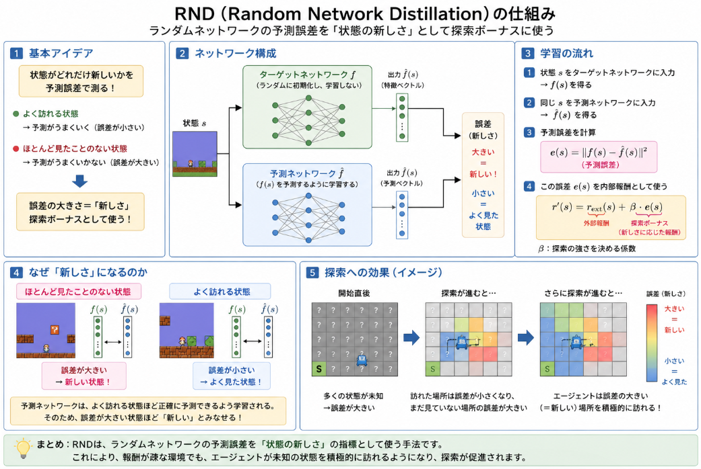

MAZeroの手法は非常に有効そうですが、モデルベースの探索MCTSを生成するため、非常に大きな学習コストがかかっていました。
そこで計算コストを抑えて、探索力にも優れる手法を考えることとしました。

## 選定した手法
QMIXに探索力を付加できるRNDを組み合わせることで活路を見出そうと思います。

### QMIXの課題

QMIX はマルチエージェント強化学習（MARL）において**非常に有効な手法**ですが、その設計上の特徴から「**探索力が不足しやすい**」という課題が生じます。  
以下では、「QMIX がなぜ有効なのか」と「なぜ探索力が不足しがちなのか」を対比して説明します。

__1. QMIX が有効な理由（強み）__

QMIX の有効性は、主に次の 2 点にあります。

__(1) 価値分解（Value Decomposition）__

- QMIX は、**グローバルな Q 値 $Q_{\text{total}}$** を、**各エージェントの Q 値 $Q_i$ の単調関数**として表現します。
- つまり、
  $$
  Q_{\text{total}}(\mathbf{s}, \mathbf{a}) = f_{\text{mixer}}\big(Q_1(s_1, a_1), \dots, Q_n(s_n, a_n)\big)
  $$
  という形で、**グローバル報酬を個々のエージェントに分解**します。
- これにより、
  - **学習時**：グローバル報酬に基づいて集中学習できる  
  - **実行時**：各エージェントは自分の観測と Q 値だけで行動できる（分散実行）
  という利点があります。

__(2) 単調性制約による安定性__

- QMIX は「単調性（monotonicity）」を課すことで、**グローバル Q と各 Q の整合性を保ちつつ学習**します。
- これにより、
  - 学習が安定しやすい  
  - 協調的な行動が自然に学習されやすい  
  という性質があります。

このように、QMIX は**協調的な価値分解と安定した学習**によって、多くのマルチエージェント環境で高い性能を示す「有効な手法」です。

__2. QMIX の探索力不足が生じる理由（課題）__

一方で、QMIX の設計は「探索」という観点では以下のような制約を持ちます。

__(1) 探索は基本的に「局所的」で「独立」__

- QMIX の各エージェントは、**自分の Q ネットワークに基づいて行動**します。
- 探索は、主に
  - ε-greedy  
  - Boltzmann 探索  
  - NoisyNet などのノイズ付加  
  といった「**局所的かつ独立な探索**」に依存します。
- つまり、
  - 各エージェントは「自分の Q が高い行動」や「ランダムに選んだ行動」を試すだけで、  
  - **エージェント間で協調的に未知の領域を探索する仕組み**は基本的にありません。

__(2) 価値分解が「既知の良い行動」を強化しがち__

- QMIX はグローバル報酬に基づいて学習するため、**一度見つかった良い協調行動**は強く強化されます。
- 一方で、
  - 報酬が得られない未知の状態・行動ペア  
  - 複雑な協調が必要ながら、短期的には報酬が低い行動  
  には、なかなか価値が割り当てられません。
- その結果、**エージェントたちは「既知の良い戦略」に留まりやすく、新しい戦略を試そうとする動機（探索）が弱くなりがち**です。

__(3) モデルベース探索や長期的計画がない__

- MAZero のような手法は、**環境モデルを学習し、MCTS で長期的な計画を行う**ことで、未知の状態空間を積極的に探索します。
- 一方 QMIX は、
  - 環境モデルを持たない（モデルフリー）  
  - 将来の状態を明示的にシミュレーションしない  
  ため、**長期的な探索や計画が苦手**です。
- つまり、「今から数ステップ先にどんな面白い協調が生まれるか」を積極的に試す仕組みが乏しいのです。

__3. 探索力不足が顕著になる状況__

QMIX の探索力不足は、特に以下のような環境で問題になります。

- **報酬が疎な環境**  
  - なかなか報酬が得られない場合、エージェントたちは「何も起こらない行動」を繰り返しがちです。
  - 新しい協調行動を見つけるために、広い探索が必要ですが、QMIX 単体ではそれが難しい。

- **複雑な協調が必要な環境**  
  - 特定のエージェントの行動だけでは報酬が得られず、複数のエージェントがタイミングを合わせて行動する必要がある場合。
  - そのような「協調の組み合わせ」を試すには広い探索が必要ですが、QMIX の局所探索だけでは見つけにくい。

- **長期的な計画が必要な環境**  
  - 短期的には報酬が低くても、長期的には大きな報酬が得られるような戦略が必要な場合。
  - QMIX は主に短期的な Q 学習に基づくため、長期的な探索・計画が弱い。

### QMIX + RNDについて

QMIX は協調学習には強いが、探索は各エージェントの局所的な ε-greedy などに依存するため、**未知の状態や新しい協調戦略を試しにくい**という課題があります。

RND は「状態の新しさ」を予測誤差で測り、それを内部報酬として与える手法です。  
QMIX に RND を組み合わせると、

1. **未知の状態に報酬が付く**  
   → QMIX 単体では訪れなかった領域を、エージェントが積極的に探索するようになる。

2. **協調的な未知状態も試されやすくなる**  
   → 複数のエージェントが同時に新しい行動を取った状態に大きな内部報酬が付き、新しい協調戦略の発見が促される。

3. **報酬が疎な環境でも探索が続く**  
   → 外部報酬が得られない間も内部報酬で学習が進み、局所解に陥りにくくなる。

このように、RND が QMIX の「探索の動機」を補強することで、**QMIX 単体では不足していた探索力を補える**、というのが仮説の核心です。

## RNDについて

RND（Random Network Distillation）は、「**状態がどれだけ新しいか**」をニューラルネットの予測誤差で測り、それを探索のボーナス（内部報酬）として使う手法です。

### 1. 基本アイデア

- ランダムに初期化した「ターゲットネットワーク」を固定し、  
  もう一方の「予測ネットワーク」にその出力を予測させる。
- **よく訪れる状態**は予測がうまくいく（誤差が小さい）。  
  **ほとんど見たことのない状態**は予測がうまくいかない（誤差が大きい）。
- この**予測誤差の大きさ**を「状態の新しさ」とみなし、探索ボーナスとして使う。

### 2. ネットワーク構成

1. **ターゲットネットワーク $f$**  
   - ランダムに初期化した後、**一切学習しない**。  
   - 入力状態 $s$ を特徴ベクトル $f(s)$ に写像する。

2. **予測ネットワーク $\hat{f}$**  
   - ターゲットネットワークの出力 $f(s)$ を予測するように学習する。  
   - つまり、入力 $s$ から $f(s)$ を再現する。

### 3. 学習の流れ

1. 状態 $s$ をターゲットネットワークに入力 → $f(s)$ を得る。
2. 同じ $s$ を予測ネットワークに入力 → $\hat{f}(s)$ を得る。
3. 予測誤差を計算：
   $$
   e(s) = \| f(s) - \hat{f}(s) \|^2
   $$
4. この誤差 $e(s)$ を「**内部報酬（intrinsic reward）**」として、外部報酬に加算：
   $$
   r'(s) = r_{\text{ext}}(s) + \beta \cdot e(s)
   $$
   （$\beta$ は探索の強さを決める係数）

### 4. なぜ「新しさ」になるのか

- 予測ネットワークは、**よく訪れる状態ほど正確に予測できるよう学習**される。
- 逆に、**ほとんど見たことのない状態**では予測がうまくいかず、誤差 $e(s)$ が大きくなる。
- したがって、誤差が大きい状態ほど「新しい状態」と解釈でき、探索ボーナスとして扱える。

### 5. まとめ

- RND は、**ランダムネットワークの予測誤差**を「状態の新しさ」の指標として使う手法です。
- これにより、報酬が疎な環境でも、エージェントが未知の状態を積極的に訪れるようになり、探索が促進されます。

今回必要なのはあくまで見たことない探索をしてくれるかです。
良いとわかっているところを集中的に探索することになるようなMCTSが欲しいというわけではありません。

## 実装

実装コードは以下のレポジトリです。

https://github.com/Shinichi0713/Reinforce-Learning-Study/tree/main/miulti-agent/src/exe-4/src/qmiz_rnd

__実装のコツ__

ここまでの実装と議論から、QMIX + RND をうまく動かすための「コツ」を整理します。

__1. 状態エンコードの設計__

QMIX は「グローバル状態」を使って価値分解を行うので、**状態ベクトルの設計が非常に重要**です。

- **エージェントごとの状態**  
  - `agent_pos`, `carrying`, `other_agent`, `packages` を固定長ベクトルにエンコードする。  
  - 例：`state_dim_per_agent = 23`（位置2 + 運搬状態1 + 他エージェント位置2 + パッケージ情報18）。
- **グローバル状態**  
  - 全エージェントの状態を結合し、`global_state_dim = num_agents * state_dim_per_agent` とする。  
  - QMIX の MixerNetwork はこの `global_state_dim` を入力として受け取る。

**コツ**：  
- 観測の各要素（位置、フラグ、他エージェント情報）を**一貫した順序**で並べる。  
- `_obs_to_tensor` と `_global_state_to_tensor` で同じロジックを使い、次元が一致するようにする。

__2. RND の内部報酬の扱い__

RND は「状態の新しさ」を予測誤差で測り、内部報酬として与えます。

- **内部報酬のスケール**  
  - 外部報酬（例：配送成功 +100）と内部報酬（予測誤差）のスケールが大きく異なるので、  
    - 内部報酬を `RND_BETA`（例：0.1）でスケーリングする。  
    - あるいは、内部報酬を正規化（移動平均・分散で標準化）する。
- **どの状態に適用するか**  
  - ここでは「各エージェントの個別状態」に RND を適用し、内部報酬をエージェントごとに与えています。  
  - グローバル状態に RND を適用する案もありますが、実装が複雑になるので、まずは個別状態で十分。

**コツ**：  
- `RND_BETA` を小さめ（0.01〜0.1）から始め、学習の様子を見ながら調整する。  
- 内部報酬が外部報酬を完全に支配しないように注意する。

__3. QMIX の更新タイミングとバッチ構成__

QMIX は「エージェント Q ネットワーク + Mixer ネットワーク」で構成されるため、更新のタイミングとバッチの形が重要です。

- **更新頻度**  
  - `update_interval = 4` など、数ステップごとに更新する。  
  - 頻繁に更新しすぎると不安定になり、逆に遅すぎると学習が進まない。
- **バッチの形状**  
  - `agent_qs: [batch, num_agents]`  
  - `state: [batch, global_state_dim]`  
  - `actions: [batch, num_agents]`  
  - これらが `torch.bmm` や `nn.Linear` の入力次元と一致するようにする。

**コツ**：  
- `MixerNetwork.forward` の `bmm` 部分で形状をよく確認する（先ほどの `batch2 must be a 3D tensor` エラーは典型例）。  
- `unsqueeze` / `squeeze` を多用するので、`print(shape)` でデバッグすると良い。

__4. 探索とターゲット更新のバランス__

QMIX + RND では、**探索（RND）と安定性（ターゲットネットワーク）** のバランスが重要です。

- **探索率（ε-greedy）**  
  - 初期 `EPS_START = 1.0` から `EPS_END = 0.05` まで指数関数的に減衰させる。  
  - RND が内部報酬で探索を促進するので、ε は比較的早く下げても良い。
- **ターゲット更新**  
  - `TARGET_UPDATE = 100` など、一定エピソードごとにターゲットネットワークを更新する。  
  - QMIX は価値分解が複雑なので、ターゲット更新を遅めにすると安定しやすい。

**コツ**：  
- RND が強く効いている間は ε を下げても探索が維持される。  
- ターゲット更新を早くしすぎると QMIX が発散しやすいので、まずは大きめの値から始める。

__5. デバイス管理とチェックポイント__

PyTorch 実装では、**デバイス（CPU/GPU）の扱い**がバグの原因になりがちです。

- **CPU-only 環境**  
  - モデル・チェックポイントはすべて `device="cpu"` で扱う。  
  - `torch.load(path, map_location="cpu")` で読み込む。
- **チェックポイント**  
  - `episode`, `eps`, 各ネットワークの `state_dict`, オプティマイザの `state_dict` を保存する。  
  - 読み込み時は `map_location` を明示し、デバイス不一致エラーを避ける。

**コツ**：  
- 学習時と推論時でデバイスが変わる可能性を考慮し、`map_location` を柔軟に指定できるようにする。  
- `agent.device` を文字列で保存し、読み込み時に必要に応じて上書きする。

__6. 可視化とデバッグ__

QMIX + RND はパラメータが多いため、**可視化とログ**が重要です。

- **報酬の推移**  
  - 外部報酬と内部報酬の合計を記録し、学習が進んでいるか確認する。
- **動画保存**  
  - `env.save_render_video` で学習済みエージェントの動作を確認し、  
    - パッケージを効率的に配送できているか  
    - エージェント同士が衝突していないか  
    を目視で確認する。
- **RND の予測誤差**  
  - 内部報酬の平均・最大値などをログに出し、探索が適切に働いているか確認する。

**コツ**：  
- 学習初期は探索が強く、報酬が低いことが多いので、短いエピソードで様子を見る。  
- 動画を見て「明らかに変な行動」をしていないか確認し、バグ（状態エンコードミスなど）を早期に発見する。

## 総括

実装してみたものの、まだ学習の推移が思わしくありません。
以下の動画のような動作となりました。

この結果の場合MAZeroの方が良い結果となりそうです。

