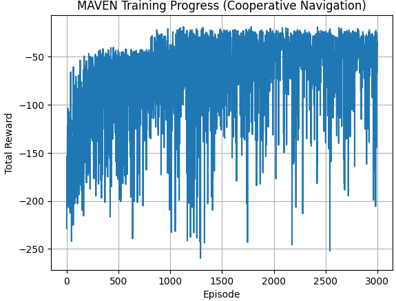

先日の協調学習をMAVENで行う問題ですが、解決しました。
経過と結果について説明します。

本ブログは以下のブログの続きです。


## 問題設定

詳細は以下のブログで説明しています。

https://yoshishinnze.hatenablog.com/entry/2026/04/04/135026


問題の成功条件や学習のゴールは以下の通りです。
- **成功**: 両エージェントが、衝突や混雑を避けつつ、共有ターゲットに**同時に**到達すること。
- **協調のポイント**: 狭い通路（ボトルネック）を**順番に**通過する必要があり、**他エージェントの行動を推測しながら協調する**ことが求められる。
- **学習のゴール**: 「自分だけ早く行く」のではなく、「**相手とタイミングを合わせて、全体として効率よくゴールする**」戦略を身につけること。

この問題は、**MAVEN や QMIX などのマルチエージェント強化学習アルゴリズムが得意とする「協調ナビゲーション」の典型的な例**になっています。


### 何をしたら「成功」か

**成功の定義は、次の条件を満たすことです。**

1. **両エージェントが同じターゲットセルに同時に到達する**
   - ターゲットは `(size-1, size-1)`（右下）で共有。
   - 片方だけが早く着いても、もう片方が遅れていれば「完全な成功」とは見なされません。

2. **できるだけ少ないステップ数で到達する**
   - 最大ステップ数（例：30）以内に到達する必要があります。
   - 早く到達するほど、全体の報酬が高くなります。

3. **衝突や混雑を避けながら、効率的にボトルネックを通過する**
   - 中央の狭い通路（ボトルネック）を、**順番に**通過する。
   - 同じセルに同時に入らない（衝突回避）。
   - ボトルネック付近で過度に接近しない（混雑回避）。


### 協調の本質（何が難しいか）

1. **「自分だけ早く行く」ではうまくいかない**
   - ボトルネックは1マス幅しかないため、**同時に通れない**。
   - どちらかが先に通る必要があり、もう一方は**待機・迂回**する必要があります。

2. **他エージェントの意図を推測しながら行動する必要がある**
   - 各エージェントは「自分の位置」「ターゲット」「相手の位置」「ボトルネックの位置」しか見えません。
   - それをもとに、「相手は今、ボトルネックを通ろうとしているのか」「自分は待つべきか、先に行くべきか」を判断する必要があります。

3. **グローバルな報酬を理解する必要がある**
   - 報酬は「全体の距離の合計」「同時到達ボーナス」「衝突ペナルティ」「混雑ペナルティ」など、**チーム全体の結果**に基づいて与えられます。
   - 各エージェントは、「自分の行動がチーム全体の報酬にどう影響するか」を学習しなければなりません。

## MAVENによる協調学習

ここまでの実装を踏まえて、**MAVEN（Multi-Agent Variational Exploration）の実装ポイント**を整理します。

### 1. MAVEN の目的（何を解決したいか）

**問題**:  
マルチエージェント強化学習では、**探索が偏りやすい**（全員が同じ戦略を試してしまう）ため、**多様な協調戦略**をうまく見つけられないことがあります。

**MAVEN の狙い**:  
- **潜在変数 z** を導入し、**探索の「モード」を変える**ことで、  
  - 「全員が突進するモード」  
  - 「一人が待機するモード」  
  - 「迂回するモード」  
  など、**多様な協調戦略を試す**こと。

### 2. CTDE（Centralized Training, Decentralized Execution）

MAVEN は **CTDE 型** のアルゴリズムです。

- **学習時（Centralized Training）**:
  - 各エージェントの Q ネットワークと、**Mixing Network** を同時に学習。
  - 潜在変数 z も学習に組み込む。
- **実行時（Decentralized Execution）**:
  - 各エージェントは **自分の観測だけ** から行動を選択。
  - z は学習時に多様な探索を促すための「裏方」であり、実行時には使わない（使う実装もあるが、ここでは簡略化）。

### 3. 実装のポイント

__(1) 潜在変数 z の導入__

**目的**:  
- 探索の「モード」を変えるための低次元ベクトル。

**実装例**:
```python
z_dim = 4  # 例: 4次元の潜在空間
z = torch.rand(batch_size, z_dim) * 2 - 1  # [-1, 1] の一様分布
```

**ポイント**:
- z は **バッチごとにサンプリング** する。
- 同じ z を「現在のQ」と「ターゲットQ」の両方に使うことで、**一貫したモードで学習**する。

__(2) Mixing Network（混合ネットワーク）__

**目的**:  
- 各エージェントの Q 値を **z と一緒に** 混ぜて、**共同Q値 Q_tot** を計算する。

**実装例**:
```python
class MixingNetwork(nn.Module):
    def __init__(self, n_agents, hidden_dim=64, z_dim=4):
        super().__init__()
        self.net = nn.Sequential(
            nn.Linear(n_agents + z_dim, hidden_dim),
            nn.ReLU(),
            nn.Linear(hidden_dim, hidden_dim),
            nn.ReLU(),
            nn.Linear(hidden_dim, 1)
        )

    def forward(self, agent_qs, z):
        x = torch.cat([agent_qs, z], dim=-1)
        return self.net(x)  # (batch, 1)
```

**ポイント**:
- 入力: `agent_qs`（各エージェントのQ値） + `z`（潜在変数）
- 出力: `Q_tot`（チーム全体のQ値）
- z が変わると、**同じ状態でも Q_tot の評価が変わる** → 探索モードが変わる。

__(3) TD誤差の計算（z を共有）__

**目的**:  
- 現在の Q_tot とターゲット Q_tot を、**同じ z のもとで** 比較する。

**実装例**:
```python
# 1. 現在のQ_tot（zを使って計算）
current_q_tot = self.compute_q_tot(obs_batch, action_batch, z, self.q_nets, self.mixing_net)

# 2. ターゲットQ_tot（同じzを使って計算）
with torch.no_grad():
    next_agent_qs = ...  # 各エージェントのmax Q
    next_q_tot = self.target_mixing_net(next_agent_qs, z)
    target_q_tot = rewards + (1 - dones) * self.gamma * next_q_tot.squeeze(1)

# 3. 損失計算
loss = nn.SmoothL1Loss()(current_q_tot, target_q_tot)
```

**ポイント**:
- **同じ z** を使うことで、「ある探索モードでのQ値」を一貫して学習。
- z を変えるたびに、**別の探索モードでのQ値**を学習できる。

### 4. 探索の多様化（MAVEN の本質）

**通常の QMIX との違い**:

- **QMIX**:  
  - 各エージェントは ε-greedy などでランダムに行動するが、**探索の「方向性」は同じ**。
- **MAVEN**:  
  - z によって、**探索の「モード」そのものを変える**。
  - 例:
    - `z ≈ [1, 0, 0, 0]` → 「全員が突進するモード」
    - `z ≈ [0, 1, 0, 0]` → 「一人が待機するモード」
    - `z ≈ [0, 0, 1, 0]` → 「迂回するモード」

**実装上のポイント**:
- z は **学習時にのみ** サンプリングし、**実行時には固定**（または使わない）。
- これにより、学習中に **多様な協調戦略を試し、その中から良いものを選ぶ** ことができます。

## 実装
実装は以下レポジトリのenv.pyとmodel_maven.pyをご参考下さい。

https://github.com/Shinichi0713/Reinforce-Learning-Study/tree/main/miulti-agent/src/exe-5/src

__分かった点__

1. 学習がなかなか進まない状況

先述のzの実装を誤って行動の度にzを変えてしまってました。

正しくはエピソードごとに同じ z を「現在のQ」と「ターゲットQ」の両方に使うことで、**一貫したモードで学習**する必要があります。

__なぜ「同じ z」が必要なのか__

__(1) 探索モードの一貫性を保つため__

MAVEN では、**潜在変数 z が「探索のモード」を決める**役割を持ちます。

- 例：
  - `z ≈ [1, 0, 0, 0]` → 「全員が突進するモード」
  - `z ≈ [0, 1, 0, 0]` → 「一人が待機するモード」

**学習の流れ**（TD誤差の計算）:
1. **現在のQ_tot**: ある状態・行動に対して、「このモード（z）での価値」を評価。
2. **ターゲットQ_tot**: 次の状態から得られる「同じモード（z）での価値」を予測。

もし **現在のQとターゲットQで z が異なる**と、どうなるでしょうか？

- 例：
  - 現在のQ: 「突進モード（z1）」での価値を評価。
  - ターゲットQ: 「待機モード（z2）」での価値を予測。

→ **モードが食い違っているため、学習がブレる**（どのモードでの価値を学んでいるのか分からなくなる）。

**結論**:  
**同じモード（同じ z）で一貫して価値を評価・予測する**ことで、  
「このモードでの良い行動は何か？」を正しく学習できます。

__(2) 学習の安定性を保つため__

TD誤差の式は：

$$
\text{loss} = \left( Q_{\text{tot}}(s, a; z) - \left( r + \gamma \cdot Q_{\text{tot}}(s', a'; z) \right) \right)^2
$$

ここで、**z が同じ**であることが重要です。

- **z が同じ** → 同じモードでの価値比較 → 学習が安定。
- **z が異なる** → 異なるモードでの価値比較 → 学習が不安定（ノイズが増える）。

特に、**ターゲットネットワーク（target network）**を使う場合、  
- 現在のネットワークとターゲットネットワークの **両方に同じ z を渡す**ことで、  
  **「同じモードでの価値の時間差分」**を正しく計算できます。


2. 報酬設計

報酬をゴール条件だけに設定していると全然学習が進みませんでした。
そのため、ゴールに近づくことで小さな報酬を出す、停滞するとペナルティを与えるというようにしました。

今回の学習のポイントは、**「ゴール報酬だけに頼らず、途中の行動にも報酬を細かく与える」**ことです。

__1. なぜゴール報酬だけではダメか__

- ゴール報酬（例：`+10.0`）は**非常に大きい**が、**偶然ゴールするまで報酬が得られない**。
- エージェントは「何が良かったのか」を学ぶ前に、**試行錯誤の時間が長すぎる**。
- 特にマルチエージェントでは、**両方が同時にゴールする確率が低い**ため、学習が進まない。

__2. 今回の報酬設計のポイント__

__(1) 距離報酬（グローバル）__

- 両エージェントのターゲットまでの距離の合計に比例したマイナス報酬。
- 例：`-0.1 * (dist0 + dist1)`
- **ゴールに近づくだけで報酬が得られる** → 段階的な学習が進む。

__(2) 個別進捗報酬__

- ターゲットに近づいたら `+0.2` など。
- **「少しでも良くなった」という信号**を明確に与える。

__(3) 停滞ペナルティ__

- 同じ位置に留まると `-0.1`。
- **動かないよりは動いた方がマシ**ということを教える。

__(4) ゴール報酬の調整__

- ゴール報酬を `+10.0 → +3.0` などに下げる。
- **途中の報酬とのバランスを取る**ことで、ゴールだけに偏らない。

## 実験結果

学習ごとに報酬の推移は以下のようになりました。



学習後のエージェントの行動は以下のようになります。
環境の設定上、同じセルにいると衝突の条件を入れてしまってたので、ゴール付近で押し出すような挙動になりましたが。。。

## 総括

QMIXだと、学習の安定感がなかったのですが、MAVENで学習の安定と、行動が一貫してゴールに向かうことが確認できるようになりました。
やはり強化学習、協調学習では探索をいかに行うかが重要だと考えています。


