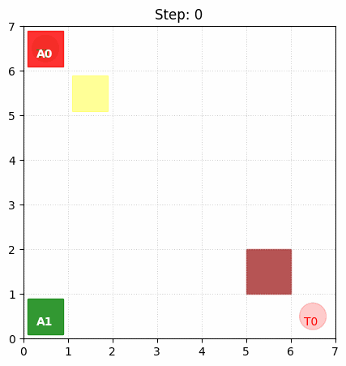
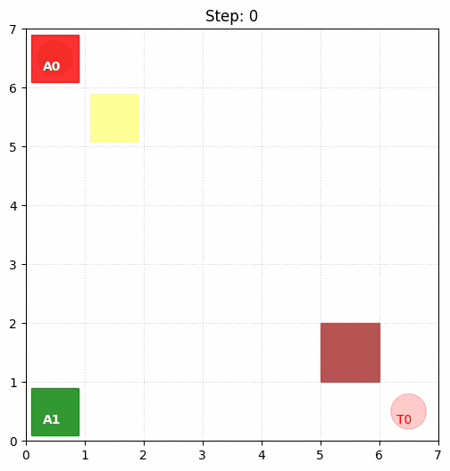

昨日の協調学習用のドローンの問題を、 **「単に各自がゴールする」** レベルから、 **「相方の助けがないと絶対にゴールできない」** という真の協調が必要なレベル（ **相互互助型タスク** ）に引き上げます。

具体的には、以前少し触れた **「スイッチとゲート」** の概念を物理的な制約として厳密に組み込み、一方が「自己犠牲（スイッチを踏み続ける）」を払うことで、もう一方が「恩恵（ゲート通過）」を受けられる仕組みにします。

## 問題設定

修正したドローンのタスクは、専門的には **「非対称な役割分担を伴う、時系列的な協調ナビゲーション問題」** と定義できます。

2台のドローンをエージェント0とエージェント1とします。

### 1. 相互依存的な行動連鎖（Interdependent Action Chain）

この問題の最大の特徴は、一方のエージェントの成功が、もう一方の特定の行動に完全に依存している点です。

* **依存関係:** エージェント0がゴールに到達するためには、エージェント1が「スイッチの上に留まる」という特定のタスクを完遂し、物理的な障壁（ゲート）を除去し続けなければなりません。
* **非対称性:** 両者が同じ動きをするのではなく、「道を切り開く者（サポーター）」と「その道を進む者（リーダー）」という異なる役割を、状況に応じて演じ分ける必要があります。

### 2. 自己犠牲を伴う長期的利益の追求

エージェント1にとって、スイッチを踏むという行為は、自身の目的地（ターゲット）からは一時的に遠ざかる、あるいは停滞することを意味します。

* **局所的マイナスの許容:** 短期的な視点（個人の距離報酬）では「損」となる行動を、チーム全体の最終的な成功（高額な協調ボーナス）のために選択できるか、という高度な意思決定が求められます。

### 3. 動的な状態変化と部分観測

環境は静止した迷路ではなく、エージェントの行動によって「ゲートが開く／閉じる」という劇的な状態変化が起こります。

* **因果関係の学習:** エージェントは「自分がスイッチに乗る」→「ゲートが開く」→「相方の報酬が上がる」→「チーム全体の価値が高まる」という複雑な因果関係を、数値的な報酬のフィードバックのみから推論しなければなりません。

### 4. 時系列的な連携（Sequential Coordination）

この問題は、同時に動くだけでは解けません。

1. **フェーズ1:** エージェント1がスイッチへ移動し、待機する。
2. **フェーズ2:** エージェント0がゲートを通過し、目的地へ向かう。
3. **フェーズ3:** エージェント0の通過を確認後、エージェント1が自分の目的地へ向かう。
という、**明確なステップ（順序立てた戦略）**を学習する必要があります。


## 環境コード
上記の問題を実際に実現する環境コードを実装します。

### 1. 修正後の環境定義：`CollaborativeDroneEnv`

この環境では、エージェント1（緑）が特定のスイッチ位置に留まっている間だけ、エージェント0（赤）の行く手を阻むゲートが消滅します。

※以下コードは昨日のレポジトリより'SimpleReachEnv'を参照した上で実行してください。
昨日のレポジトリは以下です。
https://github.com/Shinichi0713/Reinforce-Learning-Study/tree/main/miulti-agent/src/exe-5

```python
class CollaborativeDroneEnv(SimpleReachEnv):
    def __init__(self, size=7):
        # 1. 親クラスの init を呼ぶ前に必要な変数を定義する
        self.size = size
        self.num_agents = 2
        self.max_steps = 40
        self.switch_pos = np.array([1, 1])
        self.gate_pos = np.array([size-2, size-2])
        self.targets = np.array([[size-1, size-1], [0, size-1]])
        self.gate_open = False
        
        # 2. その後に親クラスを初期化（これで reset 内の _get_obs が安全に動く）
        super().__init__(size)

    def reset(self):
        # 親のresetで agent_pos が作られるが、この環境用に上書き
        self.agent_pos = np.array([[0, 0], [self.size-1, 0]])
        self.steps = 0
        self.gate_open = False
        return self._get_obs()

    def _get_obs(self):
        obs_list = []
        for i in range(self.num_agents):
            # 自クラスで定義した switch_pos を安全に参照できる
            rel_target = self.targets[i] - self.agent_pos[i]
            rel_switch = self.switch_pos - self.agent_pos[i]
            obs = np.concatenate([
                self.agent_pos[i] / self.size,
                rel_target / self.size,
                rel_switch / self.size,
                [1.0 if self.gate_open else 0.0]
            ])
            obs_list.append(obs)
        return obs_list

    def step(self, actions):
        # 1. 行動前の状態を確認
        self.gate_open = np.array_equal(self.agent_pos[1], self.switch_pos)
        old_pos_0 = self.agent_pos[0].copy()

        # 2. 基本移動（SimpleReachEnvのロジック）
        obs, rewards, done, info = super().step(actions)

        # 3. ゲートの衝突判定と報酬の修正
        if not self.gate_open and np.array_equal(self.agent_pos[0], self.gate_pos):
            self.agent_pos[0] = old_pos_0
            rewards[0] -= 0.5 

        if self.gate_open and not np.array_equal(self.agent_pos[0], self.targets[0]):
            rewards[1] += 0.2 
        
        return self._get_obs(), rewards, done, info

    def render(self, ax):
        # SimpleReachEnv の render を利用
        super().render(ax)
        
        # スイッチ (黄色)
        s_rect = patches.Rectangle((self.switch_pos[1]+0.1, self.size-1-self.switch_pos[0]+0.1), 
                                   0.8, 0.8, color='yellow', alpha=0.4)
        ax.add_patch(s_rect)
        
        # ゲート (茶色)
        if not self.gate_open:
            g_rect = patches.Rectangle((self.gate_pos[1], self.size-1-self.gate_pos[0]), 
                                       1.0, 1.0, color='brown', alpha=0.8)
            ax.add_patch(g_rect)
```

ランダムエージェントで動作させると以下となります。




### 2. 言語化：この問題における「協調」とは何か？

この修正により、問題の性質が以下のように変化しました。

* **時間差の連携 (Temporal Coordination):** エージェント1は、自分がゴール（右上）に向かう前に、まず逆方向にあるスイッチ（左上付近）へ行く必要があります。これは短期的な「自分の利益（ゴールへの接近）」を捨てて、長期的な「チームの利益（A0の通過）」を優先する判断を求めています。
* **非対称な役割分担 (Role Asymmetry):** 「二人で同時に進む」のではなく、「一方が尽くし、もう一方が進む」という明確な役割分担（サポーターとランナー）を自己組織化させなければなりません。
* **信頼の学習:** エージェント0は「今はゲートが閉じているが、相方がスイッチを踏んでくれるはずだ」という期待に基づき、ゲート前で待機するか、ゲートに向かって進み続ける必要があります。

## 実装

MAPPOを実装しました。

以下レポジトリのsrc内部のファイル一式を保存して学習してください。

https://github.com/Shinichi0713/Reinforce-Learning-Study/tree/main/miulti-agent/src/exe-5

### 結果

MAPPOで学習しましたが、結果は以下の通りです。
この後、報酬も見直してみましたが、改善しませんでした。

エージェント1が「まずスイッチへ向かい、相方が通り過ぎるのをじっと待ってから、自分もゴールへ向かう」という2段階動作になると、MAPPOでは難しそうです。




##　結論

MAPPOは学習をソフトに出来る＆簡単なタスクであれば、お互いを信頼して行動することが出来るというメリットがあります。
しかし、多段階の動作が必要となるような、少し動作が複雑になるようなケースでは対応しきれないようです。

過去同じようなことがあった場合は
1. モデルをTransformerのような時系列を理解できるモデルとする
2. 探索をしっかりと行うアルゴリズムに替える

ということが決め手となりました。

今後は2側が決め手になるのかと思っています。

