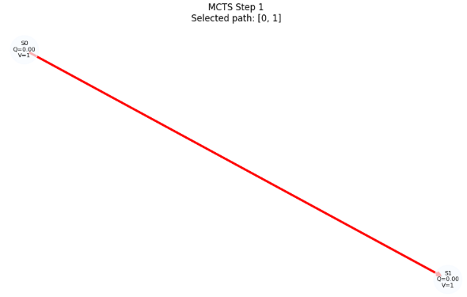
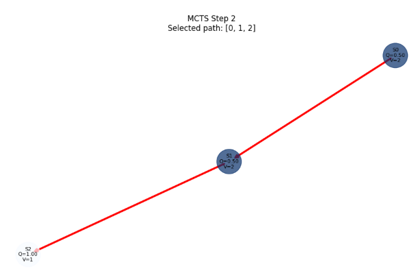
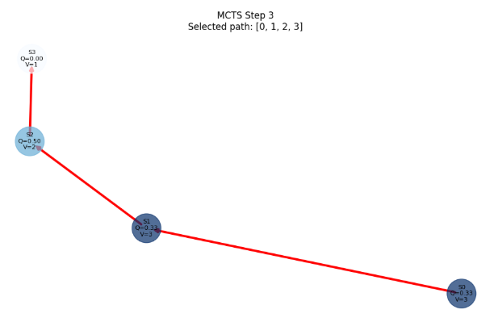
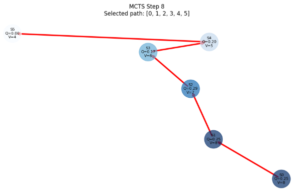

## 概要
MCTS（Monte Carlo Tree Search）は、**木探索とモンテカルロシミュレーションを組み合わせた探索アルゴリズム** です。
囲碁や将棋などのゲームAI（AlphaGo, AlphaZero, MuZero）で広く使われています。

### 1. MCTS の基本アイデア

MCTS は、**「将来の可能性を木構造で表現し、ランダムシミュレーションで評価する」** 手法です。

- **木（Tree）**：状態をノード、行動をエッジとして表現
- **モンテカルロ（Monte Carlo）**：ランダムなシミュレーションで将来の報酬を推定

これにより、**膨大な行動空間の中から、有望な行動を重点的に探索**できます。

### 2. MCTS の4つのステップ

MCTS は、以下の4つのステップを繰り返します。

__(1) 選択（Selection）__

現在の木から、**どのノード（状態）とどの行動（エッジ）を選ぶか**を決めます。

- よく使われるのが **UCB（Upper Confidence Bound）** ：
  $$
  \text{UCB}(s,a) = Q(s,a) + c \sqrt{\frac{\log N(s)}{N(s,a)}}
  $$

  - $Q(s,a)$：行動 $a$ の平均報酬
  - $N(s)$：状態 $s$ の訪問回数
  - $N(s,a)$：行動 $a$ の選択回数
  - $c$：探索の強さを調整する定数

UCB は、**「これまで良い結果が出た行動」と「まだあまり試していない行動」のバランス**を取ります。

__(2) 展開（Expansion）__

選択したノードから、**新しい状態（子ノード）を木に追加**します。

- 実際の環境や世界モデルを使って、行動を適用した次の状態 $s'$ を生成します。

__(3) シミュレーション（Simulation）__

追加したノードから、**ランダムなシミュレーション（ロールアウト）** を行い、エピソード終了までの報酬を推定します。

- 単純なランダムポリシーや、軽量なポリシーを使うことが多いです。

__(4) バックアップ（Backup）__

シミュレーションで得られた報酬を、**親ノードに伝播**します。

- 各ノードの $Q(s,a)$ と $N(s,a)$ を更新します。
- これにより、**「どの行動が有望か」の情報が蓄積**されます。

### 3. MCTS の特徴

__(A) 非対称な探索__

MCTS は、**有望な行動ほど深く探索する**ため、木が非対称に成長します。

- 良い行動：何度もシミュレーションされ、評価が精緻化される
- 悪い行動：あまり試されず、探索が浅いまま

これにより、**限られた計算資源で効率的に探索**できます。

__(B) モデルフリーでもモデルベースでも使える__

- **モデルフリー**：実際の環境とやり取りしながら探索（AlphaGo の初期など）
- **モデルベース**：学習した世界モデルを使ってシミュレーション（MuZero, MAZero）

MAZero では、**学習した世界モデルを使って MCTS を行う**ため、
実際の環境とのインタラクションを減らしつつ、多くの探索が可能です。[arXiv](https://arxiv.org/abs/2405.11778)

__(C) 大規模行動空間への適応__

共同行動空間が指数的に膨張する MARL でも、
MCTS は **UCB に基づいて有望な共同行動を重点的に探索**できるため、
効率的な探索が可能です。

### 4. MAZero における MCTS の役割

MAZero では、MCTS は以下のように使われます。[arXiv](https://arxiv.org/abs/2405.11778)

1. **共同行動のプランニング**：

   - 各エージェントの行動を独立に選ぶのではなく、
     **共同行動空間を MCTS で探索**し、最適な共同行動を見つける。
2. **世界モデルとの連携**：

   - 学習した世界モデルを使って、次の状態と報酬を予測し、
     **実際の環境とのインタラクションを減らす**。
3. **OS($\lambda$) との組み合わせ**：

   - MCTS の探索方向を改善するために、
     **将来の価値情報を統合した OS($\lambda$)** を導入し、
     より有望な共同行動を優先的に探索する。

## 解決しようとした課題

MCTS（Monte Carlo Tree Search）が主に解決しようとした課題は、**「ゲーム木（または探索空間）が非常に大きく、従来の手法では評価関数の設計や完全探索が困難な場合に、実用的な時間で“そこそこ良い”行動を選べるようにする」** ことです。

具体的には、以下のような問題を対象にしていました。

1. **探索空間が広すぎて完全探索が不可能なゲームでの意思決定**  
   - 囲碁、将棋、チェスなどのボードゲームでは、合法手の組み合わせが指数関数的に増え、ミニマックス法やαβ法でも深い探索が現実的ではありません。  
   - MCTSは、**ランダムなプレイアウト（終局までランダムに打つシミュレーション）を繰り返し、その結果をもとに有望な手を重点的に探索**することで、評価関数がなくても「勝率が高そうな手」を選べるようにしました。

2. **評価関数の設計が難しいゲームでの強さの実現**  
   - 囲碁のように局面評価が難しいゲームでは、従来のゲームAIは「局面の良さを数値化する評価関数」に大きく依存していました。  
   - MCTSは、**評価関数に頼らず、実際にプレイアウトした結果（勝ち負け）を統計的に集計して行動を選ぶ**ため、評価関数設計の難しさを緩和しました。

3. **不確実性や不完全情報を含む環境での意思決定**  
   - 不完全情報ゲーム（ポーカーなど）や、ランダム要素を含む環境では、将来の状態が確定しないため、単純な木探索ではうまくいきません。  
   - MCTSは、**シミュレーションを多数回行うことで、確率的な結果を“経験的に”学習**し、期待値の高い行動を選ぶアプローチとして有効です。

4. **汎用的で柔軟な探索アルゴリズムの提供**  
   - 従来のゲームAIは、ゲームごとに評価関数や探索戦略を個別に設計する必要がありました。  
   - MCTSは、**ゲームルールさえわかれば、ほぼ同じ枠組みで適用できる汎用的な探索手法**として、多様なゲームや意思決定問題に応用できるように設計されています。

要するに、MCTSは  
- 「探索空間が広すぎて全部見切れない」  
- 「評価関数を作るのが難しい」  
- 「不確実性がある」  

といった状況で、**評価関数に頼らず、ランダムなシミュレーションを繰り返すことで、実用的な時間で“良い手”を選べるようにする**ことを目指したアルゴリズムです。

## 実験
実装コードは以下のレポジトリに保管しました。

https://github.com/Shinichi0713/Reinforce-Learning-Study/tree/main/miulti-agent/src/mcts

実装コードを実行することで以下のように探索木が描かれることになります。

__見方__

各ステップごとにグラフが表示されます。
ノード（丸）には
- S{状態ID}
- Q={Q値}
- V={訪問回数}

が表示されます。
赤い太線が、そのステップでQ関数（UCB1）に基づいて選択された経路です。
訪問回数が多いノードほど色が濃くなります。

__実行結果__

S1→S2→S3→S4→S5という順番で探索が行われていくことになります。

__結果__

1. 初期は未訪問ノードが多いため、UCB1の式により「未訪問ノード」が優先的に選ばれます。
2. 何度かプレイアウトすると、Q値が高い（報酬が多い）ノードがより頻繁に選ばれるようになり、探索が「良い領域」に集中していきます。
3. グラフ上では、 Q値が高いノードほど訪問回数が増え、その周辺の枝が太く（頻繁に）描かれることで、探索の偏りが視覚的に分かります。

### 5. まとめ

MCTS は：

- **木探索とモンテカルロシミュレーションを組み合わせた探索アルゴリズム**
- 4ステップ（選択・展開・シミュレーション・バックアップ）を繰り返す
- UCB により、「良い行動」と「未探索の行動」のバランスを取る
- **大規模な行動空間でも効率的に探索**できる

MAZero では、この MCTS を**マルチエージェント環境に拡張**し、
**共同行動空間を効率的に探索する**ことで、サンプル効率を向上させています。[arXiv](https://arxiv.org/abs/2405.11778)
