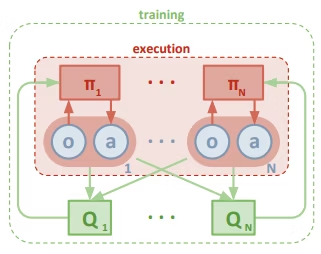

# マルチエージェント in 深層強化学習

## 概要

本日はActor-Critic手法として有名なDDPG(Deep Deterministic Policy Gradient)を拡張した手法である[MADDPG(Multi-Agent Deep Deterministic Policy Gradient)](https://arxiv.org/pdf/1706.02275.pdf)について紹介

強化学習は単一エージェントに対して発展してきたが、現実世界ではエージェントは複数存在する。

より効率的に仕事をさせるためにはエージェントを協調的に制御する必要がある。(例. 工場内のUAVとUGVの協調作業など)

MARLは近年では盛んに研究されていて、単一エージェントと比べて、行動や学習はとても難しい。

エージェントが増加すれば増加するほど、学習する際の勾配が正しい方向に進む確率が指数関数的に低下する。

## 全体イメージ

イメージは以下の図のようになる。

N個のエージェントはそれぞれ方策 $\pi = {\pi_1, \pi_2 ... \pi_N}$とします。

状態値 $o_i$ をそれぞれの方策に渡すとエージェントが取るべき行動 $o_i$が出力される。

これはそれぞれのエージェント(actor)は **Decentralized** (分散)な方策をとることを意味しています。

次にすべてのエージェントを管理できるN個の価値関数(Q関数）があります。

この価値関数はすべてのエージェントから状態値 $x={o_1,...o_N}$と行動 $a={a_1,...a_N}$ を受け取ってその価値を返します。

言い換えると**Centralized**なcritic(批評家)であることを意味しています。

つまり、N人のcriticがすべてのactor(演者)について評価し、actorたちはその評価に応じてそれぞれのとる方策を更新します。

## 少しだけ数式を見よう

以上の議論から、まずactorたち最大化するべき目的関数はcriticからの評価であることは明らかです。それぞれの確率的な方策を構成するパラメータをθiとすると、
𝕤𝕡𝕒𝕚𝕚J(θi)=Es∼pμ,ai∼πi[Qi(x,a1,...aN)]
目的関数は以上と書きます。両辺をパラメータであるθiで微分すると、確率的な方策を更新する勾配は以下になります。
𝕤𝕡𝕒𝕚𝕚∇θiJ(θi)=Es∼pμ,ai∼πi[∇θilog⁡πi(ai|oi)Qi(x,a1,...aN)]
しかしすでに知られているように、**MADDPG**は名前の通り**決定的方策をとるoff-Policy**の手法であるため、以上の式は以下のように書き換えられます。(off-Policyというのは簡単に言うと取るべき行動は現在の方策(Policy)に関係なく(Off)常に最善を尽くす手法のことです。)
方策の勾配式を決定的方策に書き換えると
𝕩𝕒𝕚∇θiJ(μi)=Ex,ai∼D[∇θiμi(ai|oi)∇aiQiμ(x,a1,...,ai′,...,aN)|ai′=μi(o)]
決定的な方策っていうのは状態値oをある関数μ(⋅)に渡すと決められた行動が出力されます、連続値空間でよく用いられます。それに対して確率的な方策っていうのは状態値oをある関数π(⋅)に渡すとそれぞれの行動を行う離散的な確率が出力されます。またこの式に注意するべきところはエージェントiを評価する価値関数Qi(⋅)に渡す行動はiの行動ai′のみ一ステップ分更新します。

ではcriticたちの評価どうやって正しく評価しているかどうかを見るでしょう？ここは慣例の **TD誤差** (説明は割愛します)の出番です。価値関数を更新するロス関数は以下に示します。
L(θi)=Ex,a,r,x′[(Qiμ(x,a1,...aN)−y2)]
ここで,x,a,r,x′はあらかじめ経験を貯蓄していたバッファーDからサンプルした値です。また、学習のターゲットであるyは以下の式で求めます。
y=ri+γQiμ′(x′,a1′,...,ai,...,aN′)|a′=μ′(o)
ここでμ′(⋅)とQ′(⋅) はターゲット関数になっていて、価値関数Q(⋅)はこいつらに準じてsoft-updateしていく感じです。

## 参考

[マルチエージェント深層強化学習を勉強しよう　第一回-MADDPGの解説及び実装 #Python - Qiita](https://qiita.com/mayudong200333/items/4a09a52e58a66a766ab2)
