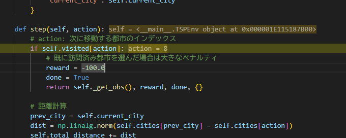
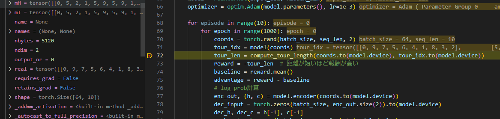
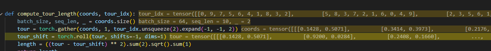

はい、強化学習（Reinforcement Learning; RL）で解くことができるオペレーションズリサーチ（OR, Operations Research）のテーマには多くの実例があります。代表的なものをいくつか挙げます。

---

## 1. 巡回セールスマン問題（TSP, Traveling Salesman Problem）
- 都市を一度ずつ巡回し最短経路を求める問題。
- RLでは状態を都市の訪問状況、行動を次の都市の選択とし、報酬を移動距離のマイナス等で設計。

## 2. 車両経路問題（VRP, Vehicle Routing Problem）
- 複数の車両が顧客に効率よく配送するルートを決定する問題。
- 配送順序や割り当てをRLで最適化。

## 3. 作業スケジューリング問題（Job Shop Scheduling, Flow Shop Scheduling）
- 複数の作業や機械への割り当て順序を最適化する問題。
- 状態を現在のスケジュール、行動を作業の割り当てとし、報酬を納期遅延や総完了時間で設計。

## 4. 在庫管理問題（Inventory Management）
- 倉庫や店舗での在庫発注タイミング・量を最適化する問題。
- 状態を在庫水準や需要、行動を発注量とし、報酬をコストや欠品ペナルティで設計。

## 5. 動的価格設定（Dynamic Pricing）
- 需要変動に応じて価格を調整し収益最大化を目指す問題。
- 状態を在庫・需要・時間、行動を価格設定、報酬を売上や利益で設計。

## 6. 列車ダイヤ作成・交通信号制御
- 列車やバスのダイヤ編成、信号の制御を最適化。
- 状態を現在の交通状況、行動を信号タイミングや列車発車タイミング、報酬を遅延や混雑の低減で設計。

## 7. ポートフォリオ最適化
- 資産配分の最適化。
- 状態を市場情報や保有資産、行動を売買判断、報酬をリターンやリスク調整後リターンで設計。

## 8. ロットサイズ決定（Lot Sizing）
- 生産や注文のバッチサイズを決定する問題。
- 状態を在庫や注文状況、行動を生産量や発注量、報酬をコストで設計。

---

### 参考論文や事例
- Bello et al., "Neural Combinatorial Optimization with Reinforcement Learning"（TSP, VRP）
- Nazari et al., "Reinforcement Learning for Solving the Vehicle Routing Problem"
- Sutton & Barto, "Reinforcement Learning: An Introduction"（在庫管理例など）

---

これらは全て、**状態・行動・報酬**を明確に設計できるため、強化学習でのアプローチが可能です。

indexは異なる

中身はこれ

